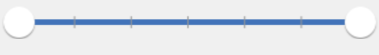
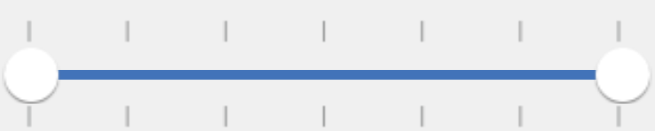
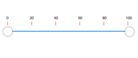

# Customizing ticks

Tick marks can be placed along the track in a uniform manner or it's position can also be customized.

## TickPlacement

The `TickPlacement` property determines where to draw tick marks in relation to the track. Available options for this property are,

* BottomRight

* Inline

* None

* Outside

* TopLeft

N> The default option is Inline.

## BottomRight

Tick marks can be placed either below the track in horizontal orientation or right of the track in vertical orientation.





	rangeSlider.TickPlacement = SFTickPlacement.SFTickPlacementBottomRight;





## TopLeft

Tick marks are placed either above the track in horizontal orientation or left of the track in vertical orientation.





	rangeSlider.TickPlacement = SFTickPlacement.SFTickPlacementTopLeft;





## Inline

Ticks are placed along the track.





	rangeSlider.TickPlacement = SFTickPlacement.SFTickPlacementInline;





## Outside

Tick marks are placed on both sides of the track either in horizontal or vertical orientation.





	rangeSlider.TickPlacement = SFTickPlacement.SFTickPlacementOutside;





## Customizing tick color

The range slider control provides the `TickColor` property to customize the color of ticks in tick bar.



	SfRangeSlider sfRangeSlider = new SfRangeSlider();
	sfRangeSlider.Frame = new CoreGraphics.CGRect(10, 50, 350, 300);
	sfRangeSlider.TickColor = UIColor.Red;
	sfRangeSlider.TickLength = 10;
	this.View.AddSubview(sfRangeSlider);
 


