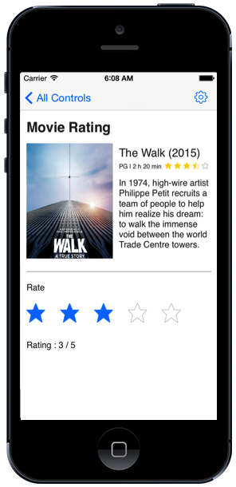

---

layout: post
title: Getting Started with Syncfusion Rating control for Xamarin.iOS
description:  A quick tour to initial users on Syncfusion Rating control for Xamarin.iOS platform
platform: Xamarin.iOS
control: Rating
documentation: ug

---

# Getting Started

This section explains how to configure the SfRating control in a real-time scenario and also provides a walk-through on some of the customization features available in the SfRating control.

## Referencing Essential Studio Components in Your Solution

After installing Essential Studio for Xamarin, you can find all the required assemblies in the installation folders,

{Syncfusion Installed location}\Essential Studio {version number}\lib

Add the following assembly references to the iOS unified project,

iOS-unified\Syncfusion.SfRating.iOS.dll

## Add SfRating

* Adding namespace for the added assemblies. 




	
	using Syncfusion.SfRating.iOS;
	




* Now add the SfRating control with a required optimal name by using the included namespace.





	SFRating rating;
	
	public override void ViewDidLoad()
	{
		base.ViewDidLoad();
		rating = new SfRating();
		rating.Frame = new CGRect(10, 310, this.View.Frame.Width, 60);
		this.Add(rating);
	}
	




## Set number of rating items

The number of rating items to be displayed can be customized in the SfRating control. Users can create a rating application with 5 rating items as follows.

N> The default value of this property is 5.





    rating.ItemCount = 5;





## SetValue

Display value can be set in SfRating control which is selected among the items. The following example shows the display value of 3 with 5 rating items. 

N> By default, property value is 0.





    rating.Value = 3;





Please find the sample from this link: [Sample](http://www.syncfusion.com/downloads/support/directtrac/general/ze/SfRating_GettingStarted1345326680.zip).
