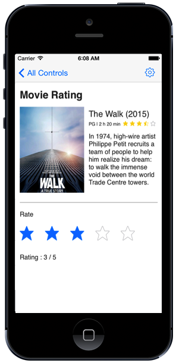

---

layout: post
title: Overview of Syncfusion Rating control for Xamarin.iOS
description: Overview and key features of Rating control
platform: Xamarin.iOS
control: Rating
documentation: ug

---

# Overview

The Essential Xamarin.iOS Rating control has a group of stars to indicate the rating with flexible precision. Also provides various customization support on item size, item spacing and the number of displayed items.

## Key Features

* `Precision`: Options to decide the accuracy level of rating.

* `Item Count`: Support to determine the number of Rating items to be displayed.
