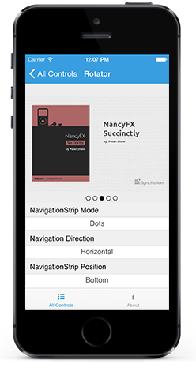

# Getting Started

This section explains you the steps to configure a Rotator control in a real-time scenario and also provides a walk-through on some of the customization features available in Rotator control.

## Creating your first Rotator in Xamarin.iOS

## Referencing Essential Studio Components in Your Solution

After installing Essential Studio for Xamarin, you can find all the required assemblies in the installation folders, typically:

{Syncfusion Installed location}\Essential Studio {version number}\lib

You have to add the following assembly reference to the iOS unified project

iOS-unifed\Syncfusion.SfRotator.iOS.dll

## Add and Configure the Rotator 

* Adding reference to Rotator.



	using Syncfusion.SFRotator.iOS;



* Create an instance of SfRotator.

		

	SFRotator  rotator  = new SFRotator();
	this.AddSubview(rotator);



## Setting Navigation Mode

The NavigationMode property decides the navigation mode for navigating items. The items can be navigated using Thumbnail or Dots.

	

	rotator.NavigationStripMode = SFRotatorNavigationStripMode.Dots;



## Customizing Position

The TabStripPosition property decides the position in which navigation strip items such as Thumbnail or Dots should be rendered. 

	

	rotator.NavigationStripMode = SFRotatorNavigationStripMode.Dots;
	rotator.NavigationStripPosition = SFRotatorNavigationStripPosition.Bottom;
	
