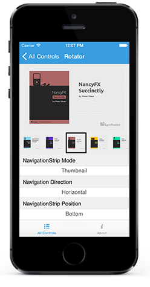
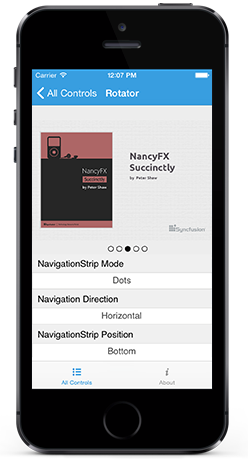
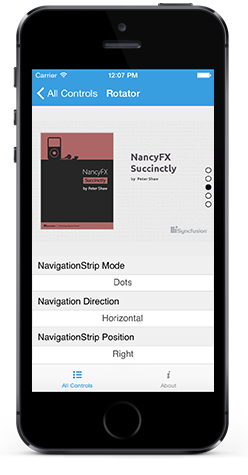

# Navigation Modes

The `NavigationStripMode` property specifies the appearance of navigation bar items. The image data can be selected either by Thumbnail or by Dots navigation modes.

* `Thumbnail` - The slider items will be loaded in thumbnail view additionally. When a thumbnail item is clicked, the slider will switch to the corresponding image data.





	rotator.NavigationStripMode = SFRotatorNavigationStripMode.Thumbnail;	





* `Dots` - The slider items will be loaded in dots view additionally. When a dots item is clicked, the slider will switch to the corresponding image data.





	rotator.NavigationStripMode = SFRotatorNavigationStripMode.Dots;	





## Items / Dot Strip Positions

The `NavigationStripPosition` position specifies the placement position of the navigation bar items such as thumbnail or dots relative to the slider area. 

There are four available positions,

* `Bottom` - Sets the position of the navigation bar items to bottom.





	rotator.NavigationStripPosition = SFRotatorNavigationStripPosition.Bottom;





* `Left` - Sets the position of the navigation bar items to left.





	rotator.NavigationStripPosition = SFRotatorNavigationStripPosition.Left;





* `Top` - Sets the position of the navigation bar items to top.





	rotator.NavigationStripPosition = SFRotatorNavigationStripPosition.Top;





* `Right` - Sets the position of the navigation bar items to right.





	rotator.NavigationStripPosition = SFRotatorNavigationStripPosition.Right;





