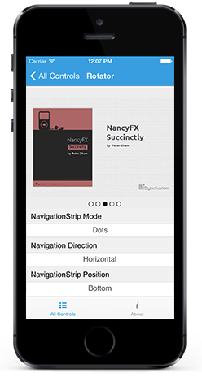

# Overview

SfRotator is a data control used to display images and navigate through them. The images can be selected either by Thumbnail or by Dots support.

## Key Features

* `NavigationMode` - It specifies the appearance of navigation bar items.
* `NavigationDirection` - It specifies the direction of sliding in Rotator.
* `TabStripPosition` - It specifies the position of the navigation bar relative to the image area.