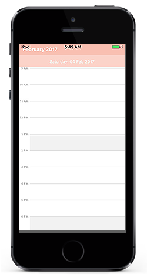
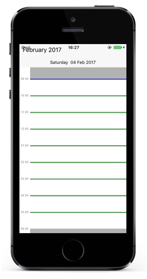
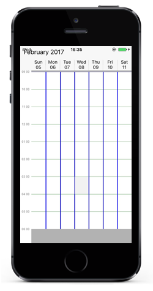
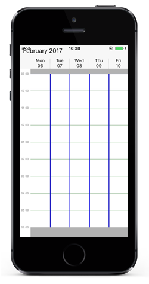

# Appearance & Styling

## Header Customization

You can customize the header of the Schedule using `HeaderStyle` and `HeaderHeight` property in schedule.

### Header Height

You can customize the height for the Header in Schedule using `HeaderHeight` in schedule.



	schedule.HeaderHeight = 50;



### Labels

you can change the header format and style using `HeaderStyle` property in schedule.

#### Format

You can change the header text format and size using `ScheduleDateHeaderSize` and `ScheduleDateHeaderFormat` property in `HeaderStyle`



	schedule.ScheduleDateHeaderFormat = (NSString)("MMM yyyy");



#### Fonts and colors

You can change the background color,text style and text size using properties such as `BackgroundColor`,`TextStyle`, `TextSize` of Header using `HeaderStyle` property in schedule.



	SFHeaderStyle headerStyle = new SFHeaderStyle();
	headerStyle.BackgroundColor = UIColor.Gray;
	headerStyle.TextStyle = UIFont.SystemFontOfSize(20, UIFontWeight.Bold);	
	headerStyle.TextColor = UIColor.Red;
	schedule.HeaderStyle = headerStyle;



## View Header Customization

	You can customize the view header of the Schedule using `ViewHeaderStyle` and `ViewHeaderHeight` property in schedule.

### Labels

#### Fonts and Colors

You can change the background color,text style and text size using properties such as `BackgroundColor`,`DateTextStyle`, `DayTextStyle`, `DayTextColor`, `DateTextColor`,`DateTextSize`, `DayTextSize` of ViewHeader using `DayHeaderStyle` property in schedule.



	SFViewHeaderStyle viewHeaderStyle = new SFViewHeaderStyle();
	viewHeaderStyle.BackgroundColor = UIColor.Gray;
	viewHeaderStyle.DayTextSyle = UIFont.SystemFontOfSize(20, UIFontWeight.Bold);
	viewHeaderStyle.DateTextSyle = UIFont.SystemFontOfSize(20, UIFontWeight.Bold);
	viewHeaderStyle.DayTextColor = UIColor.Blue;
	viewHeaderStyle.DateTextColor = UIColor.Blue;
	schedule.DayHeaderStyle = viewHeaderStyle;



### ViewHeader Height

You can customize the height for the `ViewHeader` in Schedule using `ViewHeaderHeight ` in schedule.



	schedule.ViewHeaderHeight = 30;



## Timeslots customization

### Custom Day View

#### Non-Working Hours 

You can differentiate working hours with non-working hour timeslots by its color using `NonWorkingHoursTimeSlotBorderColor`, `NonWorkingHoursTimeSlotColor` properties of `DayViewSettings`.



	//creating new instance for schedule
	SFSchedule schedule = new SFSchedule();

	//setting schedule view
	schedule.ScheduleView = SFScheduleView.SFScheduleViewDay;

	//setting day view settings properties
	DayViewSettings dayViewSettings = new DayViewSettings();
	dayViewSettings.NonWorkingHourTimeSlotBorderColor = UIColor.Gray;
	dayViewSettings.NonWorkingHourTimeSlotColor = UIColor.Black;
	schedule.DayViewSettings = dayViewSettings;

	// Set our view from the "main" layout resource
	this.View.AddSubview(schedule);



#### Timeslots 

You can differentiate working hours with non-working hour timeslots by its color using  `TimeSlotColor`,`TimeSlotBorderColor` and `TimeSlotBorderStrokeWidth` properties of `DayViewSettings`.



	//creating new instance for schedule
	SFSchedule schedule = new SFSchedule();

	//setting schedule view
	schedule.ScheduleView = SFScheduleView.SFScheduleViewDay;
	
	//setting day view settings properties
	DayViewSettings dayViewSettings = new DayViewSettings();
	dayViewSettings.TimeSlotColor = UIColor.White;
	dayViewSettings.TimeSlotBorderColor = UIColor.Blue;
	dayViewSettings.TimeSlotStrokeWidth = 2;
	schedule.DayViewSettings = dayViewSettings;

	View.AddSubview(schedule);



#### Labels

You can change the format , colors, size, style of text using `DateFormat` and `DayFormat`, `DateLabelSize`,`DayLabelSize`,`TimeFormat`, `TimeLabelColor`,`TimeLabelSize` properties of `DayLabelSettings` in `DayViewSettings`.



	//creating new instance for schedule
	SFSchedule schedule = new SFSchedule();

	//setting schedule view
	schedule.ScheduleView = SFScheduleView.SFScheduleViewDay;

	DayViewSettings dayViewSettings = new DayViewSettings();
	DayLabelSettings dayLabelSettings = new DayLabelSettings();
	dayLabelSettings.DateLabelFormat = (NSString)"d/M/yyyy";
	dayLabelSettings.DateLabelSize = 15;
	dayLabelSettings.DayLabelSize = 15;
	dayLabelSettings.DayLabelFormat = (NSString) "ddd";
	dayLabelSettings.TimeLabelFormat = (NSString) "hh mm";
	dayLabelSettings.TimeLabelColor = UIColor.Blue;
	dayLabelSettings.TimeLabelSize = 10;
	dayViewSettings.LabelSettings = dayLabelSettings;
	schedule.DayViewSettings = dayViewSettings;

	View.AddSubview(schedule);



#### All Day Appointments color

You can change the all day appointment panel color using the property `AllDayAppointmentBackgroundColor` of `DayViewSettings`.



	//creating new instance for schedule
	SFSchedule schedule = new SFSchedule();

	//setting schedule view
	schedule.ScheduleView = SFScheduleView.SFScheduleViewDay;

	//setting day view settings properties
	DayViewSettings dayViewSettings = new DayViewSettings();
	dayViewSettings.AllDayAppointmentLayoutColor = UIColor.Blue;
	schedule.DayViewSettings = dayViewSettings;

	View.AddSubview(schedule);



### Custom Week View

#### Non-Working Hours 

You can differentiate working hours with non-working hour timeslots by its color using `NonWorkingHoursTimeSlotBorderColor`, `NonWorkingHoursTimeSlotColor` properties of `WeekViewSettings`.



	//creating new instance for schedule
	SFSchedule schedule = new SFSchedule();
	schedule.ScheduleView = SFScheduleView.SFScheduleViewWeek;

	//setting day view settings properties
	WeekViewSettings weekViewSettings = new WeekViewSettings();
	weekViewSettings.NonWorkingHourTimeSlotBorderColor = UIColor.Gray;
	weekViewSettings.NonWorkingHourTimeSlotColor = UIColor.LightGray;
	schedule.WeekViewSettings = weekViewSettings;

	View.AddSubview(schedule);



#### Timeslots 

You can differentiate working hours with non-working hour timeslots by its color using `TimeSlotColor`,`TimeSlotBorderColor` and `TimeSlotBorderStrokeWidth` properties of `WeekViewSettings`.



	SFSchedule schedule = new SFSchedule();
	schedule.ScheduleView = SFScheduleView.SFScheduleViewWeek;

	//setting day view settings properties
	WeekViewSettings weekViewSettings = new WeekViewSettings();
	weekViewSettings.TimeSlotColor = UIColor.Gray;
	weekViewSettings.TimeSlotBorderColor = UIColor.LightGray;
	schedule.WeekViewSettings = weekViewSettings;

	View.AddSubview(schedule);



#### Lines

You can differentiate the timeslot panel using `VerticalLineColor` and `VerticalLineStrokeWidth` properties of `WeekViewSettings`.



	SFSchedule schedule = new SFSchedule();
	schedule.ScheduleView = SFScheduleView.SFScheduleViewWeek;

	//setting day view settings properties
	WeekViewSettings weekViewSettings = new WeekViewSettings();
	weekViewSettings.VerticalLineStrokeWidth = 2;
	weekViewSettings.VerticaTimeSlotBorderColor = UIColor.LightGray;
	schedule.WeekViewSettings = weekViewSettings;

	View.AddSubview(schedule);



#### Labels

You can change the format , colors, size, style of text using `DateFormat` and `DayFormat`, `DateLabelSize`,`DayLabelSize`,`TimeFormat`, `TimeLabelColor`,`TimeLabelSize` properties of `WeekLabelSettings` in `WeekViewSettings`.



	SFSchedule schedule = new SFSchedule();
	schedule.ScheduleView =SFScheduleView.SFScheduleViewWeek;

	WeekViewSettings weekViewSettings = new WeekViewSettings();
	WeekLabelSettings labelSettings = new WeekLabelSettings();
	labelSettings.TimeLabelSize = 15;
	labelSettings.DateLabelSize = 15;
	labelSettings.DayLabelSize = 15;
	labelSettings.DateLabelFormat = (NSString)"dd/MM/yy";
	labelSettings.DayLabelFormat = (NSString)" - EEEE";
	labelSettings.TimeLabelFormat = (NSString)"hh a";
	labelSettings.TimeLabelColor = UIColor.Blue;

	weekViewSettings.LabelSettings = labelSettings;
	schedule.WeekViewSettings = weekViewSettings;



#### All Day Appointments Color

You can change the all day appointment panel color using the property `AllDayAppointmentBackgroundColor` of `WeekViewSettings`.



	SFSchedule schedule = new SFSchedule();

	//setting schedule view
	schedule.ScheduleView = SFScheduleView.SFScheduleViewWeek;

	//setting day view settings properties
	WeekViewSettings weekViewSettings = new WeekViewSettings();
	weekViewSettings.AllDayAppointmentLayoutColor = UIColor.Blue;
	schedule.WeekViewSettings = weekViewSettings;

	View.AddSubview(schedule);



### Custom Work Week View

#### Non-Working Hours 

You can also differentiate working hours with non-working hour timeslots by its color using `NonWorkingHoursTimeSlotBorderColor`, `NonWorkingHoursTimeSlotColor` properties of `WorkWeekViewSettings`.



	SFSchedule schedule = new SFSchedule();
	schedule.ScheduleView = SFScheduleView.SFScheduleViewWorkWeek;

	//setting day view settings properties
	WorkWeekViewSettings workWeekViewSettings = new WorkWeekViewSettings();
	workWeekViewSettings.NonWorkingHourTimeSlotColor = UIColor.LightGray;
	workWeekViewSettings.NonWorkingHourTimeSlotBorderColor = UIColor.Blue;
	schedule.WorkWeekViewSettings = workWeekViewSettings;

	View.AddSubview(schedule);



#### Timeslots

You can also differentiate working hours with non-working hour timeslots by its color using `TimeSlotColor`,`TimeSlotBorderColor` and `TimeSlotBorderStrokeWidth` properties of `WorkWeekViewSettings`.



	SFSchedule schedule = new SFSchedule();
	schedule.ScheduleView = SFScheduleView.SFScheduleViewWorkWeek;

	//setting day view settings properties
	WorkWeekViewSettings workWeekViewSettings = new WorkWeekViewSettings();
	workWeekViewSettings.TimeSlotColor = UIColor.LightGray;
	workWeekViewSettings.TimeSlotBorderColor = UIColor.Blue;
	schedule.WorkWeekViewSettings = workWeekViewSettings;
    View.AddSubview(schedule)



#### Lines

You can differentiate the timeslot panel using `VerticalLineColor` and `VerticalLineStrokeWidth` properties of `WorkWeekViewSettings`.



	SFSchedule schedule = new SFSchedule();
	schedule.ScheduleView = SFScheduleView.SFScheduleViewWorkWeek;

	//setting day view settings properties
	WorkWeekViewSettings workWeekViewSettings = new WorkWeekViewSettings();
	workWeekViewSettings.VerticalLineStrokeWidth = 2;
	workWeekViewSettings.VerticaTimeSlotBorderColor = UIColor.Black;
	schedule.WorkWeekViewSettings = workWeekViewSettings;

	View.AddSubview(schedule);



#### Labels

You can change the format , colors, size, style of text using `DateFormat` and `DayFormat`, `DateLabelSize`,`DayLabelSize`,`TimeFormat`, `TimeLabelColor`,`TimeLabelSize` properties of `WorkWeekLabelSettings` in `WorkWeekViewSettings`.



	SFSchedule schedule = new SFSchedule();
	schedule.ScheduleView = SFScheduleView.SFScheduleViewWorkWeek;

	WorkWeekViewSettings workWeekViewSettings = new WorkWeekViewSettings();
	WorkWeekLabelSettings labelSettings = new WorkWeekLabelSettings();
	labelSettings.TimeLabelSize = 15;
	labelSettings.DateLabelSize = 15;
	labelSettings.DayLabelSize = 15;
	labelSettings.DateLabelFormat = (NSString)"dd/MM/yy";
	labelSettings.DayLabelFormat = (NSString)" - EEEE";
	labelSettings.TimeLabelFormat = (NSString)"hh a";
	labelSettings.TimeLabelColor = UIColor.Blue;

	workWeekViewSettings.LabelSettings = labelSettings;
	schedule.WorkWeekViewSettings = workWeekViewSettings;

	View.AddSubview(schedule);



#### All Day Appointments Panel

You can change the all day appointment panel color using the property `AllDayAppointmentBackgroundColor` of `WorkWeekViewSettings`.



	SFSchedule schedule = new SFSchedule();
	schedule.ScheduleView = SFScheduleView.SFScheduleViewWorkWeek;

	WorkWeekViewSettings workWeekViewSettings = new WorkWeekViewSettings();
	workWeekViewSettings.AllDayAppointmentLayoutColor = UIColor.Blue;
	schedule.WorkWeekViewSettings = workWeekViewSettings;

	View.AddSubview(schedule);



### Interval

You can change the time interval and time interval height using `TimeInterval` and `TimeIntervalHeight` in schedule.



	schedule.TimeInterval = 120;
	schedule.TimeIntervalHeight = 100;



>**NOTE** : `TimeInterval` value should be given in minutes.

