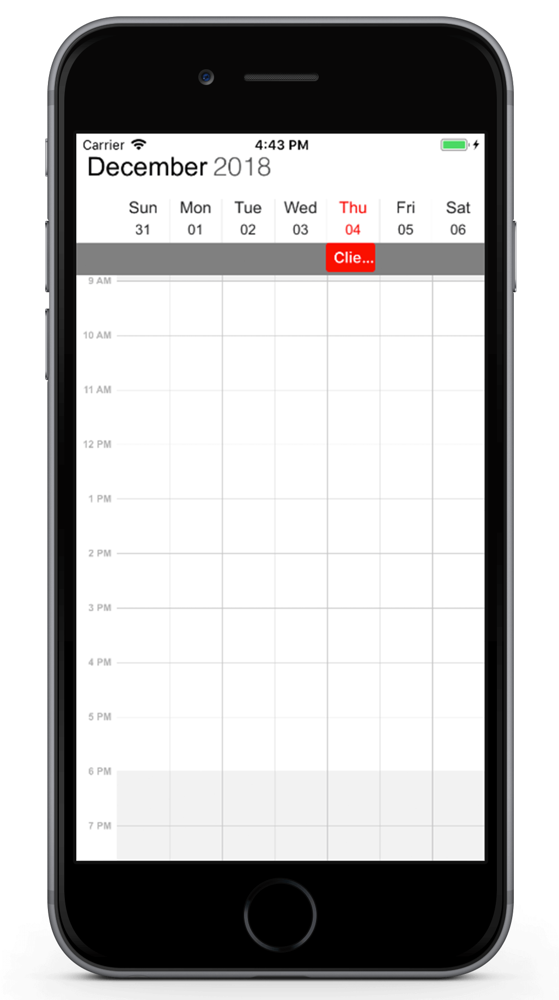

---

layout: post
title: Populating Appointments in Syncfusion SfSchedule control for Xamarin.iOS
description: Learn how to Populate Appointments in SfSchedule control
platform: xamarin.ios
control: SfSchedule
documentation: ug

---

# Appointments

[ScheduleAppointment](https://help.syncfusion.com/cr/cref_files/xamarin-ios/sfschedule/Syncfusion.SfSchedule.iOS~Syncfusion.SfSchedule.iOS.ScheduleAppointment.html) is a class, which holds the details about the appointment to be rendered in schedule. It has some basic properties such as [StartTime](https://help.syncfusion.com/cr/cref_files/xamarin-ios/sfschedule/Syncfusion.SfSchedule.iOS~Syncfusion.SfSchedule.iOS.ScheduleAppointment~StartTime.html), [EndTime](https://help.syncfusion.com/cr/cref_files/xamarin-ios/sfschedule/Syncfusion.SfSchedule.iOS~Syncfusion.SfSchedule.iOS.ScheduleAppointment~EndTime.html), [Subject](https://help.syncfusion.com/cr/cref_files/xamarin-ios/sfschedule/Syncfusion.SfSchedule.iOS~Syncfusion.SfSchedule.iOS.ScheduleAppointment~Subject.html) and some additional information about the appointment can be added using [AppointmentBackground](https://help.syncfusion.com/cr/cref_files/xamarin-ios/sfschedule/Syncfusion.SfSchedule.iOS~Syncfusion.SfSchedule.iOS.ScheduleAppointment~AppointmentBackground.html), [Notes](https://help.syncfusion.com/cr/cref_files/xamarin-ios/sfschedule/Syncfusion.SfSchedule.iOS~Syncfusion.SfSchedule.iOS.ScheduleAppointment~Notes.html), [Location](https://help.syncfusion.com/cr/cref_files/xamarin-ios/sfschedule/Syncfusion.SfSchedule.iOS~Syncfusion.SfSchedule.iOS.ScheduleAppointment~Location.html), [All Day](https://help.syncfusion.com/cr/cref_files/xamarin-ios/sfschedule/Syncfusion.SfSchedule.iOS~Syncfusion.SfSchedule.iOS.ScheduleAppointment~IsAllDay.html), [Recurring properties](https://help.syncfusion.com/cr/cref_files/xamarin-ios/sfschedule/Syncfusion.SfSchedule.iOS~Syncfusion.SfSchedule.iOS.RecurrenceProperties.html).



using Foundation;
using Syncfusion.SfSchedule.iOS;

//Creating an instance for SfSchedule control
SFSchedule schedule = new SFSchedule();

// Creating instance for schedule appointment collection
NSMutableArray appCollection = new NSMutableArray();
NSCalendar calendar = new NSCalendar(NSCalendarType.Gregorian);
calendar.TimeZone = NSTimeZone.FromGMT(NSTimeZone.LocalTimeZone.GetSecondsFromGMT);

NSDate today = new NSDate();

// Get the year, month, day from the date
NSDateComponents startDateComponents = calendar.Components(NSCalendarUnit.Year |
                                                           NSCalendarUnit.Month |
                                                           NSCalendarUnit.Day, today);

// Set the hour, minute, second
startDateComponents.Hour = 10;
startDateComponents.Minute = 0;
startDateComponents.Second = 0;

// Get the year, month, day from the date
NSDateComponents endDateComponents = calendar.Components(NSCalendarUnit.Year |
                                                         NSCalendarUnit.Month |
                                                         NSCalendarUnit.Day, today);

// Set the hour, minute, second
endDateComponents.Hour = 12;
endDateComponents.Minute = 0;
endDateComponents.Second = 0;

//setting start time for the event
NSDate startDate = calendar.DateFromComponents(startDateComponents);

//setting end time for the event
NSDate endDate = calendar.DateFromComponents(endDateComponents);

//Adding schedule appointment in schedule appointment collection
appCollection.Add(new ScheduleAppointment()
{
    StartTime = startDate,
    EndTime = endDate,
    Subject = (NSString)"Client Meeting",
    Location = (NSString)"Hutchison road",
    AppointmentBackground = UIColor.Red
});

//Adding schedule appointment in schedule appointment collection
schedule.Appointments = appCollection;

View.AddSubview(schedule);




## Minimum Appointment Height

[MinHeight](https://help.syncfusion.com/cr/cref_files/xamarin-ios/sfschedule/Syncfusion.SfSchedule.iOS~Syncfusion.SfSchedule.iOS.ScheduleAppointment~MinHeight.html) of an appointment is to set an arbitrary height to appointments when it has minimum duration, so that the subject can be readable.



SFSchedule schedule = new SFSchedule();
NSMutableArray appCollection = new NSMutableArray();
NSCalendar calendar = new NSCalendar(NSCalendarType.Gregorian);
calendar.TimeZone = NSTimeZone.FromGMT(NSTimeZone.LocalTimeZone.GetSecondsFromGMT);
NSDate today = new NSDate();
NSDateComponents startDateComponents = calendar.Components(NSCalendarUnit.Year |
                                                           NSCalendarUnit.Month |
                                                           NSCalendarUnit.Day, today);
startDateComponents.Hour = 09;
startDateComponents.Minute = 0;
startDateComponents.Second = 0;
NSDateComponents endDateComponents = calendar.Components(NSCalendarUnit.Year |
                                                         NSCalendarUnit.Month |
                                                         NSCalendarUnit.Day, today);
endDateComponents.Hour = 09;
endDateComponents.Minute = 0;
endDateComponents.Second = 0;
NSDate startDate = calendar.DateFromComponents(startDateComponents);
NSDate endDate = calendar.DateFromComponents(endDateComponents);
NSDateComponents startDateComponents1 = calendar.Components(NSCalendarUnit.Year |
                                                            NSCalendarUnit.Month |
                                                            NSCalendarUnit.Day, today);
startDateComponents1.Hour = 11;
startDateComponents1.Minute = 0;
startDateComponents1.Second = 0;
NSDateComponents endDateComponents1 = calendar.Components(NSCalendarUnit.Year |
                                                          NSCalendarUnit.Month |
                                                          NSCalendarUnit.Day, today);
endDateComponents1.Hour = 12;
endDateComponents1.Minute = 0;
endDateComponents1.Second = 0;
NSDate startDate1 = calendar.DateFromComponents(startDateComponents1);
NSDate endDate1 = calendar.DateFromComponents(endDateComponents1);
appCollection.Add(new ScheduleAppointment()
{
    StartTime = startDate,
    EndTime = endDate,
    Subject = (NSString)"Client Meeting",
    AppointmentBackground = UIColor.FromRGB(216,0,115),
    MinHeight=30
});
appCollection.Add(new ScheduleAppointment()
{
    StartTime = startDate1,
    EndTime = endDate1,
    Subject = (NSString)"Anniversary",
    AppointmentBackground = UIColor.FromRGB(162,193,57),
});
schedule.Appointments = appCollection;
View.AddSubview(schedule);



>**NOTE**
* `MinHeight` value will be set, when the an appointment height (duration) value lesser than MinHeight. 
* Appointment height (duration) value will be set, when the appointment height (duration) value greater than `MinHeight`.
* TimeInterval value will be set, when Minimum Height greater than TimeInterval with lesser appointment height (duration).
* `MinHeight` has ScheduleAppointmentMapping Support.
* All day Appointment does not support `MinHeight`.

## Mapping
Schedule supports full data binding to any type of IEnumerable source. Specify the [AppointmentMapping](https://help.syncfusion.com/cr/cref_files/xamarin-ios/sfschedule/Syncfusion.SfSchedule.iOS~Syncfusion.SfSchedule.iOS.AppointmentMapping.html) attributes to map the properties in the underlying data source to the schedule appointments.

| PropertyName | Description |
| -------------------------------------------------------------------------------------------------------------------------------------------------|------------------------------------------------------------------------------------------------------------------------------------|
| [StartTime](https://help.syncfusion.com/cr/cref_files/xamarin-ios/sfschedule/Syncfusion.SfSchedule.iOS~Syncfusion.SfSchedule.iOS.AppointmentMapping~StartTime.html) | This property is to map the property name of custom class which is equivalent for StartTime of ScheduleAppointment. |
| [EndTime](https://help.syncfusion.com/cr/cref_files/xamarin-ios/sfschedule/Syncfusion.SfSchedule.iOS~Syncfusion.SfSchedule.iOS.AppointmentMapping~EndTime.html) | This property is to map the property name of custom class which is equivalent for EndTime of ScheduleAppointment. |
| [Subject](https://help.syncfusion.com/cr/cref_files/xamarin-ios/sfschedule/Syncfusion.SfSchedule.iOS~Syncfusion.SfSchedule.iOS.AppointmentMapping~Subject.html) | This property is to map the property name of custom class which is equivalent for Subject of ScheduleAppointment. |
| [AppointmentBackground](https://help.syncfusion.com/cr/cref_files/xamarin-ios/sfschedule/Syncfusion.SfSchedule.iOS~Syncfusion.SfSchedule.iOS.AppointmentMapping~AppointmentBackground.html) | This property is to map the property name of custom class which is equivalent for Color of ScheduleAppointment. |
| [IsAllDay](https://help.syncfusion.com/cr/cref_files/xamarin-ios/sfschedule/Syncfusion.SfSchedule.iOS~Syncfusion.SfSchedule.iOS.AppointmentMapping~IsAllDay.html) | This property is to map the property name of custom class which is equivalent for IsAllDay of ScheduleAppointment. |
| [RecurrenceRule](https://help.syncfusion.com/cr/cref_files/xamarin-ios/sfschedule/Syncfusion.SfSchedule.iOS~Syncfusion.SfSchedule.iOS.AppointmentMapping~RecurrenceRule.html) | This property is to map the property name of custom class which is equivalent for RecurrenceRule of ScheduleAppointment. |
| [Notes](https://help.syncfusion.com/cr/cref_files/xamarin-ios/sfschedule/Syncfusion.SfSchedule.iOS~Syncfusion.SfSchedule.iOS.AppointmentMapping~Notes.html) | This property is to map the property name of custom class which is equivalent for Notes of ScheduleAppointment. |
| [Location](https://help.syncfusion.com/cr/cref_files/xamarin-ios/sfschedule/Syncfusion.SfSchedule.iOS~Syncfusion.SfSchedule.iOS.AppointmentMapping~Location.html) | This  property is to map the property name of custom class which is  equivalent for Location of ScheduleAppointment. |
| [MinHeight](https://help.syncfusion.com/cr/cref_files/xamarin-ios/sfschedule/Syncfusion.SfSchedule.iOS~Syncfusion.SfSchedule.iOS.AppointmentMapping~MinHeight.html) | This property is to map the property name of custom class which is equivalent for MinHeight of ScheduleAppointment. |
| [StartTimeZone](https://help.syncfusion.com/cr/cref_files/xamarin-ios/sfschedule/Syncfusion.SfSchedule.iOS~Syncfusion.SfSchedule.iOS.AppointmentMapping~StartTimeZone.html) | This property is to map the property name of custom class which is equivalent for StartTimeZone of ScheduleAppointment. |
| [EndTimeZone](https://help.syncfusion.com/cr/cref_files/xamarin-ios/sfschedule/Syncfusion.SfSchedule.iOS~Syncfusion.SfSchedule.iOS.AppointmentMapping~EndTimeZone.html) | This property is to map the property name of custom class which is equivalent for EndTimeZone of ScheduleAppointment. |

>**NOTE**
CustomAppointment class should contain two NSDate fields and a NSString field as mandatory.
 
### Creating custom Appointments
You can create a custom class `Meeting` with mandatory fields 	`From`, `To`, `EventName`.



/// 
   
/// Represents custom data properties.   
/// 
 
public class Meeting
{
	public NSString EventName { get; set; }
	public NSDate From { get; set; }
	public NSDate To { get; set; }
	public UIColor Color { get; set; }
}



>**NOTE**
You can inherit this class from `INotifyPropertyChanged` for dynamic changes in Custom data.

You can map those properties of `Meeting` class with our SfSchedule control by using [AppointmentMapping](https://help.syncfusion.com/cr/cref_files/xamarin-iOS/sfschedule/Syncfusion.SfSchedule.iOS~Syncfusion.SfSchedule.iOS.SfSchedule~AppointmentMapping.html).



/// 
   
/// Represents custom data properties.   
/// 
 
 AppointmentMapping mapping = new AppointmentMapping();
 mapping.Subject = "EventName";
 mapping.StartTime = "From";
 mapping.EndTime = "To";
 mapping.AppointmentBackground = "Color";
 schedule.AppointmentMapping = mapping;



You can schedule meetings for a day by setting `From` and `To` of `Meeting` class. Create meetings of type `ObservableCollection <Meeting>` and assign those appointments collection `Meetings` to the `ItemsSource` property which is of `IEnumerable` type.



NSCalendar calendar = new NSCalendar(NSCalendarType.Gregorian);
NSDate today = new NSDate();
NSDateComponents startDateComponents = calendar.Components(NSCalendarUnit.Year |
                                                           NSCalendarUnit.Month |
                                                           NSCalendarUnit.Day, today);
startDateComponents.Hour = 09;
startDateComponents.Minute = 0;
startDateComponents.Second = 0;
NSDateComponents endDateComponents = calendar.Components(NSCalendarUnit.Year |
                                                         NSCalendarUnit.Month |
                                                         NSCalendarUnit.Day, today);
endDateComponents.Hour = 10;
endDateComponents.Minute = 0;
endDateComponents.Second = 0;
NSDate startDate = calendar.DateFromComponents(startDateComponents);
NSDate endDate = calendar.DateFromComponents(endDateComponents);
// Creating instance for custom appointment class
Meeting meeting = new Meeting();
// Setting start time of an event
meeting.From = startDate;
// Setting end time of an event
meeting.To = endDate;
// Setting start time for an event
meeting.EventName = (NSString)"Anniversary";
// Setting color for an event
meeting.Color = UIColor.Green;
// Creating instance for collection of custom appointments
var Meetings = new ObservableCollection<Meeting>();
// Adding a custom appointment in CustomAppointmentCollection
Meetings.Add(meeting);
// Adding custom appointments in DataSource of SfSchedule
schedule.ItemsSource = Meetings;



## Spanned Appointments
Spanned Appointment is an appointment which lasts more than 24 hours. It doesn’t block out time slots in `SfSchedule`,it will render in [All-Day appointment](https://help.syncfusion.com/xamarin-ios/sfschedule/data-bindings#all-day-appointment-panel) panel exclusively.



using Foundation;
using Syncfusion.SfSchedule.iOS;

//Creating an instance for SfSchedule control
SFSchedule schedule = new SFSchedule();

// Creating instance for schedule appointment collection
NSMutableArray appCollection = new NSMutableArray();
NSCalendar calendar = new NSCalendar(NSCalendarType.Gregorian);
calendar.TimeZone = NSTimeZone.FromGMT(NSTimeZone.LocalTimeZone.GetSecondsFromGMT);

NSDate today = new NSDate();

// Get the year, month, day from the date
NSDateComponents startDateComponents = calendar.Components(NSCalendarUnit.Year |
                                                           NSCalendarUnit.Month |
                                                           NSCalendarUnit.Day, today);

// Set the hour, minute, second
startDateComponents.Hour = 10;
startDateComponents.Minute = 0;
startDateComponents.Second = 0;

// Get the year, month, day from the date
NSDateComponents endDateComponents = calendar.Components(NSCalendarUnit.Year |
                                                         NSCalendarUnit.Month |
                                                         NSCalendarUnit.Day, today);

// Set the date, hour, minute, second
endDateComponents.Day = endDateComponents.Day + 2;
endDateComponents.Hour = 12;
endDateComponents.Minute = 0;
endDateComponents.Second = 0;

//setting start time for the event
NSDate startDate = calendar.DateFromComponents(startDateComponents);

//setting end time for the event
NSDate endDate = calendar.DateFromComponents(endDateComponents);

//Adding schedule appointment in schedule appointment collection
appCollection.Add(new ScheduleAppointment()
{
    StartTime = startDate,
    EndTime = endDate,
    Subject = (NSString)"Client Meeting",
    Location = (NSString)"Hutchison road",
    AppointmentBackground = UIColor.Red
});

//Adding schedule appointment in schedule appointment collection
schedule.Appointments = appCollection;



## All Day Appointments
All-Day appointment is an appointment which is scheduled for a whole day. It can be set by using `IsAllDay` property in the `ScheduleAppointment`.



//Adding schedule appointment in schedule appointment collection
appCollection.Add(new ScheduleAppointment()
{
    StartTime = startDate,
    EndTime = endDate,
    Subject = (NSString)"Client Meeting",
    Location = (NSString)"Hutchison road",
    AppointmentBackground = UIColor.Red,
    IsAllDay = true
});



>**NOTE**
Appointment which lasts through an entire day (exact 24 hours) will be considered as all day appointment without setting `IsAllDay` property. For example  06/09/2018 12:00AM to 06/10/2018 12:00AM.

### All-Day Appointment Panel
All-day appointment and Spanned appointment doesn't block out entire time slot in SfSchedule, rather it will render in separate layout exclusively for all-day appointment. It can be enabled by setting `ShowAllDay` property of `DayViewSettings`, `WeekViewSettings` and `WorkWeekViewSettings` of `DayView`, `WeekView` and `WorkWeekView` respectively.



//Setting Schedule View
schedule.ScheduleView = SFScheduleView.SFScheduleViewDay;

//Creating Week View Settings for SfSchedule WeekView
WeekViewSettings weekViewSettings = new WeekViewSettings();
weekViewSettings.ShowAllDay = true;
schedule.WeekViewSettings = weekViewSettings;



>**NOTE**
Appointments which lasts less than 24 hours with different start date and end date will be rendered in time slot.

All-Day panel background can be customized by setting `AllDayAppointmentLayoutColor` 
of the respective view settings.



weekViewSettings.AllDayAppointmentLayoutColor = UIColor.Gray;



## Recurrence Appointment
Recurring appointment on a daily, weekly, monthly, or yearly interval. Recurring appointments can be created by setting `RecurrenceRule` property in Schedule appointments.

### Recurrence Rule
The `RecurrenceRule` is a string value, that contains the details of the recurrence appointments like repeat type - daily/weekly/monthly/yearly, how many times it needs to be repeated, the interval duration and also the time period to render the appointment, etc.
`RecurrenceRule` has the following properties and based on this property value, the recurrence appointments are rendered in the SfSchedule control with its respective time period.

| PropertyName | Purpose |
|--------------|----------------------------------------------------------------------------------------------------------------------------------------------------------------------------------------------------------------------------------------------------------------------------------------------------------------------------------------------------------------------------------------------------------------------------------------------------|
| FREQ | Maintains the Repeat type value of the appointment. (Example: Daily, Weekly, Monthly, Yearly, Every week day) Example: FREQ=DAILY;INTERVAL=1 |
| INTERVAL | Maintains the interval value of the appointments. For example, when you create the daily appointment at an interval of 2, the appointments are rendered on the days Monday, Wednesday and Friday. (creates the appointment on all days by leaving the interval of one day gap) Example: FREQ=DAILY;INTERVAL=1 |
| COUNT | It holds the appointment’s count value. For example, when the recurrence appointment count value is 10, it means 10 appointments are created in the recurrence series. Example: FREQ=DAILY;INTERVAL=1;COUNT=10 |
| UNTIL | This property is used to store the recurrence end date value. For example, when you set the end date of appointment as 6/30/2014, the UNTIL property holds the end date value when the recurrence actually ends. Example: FREQ=DAILY;INTERVAL=1;UNTIL=8/25/2014 |
| BYDAY | It holds the “DAY” values of an appointment to render.For example, when you create the weekly appointment, select the day(s) from the day options (Monday/Tuesday/Wednesday/Thursday/Friday/Saturday/Sunday).  When Monday is selected, the first two letters of the selected day “MO” is stored in the “BYDAY” property.  When you select multiple days, the values are separated by commas. Example: FREQ=WEEKLY;INTERVAL=1;BYDAY=MO,WE;COUNT=10 |
| BYMONTHDAY | This property is used to store the date value of the Month while creating the Month recurrence appointment. For example, when you create a Monthly recurrence appointment in the date 3, it means the BYMONTHDAY holds the value 3 and creates the appointment on 3rd day of every month. Example: FREQ=MONTHLY;BYMONTHDAY=3;INTERVAL=1;COUNT=10 |
| BYMONTH | This property is used to store the index value of the selected Month while creating the yearly appointments. For example, when you create the yearly appointment in the Month June, it means the index value for June month is 6 and it is stored in the BYMONTH field.  The appointment is created on every 6th month of a year. Example: FREQ=YEARLY;BYMONTHDAY=16;BYMONTH=6;INTERVAL=1;COUNT=10 |
| BYSETPOS | This property is used to store the index value of the week. For example, when you create the monthly appointment in second week of the month, the index value of the second week (2) is stored in BYSETPOS. Example: FREQ=MONTHLY;BYDAY=MO;BYSETPOS=2;UNTIL=8/11/2014 |

### Recurrence Pattern
Recurrence pattern used in the control are in iCal standard. Schedule control supports all four types of [recurrence patterns](https://help.syncfusion.com/cr/cref_files/xamarin-ios/sfschedule/Syncfusion.SfSchedule.iOS~Syncfusion.SfSchedule.iOS.RecurrenceProperties.html).

| RecurrenceType | RecurrenceProperties | Description                                                                                 |
|----------------|----------------------|---------------------------------------------------------------------------------------------|
| Daily          | [Interval](https://help.syncfusion.com/cr/cref_files/xamarin-ios/sfschedule/Syncfusion.SfSchedule.iOS~Syncfusion.SfSchedule.iOS.RecurrenceProperties~Interval.html)             | Gets or sets the day interval on which recurrence has to be set.                            |
| 				 | [IsDailyEveryNDays](https://help.syncfusion.com/cr/cref_files/xamarin-ios/sfschedule/Syncfusion.SfSchedule.iOS~Syncfusion.SfSchedule.iOS.RecurrenceProperties~IsDailyEveryNDays.html)    | Checks whether the event occurs Daily Every N days.                                         |
| Weekly         | [Interval](https://help.syncfusion.com/cr/cref_files/xamarin-ios/sfschedule/Syncfusion.SfSchedule.iOS~Syncfusion.SfSchedule.iOS.RecurrenceProperties~Interval.html)            | Gets or sets the day interval on which recurrence has to be set.                            |
|                | [DayOfWeek](https://help.syncfusion.com/cr/cref_files/xamarin-ios/sfschedule/Syncfusion.SfSchedule.iOS~Syncfusion.SfSchedule.iOS.RecurrenceProperties~DayOfWeek.html)            | Gets or sets the day of week on which recurrence has to be set.                             |
|                | [WeekDays](https://help.syncfusion.com/cr/cref_files/xamarin-ios/sfschedule/Syncfusion.SfSchedule.iOS~Syncfusion.SfSchedule.iOS.RecurrenceProperties~WeekDays.html)             | Gets or sets the day/days in a week on which recurrence has to be set.                      |
|				 | [Week](https://help.syncfusion.com/cr/cref_files/xamarin-ios/sfschedule/Syncfusion.SfSchedule.iOS~Syncfusion.SfSchedule.iOS.RecurrenceProperties~Week.html)					| Gets or sets the week of month on which recurrence has to be set.							  |
| Monthly        | [Interval](https://help.syncfusion.com/cr/cref_files/xamarin-ios/sfschedule/Syncfusion.SfSchedule.iOS~Syncfusion.SfSchedule.iOS.RecurrenceProperties~Interval.html)            | Gets or sets the day interval on which  recurrence has to be set.                           |
|                | [DayOfWeek](https://help.syncfusion.com/cr/cref_files/xamarin-ios/sfschedule/Syncfusion.SfSchedule.iOS~Syncfusion.SfSchedule.iOS.RecurrenceProperties~DayOfWeek.html)            | Gets or sets the day of week on which  recurrence has to be set.                            |
|				 | [Week](https://help.syncfusion.com/cr/cref_files/xamarin-ios/sfschedule/Syncfusion.SfSchedule.iOS~Syncfusion.SfSchedule.iOS.RecurrenceProperties~Week.html)				| Gets or sets the week of month on which recurrence has to be set.							  |
|                | [DayOfMonth](https://help.syncfusion.com/cr/cref_files/xamarin-ios/sfschedule/Syncfusion.SfSchedule.iOS~Syncfusion.SfSchedule.iOS.RecurrenceProperties~DayOfMonth.html)           | Gets or sets the day on which recurrence has to be set for every month.                     |
|				 | [IsMonthlySpecific](https://help.syncfusion.com/cr/cref_files/xamarin-ios/sfschedule/Syncfusion.SfSchedule.iOS~Syncfusion.SfSchedule.iOS.RecurrenceProperties~IsMonthlySpecific.html)  | Checks whether the event is Monthly specific event.										  |
| Yearly         | [Interval](https://help.syncfusion.com/cr/cref_files/xamarin-ios/sfschedule/Syncfusion.SfSchedule.iOS~Syncfusion.SfSchedule.iOS.RecurrenceProperties~Interval.html)             | Gets or sets the day interval on which recurrence has to be set.                            |
|                | [DayOfMonth](https://help.syncfusion.com/cr/cref_files/xamarin-ios/sfschedule/Syncfusion.SfSchedule.iOS~Syncfusion.SfSchedule.iOS.RecurrenceProperties~DayOfMonth.html)           | Gets or sets the day on which recurrence has to be set for every month.                     |
|                | [DayOfWeek](https://help.syncfusion.com/cr/cref_files/xamarin-ios/sfschedule/Syncfusion.SfSchedule.iOS~Syncfusion.SfSchedule.iOS.RecurrenceProperties~DayOfWeek.html)            | Gets or sets the day of week on which  recurrence has to be set.                            |
|				 | [Month](https://help.syncfusion.com/cr/cref_files/xamarin-ios/sfschedule/Syncfusion.SfSchedule.iOS~Syncfusion.SfSchedule.iOS.RecurrenceProperties~Month.html)				| Gets or sets the specific month of year on which recurrence has to be set.				  |
|				 | [Week](https://help.syncfusion.com/cr/cref_files/xamarin-ios/sfschedule/Syncfusion.SfSchedule.iOS~Syncfusion.SfSchedule.iOS.RecurrenceProperties~Week.html)					| Gets or sets the week of month on which recurrence has to be set.							  |
|				 | [IsYearlySpecific](https://help.syncfusion.com/cr/cref_files/xamarin-ios/sfschedule/Syncfusion.SfSchedule.iOS~Syncfusion.SfSchedule.iOS.RecurrenceProperties~IsYearlySpecific.html)     | Checks whether the event is Yearly Specific.												  |
| Common         | [RecurrenceRange](https://help.syncfusion.com/cr/cref_files/xamarin-ios/sfschedule/Syncfusion.SfSchedule.iOS~Syncfusion.SfSchedule.iOS.RecurrenceProperties~RecurrenceRange.html)      | Gets or sets the type of the recurrence range for the time limit of recurrence appointment. |
|                | [RecurrenceCount](https://help.syncfusion.com/cr/cref_files/xamarin-ios/sfschedule/Syncfusion.SfSchedule.iOS~Syncfusion.SfSchedule.iOS.RecurrenceProperties~RecurrenceCount.html)      | Gets or sets the count for recurring appointment.                                           |
|                | [StartDate](https://help.syncfusion.com/cr/cref_files/xamarin-ios/sfschedule/Syncfusion.SfSchedule.iOS~Syncfusion.SfSchedule.iOS.RecurrenceProperties~StartDate.html)           | Gets or sets the date to start the recurrence appointment.                                  |
|                | [EndDate](https://help.syncfusion.com/cr/cref_files/xamarin-ios/sfschedule/Syncfusion.SfSchedule.iOS~Syncfusion.SfSchedule.iOS.RecurrenceProperties~EndDate.html)              | Gets or sets the date to end the recurrence appointment.                                    |
| 				 | [IsSpecific](https://help.syncfusion.com/cr/cref_files/xamarin-ios/sfschedule/Syncfusion.SfSchedule.iOS~Syncfusion.SfSchedule.iOS.RecurrenceProperties~IsSpecific.html)			| Checks whether the event occurs in specific recurrence type.								  |

Find the following `RecurrenceRule` possibilities available in the Schedule control while creating the recurrence appointment.

| PossibilityType | Description | RecurrenceProperties | Examples |
|-----------------|----------------------------------------------------------------|----------------------------------------------------------------------------------------------------------------------------------------------------------------------------------------------------------------------------------------------------------|-----------------------------------------------------------------------|
| Daily | Appointment is created with Ends Never | RecurrenceType = RecurrenceType.Daily, Interval = 1, IsDailyEveryNDays = true, RecurrenceRange = RecurrenceRange.NoEndDate | FREQ=DAILY; INTERVAL=1 |
|  | Appointment is created with Ends After | RecurrenceType = RecurrenceType.Daily, Interval = 1, IsDailyEveryNDays = true, RecurrenceRange = RecurrenceRange.Count, RecurrenceCount = 15 | FREQ=DAILY; INTERVAL=1; COUNT=5 |
|  | Appointment is created with Ends On | RecurrenceType = RecurrenceType.Daily, Interval = 1, IsDailyEveryNDays = true, RecurrenceRange = RecurrenceRange.EndDate, EndDate = new DateTime(2017, 06, 20) | FREQ=DAILY; INTERVAL=1; UNTIL=06/20/2017 |
|  | Appointment is created with Every (Interval) | RecurrenceType = RecurrenceType.Daily, Interval = 2, IsDailyEveryNDays = true, RecurrenceRange = RecurrenceRange.Count, RecurrenceCount = 10 | FREQ=DAILY; INTERVAL=2; COUNT=10 |
| Weekly | Appointment is created with Ends Never | RecurrenceType = RecurrenceType.Weekly, Interval = 1, WeekDays = WeekDays.Monday`|`WeekDays.Wednesday`|`WeekDays.Friday, RecurrenceRange = RecurrenceRange.NoEndDate | FREQ=WEEKLY; INTERVAL=1; BYDAY=MO, WE, FR |
|  | Appointment is created with Ends After | RecurrenceType = RecurrenceType.Weekly, Interval = 1, WeekDays = WeekDays.Thursday, RecurrenceRange = RecurrenceRange.Count, RecurrenceCount = 10 | FREQ=WEEKLY; INTERVAL=1; BYDAY=TH; COUNT=10 |
|  | Appointment is created with Ends On | RecurrenceType = RecurrenceType.Weekly, Interval = 1, WeekDays = WeekDays.Monday, RecurrenceRange = RecurrenceRange.EndDate, EndDate = new DateTime(2017, 07, 20) | FREQ=WEEKLY; INTERVAL=1; BYDAY=MO; UNTIL=07/20/2017 |
|  | Appointment is created with selecting multiple day | RecurrenceType = RecurrenceType.Weekly, Interval = 2, WeekDays = WeekDays.Monday`|`WeekDays.Wednesday`|`WeekDays.Friday, RecurrenceRange = RecurrenceRange.Count, RecurrenceCount = 10 | FREQ=WEEKLY; INTERVAL=2; BYDAY=MO, WE, FR; COUNT=10 |
| Every Day | Appointment is created with Ends Never | RecurrenceType = RecurrenceType.Weekly, Interval = 1, WeekDays = WeekDays.Monday	`|`WeekDays.Tuesday`|`WeekDays.Wednesday`|`WeekDays.Thursday`|`WeekDays.Friday, RecurrenceRange = RecurrenceRange.NoEndDate | FREQ=WEEKLY; BYDAY=MO, TU, WE, TH, FR |
|  | Appointment is created with Ends After | RecurrenceType = RecurrenceType.Weekly, Interval = 1, WeekDays = WeekDays.Monday`|`WeekDays.Tuesday`|`WeekDays.Wednesday`|`WeekDays.Thursday`|`WeekDays.Friday, RecurrenceRange = RecurrenceRange.Count, RecurrenceCount = 10 | FREQ=WEEKLY; BYDAY=MO, TU, WE, TH, FR; COUNT=10 |
|  | Appointment is created with Ends On | RecurrenceType = RecurrenceType.Weekly, Interval = 1, WeekDays = WeekDays.Monday`|`WeekDays.Tuesday`|`WeekDays.Wednesday`|`WeekDays.Thursday`|`WeekDays.Friday, RecurrenceRange = RecurrenceRange.EndDate, EndDate = new DateTime(2017, 07, 15) | FREQ=WEEKLY; BYDAY=MO, TU, WE, TH, FR; UNTIL=07/15/2017 |
| Monthly | Appointment is created with selected date Ends Never | RecurrenceType = RecurrenceType.Monthly, Interval = 1, IsMonthlySpecific = true, DayOfMonth = 15, RecurrenceRange = RecurrenceRange.NoEndDate | FREQ=MONTHLY; BYMONTHDAY=15; INTERVAL=1 |
|  | Appointment is created with selected date and Ends After | RecurrenceType = RecurrenceType.Monthly, Interval = 1, IsMonthlySpecific = true, DayOfMonth = 16, RecurrenceRange = RecurrenceRange.Count, RecurrenceCount = 10 | FREQ=MONTHLY; BYMONTHDAY=16; INTERVAL=1; COUNT=10 |
|  | Appointment is created with selected date and Ends On | RecurrenceType = RecurrenceType.Monthly, Interval = 1, IsMonthlySpecific = true, DayOfMonth = 16, RecurrenceRange = RecurrenceRange.EndDate, EndDate = new DateTime(2018, 06, 11) | FREQ=MONTHLY; BYMONTHDAY=17; INTERVAL=1; UNTIL=06/11/2018 |
|  | Appointment is created with selected day Ends Never | RecurrenceType = RecurrenceType.Monthly, Interval = 1, Week = 2, DayOfWeek = 6, RecurrenceRange = RecurrenceRange.NoEndDate | FREQ=MONTHLY; BYDAY=FR; BYSETPOS=2; INTERVAL=1 |
|  | Appointment is created with selected day and Ends After | RecurrenceType = RecurrenceType.Monthly, Interval = 1, Week = 4, DayOfWeek = 4, RecurrenceRange = RecurrenceRange.Count, RecurrenceCount = 10 | FREQ=MONTHLY; BYDAY=WE; BYSETPOS=4; INTERVAL=1; COUNT=10 |
|  | Appointment is created with selected day and Ends On | RecurrenceType = RecurrenceType.Monthly, Interval = 1, Week = 4, DayOfWeek = 6, RecurrenceRange = RecurrenceRange.EndDate, EndDate = new DateTime(2018, 06, 11) | FREQ=MONTHLY; BYDAY=FR; BYSETPOS=4; INTERVAL=1; UNTIL=06/11/2018 |
| Yearly | Appointment is created with selected date and month Ends Never | RecurrenceType = RecurrenceType.Yearly, IsYearlySpecific = true, Interval = 1, Month = 12, DayOfMonth = 15, RecurrenceRange = RecurrenceRange.NoEndDate | FREQ=YEARLY; BYMONTHDAY=15; BYMONTH=12; INTERVAL=1 |
|  | Appointment is created with selected date and month Ends After | RecurrenceType = RecurrenceType.Yearly, IsYearlySpecific = true, Interval = 1, Month = 12, DayOfMonth = 10, RecurrenceRange = RecurrenceRange.Count, RecurrenceCount = 10 | FREQ=YEARLY; BYMONTHDAY=10; BYMONTH=12; INTERVAL=1; COUNT=10 |
|  | Appointment is created with selected date and month Ends On | RecurrenceType = RecurrenceType.Yearly, IsYearlySpecific = true, Interval = 1, Month = 12, DayOfMonth = 12, RecurrenceRange = RecurrenceRange.EndDate, EndDate = new DateTime(2018, 06, 11) | FREQ=YEARLY; BYMONTHDAY=12; BYMONTH=12; INTERVAL=1; UNTIL=06/11//2018 |

N> `SFSchedule` does not support Editing and Deleting of Recurring appointment's occurrences.

### Adding Recurrence Appointment using Recurrence Builder
Schedule appointment [RecurrenceRule](https://help.syncfusion.com/cr/cref_files/xamarin-ios/sfschedule/Syncfusion.SfSchedule.iOS~Syncfusion.SfSchedule.iOS.ScheduleAppointment~RecurrenceRule.html) is used to populate the required recurring appointment collection in a specific pattern. `RRULE` can be easily created through `RecurrenceBuilder` engine by simple APIs available in Schedule control.



// Creating instance for Schedule Appointment Collection
NSMutableArray appCollection = new NSMutableArray();

//Adding All-Day Schedule appointment in Schedule Appointment Collection 
var scheduleAppointment = new ScheduleAppointment()
{
	StartTime = startDate,
	EndTime = endDate,
	Subject = (NSString)"Client Meeting",
	Location = (NSString)"Hutchison road",
	AppointmentBackground = UIColor.Red
};
appCollection.Add(scheduleAppointment);

// Creating Recurrence rule
RecurrenceProperties recurrenceProperties = new RecurrenceProperties();
recurrenceProperties.RecurrenceType = RecurrenceType.SFRecurrenceTypeDaily;
recurrenceProperties.RecurrenceRange = true;
recurrenceProperties.Interval = 2;
recurrenceProperties.IsDailyEveryNDays = true;
recurrenceProperties.RecurrenceCount = 10;

// Setting Recurrence rule to Schedule Appointment
scheduleAppointment.RecurrenceRule = ScheduleHelper.RRuleGenerator(recurrenceProperties, scheduleAppointment.StartTime, scheduleAppointment.EndTime);

//Adding Schedule appointment in Schedule Appointment Collection 
schedule.Appointments = appCollection; 



## Drag and Drop Appointments
Appointments can be rescheduled using the drag and drop operation. To perform drag-and-drop operations within the schedule, enable the [AllowAppointmentDrag](https://help.syncfusion.com/cr/cref_files/xamarin-ios/sfschedule/Syncfusion.SfSchedule.iOS~Syncfusion.SfSchedule.iOS.SFSchedule~AllowAppointmentDrag.html) property of `SfSchedule`.



schedule.AllowAppointmentDrag = true;



### Handle dragging based on the appointment
Using [AppointmentDragStarting](https://help.syncfusion.com/cr/cref_files/xamarin-ios/sfschedule/Syncfusion.SfSchedule.iOS~Syncfusion.SfSchedule.iOS.SFSchedule~AppointmentDragStarting_EV.html) event, you can get the appointment details and handle whether the appointment can be draggable or not. This event will be triggered when the appointment is started dragging. The [AppointmentDragStartingEventArgs](https://help.syncfusion.com/cr/cref_files/xamarin-ios/sfschedule/Syncfusion.SfSchedule.iOS~Syncfusion.SfSchedule.iOS.AppointmentDragStartingEventArgs.html) argument contains the following properties.

[Appointment](https://help.syncfusion.com/cr/cref_files/xamarin-ios/sfschedule/Syncfusion.SfSchedule.iOS~Syncfusion.SfSchedule.iOS.AppointmentDragStartingEventArgs~Appointment.html) - Gets the dragged appointment details.
[Cancel](https://help.syncfusion.com/cr/cref_files/xamarin-ios/sfschedule/Syncfusion.SfSchedule.iOS~Syncfusion.SfSchedule.iOS.AppointmentDragStartingEventArgs~Cancel.html) - Appointment dragging can be handled (enable/disable) using this boolean property.



schedule.AppointmentDragStarting += Schedule_AppointmentDragStarting;

...

private void Schedule_AppointmentDragStarting(object sender, AppointmentDragStartingEventArgs e)
{
var appointment = e.Appointment;
e.Cancel = false;
}



### Disabling dragging when the appointment is AllDay appointment
Using `Cancel` property in the `AppointmentDragStartingEventArgs` argument of Schedule `AppointmentDragStarting` event, you can enable/disable the appointment dragging based on the requirement. In the below, we have disabled the appointment dragging when the appointment is AllDay appointment.



schedule.AppointmentDragStarting += Schedule_AppointmentDragStarting;

...

private void Schedule_AppointmentDragStarting(object sender, AppointmentDragStartingEventArgs e)
{
var appointment = e.Appointment as ScheduleAppointment;

if (appointment.IsAllDay)
{
e.Cancel = true;
}
}



### Get the dragging appointment position
Using [AppointmentDragOver](https://help.syncfusion.com/cr/cref_files/xamarin-ios/sfschedule/Syncfusion.SfSchedule.iOS~Syncfusion.SfSchedule.iOS.SFSchedule~AppointmentDragOver_EV.html) event you can get the dragging appointment details, position, time of the particular location. The event will continuously triggered when the appointment is being dragged. The [AppointmentDragEventArgs](https://help.syncfusion.com/cr/cref_files/xamarin-ios/sfschedule/Syncfusion.SfSchedule.iOS~Syncfusion.SfSchedule.iOS.AppointmentDragEventArgs.html) argument contains the following properties.

[Appointment](https://help.syncfusion.com/cr/cref_files/xamarin-ios/sfschedule/Syncfusion.SfSchedule.iOS~Syncfusion.SfSchedule.iOS.AppointmentDragEventArgs~Appointment.html) - Gets the dragging appointment details.
[DraggingPoint]https://help.syncfusion.com/cr/cref_files/xamarin-ios/sfschedule/Syncfusion.SfSchedule.iOS~Syncfusion.SfSchedule.iOS.AppointmentDragEventArgs~DraggingPoint.html) - Gets the dragging point (X, Y) of the appointment in Schedule.
[DraggingTime](https://help.syncfusion.com/cr/cref_files/xamarin-ios/sfschedule/Syncfusion.SfSchedule.iOS~Syncfusion.SfSchedule.iOS.AppointmentDragEventArgs~DraggingTime.html) - Gets the dragging time of the appointment in Schedule



schedule.AppointmentDragOver += Schedule_AppointmentDragOver;

...

private void Schedule_AppointmentDragOver(object sender, AppointmentDragEventArgs e)
{
var appointment = e.Appointment;
var draggingPoint = e.DraggingPoint;
var draggingTime = e.DraggingTime;
}



### Displaying alert when dragging appointment over the blocked time slots
Using `draggingPoint` and `draggingTime` properties in the `AppointmentDragEventArgs` of Schedule `AppointmentDragOver` event you can get the current position and time of dragging appointment. In the below, we have indicated the message while dragging over the Schedule `NonAccessibleBlock`.



schedule.AppointmentDragOver += Schedule_AppointmentDragOver;

...

private void Schedule_AppointmentDragOver(object sender, AppointmentDragEventArgs e)
{
//// Comparing the NonAccessibleBlock Start hour with the dragging time
NSCalendar calendar = NSCalendar.CurrentCalendar;
NSDateComponents dropTime = calendar.Components(NSCalendarUnit.Year |
NSCalendarUnit.Month |
NSCalendarUnit.Day |
NSCalendarUnit.Hour |
NSCalendarUnit.Minute |
NSCalendarUnit.Second, e.DropTime);
if (schedule.WeekViewSettings.NonAccessibleBlockCollection.GetItem<NonAccessibleBlock>(0).StartHour == dropTime.Hour)
{
label.Text = "Cannot be moved to blocked time slots";
}



### Handle appointment dropping
Using [AppointmentDrop](https://help.syncfusion.com/cr/cref_files/xamarin-ios/sfschedule/Syncfusion.SfSchedule.iOS~Syncfusion.SfSchedule.iOS.SFSchedule~AppointmentDrop_EV.html) event you can get the dropping appointment details, position, time and you can handle whether the appointment can be dropped to the specific position or not. This event will trigger after dropping the appointment. The [AppointmentDropEventArgs](https://help.syncfusion.com/cr/cref_files/xamarin-ios/sfschedule/Syncfusion.SfSchedule.iOS~Syncfusion.SfSchedule.iOS.AppointmentDropEventArgs.html) argument contains the following properties.

[Appointment](https://help.syncfusion.com/cr/cref_files/xamarin-ios/sfschedule/Syncfusion.SfSchedule.iOS~Syncfusion.SfSchedule.iOS.AppointmentDropEventArgs~Appointment.html) - Gets the dropped appointment details.
[Cancel](https://help.syncfusion.com/cr/cref_files/xamarin-ios/sfschedule/Syncfusion.SfSchedule.iOS~Syncfusion.SfSchedule.iOS.AppointmentDropEventArgs~Cancel.html) - Appointment dropping can be handled (enable / disable) using this Boolean property.
[DropTime](https://help.syncfusion.com/cr/cref_files/xamarin-ios/sfschedule/Syncfusion.SfSchedule.iOS~Syncfusion.SfSchedule.iOS.AppointmentDropEventArgs~DropTime.html) - Gets the dropped time of the appointment in Schedule



schedule.AppointmentDrop += Schedule_AppointmentDrop;

...

private void Schedule_AppointmentDrop(object sender, AppointmentDropEventArgs e)
{
var appointment = e.Appointment;
e.Cancel = false;
var dropTime = e.DropTime;
}



### Disabling dropping when dropping appointment within the Non-Accessible region
Using `Cancel` property in the `AppointmentDropEventArgs` argument of Schedule `AppointmentDrop` event, you can enable/disable the appointment dropping based on the requirement. In the below, we have disabled the appointment dropping when the dropping in the Non-Accessible block region.



schedule.AppointmentDrop += Schedule_AppointmentDrop;

...

private void Schedule_AppointmentDrop(object sender, AppointmentDropEventArgs e)
{
//// Comparing the NonAccessibleBlock Start hour with the dragging time
NSCalendar calendar = NSCalendar.CurrentCalendar;
NSDateComponents dropTime = calendar.Components(NSCalendarUnit.Year |
NSCalendarUnit.Month |
NSCalendarUnit.Day |
NSCalendarUnit.Hour |
NSCalendarUnit.Minute |
NSCalendarUnit.Second, e.DropTime);
if (schedule.WeekViewSettings.NonAccessibleBlockCollection.GetItem<NonAccessibleBlock>(0).StartHour == dropTime.Hour)
{
e.Cancel = true;
}
}



### Customizing the Drag and Drop environment
Using [DragDropSettings](https://help.syncfusion.com/cr/cref_files/xamarin-ios/sfschedule/Syncfusion.SfSchedule.iOS~Syncfusion.SfSchedule.iOS.SFSchedule~DragDropSettings.html) property of schedule can handle the behavior of drag and drop in Schedule.



DragDropSettings dragDropSettings = new DragDropSettings();
dragDropSettings.AllowNavigate = true;
dragDropSettings.AllowScroll = false;
var timeSpan = new TimeSpan(0, 0, 0, 1, 0);
dragDropSettings.AutoNavigationDelay = timeSpan;
dragDropSettings.ShowTimeIndicator = true;
dragDropSettings.TimeIndicatorStyle = timeIndicatorStyle;
schedule.DragDropSettings = dragDropSettings;



#### Disabling navigation when dragging appointment
Using [AllowNavigate](https://help.syncfusion.com/cr/cref_files/xamarin-ios/sfschedule/Syncfusion.SfSchedule.iOS~Syncfusion.SfSchedule.iOS.DragDropSettings~AllowNavigate.html) boolean property can handle the Appointment dragging, whether navigate to next/previous view or not while dragging the appointment to the endpoint of the current view in Schedule. Default value of the `AllowNavigate` property is true and  Schedule will navigate to next/previous view when dragging the appointment the endpoint of the current view.



dragDropSettings.AllowNavigate = false;



#### Handling navigation delay while holding dragged appointment
Using [AutoNavigationDelay](https://help.syncfusion.com/cr/cref_files/xamarin-ios/sfschedule/Syncfusion.SfSchedule.iOS~Syncfusion.SfSchedule.iOS.DragDropSettings~AutoNavigationDelay.html)  `TimeSpan` property can handle the navigation time when navigating to next/previous view while holding the dragged appointment.



var timeSpan = new TimeSpan(0, 0, 0, 1, 0);
dragDropSettings.AutoNavigationDelay = timeSpan;



#### Disabling scroll when dragging appointment
Using [AllowScroll](https://help.syncfusion.com/cr/cref_files/xamarin-ios/sfschedule/Syncfusion.SfSchedule.iOS~Syncfusion.SfSchedule.iOS.DragDropSettings~AllowScroll.html) boolean property can handle the Appointment dragging, whether scroll (below/above) the Schedule or not while dragging the appointment to the endpoint of the current view in Schedule. Default value of the `AllowScroll` property is true.



dragDropSettings.AllowScroll = false;



#### Disabling dragging time indicator
[ShowTimeIndicator](https://help.syncfusion.com/cr/cref_files/xamarin-ios/sfschedule/Syncfusion.SfSchedule.iOS~Syncfusion.SfSchedule.iOS.DragDropSettings~ShowTimeIndicator.html) - Using this boolean property can handle the time indicator whether it should visible or not, which shows the dragged appointment current position time in time text slots. Default value of the `ShowTimeIndicator` property is true.



dragDropSettings.ShowTimeIndicator = false;



### Customize appearance of dragging Time Indicator
Using [TimeIndicatorStyle](https://help.syncfusion.com/cr/cref_files/xamarin-ios/sfschedule/Syncfusion.SfSchedule.iOS~Syncfusion.SfSchedule.iOS.DragDropSettings~TimeIndicatorStyle.html) property can handle the time indicator style which contains [TextColor](https://help.syncfusion.com/cr/cref_files/xamarin-ios/sfschedule/Syncfusion.SfSchedule.iOS~Syncfusion.SfSchedule.iOS.TimeIndicatorStyle~TextColor.html), [TextSize](https://help.syncfusion.com/cr/cref_files/xamarin-ios/sfschedule/Syncfusion.SfSchedule.iOS~Syncfusion.SfSchedule.iOS.TimeIndicatorStyle~TextSize.html) and [TextFormat](https://help.syncfusion.com/cr/cref_files/xamarin-ios/sfschedule/Syncfusion.SfSchedule.iOS~Syncfusion.SfSchedule.iOS.TimeIndicatorStyle~TextFormat.html).



TimeIndicatorStyle timeIndicatorStyle = new TimeIndicatorStyle();
timeIndicatorStyle.TextColor = UIColor.Red;
timeIndicatorStyle.TextSize = 15;
timeIndicatorStyle.TextFormat = (NSString)"hh : mm";
dragDropSettings.TimeIndicatorStyle = timeIndicatorStyle;
schedule.DragDropSettings = dragDropSettings;



>**Notes**
* While dropping appointment to `AllDay` panel from time slots, appointment start and end time will change to 12.00 AM.
* While dropping appointment to time slots from `AllDay` panel, appointment duration will change as one (1) hour from the dropped time.
* Doesn't support control to control drag and drop.

## Appearance Customization
The default appearance of the appointment can be customized by using the [AppointmentStyle](https://help.syncfusion.com/cr/cref_files/xamarin-ios/sfschedule/Syncfusion.SfSchedule.iOS~Syncfusion.SfSchedule.iOS.SFAppointmentStyle.html) property and [AppointmentLoadedEvent](https://help.syncfusion.com/cr/cref_files/xamarin-ios/sfschedule/Syncfusion.SfSchedule.iOS~Syncfusion.SfSchedule.iOS.AppointmentLoadedEventArgs.html). The event and property is used to customize or override the default template of the Appointments.

•	[Customize appearance using Style](https://help.syncfusion.com/xamarin-ios/sfschedule/data-bindings#customize-appearance-using-style) 
•	[Customize appearance using Event](https://help.syncfusion.com/xamarin-ios/sfschedule/data-bindings#customize-appearance-using-event)
•	[Customize appearance using Custom View](https://help.syncfusion.com/xamarin-ios/sfschedule/data-bindings#customize-appearance-using-custom-view)

### Customize appearance using Style
Schedule appointment can be customized by setting appointment style properties such as [TextColor](https://help.syncfusion.com/cr/cref_files/xamarin-ios/sfschedule/Syncfusion.SfSchedule.iOS~Syncfusion.SfSchedule.iOS.SFAppointmentStyle~TextColor.html), [TextStyle](https://help.syncfusion.com/cr/cref_files/xamarin-ios/sfschedule/Syncfusion.SfSchedule.iOS~Syncfusion.SfSchedule.iOS.SFAppointmentStyle~TextStyle.html), [BorderColor](https://help.syncfusion.com/cr/cref_files/xamarin-ios/sfschedule/Syncfusion.SfSchedule.iOS~Syncfusion.SfSchedule.iOS.SFAppointmentStyle~BorderColor.html), [BorderCornerRadius](https://help.syncfusion.com/cr/cref_files/xamarin-ios/sfschedule/Syncfusion.SfSchedule.iOS~Syncfusion.SfSchedule.iOS.SFAppointmentStyle~BorderCornerRadius.html), [BorderWidth](https://help.syncfusion.com/cr/cref_files/xamarin-ios/sfschedule/Syncfusion.SfSchedule.iOS~Syncfusion.SfSchedule.iOS.SFAppointmentStyle~BorderWidth.html) to the `AppointmentStyle` property of `SfSchedule`.



//Creating Appointment style 
SFAppointmentStyle appointmentStyle = new SFAppointmentStyle();
appointmentStyle.TextColor = UIColor.Red;
appointmentStyle.TextStyle = UIFont.SystemFontOfSize(20, UIFontWeight.Bold);
appointmentStyle.BorderColor = UIColor.Blue;
appointmentStyle.BorderCornerRadius = 12;
appointmentStyle.BorderWidth = 2;
appointmentStyle.SelectionBorderColor = UIColor.Yellow;
appointmentStyle.SelectionTextColor = UIColor.Yellow;

//Setting Appointment Style 
schedule.AppointmentStyle = appointmentStyle; 



### Customize appearance using Event
Schedule appointment can be customized during runtime using [AppointmentLoadedEvent](https://help.syncfusion.com/cr/cref_files/xamarin-ios/sfschedule/Syncfusion.SfSchedule.iOS~Syncfusion.SfSchedule.iOS.AppointmentLoadedEventArgs.html). `ScheduleAppointment` style can be customized using the `AppointmentStyle` property.

[AppointmentLoadedEventArgs](https://help.syncfusion.com/cr/cref_files/xamarin-ios/sfschedule/Syncfusion.SfSchedule.iOS~Syncfusion.SfSchedule.iOS.AppointmentLoadedEventArgs.html) has below properties,

•	[Appointment](https://help.syncfusion.com/cr/cref_files/xamarin-ios/sfschedule/Syncfusion.SfSchedule.iOS~Syncfusion.SfSchedule.iOS.AppointmentLoadedEventArgs~Appointment.html) – Contains the appointments values.
•	[AppointmentStyle](https://help.syncfusion.com/cr/cref_files/xamarin-ios/sfschedule/Syncfusion.SfSchedule.iOS~Syncfusion.SfSchedule.iOS.AppointmentLoadedEventArgs~AppointmentStyle.html) – Gets and sets the appointments style.
•	[View](https://help.syncfusion.com/cr/cref_files/xamarin-ios/sfschedule/Syncfusion.SfSchedule.iOS~Syncfusion.SfSchedule.iOS.AppointmentLoadedEventArgs~View.html) -  Sets the Custom UI for Appointments.
•	[Bounds](https://help.syncfusion.com/cr/cref_files/xamarin-ios/sfschedule/Syncfusion.SfSchedule.iOS~Syncfusion.SfSchedule.iOS.AppointmentLoadedEventArgs~Bounds.html) – Contains the UI bounds of appointment.


 
schedule.AppointmentLoaded += schedule_AppointmentLoaded;

...

private void schedule_AppointmentLoaded(object sender, AppointmentLoadedEventArgs e)
{       
	if(e.Appointment != null && e.Appointment.IsAllDay)
	{
		e.AppointmentStyle.BorderColor = UIColor.Red;
		e.AppointmentStyle.TextColor = UIColor.White;
		e.AppointmentStyle.BorderCornerRadius = 12;
		e.AppointmentStyle.BorderWidth = 2;
		e.AppointmentStyle.SelectionBorderColor = UIColor.Yellow;
		e.AppointmentStyle.SelectionTextColor = UIColor.Yellow;
	}
	else
	{
		e.AppointmentStyle.BorderColor = UIColor.Blue;
		e.AppointmentStyle.TextColor = UIColor.Red;
		e.AppointmentStyle.BorderCornerRadius = 12;
		e.AppointmentStyle.BorderWidth = 2;
		e.AppointmentStyle.SelectionBorderColor = UIColor.Yellow;
		e.AppointmentStyle.SelectionTextColor = UIColor.Yellow;
	}
}



## Customize appearance using Custom View
Default appointment UI can be changed using `View` property passed through `AppointmentLoadedEventArgs`.


 
schedule.AppointmentLoaded += schedule_AppointmentLoaded;

...

private void schedule_AppointmentLoaded(object sender, AppointmentLoadedEventArgs e)
{
	if (e.Appointment == null)
		return;	
	if (e.Appointment.IsAllDay)
	{
		UITextView textView = new UITextView();
		textView.BackgroundColor = (UIColor)e.Appointment.AppointmentBackground;
		textView.Text = (NSString)e.Appointment.Subject;
		e.View = textView;
	}
	else if (e.Appointment.Subject == "Retrospective")
	{
		UIButton button = new UIButton();
		button.SetBackgroundImage(UIImage.FromFile("Meeting.png"), UIControlState.Normal);
		button.BackgroundColor = (UIColor)e.Appointment.AppointmentBackground;
		e.View = button;
	}
	else
	{       
		UIButton button = new UIButton();
		button.SetBackgroundImage(UIImage.FromFile("Cake.png"), UIControlState.Normal);
		button.BackgroundColor = (UIColor)e.Appointment.AppointmentBackground;
		e.View = button;
	}
}



### Customize Font Appearance

You can change the appearance of Font by setting the [TextStyle](https://help.syncfusion.com/cr/cref_files/xamarin-ios/sfschedule/Syncfusion.SfSchedule.iOS~Syncfusion.SfSchedule.iOS.SFAppointmentStyle~TextStyle.html) property of [AppointmentStyle](https://help.syncfusion.com/xamarin-ios/sfschedule/data-bindings#appearance-customization) property in Schedule.



appointmentStyle.TextStyle = UIFont.FromName("Lobster-Regular",15);



Refer [this](https://help.syncfusion.com/xamarin-ios/sfschedule/monthview#custom-font-setting-in-xamarinios) to configure the custom fonts in Xamarin.iOS.

## Selection
Schedule control has built-in events to handle tapped, double tapped and long pressed touch actions.

•	[CellTapped](https://help.syncfusion.com/cr/cref_files/xamarin-ios/sfschedule/Syncfusion.SfSchedule.iOS~Syncfusion.SfSchedule.iOS.CellTappedEventArgs.html)
•	[CellDoubleTapped](https://help.syncfusion.com/cr/cref_files/xamarin-ios/sfschedule/Syncfusion.SfSchedule.iOS~Syncfusion.SfSchedule.iOS.CellTappedEventArgs.html)
•	[CellLongPressed](https://help.syncfusion.com/cr/cref_files/xamarin-ios/sfschedule/Syncfusion.SfSchedule.iOS~Syncfusion.SfSchedule.iOS.CellTappedEventArgs.html)

These events will be triggered while perform respective touch actions in timeslots, month cells and in appointments. All the three events contain the same argument [CellTappedEventArgs](https://help.syncfusion.com/cr/cref_files/xamarin-ios/sfschedule/Syncfusion.SfSchedule.iOS~Syncfusion.SfSchedule.iOS.CellTappedEventArgs.html) which holds selected appointment and date time details in it.

• [SelectedAppointment](https://help.syncfusion.com/cr/cref_files/xamarin-ios/sfschedule/Syncfusion.SfSchedule.iOS~Syncfusion.SfSchedule.iOS.CellTappedEventArgs~SelectedAppointment.html) -  Contains the selected appointment value, it will be null, if any time slots selected.
• [Date](https://help.syncfusion.com/cr/cref_files/xamarin-ios/sfschedule/Syncfusion.SfSchedule.iOS~Syncfusion.SfSchedule.iOS.CellTappedEventArgs~Date.html) - Contains selected time slot DateTime value.


 
schedule.CellTapped += Schedule_CellTapped;
schedule.CellDoubleTapped += Schedule_CellDoubleTapped;
schedule.CellLongPressed += Schedule_CellLongPressed;

...

private void Schedule_CellTapped(object sender, CellTappedEventArgs e)
{
}
private void Schedule_CellDoubleTapped(object sender, CellTappedEventArgs e)
{
}
private void Schedule_CellLongPressed(object sender, CellTappedEventArgs e)
{
}



### Selection customization
The default selection of an appointment can be customized by using [SelectionBorderColor](https://help.syncfusion.com/cr/cref_files/xamarin-ios/sfschedule/Syncfusion.SfSchedule.iOS~Syncfusion.SfSchedule.iOS.SFAppointmentStyle~SelectionBorderColor.html), [SelectionTextColor](https://help.syncfusion.com/cr/cref_files/xamarin-ios/sfschedule/Syncfusion.SfSchedule.iOS~Syncfusion.SfSchedule.iOS.SFAppointmentStyle~SelectionTextColor.html) properties in `AppointmentStyle` property of `SfSchedule`. The property is used to customize or override the default selection of the appointments.

N> `BorderWidth` value must be set to highlight `SelectionBorderColor`.


 
//Creating Appointment style
SFAppointmentStyle appointmentStyle = new SFAppointmentStyle();
appointmentStyle.BorderColor = UIColor.Blue;
appointmentStyle.BorderCornerRadius = 12;
appointmentStyle.BorderWidth = 2;
appointmentStyle.SelectionBorderColor = UIColor.Yellow;
appointmentStyle.SelectionTextColor = UIColor.Yellow;

//Setting Appointment Style
schedule.AppointmentStyle = appointmentStyle;



