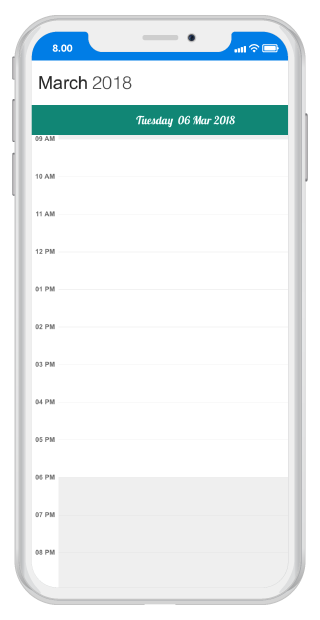
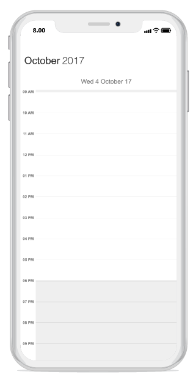
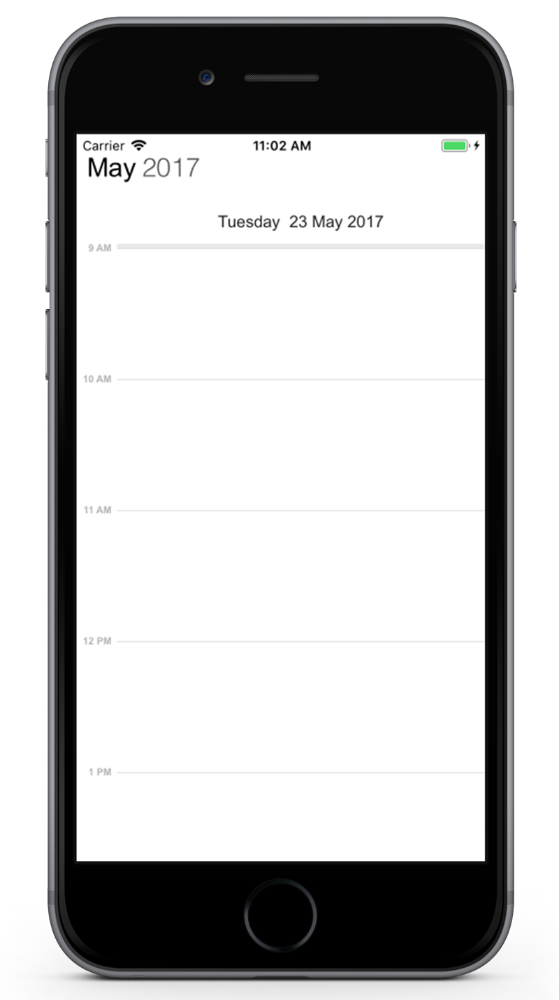
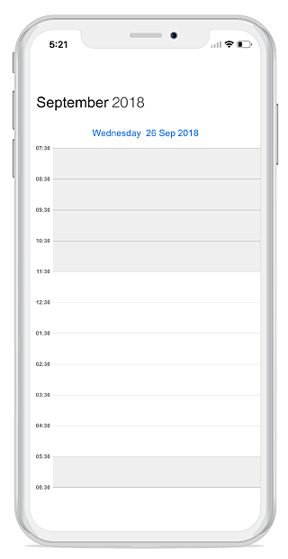
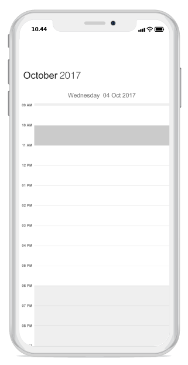

---

layout: post
title: Customize day view at Syncfusion Schedule control | Xamarin.iOS
description: Learn how to configure the view header, timeslots of schedule day view in SfSchedule control for Xamarin.iOS
platform: xamarin.iOS
control: SfSchedule
documentation: ug

---

# Day View in Xamarin.in Schedule (SfSchedule)

Day view is used to display a single day, current day will be visible by default. Appointments on a specific day will be arranged in respective timeslots based on its duration.

## ViewHeader Appearance
You can customize the default appearance of view header in [DayView](https://help.syncfusion.com/cr/xamarin-ios/Syncfusion.SfSchedule.iOS.SFScheduleView.html) by using [DayHeaderStyle](https://help.syncfusion.com/cr/xamarin-ios/Syncfusion.SfSchedule.iOS.SFSchedule.html#Syncfusion_SfSchedule_iOS_SFSchedule_DayHeaderStyle) property of [SFSchedule](https://help.syncfusion.com/cr/xamarin-ios/Syncfusion.SfSchedule.iOS.SFSchedule.html).



//Create new instance of Schedule
SFSchedule schedule = new SFSchedule();
schedule.ScheduleView = SFScheduleView.SFScheduleViewDay;
//Customize the schedule view header
SFViewHeaderStyle viewHeaderStyle = new SFViewHeaderStyle();
viewHeaderStyle.BackgroundColor = UIColor.FromRGB(0, 150, 136);
viewHeaderStyle.DayTextColor = UIColor.FromRGB(255, 255, 255);
viewHeaderStyle.DateTextColor = UIColor.FromRGB(255, 255, 255);
viewHeaderStyle.DayTextStyle = UIFont.FromName("Arial", 15);
viewHeaderStyle.DateTextStyle = UIFont.FromName("Arial", 15);
schedule.DayHeaderStyle = viewHeaderStyle;



You can customize the height of the ViewHeader in `DayView` by setting [ViewHeaderHeight](https://help.syncfusion.com/cr/xamarin-ios/Syncfusion.SfSchedule.iOS.SFSchedule.html#Syncfusion_SfSchedule_iOS_SFSchedule_ViewHeaderHeight) property of `SFSchedule`.



schedule.ScheduleView = SFScheduleView.SFScheduleViewDay;
schedule.ViewHeaderHeight = 50;



### Customize Font Appearance

You can change the appearance of Font by setting the [DayTextStyle](https://help.syncfusion.com/cr/xamarin-ios/Syncfusion.SfSchedule.iOS.SFViewHeaderStyle.html#Syncfusion_SfSchedule_iOS_SFViewHeaderStyle_DayTextStyle) and [DateTextStyle](https://help.syncfusion.com/cr/xamarin-ios/Syncfusion.SfSchedule.iOS.SFViewHeaderStyle.html#Syncfusion_SfSchedule_iOS_SFViewHeaderStyle_DateTextStyle) properties of [ViewHeaderStyle](https://help.syncfusion.com/xamarin-ios/sfschedule/dayview#viewheader-appearance) property in Schedule.



viewHeaderStyle.DayTextStyle = UIFont.FromName("Lobster-Regular",20);
viewHeaderStyle.DateTextStyle = UIFont.FromName("Lobster-Regular",20);		



Refer [this](https://help.syncfusion.com/xamarin-ios/sfschedule/monthview#custom-font-setting-in-xamarinios) to configure the custom fonts in Xamarin.iOS.

### ViewHeader Date Format
You can customize the date and day format of `SFSchedule` ViewHeader by using [DayLabelFormat](https://help.syncfusion.com/cr/xamarin-ios/Syncfusion.SfSchedule.iOS.DayLabelSettings.html#Syncfusion_SfSchedule_iOS_DayLabelSettings_DayLabelFormat) properties of `LabelSettings`.



schedule.ScheduleView = SFScheduleView.SFScheduleViewDay;
//Creating new instance of DayViewSettings
DayViewSettings dayViewSettings = new DayViewSettings();
//Creating new instance of DayLabelSettings
DayLabelSettings dayLabelSettings = new DayLabelSettings();
//Customizing date format
dayLabelSettings.DayLabelFormat = (NSString)"EEE d MMMM YY";
dayViewSettings.LabelSettings = dayLabelSettings;
schedule.DayViewSettings = dayViewSettings;



### ViewHeader Tapped Event
You can handle single tap action of ViewHeader by using [ViewHeaderTapped](https://help.syncfusion.com/cr/xamarin-ios/Syncfusion.SfSchedule.iOS.SFSchedule.html) event of `SFSchedule`. This event will be triggered when the ViewHeader is Tapped. This event contains [ViewHeaderTappedEventArgs](https://help.syncfusion.com/cr/xamarin-ios/Syncfusion.SfSchedule.iOS.ViewHeaderTappedEventArgs.html) argument which holds [Date](https://help.syncfusion.com/cr/xamarin-ios/Syncfusion.SfSchedule.iOS.ViewHeaderTappedEventArgs.html#Syncfusion_SfSchedule_iOS_ViewHeaderTappedEventArgs_Date) details in it.



//Creating  new instance of Schedule
SFSchedule schedule = new SFSchedule();
schedule.ScheduleView = SFScheduleView.SFScheduleViewDay;
schedule.ViewHeaderTapped += Handle_ViewHeaderTapped;

...

void Handle_ViewHeaderTapped(object sender, ViewHeaderTappedEventArgs e)
{
    var date = e.Date;
}



## Change Time Interval
You can customize the interval of timeslots in `DayView` by setting [TimeInterval](https://help.syncfusion.com/cr/xamarin-ios/Syncfusion.SfSchedule.iOS.SFSchedule.html#Syncfusion_SfSchedule_iOS_SFSchedule_TimeInterval) property of `SFSchedule`.



schedule.ScheduleView = SFScheduleView.SFScheduleViewDay;
schedule.TimeInterval = 120;



>**NOTE**
If you modify the `TimeInterval` value (in minutes), you need to change the time labels format by setting the `TimeFormat` value as "hh:mm". By default, TimeFormat value is `"h aa"`. You can refer [here](https://help.syncfusion.com/xamarin-ios/sfschedule/dayview#time-label-formatting) for changing TimeFormat value.

## Change Time Interval Height
You can customize the interval height of timeslots in `DayView` by setting [TimeIntervalHeight](https://help.syncfusion.com/cr/xamarin-ios/Syncfusion.SfSchedule.iOS.SFSchedule.html#Syncfusion_SfSchedule_iOS_SFSchedule_TimeIntervalHeight)  property of `SFSchedule`.



schedule.ScheduleView = SFScheduleView.SFScheduleViewDay;
schedule.TimeIntervalHeight = 120;



## Change Working hours

Working hours in `DayView` of Schedule control will be differentiated with non-working hours by separate color. By default, working hours will be between 09 to 18. You can customize the working hours by setting [WorkStartHour](https://help.syncfusion.com/cr/xamarin-ios/Syncfusion.SfSchedule.iOS.DayViewSettings.html#Syncfusion_SfSchedule_iOS_DayViewSettings_WorkStartHour) and [WorkEndHour](https://help.syncfusion.com/cr/xamarin-ios/Syncfusion.SfSchedule.iOS.DayViewSettings.html#Syncfusion_SfSchedule_iOS_DayViewSettings_WorkEndHour) properties of [DayViewSettings](https://help.syncfusion.com/cr/xamarin-ios/Syncfusion.SfSchedule.iOS.SFSchedule.html#Syncfusion_SfSchedule_iOS_SFSchedule_DayViewSettings). You can also customize the working hours along with minutes by setting double value which will be converted to time.



schedule.ScheduleView = SFScheduleView.SFScheduleViewDay;
//Create new instance of DayViewSettings
DayViewSettings dayViewSettings = new DayViewSettings();
DayLabelSettings dayLabelSettings = new DayLabelSettings();
dayLabelSettings.TimeLabelFormat = (NSString)"hh:mm";
dayViewSettings.WorkStartHour = 11.5;
dayViewSettings.WorkEndHour = 17.5;
dayViewSettings.LabelSettings = dayLabelSettings;
schedule.DayViewSettings = dayViewSettings;



>**NOTE**
No need to specify the decimal point values for `WorkStartHour` and `WorkEndHour`, if you don’t want to set the minutes.

## Changing StartHour and EndHour

Default value for [StartHour](https://help.syncfusion.com/cr/xamarin-ios/Syncfusion.SfSchedule.iOS.DayViewSettings.html#Syncfusion_SfSchedule_iOS_DayViewSettings_StartHour) and [EndHour](https://help.syncfusion.com/cr/xamarin-ios/Syncfusion.SfSchedule.iOS.DayViewSettings.html#Syncfusion_SfSchedule_iOS_DayViewSettings_EndHour) value is 0 to 24 to show all the time slots in `DayView`. You need to set [StartHour](https://help.syncfusion.com/cr/xamarin-ios/Syncfusion.SfSchedule.iOS.DayViewSettings.html#Syncfusion_SfSchedule_iOS_DayViewSettings_StartHour) and [EndHour](https://help.syncfusion.com/cr/xamarin-ios/Syncfusion.SfSchedule.iOS.DayViewSettings.html#Syncfusion_SfSchedule_iOS_DayViewSettings_EndHour) property of `DayView`, to show only the required time duration for end users. You can also set `StartHour` and `EndHour` in double value which will be converted to time to show required time duration in minutes.



schedule.ScheduleView = SFScheduleView.SFScheduleViewDay;
//Create new instance of DayViewSettings
DayViewSettings dayViewSettings = new DayViewSettings();
DayLabelSettings dayLabelSettings = new DayLabelSettings();
dayLabelSettings.TimeLabelFormat = (NSString)"hh:mm";
dayViewSettings.StartHour = 7.5;
dayViewSettings.EndHour = 18.5;
dayViewSettings.LabelSettings = dayLabelSettings;
schedule.DayViewSettings = dayViewSettings;



>**NOTE**
* `StartHour` must be greater than or equal to 0 and `EndHour` must be lesser than or equal to 24, otherwise `InvalidDataException` will be thrown.
* `EndHour` value must be greater than `StartHour`, otherwise `InvalidDataException` will be thrown.
* Schedule UI such as Appointments and NonAccessibleBlocks which does not fall within the `StartHour` and `EndHour` will not be visible and if it falls partially, it will be clipped.
* No need to specify the decimal point values for `StartHour` and `EndHour`, if you don’t want to set the minutes.
* The number of time slots will be calculated based on total minutes of a day and time interval (total minutes of a day ((start hour - end hour) * 60) / time interval).
* If the custom time interval is given, then the number of time slots calculated based on given time interval should result in integer value, otherwise given time interval will be neglected and default time interval (60 minutes) will be considered.
* If the custom start hour and end hour is given, then the number of time slots calculated based on given start hour, end hour should result in integer value, otherwise given end hour will be rounded off. For example, if StartHour is 7.2 (07:12AM), EndHour is 18.6 (06:36AM) and TimeInterval is 60 minutes, then EndHour will be rounded off to 18.2 (06:12PM).

## Timeslot Appearance
You can customize the appearance of timeslots in `DayView`.

 * [Timeslot customization in Work hours](#timeslot-customization-in-work-hours)
* [Timeslot customization in Non Working hours](#timeslot-customization-in-non-working-hours)

### Timeslot customization in Work hours

You can customize the appearance of the WorkingHourTimeslot by its color using [TimeSlotColor](https://help.syncfusion.com/cr/xamarin-ios/Syncfusion.SfSchedule.iOS.DayViewSettings.html#Syncfusion_SfSchedule_iOS_DayViewSettings_TimeSlotColor),[TimeSlotBorderColor](https://help.syncfusion.com/cr/xamarin-ios/Syncfusion.SfSchedule.iOS.DayViewSettings.html#Syncfusion_SfSchedule_iOS_DayViewSettings_TimeSlotBorderColor) and [TimeSlotStrokeWidth](https://help.syncfusion.com/cr/xamarin-ios/Syncfusion.SfSchedule.iOS.DayViewSettings.html#Syncfusion_SfSchedule_iOS_DayViewSettings_TimeSlotStrokeWidth) properties of 'DayViewSettings'.



schedule.ScheduleView = SFScheduleView.SFScheduleViewDay;
//Create new instance of DayViewSettings
DayViewSettings dayViewSettings = new DayViewSettings();
dayViewSettings.TimeSlotBorderColor = UIColor.Purple;
dayViewSettings.TimeSlotColor = UIColor.Yellow;
dayViewSettings.TimeSlotStrokeWidth = 3;
schedule.DayViewSettings = dayViewSettings;



### Timeslot customization in Non Working hours

You can customize the appearance of the Non-workingHourTimeslots by its color using [NonWorkingHoursTimeSlotBorderColor](https://help.syncfusion.com/cr/xamarin-ios/Syncfusion.SfSchedule.iOS.DayViewSettings.html#Syncfusion_SfSchedule_iOS_DayViewSettings_NonWorkingHourTimeSlotBorderColor),[NonWorkingHoursTimeSlotColor](https://help.syncfusion.com/cr/xamarin-ios/Syncfusion.SfSchedule.iOS.DayViewSettings.html#Syncfusion_SfSchedule_iOS_DayViewSettings_NonWorkingHourTimeSlotColor), properties of `DayViewSettings`.



schedule.ScheduleView = SFScheduleView.SFScheduleViewDay;
//Create new instance of DayViewSettings
DayViewSettings dayViewSettings = new DayViewSettings();
dayViewSettings.NonWorkingHourTimeSlotBorderColor = UIColor.Purple;
dayViewSettings.NonWorkingHourTimeSlotColor = UIColor.Yellow;
schedule.DayViewSettings = dayViewSettings;



>**NOTE**
`TimeSlotStrokeWidth` property common for both Working hours and Non-Working hour time slot customization.

## Non-Accessible timeslots

You can restrict or allocate certain timeslot as non-accessible blocks by using [NonAccessibleBlockCollection](https://help.syncfusion.com/cr/xamarin-ios/Syncfusion.SfSchedule.iOS.DayViewSettings.html#Syncfusion_SfSchedule_iOS_DayViewSettings_NonAccessibleBlockCollection) of `DayViewSettings`, so that you can allocate those timeslots for predefined events/activities like Lunch hour.



schedule.ScheduleView = SFScheduleView.SFScheduleViewDay;
//Create new instance of NonAccessibleBlock
NonAccessibleBlock nonAccessibleBlock = new NonAccessibleBlock();
//Create new instance of NonAccessibleBlocksCollection
NSMutableArray nonAccessibleBlocksCollection = new NSMutableArray();
DayViewSettings dayViewSettings = new DayViewSettings();
nonAccessibleBlock.StartHour = 13;
nonAccessibleBlock.EndHour = 14;
nonAccessibleBlock.Text = (NSString)"LUNCH";
nonAccessibleBlock.BackgroundColor = UIColor.Black;
nonAccessibleBlocksCollection.Add(nonAccessibleBlock);
dayViewSettings.NonAccessibleBlockCollection = nonAccessibleBlocksCollection;
schedule.DayViewSettings = dayViewSettings;



>**NOTE**
Selection and related events will not be working in this blocks.

## Change first day of week
[FirstDayOfWeek](https://help.syncfusion.com/cr/xamarin-ios/Syncfusion.SfSchedule.iOS.SFSchedule.html#Syncfusion_SfSchedule_iOS_SFSchedule_FirstDayOfWeek) of `SFSchedule` is not applicable for `DayView` as it displays only one day.

## Time Label Formatting
You can customize the format for the labels which are mentioning the time, by setting [TimeLabelFormat](https://help.syncfusion.com/cr/xamarin-ios/Syncfusion.SfSchedule.iOS.DayLabelSettings.html#Syncfusion_SfSchedule_iOS_DayLabelSettings_TimeLabelFormat) property of [LabelSettings](https://help.syncfusion.com/cr/xamarin-ios/Syncfusion.SfSchedule.iOS.DayViewSettings.html#Syncfusion_SfSchedule_iOS_DayViewSettings_LabelSettings) in `DayViewSettings`.



schedule.ScheduleView = SFScheduleView.SFScheduleViewDay;
DayViewSettings dayViewSettings = new DayViewSettings();
DayLabelSettings dayLabelSettings = new DayLabelSettings();
dayLabelSettings.TimeLabelFormat = (NSString)"hh mm";
dayViewSettings.LabelSettings = dayLabelSettings;
schedule.DayViewSettings = dayViewSettings;
this.View.AddSubview(schedule);



## Time Label Appearance

You can customize the color for the labels which are mentioning the time, by setting [TimeLabelColor](https://help.syncfusion.com/cr/xamarin-ios/Syncfusion.SfSchedule.iOS.DayLabelSettings.html#Syncfusion_SfSchedule_iOS_DayLabelSettings_TimeLabelColor) property of `LabelSettings` in `DayViewSettings`.



schedule.ScheduleView = SFScheduleView.SFScheduleViewDay;
//Create new instance of DayViewSettings
DayViewSettings dayViewSettings = new DayViewSettings();
//Create new instance of DayLabelSettings
DayLabelSettings dayLabelSettings = new DayLabelSettings();
dayLabelSettings.TimeLabelColor = UIColor.Blue;
dayViewSettings.LabelSettings = dayLabelSettings;
schedule.DayViewSettings = dayViewSettings;



## Selection
You can customize the default appearance of selection UI in the timeslots.

* [Selection customization using style](#selection-customization-using-style)
* [Selection customization using custom View](#selection-customization-using-custom-view)

### Selection customization using style
You can customize the timeslot selection by using [SelectionStyle](https://help.syncfusion.com/cr/xamarin-ios/Syncfusion.SfSchedule.iOS.SFSchedule.html#Syncfusion_SfSchedule_iOS_SFSchedule_SelectionStyle) property of `SFSchedule`.



schedule.ScheduleView = SFScheduleView.SFScheduleViewDay;
//Create new instance of SelectionStyle
SFSelectionStyle selectionStyle = new SFSelectionStyle();
selectionStyle.BackgroundColor = UIColor.Blue;
selectionStyle.BorderColor = UIColor.Black;
selectionStyle.BorderThickness = 5;
selectionStyle.BorderCornerRadius = 5;
schedule.SelectionStyle = selectionStyle;



### Selection customization using custom View
You can replace the default selection UI with your custom view by setting [SelectionView](https://help.syncfusion.com/cr/xamarin-ios/Syncfusion.SfSchedule.iOS.SFSchedule.html#Syncfusion_SfSchedule_iOS_SFSchedule_SelectionView) property of `SFSchedule`.



schedule.ScheduleView = SFScheduleView.SFScheduleViewDay;
//Add the CustomView
UIButton customView = new UIButton();
customView.SetTitle("+NewEvent", UIControlState.Normal);
customView.BackgroundColor = UIColor.FromRGB(255, 152, 0);
customView.SetTitleColor(UIColor.White, UIControlState.Normal);
schedule.SelectionView = customView;



### Programmatic selection
You can programmatically select the specific timeslot by setting corresponding date and time value to [SelectedDate](https://help.syncfusion.com/cr/xamarin-ios/Syncfusion.SfSchedule.iOS.SFSchedule.html#Syncfusion_SfSchedule_iOS_SFSchedule_SelectedDate) property of `SFSchedule`. By default, it is null.



// Creating instance of calendar
NSCalendar calendar = new NSCalendar(NSCalendarType.Gregorian);
calendar.TimeZone = NSTimeZone.FromGMT(NSTimeZone.LocalTimeZone.GetSecondsFromGMT);

// Creating instance of date
NSDate date = new NSDate();

// Setting a date and time to select
NSDateComponents dateComponents = calendar.Components(NSCalendarUnit.Year | NSCalendarUnit.Month | NSCalendarUnit.Day, date);
dateComponents.Year = 2017;
dateComponents.Month = 10;
dateComponents.Day = 04;
dateComponents.Hour = 10;
schedule.SelectedDate = calendar.DateFromComponents(dateComponents);



You can clear the selection by setting [SelectedDate](https://help.syncfusion.com/cr/xamarin-ios/Syncfusion.SfSchedule.iOS.SFSchedule.html#Syncfusion_SfSchedule_iOS_SFSchedule_SelectedDate) as null.



// Setting null value to deselect
schedule.SelectedDate = null;



You can download the entire source code of this demo for Xamarin.iOS from here [Date_Selection](http://www.syncfusion.com/downloads/support/directtrac/general/ze/Date_Selection481745259.zip)

>**NOTE**
* `SFSchedule` does not support multiple selection.
* `SFSchedule` supports two-way binding of `SelectedDate` property.

