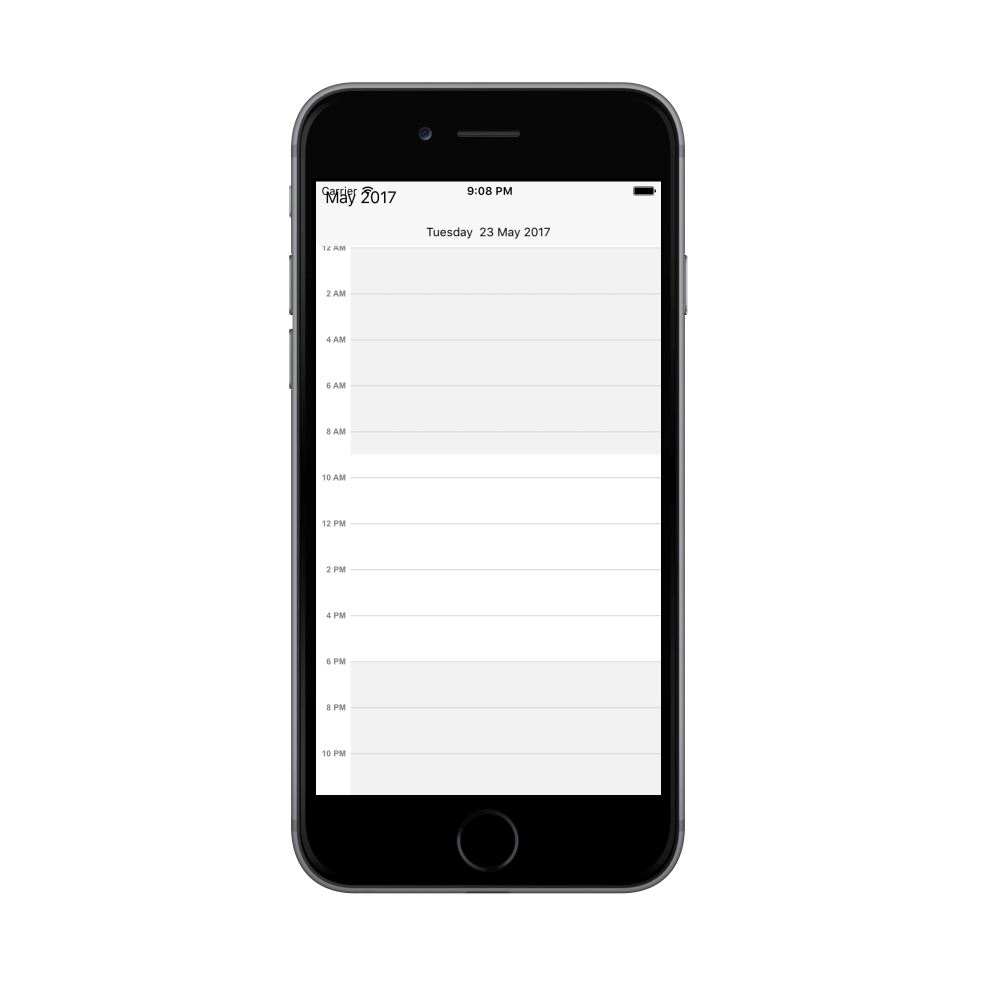
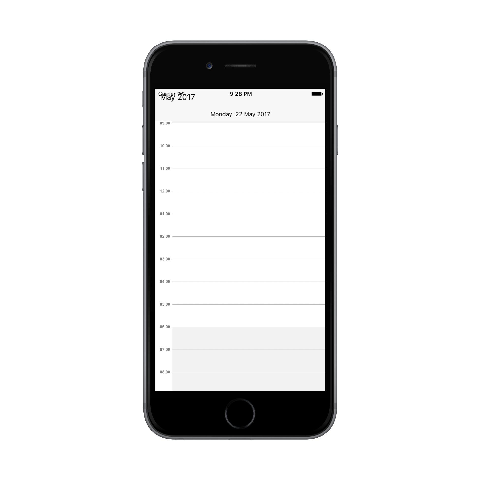
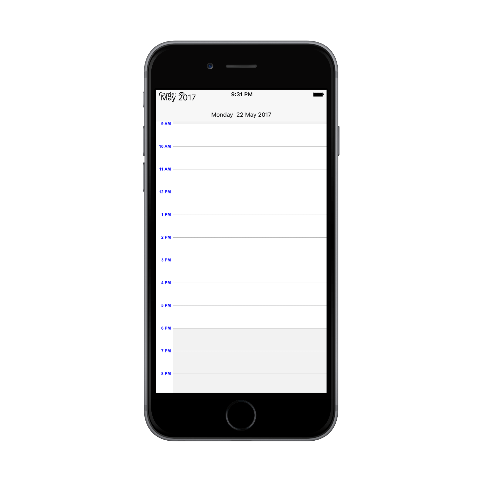

---

layout: post
title: Customize the Schedule DayView at SfSchedule control for Xamarin.iOS
description: Learn how to Customize the schedule DayView in SfSchedule control
platform: xamarin.iOS
control: SfSchedule
documentation: ug

---

# DayView:

DayView is used to display a single day, current day will be visible by default. Appointments on a specific day will be arranged in respective timeslots based on its duration.

## ViewHeader Appearance:
You can customize the default appearance of view header in [DayView](https://help.syncfusion.com/cr/cref_files/xamarin-ios/sfschedule/Syncfusion.SfSchedule.iOS~Syncfusion.SfSchedule.iOS.SFScheduleView.html) by using [DayHeaderStyle](https://help.syncfusion.com/cr/cref_files/xamarin-ios/sfschedule/Syncfusion.SfSchedule.iOS~Syncfusion.SfSchedule.iOS.SFSchedule~DayHeaderStyle.html) property of [SFSchedule](https://help.syncfusion.com/cr/cref_files/xamarin-ios/sfschedule/Syncfusion.SfSchedule.iOS~Syncfusion.SfSchedule.iOS.SFSchedule.html).



           //Create new instance of Schedule
			SFSchedule schedule = new SFSchedule();
			schedule.ScheduleView = SFScheduleView.SFScheduleViewDay;
			//Customize the schedule view header
			SFViewHeaderStyle viewHeaderStyle = new SFViewHeaderStyle();
			viewHeaderStyle.BackgroundColor = UIColor.FromRGB(0, 150, 136);
			viewHeaderStyle.DayTextColor = UIColor.FromRGB(255, 255, 255);
			viewHeaderStyle.DateTextColor = UIColor.FromRGB(255, 255, 255);
			viewHeaderStyle.DayTextSyle = UIFont.FromName("Arial", 15);
			viewHeaderStyle.DateTextSyle = UIFont.FromName("Arial", 15);
			schedule.DayHeaderStyle = viewHeaderStyle;
			


You can customize the height of the ViewHeader in `DayView` by setting [ViewHeaderHeight](https://help.syncfusion.com/cr/cref_files/xamarin-ios/sfschedule/Syncfusion.SfSchedule.iOS~Syncfusion.SfSchedule.iOS.SFSchedule~ViewHeaderHeight.html) property of `SFSchedule`.



        schedule.ScheduleView = SFScheduleView.SFScheduleViewDay;
		schedule.ViewHeaderHeight = 50;
			


## Change Time Interval:
You can customize the interval of timeslots in `DayView` by setting [TimeInterval](https://help.syncfusion.com/cr/cref_files/xamarin-ios/sfschedule/Syncfusion.SfSchedule.iOS~Syncfusion.SfSchedule.iOS.SFSchedule~TimeInterval.html) property of `SFSchedule`.



    schedule.ScheduleView = SFScheduleView.SFScheduleViewDay;
	schedule.TimeInterval = 120;


## Change Working hours:
Working hours in `DayView` of Schedule control will be differentiated with non-working hours by separate color. By default, working hours will be between 09 to 18. You can customize the working hours by setting [WorkStartHour](https://help.syncfusion.com/cr/cref_files/xamarin-ios/sfschedule/Syncfusion.SfSchedule.iOS~Syncfusion.SfSchedule.iOS.DayViewSettings~WorkStartHour.html) and [WorkEndHour](https://help.syncfusion.com/cr/cref_files/xamarin-ios/sfschedule/Syncfusion.SfSchedule.iOS~Syncfusion.SfSchedule.iOS.DayViewSettings~WorkEndHour.html) properties of [DayViewSettings](https://help.syncfusion.com/cr/cref_files/xamarin-ios/sfschedule/Syncfusion.SfSchedule.iOS~Syncfusion.SfSchedule.iOS.SFSchedule~DayViewSettings.html).



            schedule.ScheduleView = SFScheduleView.SFScheduleViewDay;
			//Create new instance of DayViewSettings
			DayViewSettings dayViewSettings = new DayViewSettings();
			dayViewSettings.WorkStartHour = 10;
			dayViewSettings.WorkEndHour = 18;
			schedule.DayViewSettings = dayViewSettings;


>**Note**:
`WorkStartHour` and `WorkEndHour` should be in integer value to represent hours.

## Timeslot Appearance:
You can customize the appearance of timeslots in `DayView`.

 * [Timeslot customization in Work hours](#timeslot-customization-in-work-hours)
* [Timeslot customization in Non Working hours](#timeslot-customization-in-non-working-hours)

### Timeslot customization in Work hours:

You can customize the appearance of the WorkingHourTimeslot by its color using [TimeSlotColor](https://help.syncfusion.com/cr/cref_files/xamarin-ios/sfschedule/Syncfusion.SfSchedule.iOS~Syncfusion.SfSchedule.iOS.DayViewSettings~TimeSlotColor.html),[TimeSlotBorderColor](https://help.syncfusion.com/cr/cref_files/xamarin-ios/sfschedule/Syncfusion.SfSchedule.iOS~Syncfusion.SfSchedule.iOS.DayViewSettings~TimeSlotBorderColor.html) and [TimeSlotStrokeWidth](https://help.syncfusion.com/cr/cref_files/xamarin-ios/sfschedule/Syncfusion.SfSchedule.iOS~Syncfusion.SfSchedule.iOS.DayViewSettings~TimeSlotStrokeWidth.html) properties of 'DayViewSettings'.



           schedule.ScheduleView = SFScheduleView.SFScheduleViewDay;
			//Create new instance of DayViewSettings
			DayViewSettings dayViewSettings = new DayViewSettings();
			dayViewSettings.TimeSlotBorderColor = UIColor.Purple;
			dayViewSettings.TimeSlotColor = UIColor.Yellow;
			dayViewSettings.TimeSlotStrokeWidth = 3;
			schedule.DayViewSettings = dayViewSettings;


### Timeslot customization in Non Working hours:

You can customize the appearance of the Non-workingHourTimeslots by its color using [NonWorkingHoursTimeSlotBorderColor](https://help.syncfusion.com/cr/cref_files/xamarin-ios/sfschedule/Syncfusion.SfSchedule.iOS~Syncfusion.SfSchedule.iOS.DayViewSettings~NonWorkingHourTimeSlotBorderColor.html),[NonWorkingHoursTimeSlotColor](https://help.syncfusion.com/cr/cref_files/xamarin-ios/sfschedule/Syncfusion.SfSchedule.iOS~Syncfusion.SfSchedule.iOS.DayViewSettings~NonWorkingHourTimeSlotColor.html), properties of `DayViewSettings`.



            schedule.ScheduleView = SFScheduleView.SFScheduleViewDay;
			//Create new instance of DayViewSettings
			DayViewSettings dayViewSettings = new DayViewSettings();
			dayViewSettings.NonWorkingHourTimeSlotBorderColor = UIColor.Purple;
			dayViewSettings.NonWorkingHourTimeSlotColor = UIColor.Yellow;
			schedule.DayViewSettings = dayViewSettings;


>**Note**:
`TimeSlotStrokeWidth` property common for both Working hours and Non-Working hour time slot customization.

## Non-Accessible timeslots:

You can restrict or allocate certain timeslot as non-accessible blocks by using [NonAccessibleBlockCollection](https://help.syncfusion.com/cr/cref_files/xamarin-ios/sfschedule/Syncfusion.SfSchedule.iOS~Syncfusion.SfSchedule.iOS.DayViewSettings~NonAccessibleBlockCollection.html) of `DayViewSettings`, so that you can allocate those timeslots for predefined events/activities like Lunch hour.



            schedule.ScheduleView = SFScheduleView.SFScheduleViewDay;
			//Create new instance of NonAccessibleBlock
			NonAccessibleBlock nonAccessibleBlock = new NonAccessibleBlock();
			//Create new instance of NonAccessibleBlocksCollection
			NSMutableArray nonAccessibleBlocksCollection = new NSMutableArray();
			DayViewSettings dayViewSettings = new DayViewSettings();
			nonAccessibleBlock.StartHour = 13;
			nonAccessibleBlock.EndHour = 14;
			nonAccessibleBlock.Text = (NSString)"LUNCH";
			nonAccessibleBlock.BackgroundColor = UIColor.Black;
			nonAccessibleBlocksCollection.Add(nonAccessibleBlock);
			dayViewSettings.NonAccessibleBlockCollection = nonAccessibleBlocksCollection;
			schedule.DayViewSettings = dayViewSettings;


>**Note**:
Selection and related events will not be working in this blocks.

## Change first day of week:
[FirstDayOfWeek](https://help.syncfusion.com/cr/cref_files/xamarin-ios/sfschedule/Syncfusion.SfSchedule.iOS~Syncfusion.SfSchedule.iOS.SFSchedule~FirstDayOfWeek.html) of `SFSchedule` is not applicable for `DayView` as it displays only one day.

## Time Label Formatting:
You can customize the format for the labels which are mentioning the time, by setting [TimeLabelFormat](https://help.syncfusion.com/cr/cref_files/xamarin-ios/sfschedule/Syncfusion.SfSchedule.iOS~Syncfusion.SfSchedule.iOS.DayLabelSettings~TimeLabelFormat.html) property of [LabelSettings](https://help.syncfusion.com/cr/cref_files/xamarin-ios/sfschedule/Syncfusion.SfSchedule.iOS~Syncfusion.SfSchedule.iOS.DayViewSettings~LabelSettings.html) in `DayViewSettings`.



            schedule.ScheduleView = SFScheduleView.SFScheduleViewDay;
			DayViewSettings dayViewSettings = new DayViewSettings();
			DayLabelSettings dayLabelSettings = new DayLabelSettings();
			dayLabelSettings.TimeLabelFormat = (NSString)"hh mm";
			dayViewSettings.LabelSettings = dayLabelSettings;
			schedule.DayViewSettings = dayViewSettings;
			this.View.AddSubview(schedule);


## Time Label Appearance:

You can customize the color for the labels which are mentioning the time, by setting [TimeLabelColor](https://help.syncfusion.com/cr/cref_files/xamarin-ios/sfschedule/Syncfusion.SfSchedule.iOS~Syncfusion.SfSchedule.iOS.DayLabelSettings~TimeLabelColor.html) property of `LabelSettings` in `DayViewSettings`.



            schedule.ScheduleView = SFScheduleView.SFScheduleViewDay;
			//Create new instance of DayViewSettings
			DayViewSettings dayViewSettings = new DayViewSettings();
			//Create new instance of DayLabelSettings
			DayLabelSettings dayLabelSettings = new DayLabelSettings();
			dayLabelSettings.TimeLabelColor = UIColor.Blue;
			dayViewSettings.LabelSettings = dayLabelSettings;
			schedule.DayViewSettings = dayViewSettings;


## Selection:
You can customize the default appearance of selection UI in the timeslots.

* [Selection customization using style](#selection-customization-using-style)
* [Selection customization using custom View](#selection-customization-using-custom-view)

### Selection customization using style:
You can customize the timeslot selection by using [SelectionStyle](https://help.syncfusion.com/cr/cref_files/xamarin-ios/sfschedule/Syncfusion.SfSchedule.iOS~Syncfusion.SfSchedule.iOS.SFSchedule~SelectionStyle.html) property of `SFSchedule`.



            schedule.ScheduleView = SFScheduleView.SFScheduleViewDay;
			//Create new instance of SelectionStyle 
			SFSelectionStyle selectionStyle = new SFSelectionStyle();
			selectionStyle.BackgroundColor = UIColor.Blue;
			selectionStyle.BorderColor = UIColor.Black;
			selectionStyle.BorderThickness = 5;
			selectionStyle.BorderCornerRadius = 5;
			schedule.SelectionStyle = selectionStyle;


### Selection customization using custom View:
You can replace the default selection UI with your custom view by setting [SelectionView](https://help.syncfusion.com/cr/cref_files/xamarin-ios/sfschedule/Syncfusion.SfSchedule.iOS~Syncfusion.SfSchedule.iOS.SFSchedule~SelectionView.html) property of `SFSchedule`.


           schedule.ScheduleView = SFScheduleView.SFScheduleViewDay;
			//Add the CustomView 
			UIButton customView = new UIButton();
			customView.SetTitle("+NewEvent", UIControlState.Normal);
			customView.BackgroundColor = UIColor.FromRGB(255, 152, 0);
			customView.SetTitleColor(UIColor.White, UIControlState.Normal);
			schedule.SelectionView = customView;


>**Note:**
Selection customization is applicable for time slots alone.

