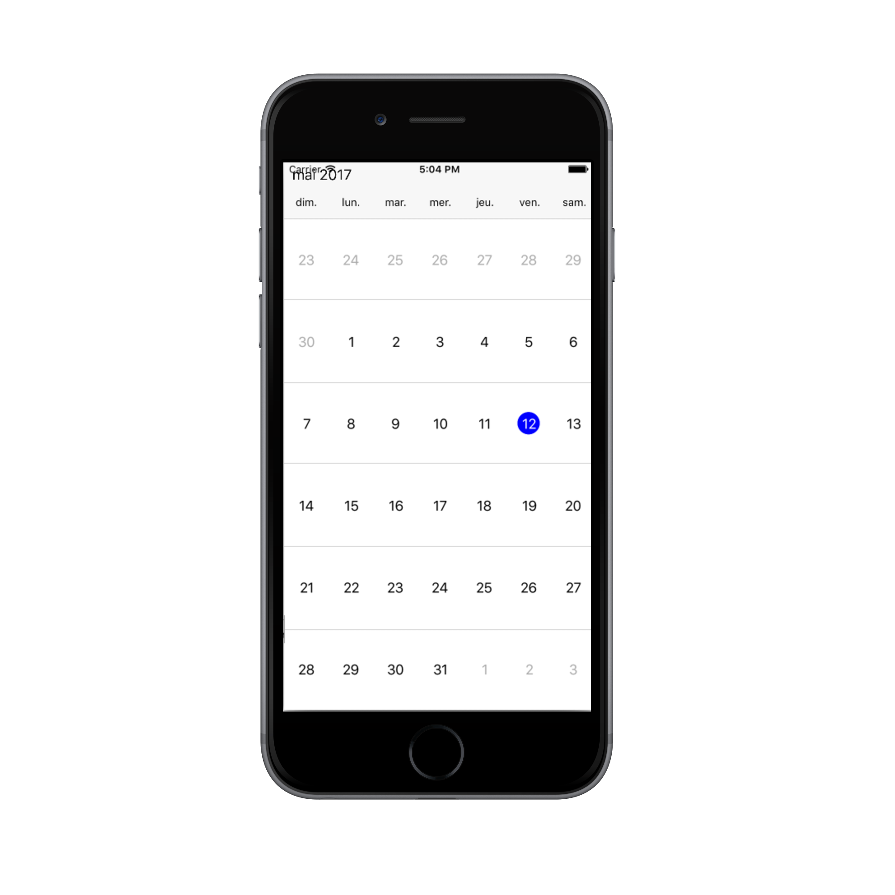

# Localization

Schedule control is available with complete localization support. Localization can be specified by setting the [Locale](https://help.syncfusion.com/cr/cref_files/xamarin-ios/sfschedule/Syncfusion.SfSchedule.iOS~Syncfusion.SfSchedule.iOS.SFSchedule~Locale.html) property of SfSchedule. In the format of `Language code`.

## Change default control language

Based on the `Locale` specified the strings in the control such as Date, time, days are localized accordingly.

By default, schedule control is available with en locale, which is English.

   
   
    
          //setting locale for the control
            schedule.Locale = new NSLocale("fr");
 
   
   

   

## Change custom texts in the control.

You can localize custom text available in the control by adding equivalent localized string in the Localizable.strings file. 

  

