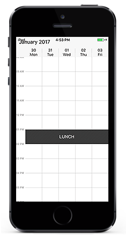
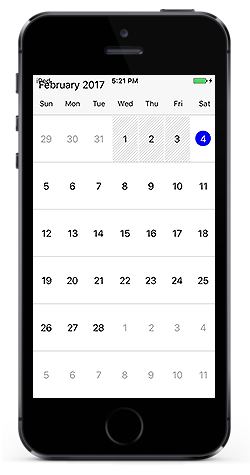

# Restricted Hours And Dates 

## Non-Accessible blocks

### Day View

You can restrict/allocate certain timeslot as non-accessible block using `NonAccessibleBlockCollection` of `DayViewSettings`, so that you can allocate those timeslots for predefined events/activities like Lunch hour.



    SFSchedule schedule= new SFSchedule ();
    schedule.ScheduleView = SFScheduleView.SFScheduleViewDay;

    DayViewSettings dayViewSettings = new DayViewSettings ();
    //Non-AccessbleBlocks
    NonAccessibleBlock lunch_hour = new NonAccessibleBlock ();
    lunch_hour.StartHour = 13;
    lunch_hour.EndHour = 14;
    lunch_hour.Text = (NSString)"LUNCH";
    dayViewSettings.NonAccessibleBlockCollection.Add (lunch_hour);
    schedule.DayViewSettings = dayViewSettings;

    View.AddSubview(schedule);



### Week View

You can restrict/allocate certain timeslot as non-accessible block using `NonAccessibleBlockCollection` of `WeekViewSettings`, so that you can allocate those timeslots for predefined events/activities like Lunch hour.



    SFSchedule schedule= new SFSchedule ();
    schedule.ScheduleView = SFScheduleView.SFScheduleViewWeek;
    WeekViewSettings weekSettings = new WeekViewSettings ();
   
    //Non-AccessibleBlocks
    NonAccessibleBlock lunch_hour = new NonAccessibleBlock ();
    lunch_hour.StartHour = 13;
    lunch_hour.EndHour = 14;
    lunch_hour.Text = (NSString)"LUNCH";
    weekSettings.NonAccessibleBlockCollection.Add (lunch_hour);

    schedule.WeekViewSettings = weekSettings;
    View.AddSubview(schedule);



### WorkWeek View

You can restrict/allocate certain timeslot as non-accessible block using `NonAccessibleBlockCollection` of `WorkWeekViewSettings`, so that you can allocate those timeslots for predefined events/activities like Lunch hour.



    SFSchedule schedule= new SFSchedule ();
    schedule.ScheduleView = SFScheduleView.SFScheduleViewWorkWeek;
    WorkWeekViewSettings workWeekSettings = new WorkWeekViewSettings ();
    //Non-AccessbleBlocks
    NonAccessibleBlock lunch_hour = new NonAccessibleBlock ();
    lunch_hour.StartHour = 13;
    lunch_hour.EndHour = 14;
    lunch_hour.Text = (NSString)"LUNCH";
    workWeekSettings.NonAccessibleBlockCollection.Add (lunch_hour);
    schedule.WorkWeekViewSettings = workWeekSettings;
    View.AddSubview(schedule);



## Blackout Dates

You can restrict/allocate certain month cell as blackout days using `BlackoutDates` of `MonthViewSettings`, so that we can allocate those cells for predefined events/activities like Scheduled maintenance, planned leave etc.



    SFSchedule schedule= new SFSchedule ();
    schedule.ScheduleView = SFScheduleView.SFScheduleViewMonth;
    
    NSDate today = new NSDate ();
    NSCalendar calendar = NSCalendar.CurrentCalendar;
    // Get the year, month, day from the date
    NSDateComponents components = calendar.Components (
    NSCalendarUnit.Year | NSCalendarUnit.Month | NSCalendarUnit.Day, today);
    
    MonthViewSettings monthViewSettings = new MonthViewSettings ();
    monthViewSettings.BlackoutDates = new NSMutableArray ();
    components.Day -= 3;
    for (int i = 0; i < 3; i++) {
    NSDate startDate = calendar.DateFromComponents (components);
    components.Day += 1;
    monthViewSettings.BlackoutDates.Add (startDate);
    }
    
    schedule.MonthViewSettings = monthViewSettings;
    View.AddSubview(schedule);



