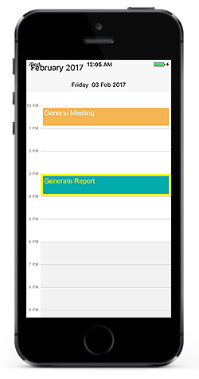
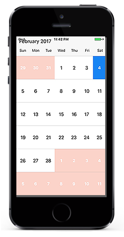
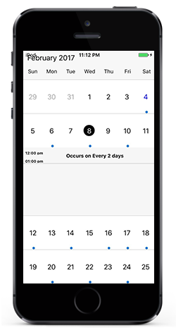

# View Customization 

## Appointment Customization

`ScheduleAppointment` created in schedule are arranged based on its duration, where the appointments viewed through day, week and work week view  are positioned in the timeslots.

### Appointment Style

Schedule Appointment can be customized in two ways, 

* AppointmentStyle property.
* AppointmentLoadedEvent.

**Using AppointmentStyle property**

`ScheduleAppointment` can be customized by setting appointmentstyle properties such as TextColor,TextStyle,BorderColor,BorderCornerRadius,BorderWidth,SelectionBorderColor,SelectionTextColor to the `AppointmentStyle` property of schedule.



	SFAppointmentStyle appointmentStyle = new SFAppointmentStyle();
	appointmentStyle.TextColor = UIColor.Red;
	appointmentStyle.TextStyle = UIFont.SystemFontOfSize(15, UIFontWeight.Bold);
	appointmentStyle.BorderColor = UIColor.Blue;
	appointmentStyle.BorderCornerRadius = 12;
	appointmentStyle.BorderWidth = 10;
	appointmentStyle.SelectionBorderColor = UIColor.Yellow;
	appointmentStyle.SelectionTextColor = UIColor.Yellow;
	sfschedule.AppointmentStyle = appointmentStyle;



**Using AppointmentLoaded Event**

Schedule appointment view can be customized during runtime using `didAppointmentLoaded Event`.In AppointmentLoaded event, the properties such as appointmentStyle,appointment,view,Bounds are passed in the `SFAppointmentLoaded`.

ScheduleAppointment can be customized using the `appointmentStyle` property as follows,



		public override void didAppointmentLoaded(SFAppointmentLoaded appointmentLoaded)
		{
			appointmentLoaded.AppointmentStyle.BorderColor = UIColor.Blue;
			appointmentLoaded.AppointmentStyle.BorderCornerRadius = 5;
			appointmentLoaded.AppointmentStyle.BorderWidth = 10;
			appointmentLoaded.AppointmentStyle.SelectionBorderColor = UIColor.Blue;
			appointmentLoaded.AppointmentStyle.SelectionTextColor = UIColor.Yellow;
			appointmentLoaded.AppointmentStyle.TextColor = UIColor.Brown;
			appointmentLoaded.AppointmentStyle.TextStyle = UIFont.SystemFontOfSize(15, UIFontWeight.Bold);
		}



### Appointment Custom View

You can also add an object in the appointment view using `view` property passed through `SFAppointmentLoaded`.



		public override void didAppointmentLoaded(SFAppointmentLoaded appointmentLoaded)
		{
			UIButton button = new UIButton();
			button.BackgroundColor=(UIColor.Red);
			appointmentLoaded.View = button;
		}



## MonthCell Customization

Schedule views are designed as per the native calendar control with some enriched user interface for the control interaction and usability. Month view cell contains the date along with its appointments if available. 

### MonthCell Style 

You can customize the MonthView cell in two ways, 

* MonthCellStyle property.
* MonthCellLoadedEvent.

**Using MonthCellStyle property**

MonthView can be customized by setting monthCellStyle properties such as TextColor,TextStyle,BackgroundColor to the `MonthCellStyle` property of schedule.



	SFMonthCellStyle monthCellStyle = new SFMonthCellStyle();
	monthCellStyle.BackgroundColor = UIColor.Gray;
	monthCellStyle.TextColor = UIColor.Blue;
	monthCellStyle.TextStyle = UIFont.SystemFontOfSize(15, UIFontWeight.Bold);
	sfschedule.MonthCellStyle = monthCellStyle;



**Using MonthCellLoaded Event**

You can customize the month view during runtime using `didMonthcellLoaded Event`. In MonthCellLoaded event, the properties such as CellStyle,Appointments,Calendar,view and boolean properties such as IsToday,IsPreviousMonthDate,IsNextMonthDate,IsBlackoutDate are passed in the `SFMonthCellLoaded`.

Month cells can be customized using the `CellStyle` property as follows,



	public override void didMonthcellLoaded(SFMonthCellLoaded monthCellLoaded)
	{
		monthCellLoaded.CellStyle.BackgroundColor = UIColor.Gray;
		monthCellLoaded.CellStyle.TextColor = UIColor.Blue;
		monthCellLoaded.CellStyle.TextStyle = UIFont.SystemFontOfSize(15, UIFontWeight.Bold);
	}



### MonthCell Custom View

You can also add an object in the month cell view using `View` property passed through `SFMonthCellLoaded`.



	public override void didMonthcellLoaded(SFMonthCellLoaded monthCellLoaded)
		{
			UIButton button = new UIButton();
			button.BackgroundColor=(UIColor.Red);
			monthCellLoaded.View = button;
		}



## Inline view Customization.

You can able to know the details of appointments in inline using `InlineAppointmentTapped` event in `Schedule`. Details of the selected  appointment and the corresponding date is passed through `InlineAppointmentTappedEventArgs` as `selectedAppointment` and `selectedDate` respectively.

### Inline Style

You can able to customize the inline view style using `MonthInlineLoadedEvent` 


	public override void didMonthInlineLoaded(SFMonthInlineLoaded monthCellLoaded)
		{
			SFMonthInlineViewStyle monthInlineViewStyle = new SFMonthInlineViewStyle();
			monthInlineViewStyle.BackgroundColor = UIColor.ParseColor("#F6F6F6");
			monthInlineViewStyle.TextColor = UIColor.Black;
			monthInlineViewStyle.TimeTextColor = UIColor.Black;
			monthCellLoaded.MonthInlineViewStyle = monthInlineViewStyle;

		}



### Inline Custom View

You can also add an object in the month cell view using `View` property passed through `MonthInlineAppointmentLoadedEvent`.

## Inline Appointment Customization

You can able to know the details of appointments in inline using `InlineAppointmentTapped` event in `Schedule`. Details of the selected  appointment and the corresponding date is passed through `InlineAppointmentTappedEventArgs` as `selectedAppointment` and `selectedDate` respectively.

## Selection

Cells can be selected using customized properties by setting `selectionStyle` property of Schedule.

### Selection Style

Cells can be selected using customized properties such as `BackgroundColor`, `BorderColor`,`BorderThickness`,`CornerRadius` in the `selectionStyle` property of Schedule.



	SFSelectionStyle selectionStyle = new SFSelectionStyle();
	selectionStyle.BackgroundColor = UIColor.Blue;
	selectionStyle.BorderColor = UIColor.Yellow;
	selectionStyle.BorderThickness = 5;
	sfSchedule.SelectionStyle = selectionStyle;



### Selection View

Also custom view can be passed using the `SelectionView` in Schedule.



	UIButton button = new UIButton();
	button.Text = "+ New event";
	button.SetTextColor(Color.White);
	button.Gravity = GravityFlags.Left;
	button.SetBackgroundColor(Color.ForestGreen);
	sfSchedule.SelectionView = button;



