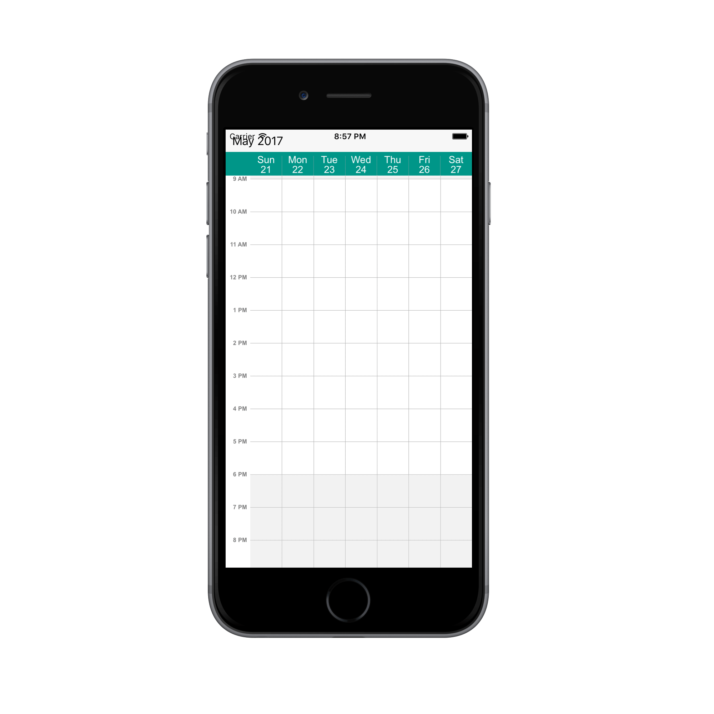
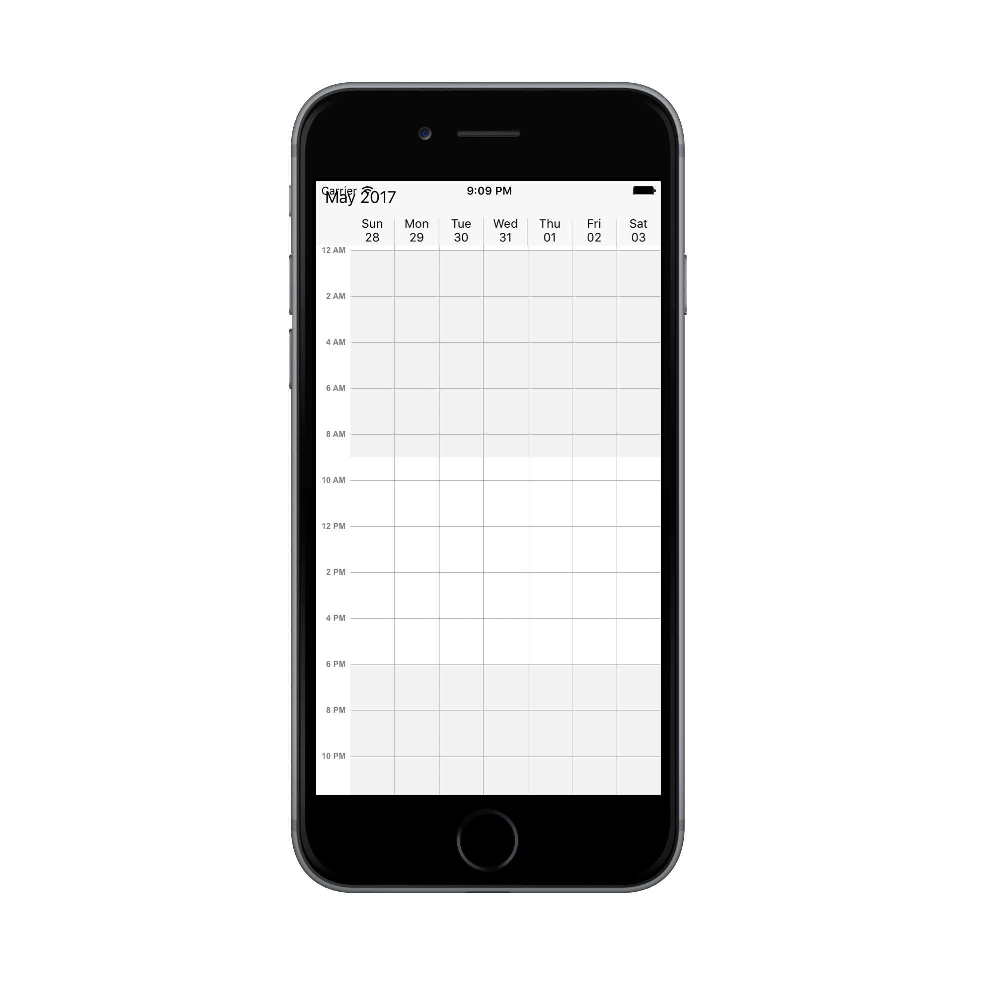
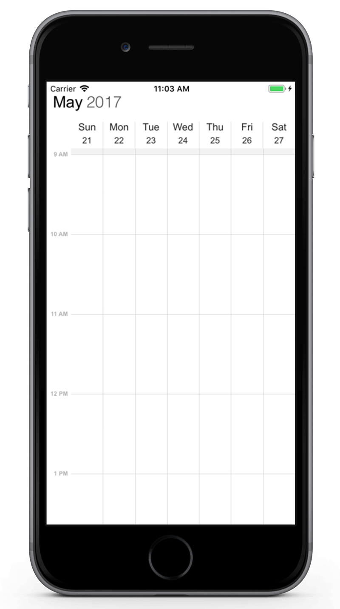
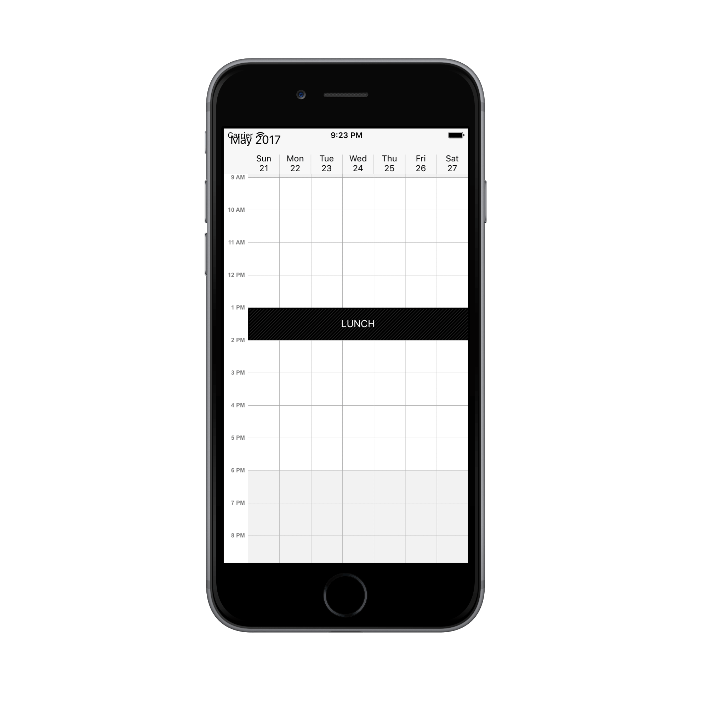
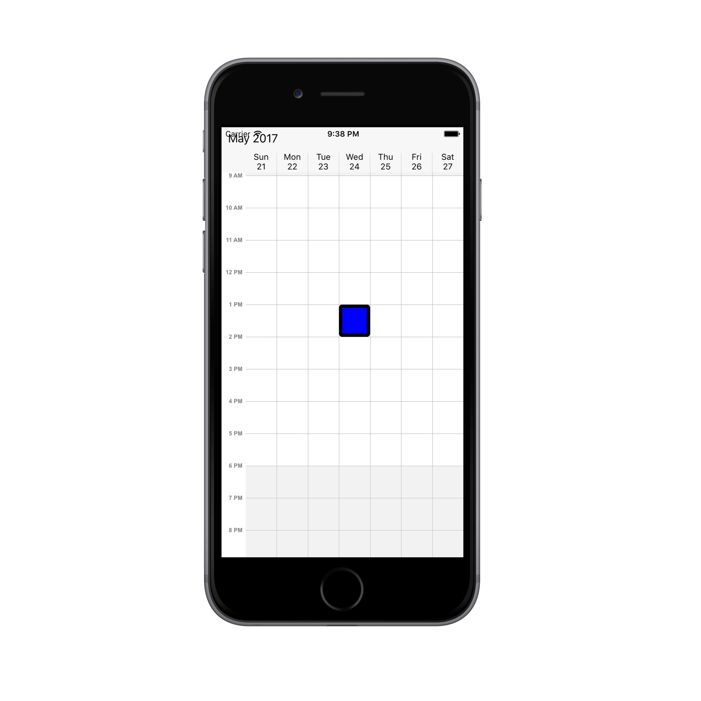

---

layout: post
title: Customize the Schedule WeekView at SfSchedule control for Xamarin.iOS
description: Learn how to Customize the schedule WeekView in SfSchedule control
platform: xamarin.iOS
control: SfSchedule
documentation: ug

---

# WeekView

WeekView is to view all days of a particular week. Appointments will be arranged based on the dates on the week in respective timeslots.

## ViewHeader Appearance
You can customize the default appearance of view header in [WeekView](https://help.syncfusion.com/cr/cref_files/xamarin-ios/sfschedule/Syncfusion.SfSchedule.iOS~Syncfusion.SfSchedule.iOS.SFScheduleView.html) by using [DayHeaderStyle](https://help.syncfusion.com/cr/cref_files/xamarin-ios/sfschedule/Syncfusion.SfSchedule.iOS~Syncfusion.SfSchedule.iOS.SFSchedule~DayHeaderStyle.html) property of [SFSchedule](https://help.syncfusion.com/cr/cref_files/xamarin-ios/sfschedule/Syncfusion.SfSchedule.iOS~Syncfusion.SfSchedule.iOS.SFSchedule.html).



           //Create new instance of Schedule
			SFSchedule schedule = new SFSchedule();
			schedule.ScheduleView = SFScheduleView.SFScheduleViewWeek;
			//Customize the schedule view header
			SFViewHeaderStyle viewHeaderStyle = new SFViewHeaderStyle();
			viewHeaderStyle.BackgroundColor = UIColor.FromRGB(0, 150, 136);
			viewHeaderStyle.DayTextColor = UIColor.FromRGB(255, 255, 255);
			viewHeaderStyle.DateTextColor = UIColor.FromRGB(255, 255, 255);
			viewHeaderStyle.DayTextStyle = UIFont.FromName("Arial", 15);
			viewHeaderStyle.DateTextStyle = UIFont.FromName("Arial", 15);
			schedule.DayHeaderStyle = viewHeaderStyle;
			


You can customize the height of the ViewHeader in `WeekView` by setting [ViewHeaderHeight](https://help.syncfusion.com/cr/cref_files/xamarin-ios/sfschedule/Syncfusion.SfSchedule.iOS~Syncfusion.SfSchedule.iOS.SFSchedule~ViewHeaderHeight.html) property of `SFSchedule`.



        schedule.ScheduleView = SFScheduleView.SFScheduleViewWeek;
		schedule.ViewHeaderHeight = 50;
			


## Change Time Interval
You can customize the interval of timeslots in `WeekView` by setting [TimeInterval](https://help.syncfusion.com/cr/cref_files/xamarin-ios/sfschedule/Syncfusion.SfSchedule.iOS~Syncfusion.SfSchedule.iOS.SFSchedule~TimeInterval.html) property of `SFSchedule`.



    schedule.ScheduleView = SFScheduleView.SFScheduleViewWeek;
    schedule.TimeInterval = 120;


## Change Time Interval Height
You can customize the interval height of timeslots in `WeekView` by setting [TimeIntervalHeight](https://help.syncfusion.com/cr/cref_files/xamarin-ios/sfschedule/Syncfusion.SfSchedule.iOS~Syncfusion.SfSchedule.iOS.SFSchedule~TimeIntervalHeight.html)  property of `SFSchedule`.



    schedule.ScheduleView = SFScheduleView.SFScheduleViewWeek;
    schedule.TimeIntervalHeight = 120;


## Change Working hours

Working hours in `WeekView` of Schedule control will be differentiated with non-working hours by separate color. By default, working hours will be between 09 to 18. You can customize the working hours by setting [WorkStartHour](https://help.syncfusion.com/cr/cref_files/xamarin-ios/sfschedule/Syncfusion.SfSchedule.iOS~Syncfusion.SfSchedule.iOS.WeekViewSettings~WorkStartHour.html) and [WorkEndHour](https://help.syncfusion.com/cr/cref_files/xamarin-ios/sfschedule/Syncfusion.SfSchedule.iOS~Syncfusion.SfSchedule.iOS.WeekViewSettings~WorkEndHour.html) properties of [WeekViewSettings](https://help.syncfusion.com/cr/cref_files/xamarin-ios/sfschedule/Syncfusion.SfSchedule.iOS~Syncfusion.SfSchedule.iOS.SFSchedule~WeekViewSettings.html).



            schedule.ScheduleView = SFScheduleView.SFScheduleViewWeek;
			//Create new instance of WeekViewSettings
			WeekViewSettings weekViewSettings = new WeekViewSettings();
			weekViewSettings.WorkStartHour = 10;
			weekViewSettings.WorkEndHour = 18;
			schedule.WeekViewSettings = weekViewSettings;


>**Note**:
	`WorkStartHour` and `WorkEndHour` should be in integer value to represent hours.

## Changing StartHour and EndHour

Default value for [StartHour](https://help.syncfusion.com/cr/cref_files/xamarin-ios/sfschedule/Syncfusion.SfSchedule.iOS~Syncfusion.SfSchedule.iOS.WeekViewSettings~StartHour.html) and [EndHour](https://help.syncfusion.com/cr/cref_files/xamarin-ios/sfschedule/Syncfusion.SfSchedule.iOS~Syncfusion.SfSchedule.iOS.WeekViewSettings~EndHour.html) value is 0 to 24 to show all the time slots in `WeekView`. You need to set [StartHour](https://help.syncfusion.com/cr/cref_files/xamarin-ios/sfschedule/Syncfusion.SfSchedule.iOS~Syncfusion.SfSchedule.iOS.WeekViewSettings~StartHour.html) and [EndHour](https://help.syncfusion.com/cr/cref_files/xamarin-ios/sfschedule/Syncfusion.SfSchedule.iOS~Syncfusion.SfSchedule.iOS.WeekViewSettings~EndHour.html) property of `WeekView`, to show only the required time duration for end users.



            schedule.ScheduleView = SFScheduleView.SFScheduleViewWeek;
			//Create new instance of WeekViewSettings
			WeekViewSettings weekViewSettings = new WeekViewSettings();
			weekViewSettings.StartHour = 08;
			weekViewSettings.EndHour = 15;
			schedule.WeekViewSettings = weekViewSettings;


>**Note**:
*  `StartHour` and `EndHour` should be in integer value to represent hours.
*  `StartHour` must be greater than or equal to 0 and `EndHour` must be lesser than or equal to 24, otherwise `InvalidDataException` will be thrown.
*  `EndHour` value must be greater than `StartHour`, otherwise `InvalidDataException` will be thrown.
*   Schedule UI such as Appointments and NonAccessibleBlocks which does not fall within the `StartHour` and `EndHour` will not be visible and if it falls partially, it will be clipped.

## Timeslot Appearance
You can customize the appearance of timeslots in `WeekView`.

 * [Timeslot customization in Work hours](#timeslot-customization-in-work-hours)
* [Timeslot customization in Non Working hours](#timeslot-customization-in-non-working-hours)

### Timeslot customization in Work hours

You can customize the appearance of the working hour timeslots by its color using[TimeSlotColor(https://help.syncfusion.com/cr/cref_files/xamarin-ios/sfschedule/Syncfusion.SfSchedule.iOS~Syncfusion.SfSchedule.iOS.WeekViewSettings~TimeSlotColor.html),[TimeSlotBorderColor](https://help.syncfusion.com/cr/cref_files/xamarin-ios/sfschedule/Syncfusion.SfSchedule.iOS~Syncfusion.SfSchedule.iOS.WeekViewSettings~TimeSlotBorderColor.html), [VerticalLineStrokeWidth](https://help.syncfusion.com/cr/cref_files/xamarin-ios/sfschedule/Syncfusion.SfSchedule.iOS~Syncfusion.SfSchedule.iOS.WeekViewSettings~VerticalLineStrokeWidth.html), [VerticalTimeSlotBorderColor](https://help.syncfusion.com/cr/cref_files/xamarin-ios/sfschedule/Syncfusion.SfSchedule.iOS~Syncfusion.SfSchedule.iOS.WeekViewSettings~VerticaTimeSlotBorderColor.html) and [HorizontalLineStrokeWidth](https://help.syncfusion.com/cr/cref_files/xamarin-ios/sfschedule/Syncfusion.SfSchedule.iOS~Syncfusion.SfSchedule.iOS.WeekViewSettings~HorizontalLineStrokeWidth.html) properties of `WeekViewSettings`.



           schedule.ScheduleView = SFScheduleView.SFScheduleViewWeek;
			//Create new instance of WeekViewSettings
			WeekViewSettings weekViewSettings = new WeekViewSettings();
			weekViewSettings.TimeSlotBorderColor = UIColor.Purple;
			weekViewSettings.VerticalTimeSlotBorderColor = UIColor.Blue;
			weekViewSettings.TimeSlotColor = UIColor.Yellow;
			weekViewSettings.HorizontalLineStrokeWidth = 3;
			weekViewSettings.VerticalLineStrokeWidth = 3;
			schedule.WeekViewSettings = weekViewSettings;


### Timeslot customization in Non Working hours

You can customize the appearance of the non-working hour timeslots by its color using[NonWorkingHourTimeSlotBorderColor](https://help.syncfusion.com/cr/cref_files/xamarin-ios/sfschedule/Syncfusion.SfSchedule.iOS~Syncfusion.SfSchedule.iOS.WeekViewSettings~NonWorkingHourTimeSlotBorderColor.html),[NonWorkingHourTimeSlotColor](https://help.syncfusion.com/cr/cref_files/xamarin-ios/sfschedule/Syncfusion.SfSchedule.iOS~Syncfusion.SfSchedule.iOS.WeekViewSettings~NonWorkingHourTimeSlotColor.html),`VerticalLineStrokeWidth`, ` VerticalTimeSlotBorderColor` and ` HorizontalLineStrokeWidth` properties of `WeekViewSettings`.



            schedule.ScheduleView = SFScheduleView.SFScheduleViewWeek;
			//Create new instance of WeekViewSettings
			WeekViewSettings weekViewSettings = new WeekViewSettings();
			weekViewSettings.NonWorkingHourTimeSlotBorderColor = UIColor.Purple;
			weekViewSettings.VerticalTimeSlotBorderColor = UIColor.Blue;
			weekViewSettings.NonWorkingHourTimeSlotColor = UIColor.Yellow;
			weekViewSettings.HorizontalLineStrokeWidth = 5;
			weekViewSettings.VerticalLineStrokeWidth = 5;
			schedule.WeekViewSettings = weekViewSettings;


>**Note**:
`HorizontalLineStrokeWidth`and `VerticalLineStrokeWidth` properties are common to both Working hours and Non-Working hour time slot customization.

## Non-Accessible timeslots

You can restrict or allocate certain timeslot as Non-accessible blocks by using [NonAccessibleBlockCollection](https://help.syncfusion.com/cr/cref_files/xamarin-ios/sfschedule/Syncfusion.SfSchedule.iOS~Syncfusion.SfSchedule.iOS.WeekViewSettings~NonAccessibleBlockCollection.html) of `WeekViewSettings` so that you can allocate those timeslots for predefined events/activities like Lunch hour.



            schedule.ScheduleView = SFScheduleView.SFScheduleViewWeek;
			//Create new instance of NonAccessibleBlock
			NonAccessibleBlock nonAccessibleBlock = new NonAccessibleBlock();
			//Create new instance of NonAccessibleBlocksCollection
			NSMutableArray nonAccessibleBlocksCollection = new NSMutableArray();
			WeekViewSettings weekViewSettings = new WeekViewSettings();
			nonAccessibleBlock.StartHour = 13;
			nonAccessibleBlock.EndHour = 14;
			nonAccessibleBlock.Text = (NSString)"LUNCH";
			nonAccessibleBlock.BackgroundColor = UIColor.Black;
			nonAccessibleBlocksCollection.Add(nonAccessibleBlock);
			weekViewSettings.NonAccessibleBlockCollection = nonAccessibleBlocksCollection;
			schedule.WeekViewSettings = weekViewSettings;


>**Note**:
Selection and related events will not be working in this blocks.

## Change first day of week
By default, schedule control will be rendered with Sunday as the first day of the week, it can be customized to any day of the week by using[FirstDayOfWeek](https://help.syncfusion.com/cr/cref_files/xamarin-ios/sfschedule/Syncfusion.SfSchedule.iOS~Syncfusion.SfSchedule.iOS.SFSchedule~FirstDayOfWeek.html) property of `SFSchedule`.


            schedule.ScheduleView = SFScheduleView.SFScheduleViewWeek;
			schedule.FirstDayOfWeek = 3;


## Time Label Formatting
You can customize the format for the labels which are mentioning the time, by setting [TimeLabelFormat](https://help.syncfusion.com/cr/cref_files/xamarin-ios/sfschedule/Syncfusion.SfSchedule.iOS~Syncfusion.SfSchedule.iOS.WeekLabelSettings~TimeLabelFormat.html) property of [LabelSettings](https://help.syncfusion.com/cr/cref_files/xamarin-ios/sfschedule/Syncfusion.SfSchedule.iOS~Syncfusion.SfSchedule.iOS.WeekViewSettings~LabelSettings.html) in `WeekViewSettings`.



            schedule.ScheduleView = SFScheduleView.SFScheduleViewWeek;
			WeekViewSettings weekViewSettings = new WeekViewSettings();
			WeekLabelSettings weekLabelSettings = new WeekLabelSettings();
			weekLabelSettings.TimeLabelFormat = (NSString)"hh mm";
			weekViewSettings.LabelSettings = weekLabelSettings;
			schedule.WeekViewSettings = weekViewSettings;
			this.View.AddSubview(schedule);


## Time Label Appearance

You can customize the color for the labels which are mentioning the time, by setting [TimeLabelColor](https://help.syncfusion.com/cr/cref_files/xamarin-ios/sfschedule/Syncfusion.SfSchedule.iOS~Syncfusion.SfSchedule.iOS.WeekLabelSettings~TimeLabelColor.html) property of `WeekLabelSettings` in `WeekViewSettings`.



           schedule.ScheduleView = SFScheduleView.SFScheduleViewWeek;
			WeekViewSettings weekViewSettings = new WeekViewSettings();
			WeekLabelSettings weekLabelSettings = new WeekLabelSettings();
			weekLabelSettings.TimeLabelColor = UIColor.Blue;
			weekViewSettings.LabelSettings = weekLabelSettings;
			schedule.WeekViewSettings = weekViewSettings;


## Selection
You can customize the default appearance of selection UI in the timeslots.

* [Selection customization using style](#selection-customization-using-style)
* [Selection customization using custom View](#selection-customization-using-custom-view)

### Selection customization using style
You can customize the timeslot selection by using [SelectionStyle](https://help.syncfusion.com/cr/cref_files/xamarin-ios/sfschedule/Syncfusion.SfSchedule.iOS~Syncfusion.SfSchedule.iOS.SFSchedule~SelectionStyle.html) property of `SFSchedule`.



            schedule.ScheduleView = SFScheduleView.SFScheduleViewWeek;
			//Create new instance of SelectionStyle 
			SFSelectionStyle selectionStyle = new SFSelectionStyle();
			selectionStyle.BackgroundColor = UIColor.Blue;
			selectionStyle.BorderColor = UIColor.Black;
			selectionStyle.BorderThickness = 5;
			selectionStyle.BorderCornerRadius = 5;
			schedule.SelectionStyle = selectionStyle;


### Selection customization using custom View
You can replace the default selection UI with your custom view by setting [SelectionView](https://help.syncfusion.com/cr/cref_files/xamarin-ios/sfschedule/Syncfusion.SfSchedule.iOS~Syncfusion.SfSchedule.iOS.SFSchedule~SelectionView.html) property of `SFSchedule`.


          schedule.ScheduleView = SFScheduleView.SFScheduleViewWeek;
			//Add the CustomView  
			UIButton customView = new UIButton();
			customView.SetTitle("+NewEvent", UIControlState.Normal);
			customView.BackgroundColor = UIColor.FromRGB(255, 152, 0);
			customView.SetTitleColor(UIColor.White, UIControlState.Normal);
			schedule.SelectionView = customView;


>**Note:**
Selection customization is applicable for time slots alone.

