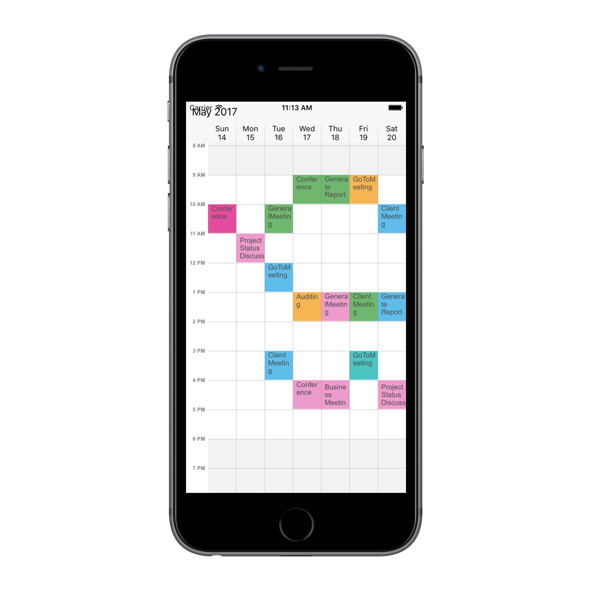
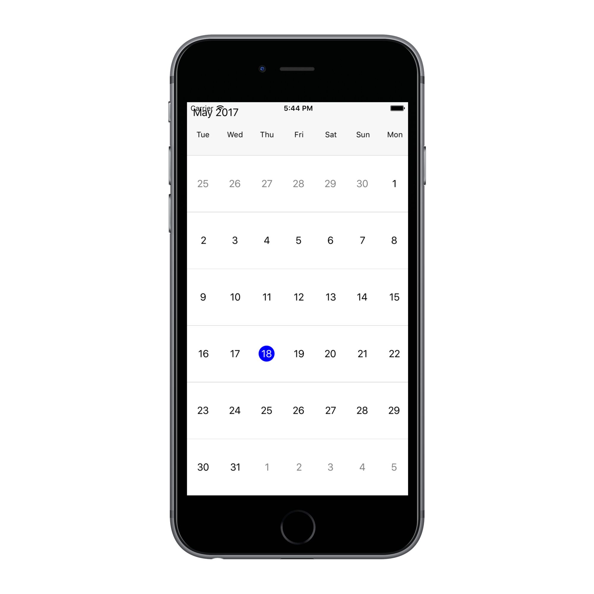
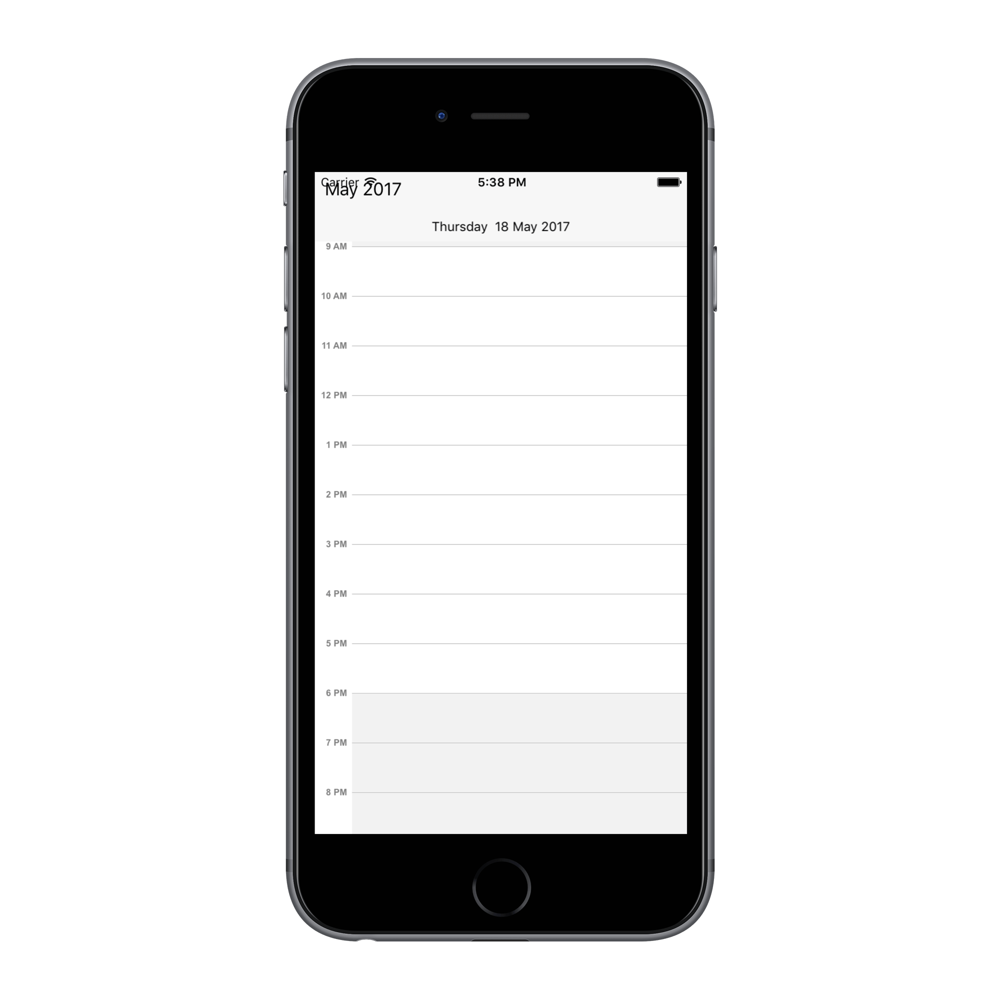

# Getting Started

This section provides you an overview for working with SfSchedule for Xamarin.Android and also provides a walk through to configure SfSchedule control in real time scenario.

## Assembly Configuration

You can download our Xamarin components directly from our website, refer [here](https://help.syncfusion.com/xamarin-ios/introduction/download-and-installation#download-directly-from-website) for assistance.
 
Once the assemblies has been downloaded and explored as mentioned above,you can find all the required assemblies in the installation folders. 
 
{Syncfusion Essential Studio Installed location}\Essential Studio\syncfusionessentialstudio-releaseversion\Xamarin\lib 
 
Eg: C:\Program Files (x86)\Syncfusion\Essential Studio\15.1.0.41\Xamarin\lib 
 
>**Note**: Assemblies can be found in unzipped package location in Mac 
 
The following assembly is need to be added as reference from the lib folder to use SfSchedule in your application. 
 
<table> 
<tr> 
<th>Project</th> 
<th>Required assembly</th> 
</tr> 
<tr> 
<td>Xamarin.iOS</td> 
<td>ios-unified\Syncfusion.SfSchedule.iOS.dll </td> 
</tr> 
</table> 

## Create a simple application with SfSchedule 
 
This section explains how to create a simple application using SfSchedule control. SfSchedule control can be configured entirely in C# code. This is how the final output will look like on iOS devices.
 
 

You can download the entire source code of this demo for Xamarin.iOS from   
here [ScheduleGettingStarted](http://www.syncfusion.com/downloads/support/directtrac/general/ze/ScheduleTest_iOS954342624.zip). 
 
This section provides a walks through to create `MeetingRoomScheduler` using our Schedule control.
 
* [Creating a new project](#creating-a-new-project) 
* [Adding SfSchedule to the project](#adding-sfschedule-to-the-project)      
* [Changing Schedule Views](#changing-schedule-views)   
* [Binding data to SfSchedule control](#binding-data-to-sfschedule-control) 

## Creating a new project 
 
Create a new iOS application in Xamarin Studio or Visual Studio for Xamarin.iOS. 
 
Add the required assembly references to the project as discussed in the [Assembly Configuration](#assembly-configuration) section. 
 
Import SfSchedule control namespace `Syncfusion.SfSchedule.iOS`. 

## Adding SfSchedule to the project 
 
Create an instance of `SfSchedule` control and add as a sub view of self view.


    
    using Syncfusion.SfSchedule.iOS;
    
    SFSchedule schedule;
    public override void ViewDidLoad()
	{
		base.ViewDidLoad();
		//Initialize Schedule control
		schedule = new SFSchedule();
		schedule.ScheduleView = SFScheduleView.SFScheduleViewWeek;
		View.AddSubview(schedule);
	}



## Changing Schedule Views 
 
SfSchedule control provides four different types of views to display dates and it can be assigned to the control by using [ScheduleView](https://help.syncfusion.com/cr/cref_files/xamarin-ios/sfschedule/Syncfusion.SfSchedule.iOS~Syncfusion.SfSchedule.iOS.SFSchedule~ScheduleView.html) property. By default the control is assigned with `DayView`.Current date will be displayed initially for all the Schedule views.
 
Schedule control will be rendered with `Sunday` as the first day of the week, but you can customize to any day by using [FirstDayOfWeek](https://help.syncfusion.com/cr/cref_files/xamarin-ios/sfschedule/Syncfusion.SfSchedule.iOS~Syncfusion.SfSchedule.iOS.SFSchedule~FirstDayOfWeek.html) property of `SfSchedule`. 
 
 
 
    //setting first day of the week 
    schedule.FirstDayOfWeek = 3; 
 
 
 
 

### Day View 
 
`DayView` is used to display a single day, current day will be visible by default. Appointments on a specific day will be arranged in respective timeslots based on its duration. 
 
 
 
    //setting schedule view 
    schedule.ScheduleView = SFScheduleView.SFScheduleViewDay;
 
 
 
 

### Week View 
 
`WeekView` is to view all days of a particular week. Appointments will be arranged based on the dates on the week in respective timeslots. 
 
 
 
    //setting schedule view 
    schedule.ScheduleView = SFScheduleView.SFScheduleViewWeek;
 
 
 
 

### Work Week View 
 
`WorkWeekView` is to view only working days of a particular week. By default, Saturday and Sunday are the non-working days. You can be customize it with any days of a Week. Appointments arranged in timeslots based on its duration with respective day of the week. 
 
 
 
    //setting schedule view 
    schedule.ScheduleView = SFScheduleView.SFScheduleViewWorkWeek;
 
 
 
 

>**Notes**: Appointments in non-working days will not be displayed. 

### Month View 
 
`MonthView` in Schedule control is to view entire dates of a particular month. Appointments can be viewed in inline by setting [ShowAppointmentsInline](https://help.syncfusion.com/cr/cref_files/xamarin-ios/sfschedule/Syncfusion.SfSchedule.iOS~Syncfusion.SfSchedule.iOS.MonthViewSettings~ShowAppointmentsInline.html) property of [MonthViewSettings](https://help.syncfusion.com/cr/cref_files/xamarin-ios/sfschedule/Syncfusion.SfSchedule.iOS~Syncfusion.SfSchedule.iOS.SFSchedule~MonthViewSettings.html) of `SfSchedule` as true. 
 
 
 
    //setting schedule view 
    schedule.ScheduleView = SFScheduleView.SFScheduleViewMonth;
    schedule.MonthViewSettings.ShowAppointmentsInline = true;
 
 
 
 

## Binding data to SfSchedule control  

You can add events to the schedule by creating collection of [ScheduleAppointment](https://help.syncfusion.com/cr/cref_files/xamarin-ios/sfschedule/Syncfusion.SfSchedule.iOS~Syncfusion.SfSchedule.iOS.ScheduleAppointment.html).
 
### Adding Appointments  
 
`ScheduleAppointment` is a class, which holds the details about the appointment to be rendered in schedule. It has some basic properties such as [StartTime](https://help.syncfusion.com/cr/cref_files/xamarin-ios/sfschedule/Syncfusion.SfSchedule.iOS~Syncfusion.SfSchedule.iOS.ScheduleAppointment~StartTime.html), [EndTime](https://help.syncfusion.com/cr/cref_files/xamarin-ios/sfschedule/Syncfusion.SfSchedule.iOS~Syncfusion.SfSchedule.iOS.ScheduleAppointment~EndTime.html), [Subject](https://help.syncfusion.com/cr/cref_files/xamarin-ios/sfschedule/Syncfusion.SfSchedule.iOS~Syncfusion.SfSchedule.iOS.ScheduleAppointment~Subject.html) and some additional information about the appointment can be added using [AppointmentBackground](https://help.syncfusion.com/cr/cref_files/xamarin-ios/sfschedule/Syncfusion.SfSchedule.iOS~Syncfusion.SfSchedule.iOS.ScheduleAppointment~AppointmentBackground.html), [Notes](https://help.syncfusion.com/cr/cref_files/xamarin-ios/sfschedule/Syncfusion.SfSchedule.iOS~Syncfusion.SfSchedule.iOS.ScheduleAppointment~Notes.html), [Location](https://help.syncfusion.com/cr/cref_files/xamarin-ios/sfschedule/Syncfusion.SfSchedule.iOS~Syncfusion.SfSchedule.iOS.ScheduleAppointment~Location.html), [IsAllDay](https://help.syncfusion.com/cr/cref_files/xamarin-ios/sfschedule/Syncfusion.SfSchedule.iOS~Syncfusion.SfSchedule.iOS.ScheduleAppointment~IsAllDay.html), [IsRecursive](https://help.syncfusion.com/cr/cref_files/xamarin-ios/sfschedule/Syncfusion.SfSchedule.iOS~Syncfusion.SfSchedule.iOS.ScheduleAppointment~IsRecursive.html)  properties. 

Here are steps to render `MeetingRoomScheduler` using SfSchedule control.

* [Adding data for class](#adding-data-for-class)
* [Populating data collection](#populating-data-collection) 
* [Setting appointments for SfSchedule](#setting-appointments-for-sfschedule) 

#### Adding data for class

##### Adding event names

You can add `Subject` to the appointments created by creating a collection for the same.


    
    List<String> subjectCollection;
    
    /// 
 
    /// Creates subject collection. 
    /// 
 
    private void CreateSubjectCollection()
    {
        //adding subject collection
        subjectCollection = new List<String>();
        subjectCollection.Add("GoToMeeting");
        subjectCollection.Add("Business Meeting");
        subjectCollection.Add("Conference");
        subjectCollection.Add("Project Status Discussion");
        subjectCollection.Add("Auditing");
        subjectCollection.Add("Client Meeting");
        subjectCollection.Add("Generate Report");
        subjectCollection.Add("Target Meeting");
        subjectCollection.Add("General Meeting");
        subjectCollection.Add("Pay House Rent");
        subjectCollection.Add("Car Service");
        subjectCollection.Add("Medical Check Up");
        subjectCollection.Add("Wedding Anniversary");
        subjectCollection.Add("Sam's Birthday");
        subjectCollection.Add("Jenny's Birthday");
    }



##### Adding color collection 

You can add `Color` to the appointments created by creating a collection for the same.


    
    List<UIColor> colorCollection;
    
    /// 
 
    /// Creates color collection.  
    /// 
 
    private void CreateColorCollection()
    {
        // adding colors collection
        colorCollection = new List<UIColor>();
        colorCollection.Add(UIColor.FromRGB(0xA2, 0xC1, 0x39));
        colorCollection.Add(UIColor.FromRGB(0xD8, 0x00, 0x73));
        colorCollection.Add(UIColor.FromRGB(0x1B, 0xA1, 0xE2));
        colorCollection.Add(UIColor.FromRGB(0xE6, 0x71, 0xB8));
        colorCollection.Add(UIColor.FromRGB(0xF0, 0x96, 0x09));
        colorCollection.Add(UIColor.FromRGB(0x33, 0x99, 0x33));
        colorCollection.Add(UIColor.FromRGB(0x00, 0xAB, 0xA9));
        colorCollection.Add(UIColor.FromRGB(0xE6, 0x71, 0xB8));
        colorCollection.Add(UIColor.FromRGB(0x1B, 0xA1, 0xE2));
        colorCollection.Add(UIColor.FromRGB(0xD8, 0x00, 0x73));
        colorCollection.Add(UIColor.FromRGB(0xA2, 0xC1, 0x39));
        colorCollection.Add(UIColor.FromRGB(0xD8, 0x00, 0x73));
        colorCollection.Add(UIColor.FromRGB(0x33, 0x99, 0x33));
        colorCollection.Add(UIColor.FromRGB(0xE6, 0x71, 0xB8));
        colorCollection.Add(UIColor.FromRGB(0x00, 0xAB, 0xA9));
    }



##### Generating random times  

You can add required times for the meetings in schedule. Here random times duration is created.



    /// 
   
    /// Creates random time required for meeting.  
    /// It can be replaced with desired time.   
    /// 
 
    private List<CGPoint> GettingTimeRanges()
    {
        List<CGPoint> randomTimeCollection = new List<CGPoint>();
        randomTimeCollection.Add(new CGPoint(9, 11));
        randomTimeCollection.Add(new CGPoint(12, 14));
        randomTimeCollection.Add(new CGPoint(15, 17));
        return randomTimeCollection;
    }



#### Populating data collection

Schedule control has a built-in capability to handle the appointment arrangement internally based on the ScheduleAppointment collections.


    
    NSMutableArray CreateAppointments()
    {
        NSDate today = new NSDate();
        CreateSubjectCollection();
        CreateColorCollection();
        NSMutableArray appCollection = new NSMutableArray();
        NSCalendar calendar = NSCalendar.CurrentCalendar;

        NSDateComponents DateFrom = calendar.Components(NSCalendarUnit.Year | NSCalendarUnit.Month | NSCalendarUnit.Day, today);
        DateFrom.Day -= 10;
        NSDate dateFrom = calendar.DateFromComponents(DateFrom);

        NSDateComponents DateTo = calendar.Components(NSCalendarUnit.Year | NSCalendarUnit.Month | NSCalendarUnit.Day, today);
        DateTo.Day += 10;
    
        NSDateComponents DateRangeStart = calendar.Components(NSCalendarUnit.Year | NSCalendarUnit.Month | NSCalendarUnit.Day, today);
        DateRangeStart.Day -= 3;
        NSDate dateRangeStart = calendar.DateFromComponents(DateRangeStart);

        NSDateComponents DateRangeEnd = calendar.Components(NSCalendarUnit.Year | NSCalendarUnit.Month | NSCalendarUnit.Day, today);
        DateRangeEnd.Day += 3;
        NSDate dateRangeEnd = calendar.DateFromComponents(DateRangeEnd);

        Random randomTime = new Random();
        List<CGPoint> randomTimeCollection = GettingTimeRanges();

        NSDateComponents startDate = calendar.Components(NSCalendarUnit.Year | NSCalendarUnit.Month | NSCalendarUnit.Day, dateFrom);
        startDate.Calendar = calendar;

        NSDateComponents endDate = calendar.Components(NSCalendarUnit.Year | NSCalendarUnit.Month | NSCalendarUnit.Day, dateFrom);

        for (int dateIndex = -10; dateIndex <= 11; dateIndex++)
        {
        if ((startDate.Date.Compare(dateRangeStart) > 0) && (startDate.Date.Compare(dateRangeEnd) < 0))
        {
        for (int AdditionalAppointmentIndex = 0; AdditionalAppointmentIndex < 3; AdditionalAppointmentIndex++)
        {
            var hour = randomTime.Next((int)randomTimeCollection[AdditionalAppointmentIndex].X, (int)randomTimeCollection[AdditionalAppointmentIndex].Y);
            startDate.Hour = hour;
            endDate.Hour = (startDate.Hour) + 1;
            NSDate meetingStartDate = calendar.DateFromComponents(startDate);
            NSDate meetingEndDate = calendar.DateFromComponents(endDate);
            ScheduleAppointment meeting = new ScheduleAppointment();
            meeting.StartTime = meetingStartDate;
            meeting.EndTime = meetingEndDate;
            meeting.Subject = (NSString)subjectCollection[randomTime.Next(9)];
            meeting.AppointmentBackground = colorCollection[randomTime.Next(9)];
            appCollection.Add(meeting);
        }
        }
        else {
            var hour = randomTime.Next(9, 16);
            startDate.Hour = hour;
            endDate.Hour = (startDate.Hour) + 1;
            NSDate meetingStartDate = calendar.DateFromComponents(startDate);
            NSDate meetingEndDate = calendar.DateFromComponents(endDate);
            ScheduleAppointment meeting = new ScheduleAppointment();
            meeting.StartTime = meetingStartDate;
            meeting.EndTime = meetingEndDate;
            meeting.Subject = (NSString)subjectCollection[randomTime.Next(9)];
            meeting.AppointmentBackground = colorCollection[randomTime.Next(9)];
            appCollection.Add(meeting);
        }
        startDate.Day++;
        endDate.Day++;
        }
    return appCollection;
    }



#### Setting appointments for SfSchedule 

Create meetings of type `NSMutableArray` and assign those appointments collection to the [Appointments](https://help.syncfusion.com/cr/cref_files/xamarin-ios/sfschedule/Syncfusion.SfSchedule.iOS~Syncfusion.SfSchedule.iOS.SFSchedule~Appointments.html) property.



    schedule.Appointments = CreateAppointments();

 

