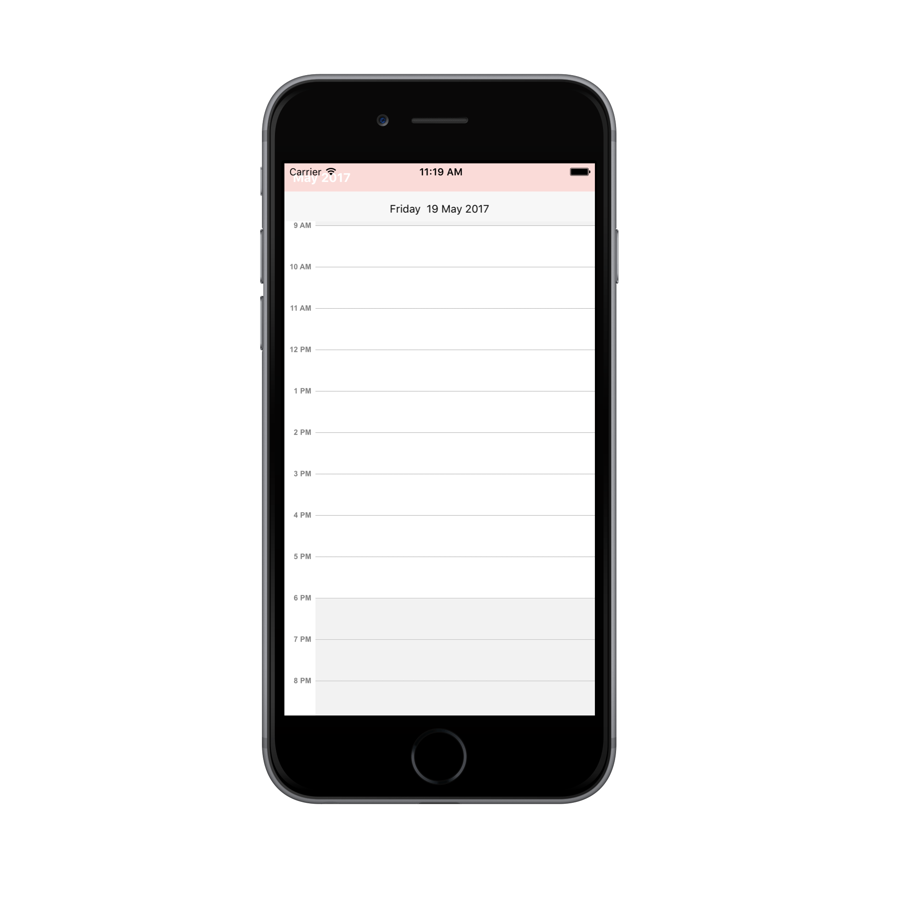
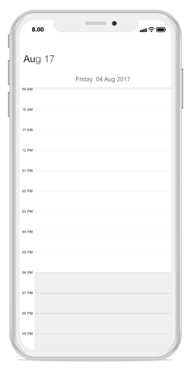

---     
layout: post     
title: Header appearance and customization in Syncfusion SfSchedule control for Xamarin.iOS     
description: Learn how to customize header in SfSchedule control    
platform: xamarin.ios   
control: SfSchedule     
documentation: ug
---  

# Header

You can customize the header of the Schedule using [HeaderStyle](https://help.syncfusion.com/cr/cref_files/xamarin-ios/sfschedule/Syncfusion.SfSchedule.iOS~Syncfusion.SfSchedule.iOS.SFSchedule~HeaderStyle.html) and [HeaderHeight](https://help.syncfusion.com/cr/cref_files/xamarin-ios/sfschedule/Syncfusion.SfSchedule.iOS~Syncfusion.SfSchedule.iOS.SFSchedule~HeaderHeight.html) property in `SFSchedule`.

## Header Height

You can customize the height for the Header in Schedule using `HeaderHeight` in schedule.



	schedule.HeaderHeight = 50;



## Appearance

You can change the header format and style using `HeaderStyle` property in schedule.

You can change the background color,text style and text color using properties such as [BackgroundColor](https://help.syncfusion.com/cr/cref_files/xamarin-ios/sfschedule/Syncfusion.SfSchedule.iOS~Syncfusion.SfSchedule.iOS.HeaderStyle~BackgroundColor.html), [TextStyle](https://help.syncfusion.com/cr/cref_files/xamarin-ios/sfschedule/Syncfusion.SfSchedule.iOS~Syncfusion.SfSchedule.iOS.HeaderStyle~TextStyle.html), [TextColor](https://help.syncfusion.com/cr/cref_files/xamarin-ios/sfschedule/Syncfusion.SfSchedule.iOS~Syncfusion.SfSchedule.iOS.HeaderStyle~TextColor.html) of Header using `HeaderStyle` property in schedule.



    SFHeaderStyle headerStyle = new SFHeaderStyle();
	headerStyle.BackgroundColor = UIColor.FromRGB(251, 211, 201);
	headerStyle.TextStyle = UIFont.SystemFontOfSize(15,UIFontWeight.Bold);
	headerStyle.TextColor=UIColor.White;
	schedule.HeaderStyle = headerStyle;



 

## Loading Custom Headers

You can collapse the default header of schedule by setting `HeaderHeight` property of `SFSchedule` as 0. Instead you can use your own custom header for it. While navigating views in schedule, text labels available in the header will be changed based on it visible dates, so while using custom header , respective text value can be obtained from the `VisibleDatesChanged` event of `SFSchedule`.


    
    //triggering visible dates changed event.
    schedule.VisibleDatesChanged += Schedule_VisibleDatesChanged;
    
    private void Schedule_VisibleDatesChanged(object sender, VisibleDatesChangedEventArgs e)
        {
            //to get visible dates index value.
            int visibleDatesIndex = 0;
            var headerString = string.Empty;
            if (schedule.ScheduleView == SFScheduleView.SFScheduleViewMonth)
            {
                visibleDatesIndex = 8;//to get current month visible dates.
            }
            else
            {
                visibleDatesIndex = 0;
            }
            NSDate date = e.VisibleDates.GetItem<NSDate>((nuint)visibleDatesIndex);
            NSDateFormatter dateFormat = new NSDateFormatter();
            dateFormat.DateFormat = "MMMM YYYY";
            headerString = dateFormat.ToString(date);
        }



You can get the complete sample for customizing the Header of Schedule [here](http://www.syncfusion.com/downloads/support/directtrac/general/ze/HeaderSample_iOS-2097240596.zip)

## Header Date Format

We can customize the date format of SFSchedule Header by using [ScheduleDateHeaderFormat](https://help.syncfusion.com/cr/cref_files/xamarin-ios/sfschedule/Syncfusion.SfSchedule.iOS~Syncfusion.SfSchedule.iOS.SFSchedule~ScheduleDateHeaderFormat.html) property of `SFSchedule`.


//Creating instance of Schedule
SFSchedule schedule = new SFSchedule();
//Customizing date format
schedule.ScheduleDateHeaderFormat = (NSString)"LLL yy";


## Header Tapped Event

We can handle single tap action for `Header` by using [HeaderTapped](https://help.syncfusion.com/cr/cref_files/xamarin-ios/sfschedule/Syncfusion.SfSchedule.iOS~Syncfusion.SfSchedule.iOS.SFSchedule~HeaderTapped_EV.html) event of `SFSchedule`. This event will be triggered when `Header` is Tapped. This event contains [HeaderTappedEventArgs](https://help.syncfusion.com/cr/cref_files/xamarin-ios/sfschedule/Syncfusion.SfSchedule.iOS~Syncfusion.SfSchedule.iOS.HeaderTappedEventArgs.html) argument which holds [Date](https://help.syncfusion.com/cr/cref_files/xamarin-ios/sfschedule/Syncfusion.SfSchedule.iOS~Syncfusion.SfSchedule.iOS.ViewHeaderTappedEventArgs~Date.html) details in it.
[Date](https://help.syncfusion.com/cr/cref_files/xamarin-ios/sfschedule/Syncfusion.SfSchedule.iOS~Syncfusion.SfSchedule.iOS.ViewHeaderTappedEventArgs~Date.html) contains date time value of visible date.



//Creating  new instance of Schedule
SFSchedule schedule = new SFSchedule();
schedule.HeaderTapped += Handle_HeaderTapped;



void Handle_HeaderTapped(object sender, HeaderTappedEventArgs e)
{
}

