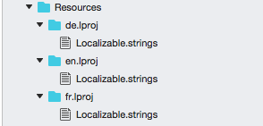

# Localization

Schedule control is available with complete localization support. Localization can be specified by setting the [Locale](https://help.syncfusion.com/cr/cref_files/xamarin-ios/sfschedule/Syncfusion.SfSchedule.iOS~Syncfusion.SfSchedule.iOS.SFSchedule~Locale.html) property of SfSchedule. In the format of `Language code`.

## Change default control language

Based on the `Locale` specified the strings in the control such as Date, time, days are localized accordingly.

By default, schedule control is available with en locale, which is English.

   
    
          //setting locale for the control
            schedule.Locale = new NSLocale("fr");
 
   
 

>**Note:** AM/PM in the timeline will not be localized in the Schedule views 

   

## Change custom texts in the control.

You can localize custom text available in the control by adding equivalent localized string in the Localizable.strings file, refer [here](https://developer.xamarin.com/guides/ios/advanced_topics/localization_and_internationalization/).

  

If an application requires multiple languages we can follow the below steps:

*	Translate the Localizable.Strings file to each language. 
*	Create new `<Language>.lproj` folders under resource as `en.lproj`, `fr.lproj`, `de.lproj`.
* 	Place the `Localizable.Strings` file in the respective `<Language>.lproj` folders.

You can download the entire source code of this demo for Xamarin.iOS from
here [Localization](http://www.syncfusion.com/downloads/support/directtrac/general/ze/Localization_iOS1315782719.zip).

>**Note:** The corresponding `<Language>.lproj` folder loads only depends on the device configuration and locale.
