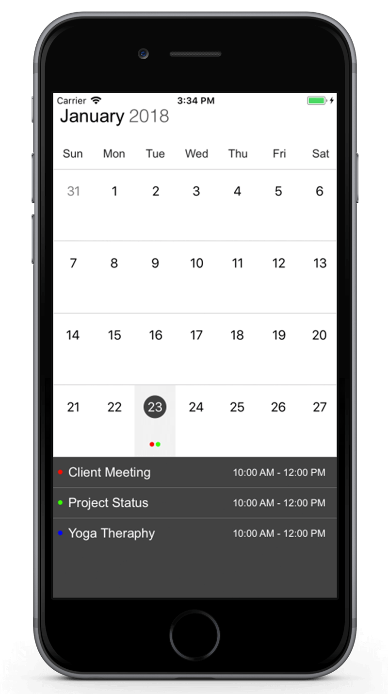
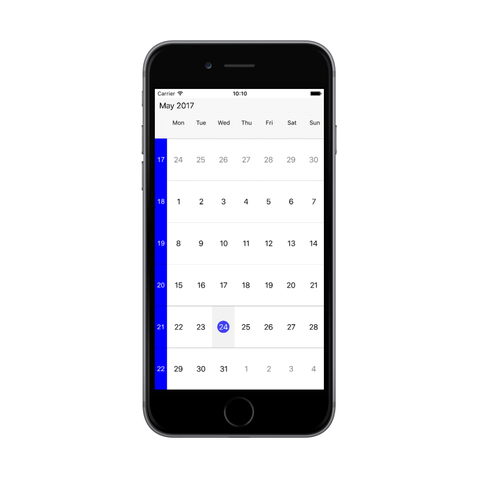
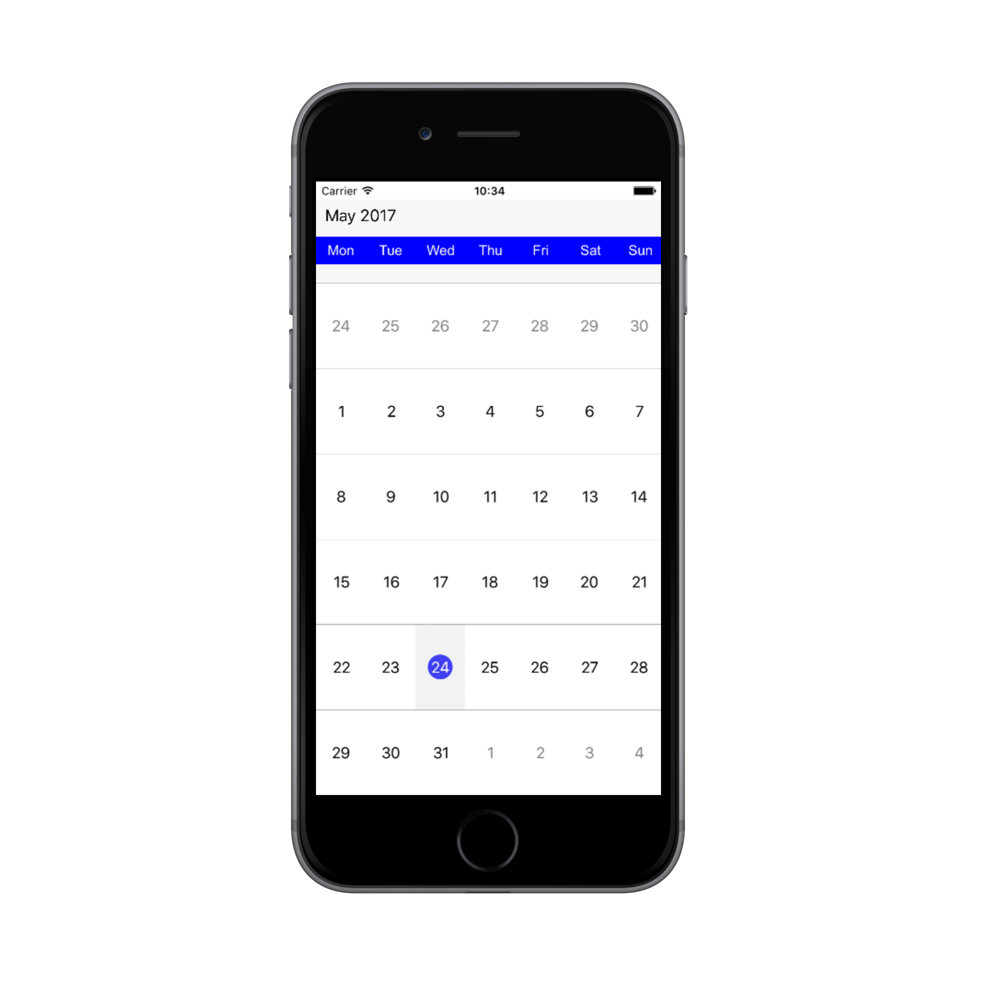
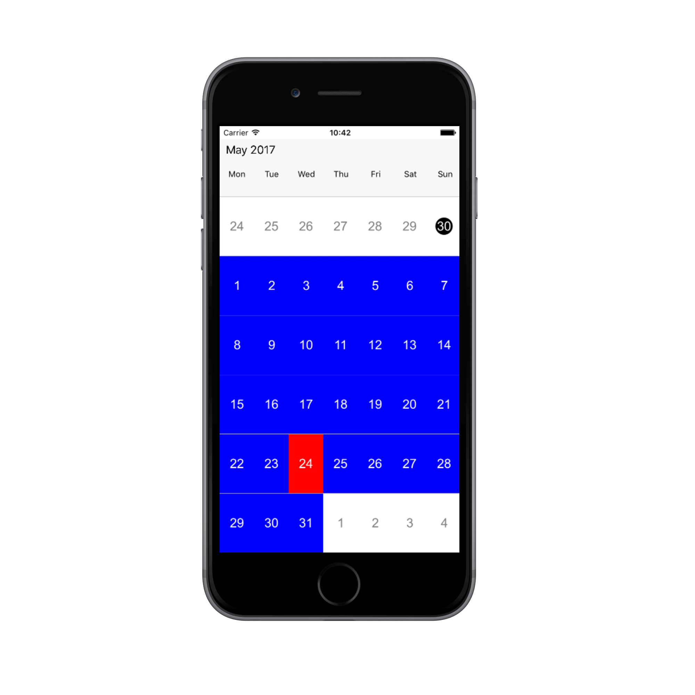
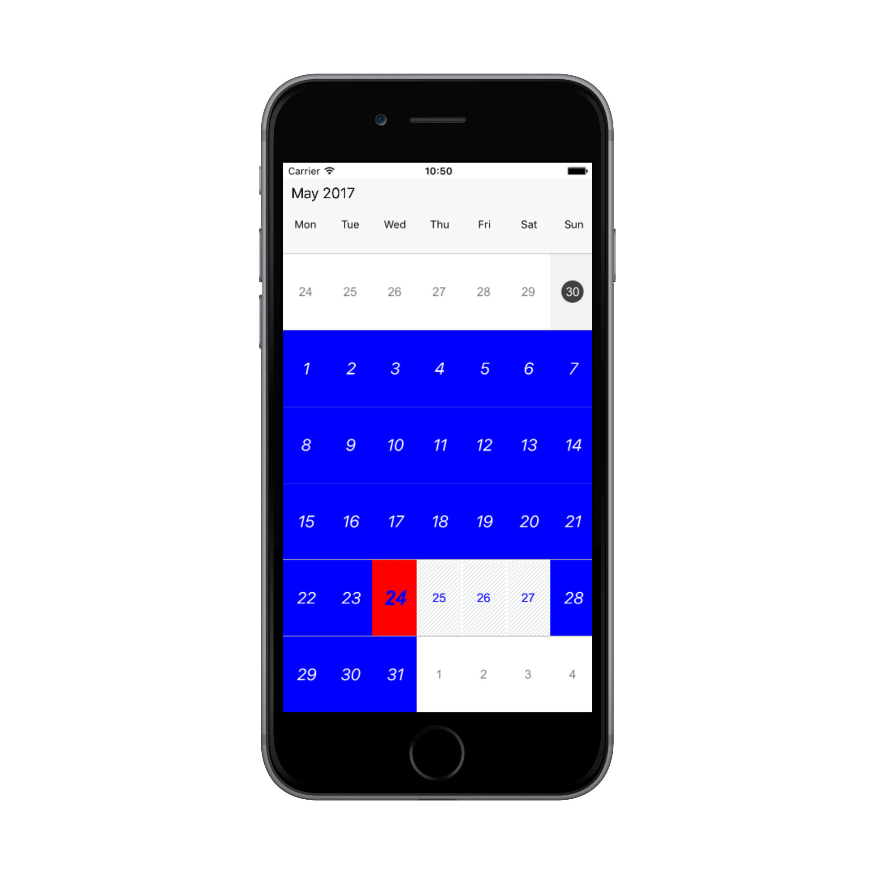
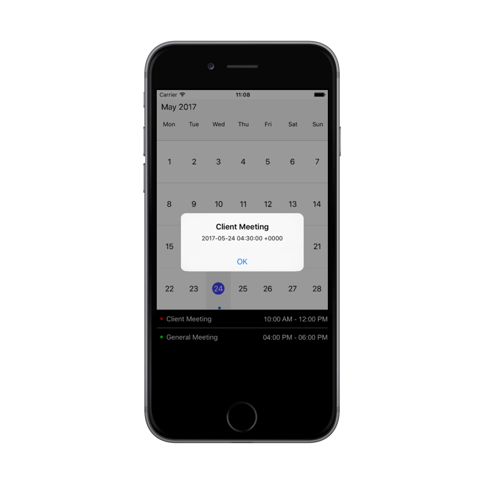
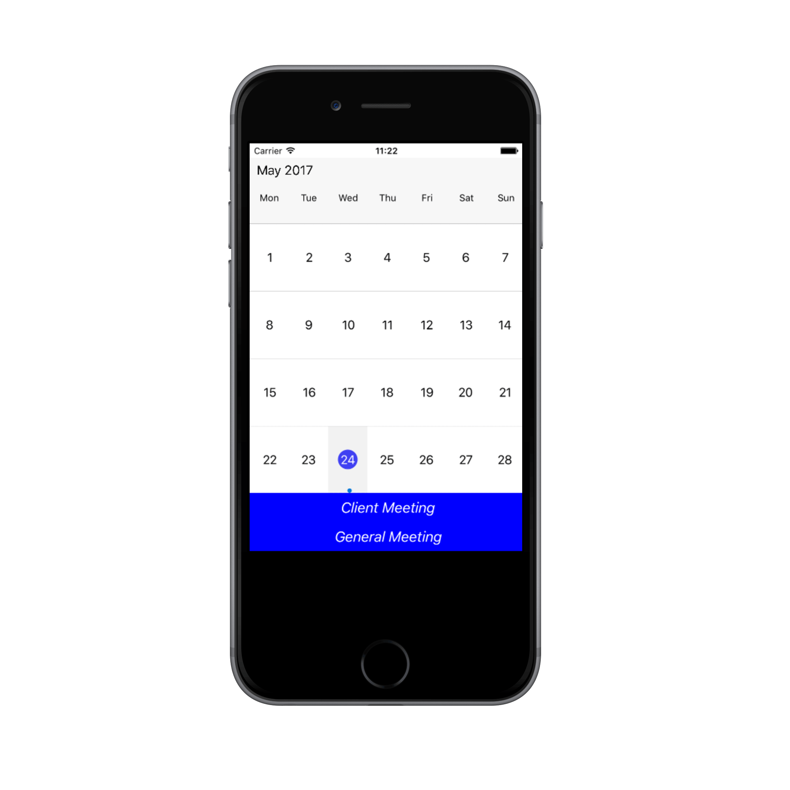
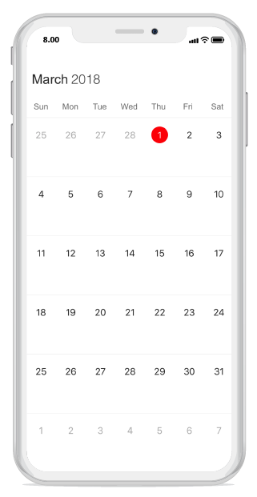

---   
layout: post   
title: MonthView   
description: Overview of MonthView related features
platform: xamarin.ios   
control: SfSchedule   
documentation: ug   
---   
    
# Month View
`MonthView` of `SfSchedule` used to display entire dates of the specific month, current month will be displayed by default initially. Current date color is differentiated with other dates of the current month, also the color differentiation for dates will be applicable for previous and next month dates.



schedule.ScheduleView = SFScheduleView.SFScheduleViewMonth;



## Month Appointment indicator
In `MonthView`, appointments are not viewed in the month cell instead appointment indicators are drawn. You can customize the number of appointment indicators displayed in month cell using  [AppointmentIndicatorCount](https://help.syncfusion.com/cr/cref_files/xamarin-ios/sfschedule/Syncfusion.SfSchedule.iOS~Syncfusion.SfSchedule.iOS.MonthViewSettings~AppointmentIndicatorCount.html) property of [MonthViewSettings](https://help.syncfusion.com/cr/cref_files/xamarin-ios/sfschedule/Syncfusion.SfSchedule.iOS~Syncfusion.SfSchedule.iOS.SFSchedule~MonthViewSettings.html) in `SfSchedule`, by default Appointment indicator count is 3.


//creating new instance for month view settings
MonthViewSettings monthViewSettings = new MonthViewSettings();
monthViewSettings.AppointmentIndicatorCount = 2;
schedule.MonthViewSettings = monthViewSettings;


>**Notes**: If appointments count are lesser than the `AppointmentIndicatorCount` value in the particular day, then according to number of appointments available, indicator will be displayed in the month cell.Maximum number of appointment indicators drawn in the month cell is 6.

## Month Inline View
You can use [ShowAppointmentsInline](https://help.syncfusion.com/cr/cref_files/xamarin-ios/sfschedule/Syncfusion.SfSchedule.iOS~Syncfusion.SfSchedule.iOS.MonthViewSettings~ShowAppointmentsInline.html) bool property in [MonthViewSettings](https://help.syncfusion.com/cr/cref_files/xamarin-ios/sfschedule/Syncfusion.SfSchedule.iOS~Syncfusion.SfSchedule.iOS.SFSchedule~MonthViewSettings.html) to enable / disable the month inline view, by setting `ShowAppointmentsInline` property as `true` you can view the Appointments in the specific date. 



//creating new instance for month view settings
MonthViewSettings monthViewSettings = new MonthViewSettings();
monthViewSettings.ShowAppointmentsInline = true;
schedule.MonthViewSettings = monthViewSettings;



>**Notes**: If appointments not there in the selected day, Inline view displays the text as "No Events"      

## Month Navigation direction
`MonthView` of Schedule can be navigated in both horizontal and vertical direction. You can change the direction of navigation through [MonthNavigationDirection](https://help.syncfusion.com/cr/cref_files/xamarin-ios/sfschedule/Syncfusion.SfSchedule.iOS~Syncfusion.SfSchedule.iOS.MonthViewSettings~MonthNavigationDirection.html) property of `MonthViewSettings` in `SfSchedule`, by default Month navigation direction is `Horizontal`.



monthViewSettings.MonthNavigationDirection = SFMonthNavigationDirections.Vertical;



## Restricted days in Month
You can disable the interaction for certain date in Month view by using [BlackoutDates](https://help.syncfusion.com/cr/cref_files/xamarin-ios/sfschedule/Syncfusion.SfSchedule.iOS~Syncfusion.SfSchedule.iOS.MonthViewSettings~BlackoutDates.html) of `MonthViewSettings`, using this you can allocate / restrict the specific date for predefined events.



//creating new instance for month view settings
MonthViewSettings monthViewSettings = new MonthViewSettings();
monthViewSettings.BlackoutDates = new NSMutableArray();
NSDate today = new NSDate();
NSCalendar calendar = NSCalendar.CurrentCalendar;
// Get the year, month, day from the date
NSDateComponents components = calendar.Components(
NSCalendarUnit.Year | NSCalendarUnit.Month | NSCalendarUnit.Day, today);
components.Day += 1;
for (int i = 0; i < 3; i++)
{
	NSDate startDate = calendar.DateFromComponents(components);
	components.Day += 1;
	monthViewSettings.BlackoutDates.Add(startDate);
}
schedule.MonthViewSettings = monthViewSettings;



## First day of Week in Month
You can set First day of week using [FirstDayOfWeek](https://help.syncfusion.com/cr/cref_files/xamarin-ios/sfschedule/Syncfusion.SfSchedule.iOS~Syncfusion.SfSchedule.iOS.SFSchedule~FirstDayOfWeek.html) property of `SfSchedule`, by default schedule control will rendered with `Sunday` as the first day of the week. 




			//setting FirstDayOfWeek
			schedule.FirstDayOfWeek = 2; // Monday




## Week Number of the Year in Month
You can display the Week Number of the year in Month View by setting [ShowWeekNumber](https://help.syncfusion.com/cr/cref_files/xamarin-ios/sfschedule/Syncfusion.SfSchedule.iOS~Syncfusion.SfSchedule.iOS.MonthViewSettings~ShowWeekNumber.html) property of `MonthViewSettings` as `true`, by default it is `false`.




			monthViewSettings.ShowWeekNumber = true;




## Week Number Appearance
You can customize the Week Number appearance by using [SFWeekNumberStyle](https://help.syncfusion.com/cr/cref_files/xamarin-ios/sfschedule/Syncfusion.SfSchedule.iOS~Syncfusion.SfSchedule.iOS.SFWeekNumberStyle.html) property of `MonthViewSettings`. Week number [BackgroundColor](https://help.syncfusion.com/cr/cref_files/xamarin-ios/sfschedule/Syncfusion.SfSchedule.iOS~Syncfusion.SfSchedule.iOS.SFWeekNumberStyle~BackgroundColor.html), [TextColor](https://help.syncfusion.com/cr/cref_files/xamarin-ios/sfschedule/Syncfusion.SfSchedule.iOS~Syncfusion.SfSchedule.iOS.SFWeekNumberStyle~TextColor.html) and [TextStyle](https://help.syncfusion.com/cr/cref_files/xamarin-ios/sfschedule/Syncfusion.SfSchedule.iOS~Syncfusion.SfSchedule.iOS.SFWeekNumberStyle~TextStyle.html) can be customized using `SFWeekNumberStyle` properties.




			//creating new instance for WeekNumberStyle
			SFWeekNumberStyle weekNumberStyle = new SFWeekNumberStyle();
			weekNumberStyle.TextStyle = UIFont.FromName("Arial", 15);
			weekNumberStyle.BackgroundColor = UIColor.Blue;
			weekNumberStyle.TextColor = UIColor.White;
			monthViewSettings.WeekNumberStyle = weekNumberStyle;
			schedule.MonthViewSettings = monthViewSettings;




## Month Label Formatting 
You can change the Format of the Month date and day labels string in the Schedule using [DateLabelFormat](https://help.syncfusion.com/cr/cref_files/xamarin-ios/sfschedule/Syncfusion.SfSchedule.iOS~Syncfusion.SfSchedule.iOS.MonthLabelSettings~DateLabelFormat.html), [DayLabelFormat](https://help.syncfusion.com/cr/cref_files/xamarin-ios/sfschedule/Syncfusion.SfSchedule.iOS~Syncfusion.SfSchedule.iOS.MonthLabelSettings~DayLabelFormat.html) and [DateLabelSize](https://help.syncfusion.com/cr/cref_files/xamarin-ios/sfschedule/Syncfusion.SfSchedule.iOS~Syncfusion.SfSchedule.iOS.MonthLabelSettings~DateLabelSize.html) properties of [LabelSettings](https://help.syncfusion.com/cr/cref_files/xamarin-ios/sfschedule/Syncfusion.SfSchedule.iOS~Syncfusion.SfSchedule.iOS.MonthLabelSettings.html) in `MonthViewSettings`. 




			//creating new instance for MonthLabelSettings
			MonthLabelSettings monthLabelSettings = new MonthLabelSettings();
			monthLabelSettings.DayLabelFormat = (NSString)"EEEE";
			monthLabelSettings.DateLabelFormat = (NSString)"dd";
			monthLabelSettings.DateLabelSize = 20;
			monthViewSettings.LabelSettings = monthLabelSettings;
			schedule.MonthViewSettings = monthViewSettings;




## View Header Appearance  
You can customize the View Header appearance by using [SFViewHeaderStyle](https://help.syncfusion.com/cr/cref_files/xamarin-ios/sfschedule/Syncfusion.SfSchedule.iOS~Syncfusion.SfSchedule.iOS.SFViewHeaderStyle.html) property in SfSchedule. View Header [BackgroundColor](https://help.syncfusion.com/cr/cref_files/xamarin-ios/sfschedule/Syncfusion.SfSchedule.iOS~Syncfusion.SfSchedule.iOS.SFViewHeaderStyle~BackgroundColor.html), [DayTextColor](https://help.syncfusion.com/cr/cref_files/xamarin-ios/sfschedule/Syncfusion.SfSchedule.iOS~Syncfusion.SfSchedule.iOS.SFViewHeaderStyle~DayTextColor.html) and [DayTextStyle](https://help.syncfusion.com/cr/cref_files/xamarin-ios/sfschedule/Syncfusion.SfSchedule.iOS~Syncfusion.SfSchedule.iOS.SFViewHeaderStyle~DayTextSyle.html) can be customized using `SFViewHeaderStyle` properties.




			//creating new instance for viewHeaderStyle 
			SFViewHeaderStyle viewHeaderStyle = new SFViewHeaderStyle();
			viewHeaderStyle.BackgroundColor = UIColor.Blue;
			viewHeaderStyle.DayTextColor = UIColor.White;
			viewHeaderStyle.DayTextStyle = UIFont.FromName("Arial", 15);
			schedule.DayHeaderStyle = viewHeaderStyle;




### ViewHeader Date Format
We can customize the date and day format of `SFSchedule` ViewHeader by using [DateLabelFormat](https://help.syncfusion.com/cr/cref_files/xamarin-ios/sfschedule/Syncfusion.SfSchedule.iOS~Syncfusion.SfSchedule.iOS.MonthLabelSettings~DateLabelFormat.html) and [DayLabelFormat](https://help.syncfusion.com/cr/cref_files/xamarin-ios/sfschedule/Syncfusion.SfSchedule.iOS~Syncfusion.SfSchedule.iOS.MonthLabelSettings~DayLabelFormat.html) properties of `LabelSettings`.


schedule.ScheduleView = SFScheduleView.SFScheduleViewMonth;
//Creating new instance of MonthViewSettings
MonthViewSettings monthViewSettings = new MonthViewSettings();
//Creating new instance of MonthLabelSettings
MonthLabelSettings monthLabelSettings = new MonthLabelSettings();
//Customizing date format
monthLabelSettings.DateLabelFormat = (NSString)"dd";
monthLabelSettings.DayLabelFormat = (NSString)"EEEE";
monthViewSettings.LabelSettings = monthLabelSettings;
schedule.MonthViewSettings = monthViewSettings;


### ViewHeader Tapped Event
We can handle single tap action of ViewHeader by using [ViewHeaderTapped](https://help.syncfusion.com/cr/cref_files/xamarin-ios/sfschedule/Syncfusion.SfSchedule.iOS~Syncfusion.SfSchedule.iOS.SFSchedule~ViewHeaderTapped_EV.html) event of `SFSchedule`. This event will be triggered when the ViewHeader is Tapped. This event contains [ViewHeaderTappedEventArgs](https://help.syncfusion.com/cr/cref_files/xamarin-ios/sfschedule/Syncfusion.SfSchedule.iOS~Syncfusion.SfSchedule.iOS.ViewHeaderTappedEventArgs.html) argument which holds [Date](https://help.syncfusion.com/cr/cref_files/xamarin-ios/sfschedule/Syncfusion.SfSchedule.iOS~Syncfusion.SfSchedule.iOS.ViewHeaderTappedEventArgs~Date.html) details in it.


//Creating  new instance of Schedule
SFSchedule schedule = new SFSchedule();
schedule.ScheduleView = SFScheduleView.SFScheduleViewMonth;
schedule.ViewHeaderTapped += Handle_ViewHeaderTapped;



void Handle_ViewHeaderTapped(object sender, ViewHeaderTappedEventArgs e)
{
    var date = e.Date;
}


## MonthCell Appearance 
You can customize the Month view cell in three ways,

* [Customize month cell using style](#customize-month-cell-using-style)
* [Customize month cell using event](#customize-month-cell-using-event)
* [Customize month cell with custom UI](#customize-month-cell-with-custom-ui)

### Customize month cell using style
By using [SFMonthCellStyle](https://help.syncfusion.com/cr/cref_files/xamarin-ios/sfschedule/Syncfusion.SfSchedule.iOS~Syncfusion.SfSchedule.iOS.SFMonthCellStyle.html) of `SfSchedule` you can customize the month cell properties such as [BackgroundColor](https://help.syncfusion.com/cr/cref_files/xamarin-ios/sfschedule/Syncfusion.SfSchedule.iOS~Syncfusion.SfSchedule.iOS.SFMonthCellStyle~BackgroundColor.html), [NextMonthBackgroundColor](https://help.syncfusion.com/cr/cref_files/xamarin-ios/sfschedule/Syncfusion.SfSchedule.iOS~Syncfusion.SfSchedule.iOS.SFMonthCellStyle~NextMonthBackgroundColor.html), [NextMonthTextColor](https://help.syncfusion.com/cr/cref_files/xamarin-ios/sfschedule/Syncfusion.SfSchedule.iOS~Syncfusion.SfSchedule.iOS.SFMonthCellStyle~NextMonthTextColor.html), [PreviousMonthBackgroundColor](https://help.syncfusion.com/cr/cref_files/xamarin-ios/sfschedule/Syncfusion.SfSchedule.iOS~Syncfusion.SfSchedule.iOS.SFMonthCellStyle~PreviousMonthBackgroundColor.html), [PreviousMonthTextColor](https://help.syncfusion.com/cr/cref_files/xamarin-ios/sfschedule/Syncfusion.SfSchedule.iOS~Syncfusion.SfSchedule.iOS.SFMonthCellStyle~PreviousMonthTextColor.html), [TextColor](https://help.syncfusion.com/cr/cref_files/xamarin-ios/sfschedule/Syncfusion.SfSchedule.iOS~Syncfusion.SfSchedule.iOS.SFMonthCellStyle~TextColor.html), [TextStyle](https://help.syncfusion.com/cr/cref_files/xamarin-ios/sfschedule/Syncfusion.SfSchedule.iOS~Syncfusion.SfSchedule.iOS.SFMonthCellStyle~TextStyle.html), [TodayBackgroundColor](https://help.syncfusion.com/cr/cref_files/xamarin-ios/sfschedule/Syncfusion.SfSchedule.iOS~Syncfusion.SfSchedule.iOS.SFMonthCellStyle~TodayBackgroundColor.html) and [TodayTextColor](https://help.syncfusion.com/cr/cref_files/xamarin-ios/sfschedule/Syncfusion.SfSchedule.iOS~Syncfusion.SfSchedule.iOS.SFMonthCellStyle~TodayTextColor.html).
   



			//creating new instance for SFMonthCellStyle 
			SFMonthCellStyle monthCellStyle = new SFMonthCellStyle();
			monthCellStyle.BackgroundColor = UIColor.Blue;
			monthCellStyle.NextMonthBackgroundColor = UIColor.White;
			monthCellStyle.NextMonthTextColor = UIColor.Gray;
			monthCellStyle.PreviousMonthBackgroundColor = UIColor.White;
			monthCellStyle.PreviousMonthTextColor = UIColor.Gray;
			monthCellStyle.TextColor = UIColor.White;
			monthCellStyle.TextStyle = UIFont.FromName("Arial", 20);
			monthCellStyle.TodayBackgroundColor = UIColor.Red;
			monthCellStyle.TodayTextColor = UIColor.White;
			schedule.MonthCellStyle = monthCellStyle;




    
### Customize month cell using event
By using [MonthCellLoaded](https://help.syncfusion.com/cr/cref_files/xamarin-ios/sfschedule/Syncfusion.SfSchedule.iOS~Syncfusion.SfSchedule.iOS.SFSchedule~MonthCellLoaded_EV.html) event in `SfSchedule`, you can customize the month cell properties in the run time. In `MonthCellLoaded` event, arguments such as [CellStyle](https://help.syncfusion.com/cr/cref_files/xamarin-ios/sfschedule/Syncfusion.SfSchedule.iOS~Syncfusion.SfSchedule.iOS.MonthCellLoadedEventArgs~CellStyle.html), [Appointments](https://help.syncfusion.com/cr/cref_files/xamarin-ios/sfschedule/Syncfusion.SfSchedule.iOS~Syncfusion.SfSchedule.iOS.MonthCellLoadedEventArgs~Appointments.html), [Date](https://help.syncfusion.com/cr/cref_files/xamarin-ios/sfschedule/Syncfusion.SfSchedule.iOS~Syncfusion.SfSchedule.iOS.MonthCellLoadedEventArgs~Date.html), [View](https://help.syncfusion.com/cr/cref_files/xamarin-ios/sfschedule/Syncfusion.SfSchedule.iOS~Syncfusion.SfSchedule.iOS.MonthCellLoadedEventArgs~View.html) and boolean properties such as [IsToday](https://help.syncfusion.com/cr/cref_files/xamarin-ios/sfschedule/Syncfusion.SfSchedule.iOS~Syncfusion.SfSchedule.iOS.MonthCellLoadedEventArgs~IsToday.html), [IsNextMonthDate](https://help.syncfusion.com/cr/cref_files/xamarin-ios/sfschedule/Syncfusion.SfSchedule.iOS~Syncfusion.SfSchedule.iOS.MonthCellLoadedEventArgs~IsNextMonthDate.html), [IsPreviousMonthDate](https://help.syncfusion.com/cr/cref_files/xamarin-ios/sfschedule/Syncfusion.SfSchedule.iOS~Syncfusion.SfSchedule.iOS.MonthCellLoadedEventArgs~IsPreviousMonthDate.html) and [IsBlackOutDate](https://help.syncfusion.com/cr/cref_files/xamarin-ios/sfschedule/Syncfusion.SfSchedule.iOS~Syncfusion.SfSchedule.iOS.MonthCellLoadedEventArgs~IsBlackOutDate.html) are in the [MonthCellLoadedEventArgs](https://help.syncfusion.com/cr/cref_files/xamarin-ios/sfschedule/Syncfusion.SfSchedule.iOS~Syncfusion.SfSchedule.iOS.MonthCellLoadedEventArgs.html). 




			schedule.MonthCellLoaded += Schedule_MonthCellLoaded;
			...
			void Schedule_MonthCellLoaded(object sender, MonthCellLoadedEventArgs e)
		{
			e.CellStyle = new SFCellStyle();
			if (e.IsToday)
			{
				e.CellStyle.BackgroundColor = UIColor.Red;
				e.CellStyle.TextColor = UIColor.Blue;
				e.CellStyle.TextStyle = UIFont.FromName("Arial-BoldItalicMT", 25);
			}
			else if (e.IsNextMonthDate)
			{
				e.CellStyle.BackgroundColor = UIColor.White;
				e.CellStyle.TextColor = UIColor.Gray;
				e.CellStyle.TextStyle = UIFont.FromName("Arial", 15);
			}
			else if (e.IsPreviousMonthDate)
			{
				e.CellStyle.BackgroundColor = UIColor.White;
				e.CellStyle.TextColor = UIColor.Gray;
				e.CellStyle.TextStyle = UIFont.FromName("Arial", 15);
			}
			else if (e.IsBlackOutDate)
			{
				e.CellStyle.BackgroundColor = UIColor.Black;
				e.CellStyle.TextColor = UIColor.Blue;
				e.CellStyle.TextStyle = UIFont.FromName("Arial", 15);
			}
			else
			{
				e.CellStyle.BackgroundColor = UIColor.Blue;
				e.CellStyle.TextColor = UIColor.White;
				e.CellStyle.TextStyle = UIFont.ItalicSystemFontOfSize(20);
			}
		}




#### Customize month cell with custom UI 
You can set the Custom UI for the month cell using [View](https://help.syncfusion.com/cr/cref_files/xamarin-ios/sfschedule/Syncfusion.SfSchedule.iOS~Syncfusion.SfSchedule.iOS.MonthCellLoadedEventArgs~View.html) property of `MonthCellLoadedEventArgs` in the `MonthCellLoaded` event of `SfSchedule`.




			schedule.MonthCellLoaded += Schedule_MonthCellLoaded;
			...
			void Schedule_MonthCellLoaded(object sender, MonthCellLoadedEventArgs e)
		{
			NSCalendar calendar = NSCalendar.CurrentCalendar;
			// Get the year, month, day from the date
			NSDateComponents dateComponents = calendar.Components(NSCalendarUnit.Year | NSCalendarUnit.Month | NSCalendarUnit.Day, e.Date);
			UIButton button = new UIButton();
			button.SetTitle(dateComponents.Day.ToString(), UIControlState.Normal);
			button.SetTitleColor(UIColor.White, UIControlState.Disabled);
			if (e.IsToday)
			{
				button.BackgroundColor = UIColor.Red;
				button.Font = UIFont.FromName("Arial-BoldItalicMT", 20);
			}
			else
			{
				button.BackgroundColor = UIColor.Blue;
				button.Font = UIFont.ItalicSystemFontOfSize(20);
			}
			e.View = button;
		}




## Getting Inline Appointment details
Using [Appointment](https://help.syncfusion.com/cr/cref_files/xamarin-ios/sfschedule/Syncfusion.SfSchedule.iOS~Syncfusion.SfSchedule.iOS.MonthInlineAppointmentTappedEventArgs~Appointment.html) argument in the [MonthInlineAppointmentTappedEventArgs](https://help.syncfusion.com/cr/cref_files/xamarin-ios/sfschedule/Syncfusion.SfSchedule.iOS~Syncfusion.SfSchedule.iOS.MonthInlineAppointmentTappedEventArgs.html) of [MonthInlineAppointmentTapped](https://help.syncfusion.com/cr/cref_files/xamarin-ios/sfschedule/Syncfusion.SfSchedule.iOS~Syncfusion.SfSchedule.iOS.SFSchedule~MonthInlineAppointmentTapped_EV.html) event, you can get the details Month Inline Appointments details while tapping the specific appointment. You can do the required functions while tapping the inline appointment using this event. 




			schedule.MonthInlineAppointmentTapped += Schedule_MonthInlineAppointmentTapped;
			...
			void Schedule_MonthInlineAppointmentTapped(object sender, MonthInlineAppointmentTappedEventArgs e)
		{
			var appointment = (e.Appointment as ScheduleAppointment);
			UIAlertView alert = new UIAlertView()
			{
				Title = appointment.Subject,
				Message = appointment.StartTime.ToString()
			};
			alert.AddButton("OK");
			alert.Show();
		}




## InlineView Appearance  
By using [MonthInlineLoaded](https://help.syncfusion.com/cr/cref_files/xamarin-ios/sfschedule/Syncfusion.SfSchedule.iOS~Syncfusion.SfSchedule.iOS.SFSchedule~MonthInlineLoaded_EV.html) in `SfSchedule`, you can customize the month inline view properties in the run time. In `MonthInlineLoadedEvent`, arguments such as [MonthInlineViewStyle](https://help.syncfusion.com/cr/cref_files/xamarin-ios/sfschedule/Syncfusion.SfSchedule.iOS~Syncfusion.SfSchedule.iOS.MonthInlineLoadedEventArgs~MonthInlineViewStyle.html), [Appointments](https://help.syncfusion.com/cr/cref_files/xamarin-ios/sfschedule/Syncfusion.SfSchedule.iOS~Syncfusion.SfSchedule.iOS.MonthInlineLoadedEventArgs~Appointments.html) and [Date](https://help.syncfusion.com/cr/cref_files/xamarin-ios/sfschedule/Syncfusion.SfSchedule.iOS~Syncfusion.SfSchedule.iOS.MonthInlineLoadedEventArgs~Date.html) are in the MonthInlineLoadedEventArgs.




			schedule.MonthInlineLoaded += Schedule_MonthInlineLoaded;
			...
			void Schedule_MonthInlineLoaded(object sender, MonthInlineLoadedEventArgs e)
		{
			SFMonthInlineViewStyle monthInlineViewStyle = new SFMonthInlineViewStyle();
			monthInlineViewStyle.BackgroundColor = UIColor.Black;
			monthInlineViewStyle.TextColor = UIColor.Green;
			monthInlineViewStyle.TextStyle = UIFont.FromName("Times New Roman", 13);
			monthInlineViewStyle.TimeTextColor = UIColor.Green;
			monthInlineViewStyle.TimeTextStyle = UIFont.ItalicSystemFontOfSize(13);
			monthInlineViewStyle.TimeTextFormat = (NSString)"hh mm a";
			e.MonthInlineViewStyle = monthInlineViewStyle;
		}




## Inline Appointment Appearance 
You can customize the Month inline view Appointment by using [MonthInlineAppointmentLoaded](https://help.syncfusion.com/cr/cref_files/xamarin-ios/sfschedule/Syncfusion.SfSchedule.iOS~Syncfusion.SfSchedule.iOS.SFSchedule~MonthInlineAppointmentLoaded_EV.html) event in `SfSchedule`, using [View](https://help.syncfusion.com/cr/cref_files/xamarin-ios/sfschedule/Syncfusion.SfSchedule.iOS~Syncfusion.SfSchedule.iOS.MonthInlineAppointmentLoadedEventArgs~View.html) of [MonthInlineAppointmentLoadedEventArgs](https://help.syncfusion.com/cr/cref_files/xamarin-ios/sfschedule/Syncfusion.SfSchedule.iOS~Syncfusion.SfSchedule.iOS.MonthInlineAppointmentLoadedEventArgs.html) argument. You can get the details of Appointment in the [Appointment](https://help.syncfusion.com/cr/cref_files/xamarin-ios/sfschedule/Syncfusion.SfSchedule.iOS~Syncfusion.SfSchedule.iOS.MonthInlineAppointmentLoadedEventArgs~Appointment.html) argument.




			schedule.MonthInlineAppointmentLoaded += Schedule_MonthInlineAppointmentLoaded;
			...
			void Schedule_MonthInlineAppointmentLoaded(object sender, MonthInlineAppointmentLoadedEventArgs e)
		{
			UIButton button = new UIButton();
			button.SetTitle(e.Appointment.Subject, UIControlState.Normal);
			button.SetTitleColor(UIColor.White, UIControlState.Disabled);
			button.BackgroundColor = UIColor.Blue;
			button.Font = UIFont.ItalicSystemFontOfSize(20);
			e.View = button;
		}




## Selection
You can customize the default appearance of selection UI in the month cells.

* [Selection customization using style](#selection-customization-using-style)
* [Selection customization using custom View](#selection-customization-using-custom-view)

### Selection customization using style
You can customize the month cell selection by using [SelectionStyle](https://help.syncfusion.com/cr/cref_files/xamarin-ios/sfschedule/Syncfusion.SfSchedule.iOS~Syncfusion.SfSchedule.iOS.SFSchedule~SelectionStyle.html) property of `SFSchedule`.



    schedule.ScheduleView = SFScheduleView.SFScheduleViewMonth;
    //Create new instance of SelectionStyle
    SFSelectionStyle selectionStyle = new SFSelectionStyle();
    selectionStyle.BackgroundColor = UIColor.Blue;
    selectionStyle.BorderColor = UIColor.Black;
    selectionStyle.BorderThickness = 5;
    selectionStyle.BorderCornerRadius = 5;
    schedule.SelectionStyle = selectionStyle;
    


### Selection customization using custom View
You can replace the default selection UI with your custom view by setting [SelectionView](https://help.syncfusion.com/cr/cref_files/xamarin-ios/sfschedule/Syncfusion.SfSchedule.iOS~Syncfusion.SfSchedule.iOS.SFSchedule~SelectionView.html) property of `SFSchedule`.


    schedule.ScheduleView = SFScheduleView.SFScheduleViewMonth;
    //Add the CustomView
    UIButton customView = new UIButton();
    customView.SetTitle("+NewEvent", UIControlState.Normal);
    customView.BackgroundColor = UIColor.FromRGB(255, 152, 0);
    customView.SetTitleColor(UIColor.White, UIControlState.Normal);
    schedule.SelectionView = customView;
    


### Programmatic selection
You can programmatically select the specific cell by setting corresponding date to [SelectedDate]( https://help.syncfusion.com/cr/cref_files/xamarin-ios/sfschedule/Syncfusion.SfSchedule.iOS~Syncfusion.SfSchedule.iOS.SFSchedule~SelectedDate.html) property of `SFSchedule`. By default, it is null.



     // Creating instance of calendar
     NSCalendar calendar = NSCalendar.CurrentCalendar;

    // Creating instance of date
    NSDate date = new NSDate();

    // Setting a date and time to select
    NSDateComponents dateComponents = calendar.Components(NSCalendarUnit.Year | NSCalendarUnit.Month | NSCalendarUnit.Day, date);
    dateComponents.Year = 2017;
    dateComponents.Month = 10;
    dateComponents.Day = 04;
    schedule.SelectedDate = calendar.DateFromComponents(dateComponents);



You can clear the selection by setting [SelectedDate]( https://help.syncfusion.com/cr/cref_files/xamarin-ios/sfschedule/Syncfusion.SfSchedule.iOS~Syncfusion.SfSchedule.iOS.SFSchedule~SelectedDate.html) as null.



    // Setting null value to deselect
    schedule.SelectedDate = null;



You can download the entire source code of this demo for Xamarin.iOS from here [Date_Selection](http://www.syncfusion.com/downloads/support/directtrac/general/ze/Date_Selection481745259.zip)

>**Note**:
* `SFSchedule` does not support multiple selection.
* `SFSchedule` supports two-way binding of `SelectedDate` property.

 
 
## Today Background Color
 
 We can customize the current date background of  `SFSchedule`  by using [TodayBackgroundColor](https://help.syncfusion.com/cr/cref_files/xamarin-ios/sfschedule/Syncfusion.SfSchedule.iOS~Syncfusion.SfSchedule.iOS.MonthViewSettings~TodayBackgroundColor.html) property of `MonthViewSettings`.
 
 
 schedule.ScheduleView = SFScheduleView.SFScheduleViewMonth;
 //Creating new instance of MonthViewSettings
 MonthViewSettings monthViewSettings = new MonthViewSettings();
 //Customizing background color
 monthViewSettings.TodayBackgroundColor = UIColor.Red;
 schedule.MonthViewSettings = monthViewSettings;
 
 
 
 
## Custom Font

you can change the appearance of Font by setting the TextStyle property of following classes.

* [ViewHeaderStyle](https://help.syncfusion.com/xamarin-ios/sfschedule/dayview#viewheader-appearance)- We can change the appearance of [ViewHeaderStyle](https://help.syncfusion.com/xamarin-ios/sfschedule/dayview#viewheader-appearance) by setting the [DayTextStyle](https://help.syncfusion.com/cr/cref_files/xamarin-ios/sfschedule/Syncfusion.SfSchedule.iOS~Syncfusion.SfSchedule.iOS.SFViewHeaderStyle~DayTextStyle.html) and [DateTextStyle](https://help.syncfusion.com/cr/cref_files/xamarin-ios/sfschedule/Syncfusion.SfSchedule.iOS~Syncfusion.SfSchedule.iOS.SFViewHeaderStyle~DateTextStyle.html) properties of Schedule `ViewHeaderStyle`. 
* [MonthCellStyle](https://help.syncfusion.com/xamarin-ios/sfschedule/monthview#monthcell-appearance) - We can change the appearance of [MonthCellStyle](https://help.syncfusion.com/xamarin-ios/sfschedule/monthview#monthcell-appearance) by setting the [TextStyle](https://help.syncfusion.com/cr/cref_files/xamarin-ios/sfschedule/Syncfusion.SfSchedule.iOS~Syncfusion.SfSchedule.iOS.SFMonthCellStyle~TextStyle.html) property of Schedule `MonthCellStyle`.
* [MonthInlineViewStyle](https://help.syncfusion.com/xamarin-ios/sfschedule/monthview#inlineview-appearance) - We can change the appearance of [MonthInlineViewStyle](https://help.syncfusion.com/cr/cref_files/xamarin-ios/sfschedule/Syncfusion.SfSchedule.iOS~Syncfusion.SfSchedule.iOS.SFMonthCellStyle~TextStyle.html) by setting the [TextStyle](https://help.syncfusion.com/cr/cref_files/xamarin-ios/sfschedule/Syncfusion.SfSchedule.iOS~Syncfusion.SfSchedule.iOS.SFMonthInlineViewStyle~TextStyle.html) property of Schedule `MonthInlineViewStyle`.
* [WeekNumberStyle](https://help.syncfusion.com/xamarin-ios/sfschedule/monthview#week-number-appearance) - We can change the appearance of [WeekNumberStyle](https://help.syncfusion.com/xamarin-ios/sfschedule/monthview#week-number-appearance) by setting the [TextStyle](https://help.syncfusion.com/cr/cref_files/xamarin-ios/sfschedule/Syncfusion.SfSchedule.iOS~Syncfusion.SfSchedule.iOS.SFWeekNumberStyle~TextStyle.html) property of Schedule `WeekNumberStyle`.



viewHeaderStyle.DayTextStyle = UIFont.FromName("Lobster-Regular", 15);



 



monthCellStyle.TextStyle = UIFont.FromName("Lobster-Regular", 15);



 



schedule.MonthInlineLoaded += Schedule_MonthInlineLoaded;
...
void Schedule_MonthInlineLoaded(object sender, MonthInlineLoadedEventArgs e)
{
	SFMonthInlineViewStyle monthInlineViewStyle = new SFMonthInlineViewStyle();
	monthInlineViewStyle.TextStyle = UIFont.FromName("Lobster-Regular", 15);
	e.MonthInlineViewStyle = monthInlineViewStyle;
}



 
 
 

weekNumberStyle.TextStyle = UIFont.FromName("Lobster-Regular", 15);



 

Following steps will explain how to configure the custom fonts.

### Custom Font Setting in Xamarin.iOS
* Add the Custom Font (e.g. Lobster-Regular.ttf) to the Resources Folder.
* Edit info.plist and add a key Fonts provided by application (value type should be Array). In item0 of the array enter the name of the Font you added in the Resource folder (Such as Lobster-Regular.ttf).
* Then, directly use Custom Font name as TextStyle.

>**Note**:
 No need to mention .ttf when set the Custom Font in iOS.

