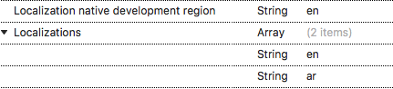

# Right to left(RTL)

Schedule supports to change the layout direction of the control in the `RightToLeft` direction by setting the  [SemanticContentAttribute](https://developer.xamarin.com/api/property/UIKit.UIView.SemanticContentAttribute/) to `UISemanticContentAttribute.ForceRightToLeft`. Schedule also supports `RTL` based on device language layout direction.



schedule.SemanticContentAttribute = UISemanticContentAttribute.ForceRightToLeft;



>**Note**
Add the `RightToLeft` language in the `CFBundleLocalizations` section of your `Info.plist`, and make sure you’re targeting iOS 9+. For this you can refer [Localization Basics in iOS](https://docs.microsoft.com/en-gb/xamarin/ios/app-fundamentals/localization/#localization-basics-in-ios).



<resources>
<key>CFBundleDevelopmentRegion</key>
<string>en</string>
<key>CFBundleLocalizations</key>
<array>
<string>en</string>
<string>ar</string>
</array>
</resources>



