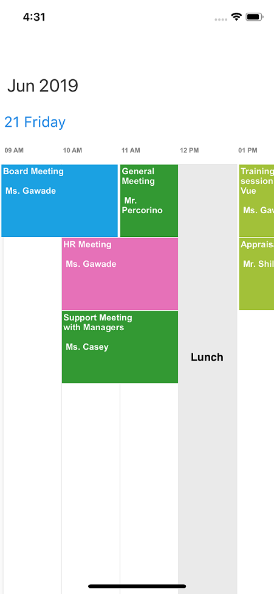

---

layout: post
title: Timeline view scheduler | Xamarin.iOS | Syncfusion
description: Xamarin.iOS scheduler timeline view displays the dates in a horizontal time axis with desired days count, displays events accurately across the time slots.
platform: xamarin.iOS
control: SfSchedule
documentation: ug

---

# Timeline view

`TimelineView` displays the dates in horizontal time axis with the desired day's count. You can see the past or future dates by scrolling to the right or left. Each view displays events accurately across the time slots with an intuitive drag-and-drop feature. It provides support to highlight the selected region of time slots and handle interaction.



schedule.ScheduleView = SFScheduleView.SFScheduleViewTimeline;



## Timeline view days count

You can customize the number of days in `TimelineView` using the [DaysCount](https://help.syncfusion.com/cr/cref_files/xamarin-ios/Syncfusion.SfSchedule.iOS~Syncfusion.SfSchedule.iOS.TimelineViewSettings~DaysCount.html) property of [TimelineViewSettings](https://help.syncfusion.com/cr/cref_files/xamarin-ios/Syncfusion.SfSchedule.iOS~Syncfusion.SfSchedule.iOS.SFSchedule~TimelineViewSettings.html). By default, value of the timeline days count is -1, and single day will be visible.



schedule.ScheduleView = SFScheduleView.SFScheduleViewTimeline;
//Creating new instance of TimelineViewSettings
TimelineViewSettings timelineViewSettings = new TimelineViewSettings();
//Customizing days count
timelineViewSettings.DaysCount = 10;
schedule.TimelineViewSettings = timelineViewSettings;



## Timeline view based on day, week, work week, and month.
 
You can achieve timeline day, timeline week, timeline work week, and timeline month view with the default value of `DaysCount` by dynamically switching between day, week, work week, and month view to timeline view with respective visible dates. 
 
>**NOTE**
For other value of `DaysCount`, only timeline view visible dates will be displayed as mentioned days count on dynamic view switching.

## Customized working hours

You can customize the [StartHour](https://help.syncfusion.com/cr/cref_files/xamarin-ios/Syncfusion.SfSchedule.iOS~Syncfusion.SfSchedule.iOS.TimelineViewSettings~StartHour.html) and [EndHour](https://help.syncfusion.com/cr/cref_files/xamarin-ios/Syncfusion.SfSchedule.iOS~Syncfusion.SfSchedule.iOS.TimelineViewSettings~EndHour.html) properties of `TimelineView` to show only the required time duration for end users. You can also set `StartHour` and `EndHour` in double value, which will be converted to time to show the required time duration in minutes. The default value for `StartHour` and `EndHour` value is 0 to 24 to show all the time slots in `TimelineView`.



schedule.ScheduleView = SFScheduleView.SFScheduleViewTimeline;
//Creating new instance of TimelineViewSettings
TimelineViewSettings timelineViewSettings = new TimelineViewSettings();
timelineViewSettings.StartHour = 09;
timelineViewSettings.EndHour = 13;
schedule.TimelineViewSettings = timelineViewSettings;



>**NOTE**
* `StartHour` must be greater than or equal to 0 and `EndHour` must be lesser than or equal to 24, otherwise `InvalidDataException` will be thrown.
* `EndHour` value must be greater than `StartHour`, otherwise `InvalidDataException` will be thrown.
* Schedule UI such as Appointments and NonAccessibleBlocks which does not fall within the `StartHour` and `EndHour` will not be visible and if it falls partially, it will be clipped.
* No need to specify the decimal point values for `StartHour` and `EndHour`, if you don’t want to set the minutes.
* The number of time slots will be calculated based on total minutes of a day and time interval (total minutes of a day ((start hour - end hour) * 60) / time interval).
* If the custom time interval is given, then the number of time slots calculated based on given time interval should result in integer value, otherwise given time interval will be neglected and default time interval (60 minutes) will be considered.
* If the custom start hour and end hour is given, then the number of time slots calculated based on given start hour, end hour should result in integer value, otherwise given end hour will be rounded off. For example, if StartHour is 7.2 (07:12AM), EndHour is 18.6 (06:36AM) and TimeInterval is 60 minutes, then EndHour will be rounded off to 18.2 (06:12PM).

## Special time regions

You can restrict user interaction such as selection and highlight specific region of time in `TimelineView` by adding `SpecialTimeRegion` in the [SpecialTimeRegions](https://help.syncfusion.com/cr/cref_files/xamarin-ios/Syncfusion.SfSchedule.iOS~Syncfusion.SfSchedule.iOS.SFSchedule~SpecialTimeRegions.html) property of `SFSchedule`. You need to set the [StartHour](https://help.syncfusion.com/cr/cref_files/xamarin-ios/Syncfusion.SfSchedule.iOS~Syncfusion.SfSchedule.iOS.TimeRegionSettings~StartHour.html) and [EndHour](https://help.syncfusion.com/cr/cref_files/xamarin-ios/Syncfusion.SfSchedule.iOS~Syncfusion.SfSchedule.iOS.TimeRegionSettings~EndHour.html) properties of [TimeRegionSettings](https://help.syncfusion.com/cr/cref_files/xamarin-ios/Syncfusion.SfSchedule.iOS~Syncfusion.SfSchedule.iOS.TimeRegionSettings.html) to create `SpecialTimeRegion`. You can also set `StartHour` and `EndHour` in double value, which will be converted to time to show the required time duration in minutes. By default, the values of `StartHour` and `EndHour` are 0.

### Special time region appearance

You can customize the appearance of `SpecialTimeRegion` using the [Color](https://help.syncfusion.com/cr/cref_files/xamarin-ios/Syncfusion.SfSchedule.iOS~Syncfusion.SfSchedule.iOS.TimeRegionSettings~Color.html) and [TextColor](https://help.syncfusion.com/cr/cref_files/xamarin-ios/Syncfusion.SfSchedule.iOS~Syncfusion.SfSchedule.iOS.TimeRegionSettings~TextColor.html) properties of `TimeRegionSettings`.

### Selection restriction in time slots

You can enable/disable the touch interaction of `SpecialTimeRegion` using [CanEdit](https://help.syncfusion.com/cr/cref_files/xamarin-ios/Syncfusion.SfSchedule.iOS~Syncfusion.SfSchedule.iOS.TimeRegionSettings~CanEdit.html) property of `TimeRegionSettings`. By default, its value is true.



schedule.ScheduleView = SFScheduleView.SFScheduleViewTimeline;
List<TimeRegionSettings> specialTimeRegions = new List<TimeRegionSettings>();
//Setting Special time regions property
TimeRegionSettings timeRegionSettings = new TimeRegionSettings();
timeRegionSettings.StartHour = 12;
timeRegionSettings.EndHour = 13;
timeRegionSettings.Text = "Lunch";
timeRegionSettings.Color = UIColor.FromRGB(234, 234, 234);
timeRegionSettings.TextColor = UIColor.Black;
timeRegionSettings.CanEdit = false;
specialTimeRegions.Add(timeRegionSettings);
schedule.SpecialTimeRegions = specialTimeRegions;



## Time interval

You can customize the interval of time slots in `TimelineView` by setting [TimeInterval](https://help.syncfusion.com/cr/cref_files/xamarin-ios/Syncfusion.SfSchedule.iOS~Syncfusion.SfSchedule.iOS.SFSchedule~TimeInterval.html) property of `SFSchedule`.



schedule.ScheduleView = SFScheduleView.SFScheduleViewTimeline; 
schedule.TimeInterval = 180;



>**NOTE**
If you modify the `TimeInterval` value (in minutes), you need to change the time labels format by setting the `TimeFormat` as “hh:mm”. By default, `TimeFormat` is "hh a".

## Time interval height 

You can customize the interval height of time slots in `TimelineView` by setting the [TimeIntervalHeight](https://help.syncfusion.com/cr/cref_files/xamarin-ios/Syncfusion.SfSchedule.iOS~Syncfusion.SfSchedule.iOS.SFSchedule~TimeIntervalHeight.html) property of `SFSchedule`.



schedule.ScheduleView = SFScheduleView.SFScheduleViewTimeline; 
schedule.TimeIntervalHeight = 180;



## Nonworking days

You can add the non-working days in `TimelineView` using [NonWorkingsDays](https://help.syncfusion.com/cr/cref_files/xamarin-ios/Syncfusion.SfSchedule.iOS~Syncfusion.SfSchedule.iOS.TimelineViewSettings~NonWorkingDays.html) property of `TimelineViewSettings`. By default, there is no non-working day in `TimelineView`.



var nonWorkingDays = new NSMutableArray();
nonWorkingDays.Add((NSNumber)2);
nonWorkingDays.Add((NSNumber)6);
var timelineViewSettings = new TimelineViewSettings();
timelineViewSettings.NonWorkingDays = nonWorkingDays;
schedule.TimelineViewSettings = timelineViewSettings;



## First day of week

By default, schedule control will be rendered with Sunday as the first day of the week. It can be customized to any day of the week using the `FirstDayOfWeek` property of `SFSchedule`.



schedule.ScheduleView = SFScheduleView.SFScheduleViewTimeline; 
schedule.FirstDayOfWeek = 3;



>**NOTE**
In Timeline view, `FirstDayOfWeek` will be applied only when `DayCounts` property of `TimelineViewSettings` is 7.

## Appointment height

You can customize the height of the appointment in `TimelineView` using the [AppointmentHeight](https://help.syncfusion.com/cr/cref_files/xamarin-ios/Syncfusion.SfSchedule.iOS~Syncfusion.SfSchedule.iOS.TimelineViewSettings~AppointmentHeight.html) property of `TimelineViewSettings`. By default, its value is 50.



schedule.ScheduleView = SFScheduleView.SFScheduleViewTimeline;
//Create new instance of TimelineViewSettings
TimelineViewSettings timelineViewSettings = new TimelineViewSettings();
timelineViewSettings.AppointmentHeight = 100;
schedule.TimelineViewSettings = timelineViewSettings;



>**NOTE**
When a greater number of appointments is added in the same time slot, appointment height will be calculated automatically without considering the `AppointmentHeight` property to display all the appointment in the view.

## View header tapped event

You can handle single tap action of ViewHeader using the `ViewHeaderTapped` event of `SFSchedule`. This event occurs when the `ViewHeader` is tapped. This event contains `ViewHeaderTappedEventArgs` argument, which holds the details of `NSDate` in it.



//Creating new instance of Schedule 
SFSchedule schedule = new SFSchedule();
schedule.ScheduleView = SFScheduleView.SFScheduleViewTimeline;
schedule.ViewHeaderTapped += OnViewHeaderTapped;





private void OnViewHeaderTapped(object sender, ViewHeaderTappedEventArgs e)
{
     var date = e.Date;
}



## View header customization

You can customize the default appearance of view header in `TimelineView` by using `DayHeaderStyle` property of `SFSchedule`.



//Create new instance of Schedule
SFSchedule schedule = new SFSchedule();
schedule.ScheduleView = SFScheduleView.SFScheduleViewTimeline;
//Customize the schedule view header
SFViewHeaderStyle viewHeaderStyle = new SFViewHeaderStyle();
viewHeaderStyle.BackgroundColor = UIColor.FromRGB(169, 177, 252);
viewHeaderStyle.DateTextColor = UIColor.Black;
schedule.DayHeaderStyle = viewHeaderStyle;



You can customize the height of `ViewHeader` in `TimelineView` by setting the `ViewHeaderHeight` property of `SFSchedule.`



schedule.ScheduleView = SFScheduleView.SFScheduleViewTimeline; 
schedule.ViewHeaderHeight = 50;



### View header date format

You can customize the date format of `ViewHeader` in `TimelineView` using the [DateFormat](https://help.syncfusion.com/cr/cref_files/xamarin-ios/Syncfusion.SfSchedule.iOS~Syncfusion.SfSchedule.iOS.TimelineLabelSettings~DateFormat.html) property of `TimelineLabelSettings`.



schedule.ScheduleView = SFScheduleView.SFScheduleViewTimeline;
//Creating new instance of TimelineViewSettings
TimelineViewSettings timelineViewSettings = new TimelineViewSettings();
//Creating new instance of TimelineLabelSettings
TimelineLabelSettings labelSettings = new TimelineLabelSettings();
//Customizing date format
labelSettings.DateFormat = "d EEE";
timelineViewSettings.LabelSettings = labelSettings;
schedule.TimelineViewSettings = timelineViewSettings;



## Timeslot customization

You can customize the appearance of time slots using the [Color](https://help.syncfusion.com/cr/cref_files/xamarin-ios/Syncfusion.SfSchedule.iOS~Syncfusion.SfSchedule.iOS.TimelineViewSettings~Color.html), [BorderColor](https://help.syncfusion.com/cr/cref_files/xamarin-ios/Syncfusion.SfSchedule.iOS~Syncfusion.SfSchedule.iOS.TimelineViewSettings~BorderColor.html) and [BorderWidth](https://help.syncfusion.com/cr/cref_files/xamarin-ios/Syncfusion.SfSchedule.iOS~Syncfusion.SfSchedule.iOS.TimelineViewSettings~BorderWidth.html) properties of `TimelineViewSettings`.



schedule.ScheduleView = SFScheduleView.SFScheduleViewTimeline;
//Create new instance of TimelineViewSettings
TimelineViewSettings timelineViewSettings = new TimelineViewSettings();
timelineViewSettings.BorderColor = UIColor.FromRGB(132, 144, 249);
timelineViewSettings.Color = UIColor.FromRGB(232, 234, 249);
timelineViewSettings.BorderWidth = 2;
schedule.TimelineViewSettings = timelineViewSettings;



## Time label customization

You can customize the format for the labels that mention the time by setting the [TimeFormat](https://help.syncfusion.com/cr/cref_files/xamarin-ios/Syncfusion.SfSchedule.iOS~Syncfusion.SfSchedule.iOS.TimelineLabelSettings~TimeFormat.html) property of [LabelSettings](https://help.syncfusion.com/cr/cref_files/xamarin-ios/Syncfusion.SfSchedule.iOS~Syncfusion.SfSchedule.iOS.TimelineViewSettings~LabelSettings.html) in `TimelineViewSettings`.



schedule.ScheduleView = SFScheduleView.SFScheduleViewTimeline;
//Creating new instance of TimelineViewSettings
TimelineViewSettings timelineViewSettings = new TimelineViewSettings();
TimelineLabelSettings labelSettings = new TimelineLabelSettings();
labelSettings.TimeFormat = "hh:mm";
timelineViewSettings.LabelSettings = labelSettings;
schedule.TimelineViewSettings = timelineViewSettings;



### Time label appearance

You can customize the color for the labels that mention the time by setting the [TimeLabelColor](https://help.syncfusion.com/cr/cref_files/xamarin-ios/Syncfusion.SfSchedule.iOS~Syncfusion.SfSchedule.iOS.TimelineLabelSettings~TimeLabelColor.html) property of `LabelSettings` in `TimelineViewSettings`.



schedule.ScheduleView = SFScheduleView.SFScheduleViewTimeline;
//Creating new instance of TimelineViewSettings
TimelineViewSettings timelineViewSettings = new TimelineViewSettings();
TimelineLabelSettings labelSettings = new TimelineLabelSettings();
labelSettings.TimeLabelColor = UIColor.FromRGB(132, 144, 249);
timelineViewSettings.LabelSettings = labelSettings;
schedule.TimelineViewSettings = timelineViewSettings;



### Time Label size

You can customize the size of the labels that mention the time by setting the [TimeLabelSize](https://help.syncfusion.com/cr/cref_files/xamarin-ios/Syncfusion.SfSchedule.iOS~Syncfusion.SfSchedule.iOS.TimelineLabelSettings~TimeLabelSize.html) property of `LabelSettings` in `TimelineViewSettings`.



schedule.ScheduleView = SFScheduleView.SFScheduleViewTimeline;
//Creating new instance of TimelineViewSettings
TimelineViewSettings timelineViewSettings = new TimelineViewSettings();
TimelineLabelSettings labelSettings = new TimelineLabelSettings();
labelSettings.TimeLabelSize = 10;	
timelineViewSettings.LabelSettings = labelSettings;
schedule.TimelineViewSettings = timelineViewSettings;



## Selection
You can customize the default appearance of selection UI in the timeslots.

* [Selection customization using style](#selection-customization-using-style)
* [Selection customization using custom View](#selection-customization-using-custom-view)
* [Programmatic selection](#programmatic-selection)

### Selection customization using style
You can customize the timeslot selection by using [SelectionStyle](https://help.syncfusion.com/cr/cref_files/xamarin-ios/Syncfusion.SfSchedule.iOS~Syncfusion.SfSchedule.iOS.SFSchedule~SelectionStyle.html) property of `SFSchedule`.



schedule.ScheduleView = SFScheduleView.SFScheduleViewTimeline;
//Create new instance of SelectionStyle
SFSelectionStyle selectionStyle = new SFSelectionStyle();
selectionStyle.BackgroundColor = UIColor.FromRGB(132, 144, 249);
selectionStyle.BorderColor = UIColor.Black;
selectionStyle.BorderThickness = 5;
selectionStyle.BorderCornerRadius = 5;
schedule.SelectionStyle = selectionStyle;



### Selection customization using custom View
You can replace the default selection UI with your custom view by setting [SelectionView](https://help.syncfusion.com/cr/cref_files/xamarin-ios/Syncfusion.SfSchedule.iOS~Syncfusion.SfSchedule.iOS.SFSchedule~SelectionView.html) property of `SFSchedule`.



schedule.ScheduleView = SFScheduleView.SFScheduleViewTimeline;
//Add the CustomView
UIButton customView = new UIButton();
customView.SetTitle("+NewEvent", UIControlState.Normal);
customView.BackgroundColor = UIColor.FromRGB(255, 152, 0);
customView.SetTitleColor(UIColor.White, UIControlState.Normal);
schedule.SelectionView = customView;



### Programmatic selection
You can programmatically select the specific timeslot by setting corresponding date and time value to [SelectedDate](https://help.syncfusion.com/cr/cref_files/xamarin-ios/Syncfusion.SfSchedule.iOS~Syncfusion.SfSchedule.iOS.SFSchedule~SelectedDate.html) property of `SFSchedule`. By default, it is null.



// Creating instance of calendar
NSCalendar calendar = new NSCalendar(NSCalendarType.Gregorian);
calendar.TimeZone = NSTimeZone.FromGMT(NSTimeZone.LocalTimeZone.GetSecondsFromGMT);

// Creating instance of date
NSDate date = new NSDate();

// Setting a date and time to select
NSDateComponents dateComponents = calendar.Components(NSCalendarUnit.Year |
                                                       NSCalendarUnit.Month |
                                                       NSCalendarUnit.Day, date);
dateComponents.Year = 2017;
dateComponents.Month = 10;
dateComponents.Day = 04;
dateComponents.Hour = 10;
schedule.SelectedDate = calendar.DateFromComponents(dateComponents);



You can clear the selection by setting `SelectedDate` as null.



// Setting null value to deselect
schedule.SelectedDate = null;



>**NOTE**
* `SFSchedule` does not support multiple selection.
* `SFSchedule` supports two-way binding of `SelectedDate` property.

