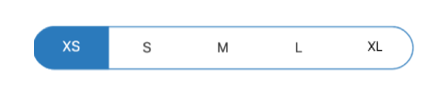

# Customization

The segmented control supports customizing segment color, text color, icon size, selection color, and more. This control also supports enabling the segments to fit your application’s theme. It can be customized in the following areas.

## Text appearance

The text inside the segmented control can be customized by its font size, color, and font family.

### Font family and size

You can customize the font family and font size of the segmented item using the `Font` property.



segmentedControl.Font = UIFont.FromName("Helvetica-Bold", 10f);





segmentedControl.Font = UIFont.SystemFontOfSize(20);



### Font color

You can customize the text color of the segmented item using the `FontColor` property.



segmentedControl.FontColor = UIColor.Red;



## Border

You can customize the border of the segmented control by using the `BorderColor`  and `BorderThickness` properties. Border of each segment item can also be customized using the `SegmentBorderColor`  and `SegmentBorderThickness` properties.



segmentedControl.BorderColor = UIColor.Red;
segmentedControl.BorderThickness = 5;



## Padding

You can handle the padding between the segment items by using the `SegmentPadding` property.



segmentedControl.SegmentPadding = 15;



## Corner radius

The segmented control provides corner radius support to control, each segment item and selected segment item.

### Control radius

The segmented control also handles corner radius for border line of the whole control using the `CornerRadius` property.



segmentedControl.CornerRadius = 15;



### Segment items radius

The segmented control customizes corner radius for each segmented item using the `SegmentCornerRadius` property.



segmentedControl.SegmentCornerRadius = 15;



### Selected segment radius

You can customize the corner radius for selected segment item using the `CornerRadius` property of `SelectionIndicatorSettings`.



segmentedControl.SelectionIndicatorSettings = new SelectionIndicatorSettings() {CornerRadius = 15};



## Color

The segmented control allows users to customize the background color of control, segment items and selected segment item.

### Control color

You can customize the background color of the control by setting a value to the `Color` property.



segmentedControl.Color = UIColor.FromRGB(4, 142, 172);



### Segment items color

You can customize the background color of each segment item by setting a value to the `SegmentBackgroundColor` property.



segmentedControl.SegmentBackgroundColor = UIColor.FromRGB(53,80,136);



### Selected segment color

You can customize the background color of selected segment item using the `Color` property of `SelectionIndicatorSettings`.



segmentedControl.SelectionIndicatorSettings = new SelectionIndicatorSettings() {Color = UIColor.FromRGB(53,80,136)};



## Programmatically scrolling in segmented control 

SegmentedControl allows programmatic scrolling based on the index and item using the `ScrollTo` methods mentioned below.

### ScrollTo(index, scrollToPosition)

This method is used to scroll the segment item based on given index and [`ScrollToPosition`]() value.





segmentedControl.ScrollTo(5,  Syncfusion.iOS.Buttons.ScrollToPosition.Start);





### ScrollTo(item, scrollToPosition)

This method is used to scroll the segment item based on the given data or `SfSegmentItem` and [`ScrollToPosition`]() value.





segmentedControl.ScrollTo(viewModel.Items[5], Syncfusion.iOS.Buttons.ScrollToPosition.Start);



