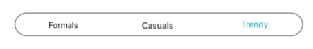

# Selection changed

The selection changed event occurs when there is a change from one segment item to another in the segmented control. It can be handled by two ways.

## User interface

When users navigate from one item to another, selection is changed, so that the `SelectedIndex` value is updated to the new index of the item. The segmented control provides the `SelectionChanged` event, which is triggered when the selection is changed with the `SelectionChangedEventArgs`.

`Index` - Gets the current index value of the selected item.


SfSegmentedControl segmentedControl = new SfSegmentedControl();
segmentedControl.SelectionChanged += (object sender, SelectionChangedEventArgs e) =>
{
segmentedControl.BorderColor = UIColor.Red;
};


## Selected Index through programmatically.

Users can set the default value programmatically for the selection to be placed. The selection is updated based on the index value given for the `SelectedIndex`. 


SfSegmentedControl segmentedControl = new SfSegmentedControl();
segmentedControl.SelectedIndex = 2;


