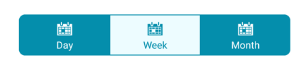

# Display mode

Depending on application, different scenarios may require for effective communication. The segmented control supports these three options: icons, text, or a combination of both.

## Text

Items populated in the segmented control will be displayed as text by default.


public override void ViewDidLoad()
{
    base.ViewDidLoad();

    SfSegmentedControl segmentedControl = new SfSegmentedControl();
    ObservableCollection<string> textCollection = new ObservableCollection<string>();
    textCollection.Add("Day");
    textCollection.Add("Week");
    textCollection.Add("Month");
    segmentedControl.ItemsSource = textCollection;
    segmentedControl.FontColor = UIColor.FromRGB(255, 255, 255);
    segmentedControl.Font = UIFont.SystemFontOfSize(22);
    segmentedControl.Frame = new CGRect(100, 40, 300, 40);
    segmentedControl.Color = UIColor.FromRGB(4, 142, 172);
    segmentedControl.CornerRadius = 0;
    segmentedControl.SegmentHeight = 40;
    segmentedControl.VisibleSegmentsCount = 3;
    segmentedControl.SelectedIndex = 1;
    segmentedControl.DisplayMode = SegmentDisplayMode.Text;
    segmentedControl.BorderThickness = 1;
    segmentedControl.BorderColor = UIColor.Clear;
    segmentedControl.SelectionTextColor = UIColor.FromRGB(4, 142, 172);
    segmentedControl.SelectionIndicatorSettings = new SelectionIndicatorSettings()
    {
        Color = UIColor.White, CornerRadius = 0,
    };
    this.View.Add(segmentedControl);
}


## Image 

Items populated in the segmented control can be displayed as icons.


ObservableCollection<SfSegmentItem> ImageTextCollection;

public override void ViewDidLoad()
{
    base.ViewDidLoad();

    SfSegmentedControl segmentedControl = new SfSegmentedControl();
    AddCollection();
    segmentedControl.ItemsSource = ImageTextCollection;
    segmentedControl.FontColor = UIColor.FromRGB(255, 255, 255);
    segmentedControl.Font = UIFont.SystemFontOfSize(22);
    segmentedControl.Frame = new CGRect(100, 40, 230, 40);
    segmentedControl.Color = UIColor.FromRGB(4, 142, 172);
    segmentedControl.CornerRadius = 0;
    segmentedControl.SegmentHeight = 40;
    segmentedControl.BackgroundColor = UIColor.FromRGB(4, 142, 172);
    segmentedControl.VisibleSegmentsCount = 3;
    segmentedControl.SelectedIndex = 1;
    segmentedControl.DisplayMode = SegmentDisplayMode.Image;
    segmentedControl.BorderThickness = 1;
    segmentedControl.BorderColor = UIColor.Clear;
    segmentedControl.SelectionTextColor = UIColor.FromRGB(4, 142, 172);
    segmentedControl.SelectionIndicatorSettings = new SelectionIndicatorSettings()
    {
        Color = UIColor.White,
        Position = SelectionIndicatorPosition.Fill,
        CornerRadius = 0
    };
    this.View.Add(segmentedControl);
}

private void AddCollection()
{
    UIFont fontFamily = UIFont.FromName("segment", 10f);
    ImageTextCollection = new ObservableCollection<SfSegmentItem>();

    ImageTextCollection.Add(
    new SfSegmentItem() { IconFont = "A", FontIconFontColor = UIColor.FromRGB(255, 255, 255),
    FontIconFont = fontFamily });

    ImageTextCollection.Add(
    new SfSegmentItem() { IconFont = "A", FontIconFontColor = UIColor.FromRGB(255, 255, 255),
    FontIconFont = fontFamily });

    ImageTextCollection.Add( 
    new SfSegmentItem() { IconFont = "A", FontIconFontColor = UIColor.FromRGB(255, 255, 255), 
    FontIconFont = fontFamily });
}


## Image with text

Items populated in the segmented control can be displayed as icons with accompanying text.


ObservableCollection<SfSegmentItem> ImageTextCollection;

public override void ViewDidLoad()
{
    base.ViewDidLoad();

    SfSegmentedControl segmentedControl = new SfSegmentedControl();
    AddCollection();
    segmentedControl.ItemsSource = ImageTextCollection;
    segmentedControl.FontColor = UIColor.FromRGB(255, 255, 255);
    segmentedControl.Font = UIFont.SystemFontOfSize(22);
    segmentedControl.Frame = new CGRect(100, 40, 230, 40);
    segmentedControl.Color = UIColor.FromRGB(4, 142, 172);
    segmentedControl.CornerRadius = 0;
    segmentedControl.SegmentHeight = 40;
    segmentedControl.BackgroundColor = UIColor.FromRGB(4, 142, 172);
    segmentedControl.VisibleSegmentsCount = 3;
    segmentedControl.SelectedIndex = 1;
    segmentedControl.DisplayMode = SegmentDisplayMode.ImageWithText;
    segmentedControl.BorderThickness = 1;
    segmentedControl.BorderColor = UIColor.Clear;
    segmentedControl.SelectionTextColor = UIColor.FromRGB(4, 142, 172);
    segmentedControl.SelectionIndicatorSettings = new SelectionIndicatorSettings()
    {
        Color = UIColor.White,
        Position = SelectionIndicatorPosition.Fill,
        CornerRadius = 0
    };
    this.View.Add(segmentedControl);
}

private void AddCollection()
{
    UIFont fontFamily = UIFont.FromName("segment", 10f);
    ImageTextCollection = new ObservableCollection<SfSegmentItem>();

    ImageTextCollection.Add(
    new SfSegmentItem() { Text="Day", IconFont = "A", FontIconFontColor = UIColor.FromRGB(255, 255, 255),FontIconFont = fontFamily });

    ImageTextCollection.Add(
    new SfSegmentItem() { Text="Week", IconFont = "A", FontIconFontColor = UIColor.FromRGB(255, 255, 255), FontIconFont = fontFamily });

    ImageTextCollection.Add( 
    new SfSegmentItem() { Text="Month", IconFont = "A", FontIconFontColor = UIColor.FromRGB(255, 255, 255), FontIconFont = fontFamily });
}


## How to use font icons

The segmented control enables the user to use font icons for the items in the data source collection. For this we have to first give the desired font icon and its font family using `IconFont` and `FontIconFont` properties of `SfSegmentItem` .



UIFont customFontFamily = UIFont.FromName("segment", 10f);
SfSegmentItem segmentItem = new SfSegmentItem();
segmentItem.IconFont = "A";
segmentItem.FontIconFont = customFontFamily;



**Adding font file in project**

1. Add the font file inside `Resource` folder.
2. Set font file build action as `BundleResource`.
3. Update the `Info.plist` file (fonts that are provided by application, UIAppFonts, or key).
