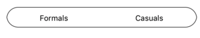

# Handling multiple segments

The segmented control handles segmented items with space distributed for items in two ways by `VisibleSegmentsCount` and `SegmentWidth`. When the available space in the segmented control is not equally distributed, the items beyond the edges of the control can be viewed by scrolling the panel.

## Visible segment counts

The segmented control displays items for view based on the count value given for the `VisibleSegmentsCount` property. 



public override void ViewDidLoad()
{
    base.ViewDidLoad();

    ObservableCollection<string> itemCollection = new ObservableCollection<string>();
    SfSegmentedControl segmentedControl = new SfSegmentedControl();
    itemCollection.Add("Formals");
    itemCollection.Add("Casuals");
    itemCollection.Add("Trendy");
    segmentedControl.ItemsSource = itemCollection;
    segmentedControl.FontColor = UIColor.Black;
    segmentedControl.Font = UIFont.SystemFontOfSize(15);
    segmentedControl.Frame = new CGRect(100, 40, 230, 40);
    segmentedControl.Color = UIColor.White;
    segmentedControl.CornerRadius = 15;
    segmentedControl.SegmentHeight = 30;
    segmentedControl.SelectedIndex = 2;
    segmentedControl.VisibleSegmentsCount = 2;
    segmentedControl.BorderThickness = 1;
    segmentedControl.BorderColor = UIColor.Black;
    segmentedControl.SelectionTextColor = UIColor.FromRGB(4, 142, 172);
    this.View.Add(segmentedControl);
}



## Segment width

You can use the `SegmentWidth` property to display the segmented items within the given width instead of `VisibleSegmentsCount`.



segmentedControl.SegmentWidth = 80;


