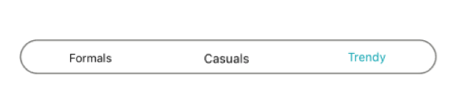
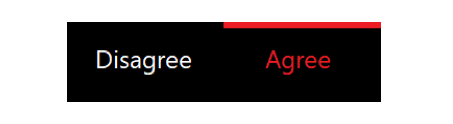
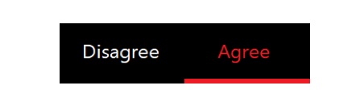
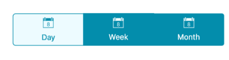
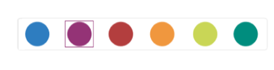
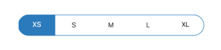

# Indicating the Selected Item

The Segmented Control indicates the selected item by differentiating it with the text color of the item or by using a selection strip.

## Selection Text Color

You can change the text color of the selected item to the desired color. The selected item's text color can be customized using the `SelectionTextColor` property.



segmentControl.SelectionTextColor = UIColor.FromRGB(4, 142, 172);



## Selection Strip

A selection strip is used to indicate the selected item in the Segmented Control. The selection strip can be customized in many forms.

### Position

The position of the selection indicator can be customized in different ways such as top, bottom, fill, and border.

###### Top

The selection strip can be displayed as a line with customizable color and thickness. It can be positioned at the top of the selected item.



segmentControl.SelectionIndicatorSettings = new SelectionIndicatorSettings() {Position = SelectionIndicatorPosition.Top};



#### Bottom

Like top placement, the selection strip can be customized by its color and thickness, and it can be positioned at the bottom of the selected item.



segmentControl.SelectionIndicatorSettings = new SelectionIndicatorSettings() {Position = SelectionIndicatorPosition.Bottom};



#### Fill

The selection strip can be placed over a segment item to indicate the selection. You can customize its color to highlight the item.



segmentControl.SelectionIndicatorSettings = new SelectionIndicatorSettings() {Position = SelectionIndicatorPosition.Fill};



#### Border

The selection strip can be set as a border to highlight the selected item.



segmentControl.SelectionIndicatorSettings = new SelectionIndicatorSettings() {Position = SelectionIndicatorPosition.Border};



### Color

The background color of the selection strip can be customized using the `Color` property of `SelectionIndicatorSettings`.



segmentControl.SelectionIndicatorSettings = new SelectionIndicatorSettings() { Color = UIColor.FromRGB(44,123,188)};



### Thickness

The border thickness of the selection strip can be customized using the `StrokeThickness` property of `SelectionIndicatorSettings`.



segmentControl.SelectionIndicatorSettings = new SelectionIndicatorSettings() { StrokeThickness= 10 };



