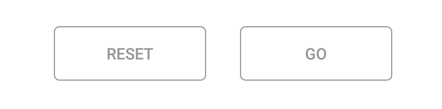

# Populating data source

The segmented control can be populated from a collection of strings, views, or a collection of objects in a built-in class.

## String collection

The segmented control provides the collection of strings as a data source.


public override void ViewDidLoad()
{
    base.ViewDidLoad();
    
    SfSegmentedControl segmentedControl = new SfSegmentedControl();
    ObservableCollection<string> clothCollection = new ObservableCollection<string>();
    clothCollection.Add("Formals");
    clothCollection.Add("Causals");
    clothCollection.Add("Trendy");
    segmentedControl.ItemsSource = clothCollection;
    segmentedControl.FontColor = UIColor.Black;
    segmentedControl.Font = UIFont.SystemFontOfSize(22);
    segmentedControl.Frame = new CGRect(100, 40, 230, 40);
    segmentedControl.Color = UIColor.White;
    segmentedControl.CornerRadius = 15;
    segmentedControl.SegmentHeight = 30;
    segmentedControl.VisibleSegmentsCount = 3;
    segmentedControl.SelectedIndex = 2;
    segmentedControl.BorderThickness = 1;
    segmentedControl.BorderColor = UIColor.Black;
    segmentedControl.SelectionTextColor = UIColor.FromRGB(4, 142, 172);
    this.View.Add(segmentedControl);
}


## Segment items

The segmented control customize the text or icons, or use other built-in customization options available for the segments. Segment item collections can also be used.


ObservableCollection<SfSegmentItem> sizeCollection;

public override void ViewDidLoad()
{
    base.ViewDidLoad();
    
    SfSegmentedControl segmentedControl = new SfSegmentedControl();
    AddCollection();
    segmentedControl.ItemsSource = sizeCollection;
    segmentedControl.Frame = new CGRect(100, 600, 300, 50);
    segmentedControl.CornerRadius = 15;
    segmentedControl.BorderColor = UIColor.FromRGB(44, 123, 188);
    segmentedControl.FontColor = UIColor.Black;
    segmentedControl.SelectionTextColor = UIColor.White;
    segmentedControl.Font = UIFont.SystemFontOfSize(16);
    segmentedControl.VisibleSegmentsCount = 5;
    segmentedControl.SegmentHeight = 30;
    segmentedControl.SelectionIndicatorSettings = new SelectionIndicatorSettings()
    {
        Color = UIColor.FromRGB(44, 123, 188),
        Position = SelectionIndicatorPosition.Fill
    };
    this.View.Add(segmentedControl);
}

private void AddCollection()
{
    sizeCollection = new ObservableCollection<SfSegmentItem>()
    {
        new SfSegmentItem(){Text="XS"},
        new SfSegmentItem(){Text="S"},
        new SfSegmentItem(){Text="M"},
        new SfSegmentItem(){Text="L"},
        new SfSegmentItem(){Text="XL"},
    };
}


    

## Custom views

Custom views or images can be added as segments in the segmented control.


ObservableCollection<UIView> ViewCollection;

public override void ViewDidLoad()
{
    base.ViewDidLoad();

    SfSegmentedControl segmentedControl = new SfSegmentedControl();
    AddCollection();
    segmentedControl.ItemsSource = ViewCollection;
    segmentedControl.Font = UIFont.SystemFontOfSize(15);
    segmentedControl.Frame = new CGRect(100, 40, 300, 40);
    segmentedControl.CornerRadius = 0;
    segmentedControl.SegmentHeight = 40;
    segmentedControl.BackgroundColor = UIColor.White;
    segmentedControl.VisibleSegmentsCount = 2;
    segmentedControl.SegmentPadding = 5;
    segmentedControl.BorderColor = UIColor.Clear;
    this.View.Add(segmentedControl);
}

private void AddCollection()
{
    UIButton ResetButtonView = new UIButton();
    ResetButtonView.Frame = new CGRect(20, 100, 50, 40);
    ResetButtonView.BackgroundColor = UIColor.LightGray;
    ResetButtonView.SetTitle("Reset", UIControlState.Normal);

    UIButton GoButtonView = new UIButton();
    GoButtonView.Frame = new CGRect(120, 100, 50, 40);
    GoButtonView.BackgroundColor = UIColor.LightGray;
    GoButtonView.SetTitle("Go", UIControlState.Normal);

    ViewCollection = new ObservableCollection<UIView>()
    {
        ResetButtonView,
        GoButtonView
    };
}


