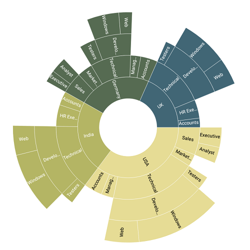
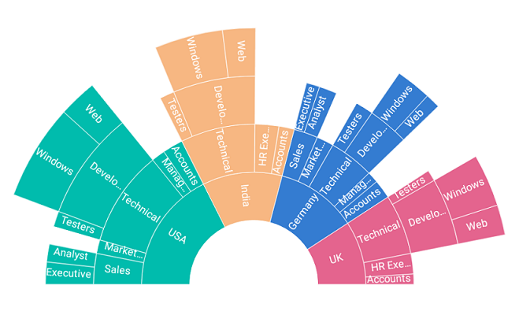
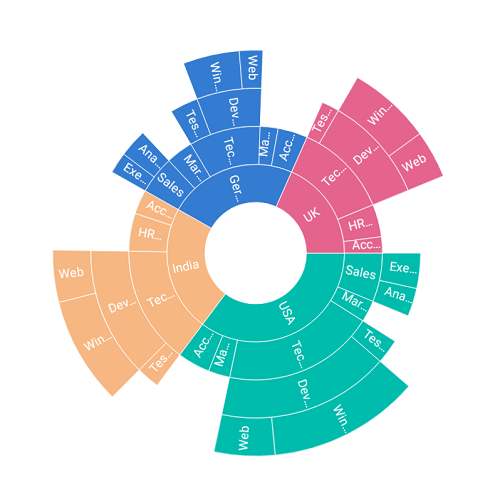
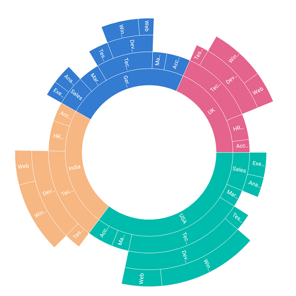
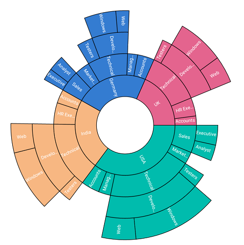

# Customization

The sunburst chart provides various customizing and styling options to enrich the application.

## Palettes

The sunburst chart provides options to apply different kinds of palettes using the [`ColorModel`](https://help.syncfusion.com/cr/cref_files/xamarin-ios/sfsunburstchart/Syncfusion.SfSunburstChart.iOS~Syncfusion.SfSunburstChart.iOS.SfSunburstChart~ColorModel.html).

The following palettes are available in the sunburst chart:

* Metro
* Natural
* Pineapple
* TomatoSpectrum
* Custom

The following code shows applying the TomatoSpectrum [`Palette`](https://help.syncfusion.com/cr/cref_files/xamarin-ios/sfsunburstchart/Syncfusion.SfSunburstChart.iOS~Syncfusion.SfSunburstChart.iOS.SunburstChartColorModel~Palette.html).

 

 

            SfSunburstChart sunburstChart = new SfSunburstChart();

            SunburstViewModel dataModel = new SunburstViewModel();
            sunburstChart.ItemsSource = dataModel.DataSource;
            sunburstChart.ValueMemberPath = "EmployeesCount";

            sunburstChart.DataLabel.ShowLabel = true;

            sunburstChart.Levels.Add(new SunburstHierarchicalLevel() { GroupMemberPath = "Country" });
            sunburstChart.Levels.Add(new SunburstHierarchicalLevel() { GroupMemberPath = "JobDescription" });
            sunburstChart.Levels.Add(new SunburstHierarchicalLevel() { GroupMemberPath = "JobGroup" });
            sunburstChart.Levels.Add(new SunburstHierarchicalLevel() { GroupMemberPath = "JobRole" });

            SunburstChartColorModel colorModel = new SunburstChartColorModel();
            colorModel.Palette = SunburstColorPalette.TomatoSpectrum;
            sunburstChart.ColorModel = colorModel;

            sunburstChart.Frame = this.View.Frame;
            View.AddSubview(sunburstChart);  



 

## Angle

The start angle and end angle of the sunburst chart can be adjusted by using the [`StartAngle`](https://help.syncfusion.com/cr/cref_files/xamarin-ios/sfsunburstchart/Syncfusion.SfSunburstChart.iOS~Syncfusion.SfSunburstChart.iOS.SfSunburstChart~StartAngle.html) and [`EndAngle`](https://help.syncfusion.com/cr/cref_files/xamarin-ios/sfsunburstchart/Syncfusion.SfSunburstChart.iOS~Syncfusion.SfSunburstChart.iOS.SfSunburstChart~StartAngle.html) properties.

 

 

            SfSunburstChart sunburstChart = new SfSunburstChart();          

            SunburstViewModel dataModel = new SunburstViewModel();
            sunburstChart.ItemsSource = dataModel.DataSource;
            sunburstChart.ValueMemberPath = "EmployeesCount";

            sunburstChart.StartAngle = 180;
            sunburstChart.EndAngle = 360;
            sunburstChart.DataLabel.ShowLabel = true;

            sunburstChart.Levels.Add(new SunburstHierarchicalLevel() { GroupMemberPath = "Country" });
            sunburstChart.Levels.Add(new SunburstHierarchicalLevel() { GroupMemberPath = "JobDescription" });
            sunburstChart.Levels.Add(new SunburstHierarchicalLevel() { GroupMemberPath = "JobGroup" });
            sunburstChart.Levels.Add(new SunburstHierarchicalLevel() { GroupMemberPath = "JobRole" });
            
            sunburstChart.Frame = this.View.Frame;
            View.AddSubview(sunburstChart);     



 

## Radius

The sunburst chart allows you to customize the radius by using the [`Radius`](https://help.syncfusion.com/cr/cref_files/xamarin-ios/sfsunburstchart/Syncfusion.SfSunburstChart.iOS~Syncfusion.SfSunburstChart.iOS.SfSunburstChart~Radius.html) property. The default value of this property is 0.9, and the value ranges from 0 to 1.

 

 

            SfSunburstChart sunburstChart = new SfSunburstChart();           

            SunburstViewModel dataModel = new SunburstViewModel();
            sunburstChart.ItemsSource = dataModel.DataSource;
            sunburstChart.ValueMemberPath = "EmployeesCount";

            sunburstChart.Radius = 0.6;
            sunburstChart.DataLabel.ShowLabel = true;

            sunburstChart.Levels.Add(new SunburstHierarchicalLevel() { GroupMemberPath = "Country" });
            sunburstChart.Levels.Add(new SunburstHierarchicalLevel() { GroupMemberPath = "JobDescription" });
            sunburstChart.Levels.Add(new SunburstHierarchicalLevel() { GroupMemberPath = "JobGroup" });
            sunburstChart.Levels.Add(new SunburstHierarchicalLevel() { GroupMemberPath = "JobRole" });          

            sunburstChart.Frame = this.View.Frame;
            View.AddSubview(sunburstChart);   



 

## Inner radius

The sunburst chart allows you to customize the inner radius using the [`InnerRadius`](https://help.syncfusion.com/cr/cref_files/xamarin-ios/sfsunburstchart/Syncfusion.SfSunburstChart.iOS~Syncfusion.SfSunburstChart.iOS.SfSunburstChart~InnerRadius.html) property. The default value of this property is 0.2, and the value ranges from 0 to 1.

 

 

            SfSunburstChart sunburstChart = new SfSunburstChart();
            
            SunburstViewModel dataModel = new SunburstViewModel();
            sunburstChart.ItemsSource = dataModel.DataSource;
            sunburstChart.ValueMemberPath = "EmployeesCount";

            sunburstChart.InnerRadius = 0.5;
            sunburstChart.DataLabel.ShowLabel = true;

            sunburstChart.Levels.Add(new SunburstHierarchicalLevel() { GroupMemberPath = "Country" });
            sunburstChart.Levels.Add(new SunburstHierarchicalLevel() { GroupMemberPath = "JobDescription" });
            sunburstChart.Levels.Add(new SunburstHierarchicalLevel() { GroupMemberPath = "JobGroup" });
            sunburstChart.Levels.Add(new SunburstHierarchicalLevel() { GroupMemberPath = "JobRole" });                 

            sunburstChart.Frame = this.View.Frame;
            View.AddSubview(sunburstChart);  



 

## Stroke customization

Stroke color and stroke width of the sunburst chart can be customized using [`StrokeColor`](https://help.syncfusion.com/cr/cref_files/xamarin-ios/sfsunburstchart/Syncfusion.SfSunburstChart.iOS~Syncfusion.SfSunburstChart.iOS.SfSunburstChart~StrokeColor.html) and [`StrokeWidth`](https://help.syncfusion.com/cr/cref_files/xamarin-ios/sfsunburstchart/Syncfusion.SfSunburstChart.iOS~Syncfusion.SfSunburstChart.iOS.SfSunburstChart~StrokeWidth.html) properties respectively.

 

 

            SfSunburstChart sunburstChart = new SfSunburstChart();
            
            SunburstViewModel dataModel = new SunburstViewModel();
            sunburstChart.ItemsSource = dataModel.DataSource;
            sunburstChart.ValueMemberPath = "EmployeesCount";

            sunburstChart.StrokeColor = UIColor.Black;
            sunburstChart.StrokeWidth = 2;

            sunburstChart.DataLabel.ShowLabel = true;

            sunburstChart.Levels.Add(new SunburstHierarchicalLevel() { GroupMemberPath = "Country" });
            sunburstChart.Levels.Add(new SunburstHierarchicalLevel() { GroupMemberPath = "JobDescription" });
            sunburstChart.Levels.Add(new SunburstHierarchicalLevel() { GroupMemberPath = "JobGroup" });
            sunburstChart.Levels.Add(new SunburstHierarchicalLevel() { GroupMemberPath = "JobRole" });                     

            sunburstChart.Frame = this.View.Frame;
            View.AddSubview(sunburstChart);  



 

