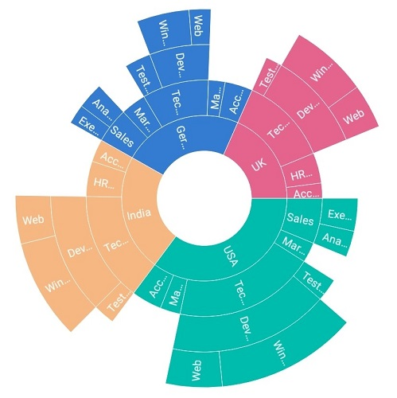
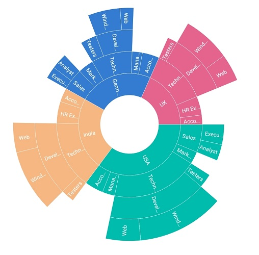
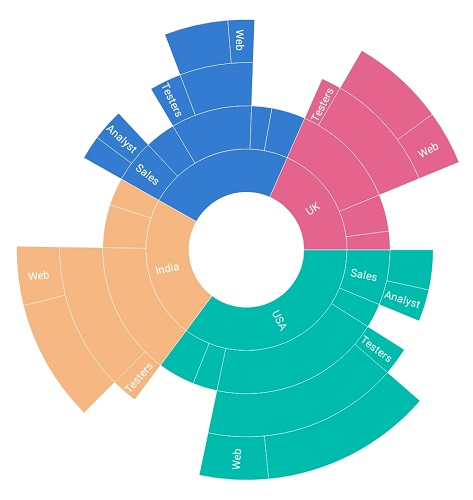
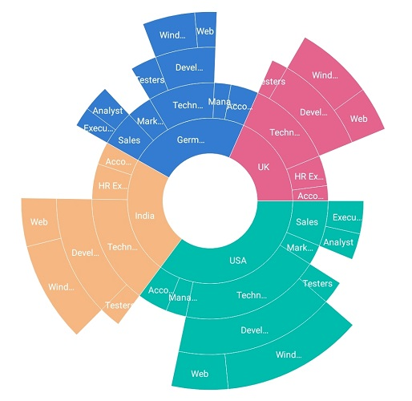
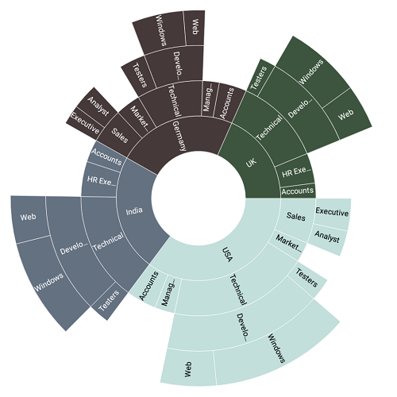

# Data label

Data labels are used to display information about segments. Data labels are enabled and disabled using the [`ShowLabel`](https://help.syncfusion.com/cr/cref_files/xamarin-ios/sfsunburstchart/Syncfusion.SfSunburstChart.iOS~Syncfusion.SfSunburstChart.iOS.SunburstChartDataLabel~ShowLabel.html) property. The default value of the ShowLabel property is true.

The following code explains how to initialize data labels.

 

 

            SfSunburstChart sunburstChart = new SfSunburstChart();
            sunburstChart.DataLabel.ShowLabel = true;  
            sunburstChart.Frame = this.View.Frame;
            View.AddSubview(sunburstChart);       



 

## Overflow Mode

When the data labels are large in size, they will overlap each other. To avoid overlapping, trim or hide the data labels using the [`OverflowMode`](https://help.syncfusion.com/cr/cref_files/xamarin-ios/sfsunburstchart/Syncfusion.SfSunburstChart.iOS~Syncfusion.SfSunburstChart.iOS.SunburstChartDataLabel~OverflowMode.html) property.

### Trim

The following code shows trimming the data labels.

 

 

            SfSunburstChart sunburstChart = new SfSunburstChart();
            sunburstChart.DataLabel.ShowLabel = true; 
            sunburstChart.DataLabel.OverflowMode = SunburstLabelOverflowMode.Trim; 
            sunburstChart.Frame = this.View.Frame;
            View.AddSubview(sunburstChart); 



 

### Hide

The following code shows hiding the data labels.



 

            SfSunburstChart sunburstChart = new SfSunburstChart();
            sunburstChart.DataLabel.ShowLabel = true; 
            sunburstChart.DataLabel.OverflowMode = SunburstLabelOverflowMode.Hide; 
            sunburstChart.Frame = this.View.Frame;
            View.AddSubview(sunburstChart); 



 

## Rotation Mode

The view of data labels can be customized using the [`RotationMode`](https://help.syncfusion.com/cr/cref_files/xamarin-ios/sfsunburstchart/Syncfusion.SfSunburstChart.iOS~Syncfusion.SfSunburstChart.iOS.SunburstChartDataLabel~RotationMode.html) property. Data labels can be rotated to a angle for better readability. By default, the rotation mode is angle.

### Angle

The following code shows rotating a data label to an angle.

 

 

            SfSunburstChart sunburstChart = new SfSunburstChart();
            sunburstChart.DataLabel.ShowLabel = true; 
            sunburstChart.DataLabel.RotationMode = SunburstLabelRotationMode.Angle;           
            sunburstChart.Frame = this.View.Frame;
            View.AddSubview(sunburstChart); 



 

### Normal

The following code shows normal mode of data labels.

 

 

            SfSunburstChart sunburstChart = new SfSunburstChart();
            sunburstChart.DataLabel.ShowLabel = true; 
            sunburstChart.DataLabel.RotationMode = SunburstLabelRotationMode.Normal;         
            sunburstChart.Frame = this.View.Frame;
            View.AddSubview(sunburstChart);   



 

## Customization

Data labels can be customized using the properties available in [`LabelStyle`](https://help.syncfusion.com/cr/cref_files/xamarin-ios/sfsunburstchart/Syncfusion.SfSunburstChart.iOS~Syncfusion.SfSunburstChart.iOS.SunburstChartDataLabel~LabelStyle.html).

* [`Color`](https://help.syncfusion.com/cr/cref_files/xamarin-ios/sfsunburstchart/Syncfusion.SfSunburstChart.iOS~Syncfusion.SfSunburstChart.iOS.SunburstChartLabelStyle~Color.html) : Data label's color can be modified.
* [`Font`](https://help.syncfusion.com/cr/cref_files/xamarin-ios/sfsunburstchart/Syncfusion.SfSunburstChart.iOS~Syncfusion.SfSunburstChart.iOS.SunburstChartLabelStyle~Font.html) : Font of the data label can be modified.

 

 

            SfSunburstChart sunburstChart = new SfSunburstChart(this);
            sunburstChart.DataLabel.ShowLabel = true;           
            sunburstChart.DataLabel.LabelStyle.Color = UIColor.White;
            sunburstChart.DataLabel.LabelStyle.Font= UIFont.FromName("Arial", 8);          
            sunburstChart.Frame = this.View.Frame;
            View.AddSubview(sunburstChart); 



 

## Label text color

Data label text color will change automatically based on the color of the segments. Whatever be the color of the segments, text color of the label will change accordingly for better readability.

In the following code `Pineapple` palette is applied, hence data label takes the color based on the color of the segments.

 



            SfSunburstChart sunburstChart = new SfSunburstChart();
            sunburstChart.DataLabel.ShowLabel = true;
            sunburstChart.ColorModel.Palette = SunburstColorPalette.Pineapple;



 

In the below image, first segment's data label will be in black and others will be in white.

