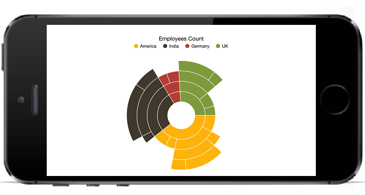

# Getting Started

This section explains you the steps required to populate the sunburst chart with data, data labels, legends and title. This section covers only the minimal features that you need to know to get started with the sunburst chart. 

## Reference Essential Studio components in your solution

After installing Essential Studio for Xamarin, you can find all the required assemblies in the installation folders, 

{Syncfusion Installed location}\Essential Studio\15.2.0.40\lib

N> Assemblies are available in unzipped package location in Mac.

Add the following assembly references to the Android project,

android\Syncfusion.SfSunburstChart.iOS.dll

# Add and configure the sunburst chart

The following steps explain on how to create a sunburst chart and configure its elements,

1. Create an instance of SfSunburstChart.



SfSunburstChart chart = new SfSunburstChart();

SetContentView(chart);



## Initialize view model

In this section, the data in the following table is used for demonstration,

<table>
<tr>
<th>
Country
</th>
<th>
Job Description
</th>
<th>
Job Group
</th>
<th>
Job Role
</th>
<th>
Employees Count
</th>
</tr>
<tr>
<td>
America
</td>
<td>
Sales
</td>
<td>
</td>
<td>
</td>
<td>
70
</td>
</tr>
<tr>
<td>
America
</td>
<td>
Technical
</td>
<td>
Testers
</td>
<td>
</td>
<td>
35
</td>
</tr>
<tr>
<td>
America
</td>
<td>
Technical
</td>
<td>
Developers
</td>
<td>
Windows
</td>
<td>
105
</td>
</tr>
<tr>
<td>
America
</td>
<td>
Technical
</td>
<td>
Developers
</td>
<td>
Web
</td>
<td>
40
</td>
</tr>
<tr>
<td>
America
</td>
<td>
Management
</td>
<td>
</td>
<td>
</td>
<td>
40
</td>
</tr>
<tr>
<td>
America
</td>
<td>
Accounts
</td>
<td>
</td>
<td>
</td>
<td>
60
</td>
</tr>
<tr>
<td>
India
</td>
<td>
Technical
</td>
<td>
Testers
</td>
<td>
</td>
<td>
25
</td>
</tr>
<tr>
<td>
India
</td>
<td>
Technical
</td>
<td>
Developers
</td>
<td>
Windows
</td>
<td>
155
</td>
</tr>
<tr>
<td>
India
</td>
<td>
Technical
</td>
<td>
Developers
</td>
<td>
Web
</td>
<td>
60
</td>
</tr>
<tr>
<td>
Germany
</td>
<td>
Sales
</td>
<td>
Executive
</td>
<td>
</td>
<td>
30
</td>
</tr>
<tr>
<td>
Germany
</td>
<td>
Sales
</td>
<td>
Analyst
</td>
<td>
</td>
<td>
40
</td>
</tr>
<tr>
<td>
UK
</td>
<td>
Technical
</td>
<td>
Developers
</td>
<td>
Windows
</td>
<td>
100
</td>
</tr>
<tr>
<td>
UK
</td>
<td>
Technical
</td>
<td>
Developers
</td>
<td>
Web
</td>
<td>
30
</td>
</tr>
<tr>
<td>
UK
</td>
<td>
HR Executives
</td>
<td>
</td>
<td>
</td>
<td>
60
</td>
</tr>
<tr>
<td>
UK
</td>
<td>
Marketing
</td>
<td>
</td>
<td>
</td>
<td>
40
</td>
</tr>
</table>

Now, let us define a data model that represents the above data in [`SfSunburstChart`](https://help.syncfusion.com/cr/cref_files/xamarin-ios/sfsunburstchart/Syncfusion.SfSunburstChart.iOS~Syncfusion.SfSunburstChart.iOS.SfSunburstChart.html).


public class Model   
{   
    public string Category { get; set; }
    public string Country { get; set; }
    public string JobDescription { get; set; }
    public string JobGroup { get; set; }
    public string JobRole { get; set; }
    public double EmployeesCount { get; set; }
}
 

In ['SfSunburstChart'](https://help.syncfusion.com/cr/cref_files/xamarin-ios/sfsunburstchart/Syncfusion.SfSunburstChart.iOS~Syncfusion.SfSunburstChart.iOS.SfSunburstChart.html), the [`ItemsSource`](https://help.syncfusion.com/cr/cref_files/xamarin-ios/sfsunburstchart/Syncfusion.SfSunburstChart.iOS~Syncfusion.SfSunburstChart.iOS.SfSunburstChart~ItemsSource.html) should to be a collection of objects. Add the following class for generating the datapoints.


public class DataModel
{
    public ObservableCollection<Model> Data { get; set; }
    public DataModel()
    {
        Data = new ObservableCollection<Model>
        {
            new Model
            {
                Country = "America", JobDescription = "Sales",
                EmployeesCount = 70
            },
            new Model
            {
                Country = "America", JobDescription = "Technical",
                JobGroup = "Testers", EmployeesCount = 35
            },
            new Model
            {
                Country = "America", JobDescription = "Technical",
                JobGroup = "Developers", JobRole = "Windows", EmployeesCount = 105
            },
            new Model
            {
                Country = "America", JobDescription = "Technical",
                JobGroup = "Developers", JobRole = "Web", EmployeesCount = 40
            },
            new Model
            {
                Country = "America", JobDescription = "Management",
                EmployeesCount = 40
            },
            new Model
            {
                Country = "America", JobDescription = "Accounts",
                EmployeesCount = 60
            },
            new Model
            {
                Country = "India", JobDescription = "Technical",
                JobGroup = "Testers", EmployeesCount = 25
            },
            new Model
            {
                Country = "India", JobDescription = "Technical", JobGroup = "Developers",
            JobRole = "Windows", EmployeesCount = 155
            },
            new Model
            {
                Country = "India", JobDescription = "Technical", JobGroup = "Developers",
                JobRole = "Web", EmployeesCount = 60
            },
            new Model
            {
                Country = "Germany", JobDescription = "Sales", JobGroup = "Executive",
                EmployeesCount = 30
            },
            new Model
            {
                Country = "Germany", JobDescription = "Sales", JobGroup = "Analyst",
                EmployeesCount = 40
            },
            new Model
            {
                Country = "UK", JobDescription = "Technical", JobGroup = "Developers",
                JobRole = "Windows", EmployeesCount = 100
            },
            new Model
            {
                Country = "UK", JobDescription = "Technical", JobGroup = "Developers",
                JobRole = "Web", EmployeesCount = 30
            },
            new Model
            {
                Country = "UK", JobDescription = "HR Executives", EmployeesCount = 60
            },
            new Model
            {
                Country = "UK", JobDescription = "Marketing", EmployeesCount = 40
            }
        };
    }
}

 

## Populate SunburstChart with data

Now, set the Data property of the above DataModel to the [`ItemsSource`](https://help.syncfusion.com/cr/cref_files/xamarin-ios/sfsunburstchart/Syncfusion.SfSunburstChart.iOS~Syncfusion.SfSunburstChart.iOS.SfSunburstChart~ItemsSource.html) property. 
Add [`SunburstHierarchicalLevel`](https://help.syncfusion.com/cr/cref_files/xamarin-ios/sfsunburstchart/Syncfusion.SfSunburstChart.iOS~Syncfusion.SfSunburstChart.iOS.SunburstHierarchicalLevel.html) to [`Levels`](https://help.syncfusion.com/cr/cref_files/xamarin-ios/sfsunburstchart/Syncfusion.SfSunburstChart.iOS~Syncfusion.SfSunburstChart.iOS.SfSunburstChart~Levels.html) property. Each hierarchy level is formed based on the property specified in [`GroupMemberPath`](https://help.syncfusion.com/cr/cref_files/xamarin-ios/sfsunburstchart/Syncfusion.SfSunburstChart.iOS~Syncfusion.SfSunburstChart.iOS.SunburstHierarchicalLevel~GroupMemberPath.html) property, and each arc segment size is calculated using [`ValueMemberPath`](https://help.syncfusion.com/cr/cref_files/xamarin-ios/sfsunburstchart/Syncfusion.SfSunburstChart.iOS~Syncfusion.SfSunburstChart.iOS.SfSunburstChart~ValueMemberPath.html).


SfSunburstChart sunburst = new SfSunburstChart();
sunburst.ValueMemberPath = "EmployeesCount";
sunburst.ItemsSource = dataModel.Data;
sunburst.Levels.Add(new SunburstHierarchicalLevel() {GroupMemberPath = "Country"});
sunburst.Levels.Add(new SunburstHierarchicalLevel() {GroupMemberPath = "JobDescription"});
sunburst.Levels.Add(new SunburstHierarchicalLevel() {GroupMemberPath = "JobGroup"});
sunburst.Levels.Add(new SunburstHierarchicalLevel() {GroupMemberPath = "JobRole"});


## Add Title

You can add title to sunburst chart to provide quick information to the user about the data being plotted in the chart. You can set title using [`SfSunburstChart.Title`](https://help.syncfusion.com/cr/cref_files/xamarin-ios/sfsunburstchart/Syncfusion.SfSunburstChart.iOS~Syncfusion.SfSunburstChart.iOS.SfSunburstChart~Title.html) property as shown below.

 
sunburst.Title.IsVisible = true;
sunburst.Title.Text = "Employees Count";


## Add legend

You can enable legend using [`SfSunburstChart.Legend`](https://help.syncfusion.com/cr/cref_files/xamarin-ios/sfsunburstchart/Syncfusion.SfSunburstChart.iOS~Syncfusion.SfSunburstChart.iOS.SfSunburstChart~Legend.html) property as shown below,

 
sunburst.Legend.IsVisible = true; 


## Add data labels

You can add data labels to improve the readability of the sunburst chart. This can be achieved using [`SfSunburstChart.DataLabel`](https://help.syncfusion.com/cr/cref_files/xamarin-ios/sfsunburstchart/Syncfusion.SfSunburstChart.iOS~Syncfusion.SfSunburstChart.iOS.SfSunburstChart~DataLabel.html) property as shown below.

 
sunburst.DataLabel.ShowLabel = true;


Following is the final output screenshot,

