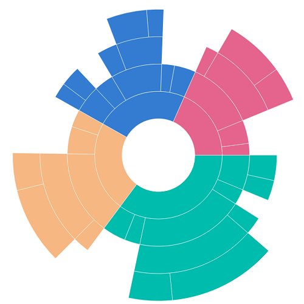
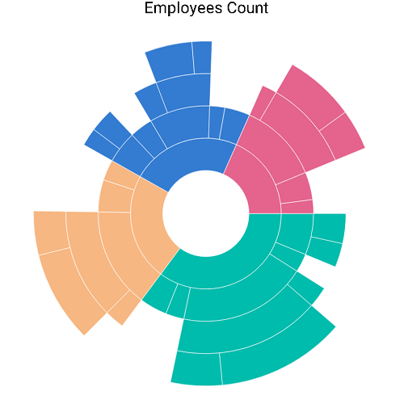
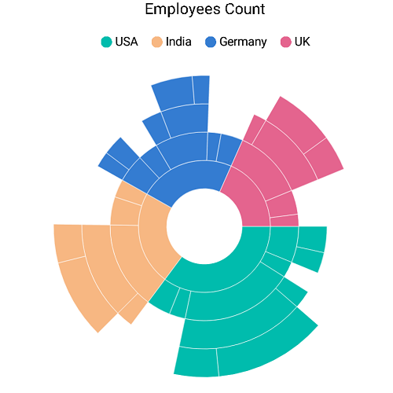
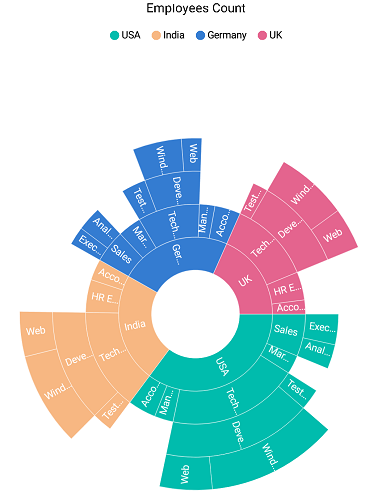
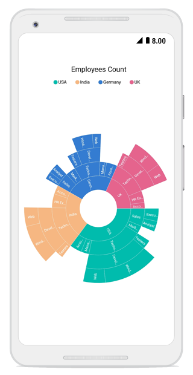

# Getting Started

This section explains the steps required to configure the `SfSunburstChart` and populate it with data, data labels, legends, and title. This section covers only the minimal features that needed to get started with the sunburst chart. 

## Add sunburst chart references

After installing Essential Studio for Xamarin, you can find all the required assemblies in the installation folders, 

{Syncfusion Installed location}\Essential Studio\15.2.0.39\lib

N> Assemblies are available in unzipped package location in Mac.

Add the following assembly references to the iOS project,

ios-unified\Syncfusion.SfSunburstChart.iOS.dll

# Initialize sunburst chart

Import the SfSunburstChart namespace as shown below.



using Syncfusion.SfSunburstChart.iOS;



Then initialize an empty SunburstChart.



public override void ViewDidLoad ()
{
    base.ViewDidLoad ();

    //Initialize the sunburst chart with required frame. This frame can be any rectangle, which bounds inside the view.
    SfSunburstChart chart = new SfSunburstChart ();
    chart.Frame   = this.View.Frame;
	View.AddSubview(chart);
}



## Initialize view model

In this section, data in the following table is used for demonstration.

<table>
<tr>
<th>
Country
</th>
<th>
Job description
</th>
<th>
Job group
</th>
<th>
Job role
</th>
<th>
Employees count
</th>
</tr>
<tr>
<td>
United States
</td>
<td>
Sales
</td>
<td>
Executive
</td>
<td>
</td>
<td>
50
</td>
</tr>
<tr>
<td>
United States
</td>
<td>
Sales
</td>
<td>
Analyst
</td>
<td>
</td>
<td>
40
</td>
</tr>
<tr>
<td>
United States
</td>
<td>
Marketing
</td>
<td>
</td>
<td>
</td>
<td>
40
</td>
</tr>
<tr>
<td>
United States
</td>
<td>
Technical
</td>
<td>
Testers
</td>
<td>
</td>
<td>
35
</td>
</tr>
<tr>
<td>
United States
</td>
<td>
Technical
</td>
<td>
Developers
</td>
<td>
Windows
</td>
<td>
175
</td>
</tr>
<tr>
<td>
United States
</td>
<td>
Technical
</td>
<td>
Developers
</td>
<td>
Web
</td>
<td>
70
</td>
</tr>
<tr>
<td>
United States
</td>
<td>
Management
</td>
<td>
</td>
<td>
</td>
<td>
40
</td>
</tr>
<tr>
<td>
United States
</td>
<td>
Accounts
</td>
<td>
</td>
<td>
</td>
<td>
60
</td>
</tr>
<tr>
<td>
India
</td>
<td>
Technical
</td>
<td>
Testers
</td>
<td>
</td>
<td>
33
</td>
</tr>
<tr>
<td>
India
</td>
<td>
Technical
</td>
<td>
Developers
</td>
<td>
Windows
</td>
<td>
125
</td>
</tr>
<tr>
<td>
India
</td>
<td>
Technical
</td>
<td>
Developers
</td>
<td>
Web
</td>
<td>
60
</td>
</tr>
<tr>
<td>
India
</td>
<td>
HR Executives
</td>
<td>
</td>
<td>
</td>
<td>
70
</td>
</tr>
<tr>
<td>
India
</td>
<td>
Accounts
</td>
<td>
</td>
<td>
</td>
<td>
45
</td>
</tr>
<tr>
<td>
Germany
</td>
<td>
Sales
</td>
<td>
Executive
</td>
<td>
</td>
<td>
30
</td>
</tr>
<tr>
<td>
Germany
</td>
<td>
Sales
</td>
<td>
Analyst
</td>
<td>
</td>
<td>
40
</td>
</tr>
<tr>
<td>
Germany
</td>
<td>
Marketing
</td>
<td>
</td>
<td>
</td>
<td>
50
</td>
</tr>
<tr>
<td>
Germany
</td>
<td>
Technical
</td>
<td>
Testers
</td>
<td>
</td>
<td>
40
</td>
</tr>
<tr>
<td>
Germany
</td>
<td>
Technical
</td>
<td>
Developers
</td>
<td>
Windows
</td>
<td>
65
</td>
</tr>
<tr>
<td>
Germany
</td>
<td>
Technical
</td>
<td>
Developers
</td>
<td>
Web
</td>
<td>
27
</td>
</tr>
<tr>
<td>
Germany
</td>
<td>
Management
</td>
<td>
</td>
<td>
</td>
<td>
33
</td>
</tr>
<tr>
<td>
Germany
</td>
<td>
Accounts
</td>
<td>
</td>
<td>
</td>
<td>
55
</td>
</tr>
<tr>
<td>
UK
</td>
<td>
Technical
</td>
<td>
Testers
</td>
<td>
</td>
<td>
25
</td>
</tr>
<tr>
<td>
UK
</td>
<td>
Technical
</td>
<td>
Developers
</td>
<td>
Windows
</td>
<td>
96
</td>
</tr>
<tr>
<td>
UK
</td>
<td>
Technical
</td>
<td>
Developers
</td>
<td>
Web
</td>
<td>
55
</td>
</tr>
<tr>
<td>
UK
</td>
<td>
HR executives
</td>
<td>
</td>
<td>
</td>
<td>
60
</td>
</tr>
<tr>
<td>
UK
</td>
<td>
Accounts
</td>
<td>
</td>
<td>
</td>
<td>
30
</td>
</tr>
</table>

Define a data model that represents the above data in [`SfSunburstChart`](https://help.syncfusion.com/cr/cref_files/xamarin-ios/sfsunburstchart/Syncfusion.SfSunburstChart.iOS~Syncfusion.SfSunburstChart.iOS.SfSunburstChart.html).



public class SunburstModel
{
        public string JobDescription { get; set; }
        public string JobGroup { get; set; }
        public string JobRole { get; set; }
        public double EmployeesCount { get; set; }
        public string Country { get; set; }
}

 

Then, create a view model class, and initialize a list of SunburstModel objects as follows.

In ['SfSunburstChart'](https://help.syncfusion.com/cr/cref_files/xamarin-ios/sfsunburstchart/Syncfusion.SfSunburstChart.iOS~Syncfusion.SfSunburstChart.iOS.SfSunburstChart.html), [`ItemsSource`](https://help.syncfusion.com/cr/cref_files/xamarin-ios/sfsunburstchart/Syncfusion.SfSunburstChart.iOS~Syncfusion.SfSunburstChart.iOS.SfSunburstChart~ItemsSource.html) property should be a collection of objects. Add the following class for generating the datapoints.



public class SunburstViewModel
{
        public ObservableCollection<SunburstModel> DataSource { get; set; }
        public SunburstViewModel()
        {
            this.DataSource = new ObservableCollection<SunburstModel>
            {
                new SunburstModel { Country = "USA", JobDescription = "Sales", JobGroup="Executive", EmployeesCount = 50 },
                new SunburstModel { Country = "USA", JobDescription = "Sales", JobGroup = "Analyst", EmployeesCount = 40 },
                new SunburstModel { Country = "USA", JobDescription = "Marketing", EmployeesCount = 40 },
                new SunburstModel { Country = "USA", JobDescription = "Technical", JobGroup = "Testers", EmployeesCount = 35 },
                new SunburstModel { Country = "USA", JobDescription = "Technical", JobGroup = "Developers", JobRole = "Windows", EmployeesCount = 175 },
                new SunburstModel { Country = "USA", JobDescription = "Technical", JobGroup = "Developers", JobRole = "Web", EmployeesCount = 70 },
                new SunburstModel { Country = "USA", JobDescription = "Management", EmployeesCount = 40 },
                new SunburstModel { Country = "USA", JobDescription = "Accounts", EmployeesCount = 60 },

                new SunburstModel { Country = "India", JobDescription = "Technical", JobGroup = "Testers", EmployeesCount = 33 },
                new SunburstModel { Country = "India", JobDescription = "Technical", JobGroup = "Developers", JobRole = "Windows", EmployeesCount = 125 },
                new SunburstModel { Country = "India", JobDescription = "Technical", JobGroup = "Developers", JobRole = "Web", EmployeesCount = 60 },
                new SunburstModel { Country = "India", JobDescription = "HR Executives", EmployeesCount = 70 },
                new SunburstModel { Country = "India", JobDescription = "Accounts", EmployeesCount = 45 },

                new SunburstModel { Country = "Germany", JobDescription = "Sales", JobGroup = "Executive", EmployeesCount = 30 },
                new SunburstModel { Country = "Germany", JobDescription = "Sales", JobGroup = "Analyst", EmployeesCount = 40 },
                new SunburstModel { Country = "Germany", JobDescription = "Marketing", EmployeesCount = 50 },
                new SunburstModel { Country = "Germany", JobDescription = "Technical", JobGroup = "Testers", EmployeesCount = 40 },
                new SunburstModel { Country = "Germany", JobDescription = "Technical", JobGroup = "Developers", JobRole = "Windows", EmployeesCount = 65 },
                new SunburstModel { Country = "Germany", JobDescription = "Technical", JobGroup = "Developers", JobRole = "Web", EmployeesCount = 27 },
                new SunburstModel { Country = "Germany", JobDescription = "Management", EmployeesCount = 33 },
                new SunburstModel { Country = "Germany", JobDescription = "Accounts", EmployeesCount = 55 },

                new SunburstModel { Country = "UK", JobDescription = "Technical", JobGroup = "Testers", EmployeesCount = 25 },
                new SunburstModel { Country = "UK", JobDescription = "Technical", JobGroup = "Developers", JobRole = "Windows", EmployeesCount = 96 },
                new SunburstModel { Country = "UK", JobDescription = "Technical", JobGroup = "Developers", JobRole = "Web", EmployeesCount = 55 },
                new SunburstModel { Country = "UK", JobDescription = "HR Executives", EmployeesCount = 60 },
                new SunburstModel { Country = "UK", JobDescription = "Accounts", EmployeesCount = 30 }
            };
        }
}

 

## Populate sunburst chart with data

Now, set the DataSource property of the above SunburstViewModel to the [`ItemsSource`](https://help.syncfusion.com/cr/cref_files/xamarin-ios/sfsunburstchart/Syncfusion.SfSunburstChart.iOS~Syncfusion.SfSunburstChart.iOS.SfSunburstChart~ItemsSource.html) property. 
Then, add the [`SunburstHierarchicalLevel`](https://help.syncfusion.com/cr/cref_files/xamarin-ios/sfsunburstchart/Syncfusion.SfSunburstChart.iOS~Syncfusion.SfSunburstChart.iOS.SunburstHierarchicalLevel.html) to [`Levels`](https://help.syncfusion.com/cr/cref_files/xamarin-ios/sfsunburstchart/Syncfusion.SfSunburstChart.iOS~Syncfusion.SfSunburstChart.iOS.SfSunburstChart~Levels.html) collection. Each hierarchy level is formed based on the property specified in [`GroupMemberPath`](https://help.syncfusion.com/cr/cref_files/xamarin-ios/sfsunburstchart/Syncfusion.SfSunburstChart.iOS~Syncfusion.SfSunburstChart.iOS.SunburstHierarchicalLevel~GroupMemberPath.html) property, and each arc segment size is calculated using the [`ValueMemberPath`](https://help.syncfusion.com/cr/cref_files/xamarin-ios/sfsunburstchart/Syncfusion.SfSunburstChart.iOS~Syncfusion.SfSunburstChart.iOS.SfSunburstChart~ValueMemberPath.html) property.



            SfSunburstChart sunburstChart = new SfSunburstChart();

            SunburstViewModel dataModel = new SunburstViewModel();
            sunburstChart.ItemsSource = dataModel.DataSource;
            sunburstChart.ValueMemberPath = "EmployeesCount";

            sunburstChart.Levels.Add(new SunburstHierarchicalLevel() { GroupMemberPath = "Country" });
            sunburstChart.Levels.Add(new SunburstHierarchicalLevel() { GroupMemberPath = "JobDescription" });
            sunburstChart.Levels.Add(new SunburstHierarchicalLevel() { GroupMemberPath = "JobGroup" });
            sunburstChart.Levels.Add(new SunburstHierarchicalLevel() { GroupMemberPath = "JobRole" });

            sunburstChart.Frame = this.View.Frame;
            View.AddSubview(sunburstChart);



## Add title

You can add title to the sunburst chart to provide information to users about the data being plotted in the chart. You can set title using the [`SfSunburstChart.Title`](https://help.syncfusion.com/cr/cref_files/xamarin-ios/sfsunburstchart/Syncfusion.SfSunburstChart.iOS~Syncfusion.SfSunburstChart.iOS.SfSunburstChart~Title.html) property.

 

            sunburstChart.Title.IsVisible = true;
            sunburstChart.Title.Text = "Employees Count";



## Add legend

You can enable legend using the [`SfSunburstChart.Legend`](https://help.syncfusion.com/cr/cref_files/xamarin-ios/sfsunburstchart/Syncfusion.SfSunburstChart.iOS~Syncfusion.SfSunburstChart.iOS.SfSunburstChart~Legend.html) property.

 

sunburstChart.Legend.IsVisible = true; 



## Add data labels

You can add data labels to improve the readability of the sunburst chart. Data labels can be added using the [`SfSunburstChart.DataLabel`](https://help.syncfusion.com/cr/cref_files/xamarin-ios/sfsunburstchart/Syncfusion.SfSunburstChart.iOS~Syncfusion.SfSunburstChart.iOS.SfSunburstChart~DataLabel.html) property.

 

sunburstChart.DataLabel.ShowLabel = true;



Below snippet is the complete code for generating the following output.



public partial class ViewController : UIViewController
{   
    #region View life cycle

    public override void ViewDidLoad ()
    {
        base.ViewDidLoad ();        
        // Perform any additional setup after loading the view, typically from a nib.
  
		    SfSunburstChart sunburstChart = new SfSunburstChart();

            SunburstViewModel dataModel = new SunburstViewModel();
            sunburstChart.ItemsSource = dataModel.DataSource;
            sunburstChart.ValueMemberPath = "EmployeesCount";
  
            sunburstChart.Title.IsVisible = true;
            sunburstChart.Title.Text = "Employees Count";

            sunburstChart.Legend.IsVisible = true;
            sunburstChart.DataLabel.ShowLabel = true;

            sunburstChart.Levels.Add(new SunburstHierarchicalLevel() { GroupMemberPath = "Country" });
            sunburstChart.Levels.Add(new SunburstHierarchicalLevel() { GroupMemberPath = "JobDescription" });
            sunburstChart.Levels.Add(new SunburstHierarchicalLevel() { GroupMemberPath = "JobGroup" });
            sunburstChart.Levels.Add(new SunburstHierarchicalLevel() { GroupMemberPath = "JobRole" });

            sunburstChart.Frame = this.View.Frame;
            View.AddSubview(sunburstChart);
    }
}
	


The following screenshot depicts the final output.

You can find the complete getting started sample from this link.