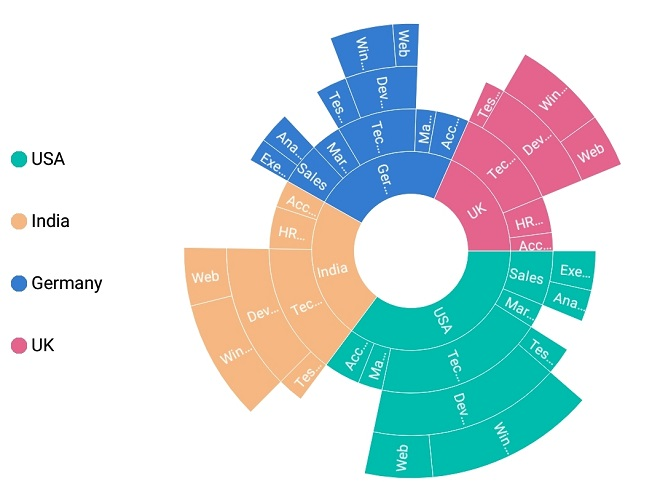
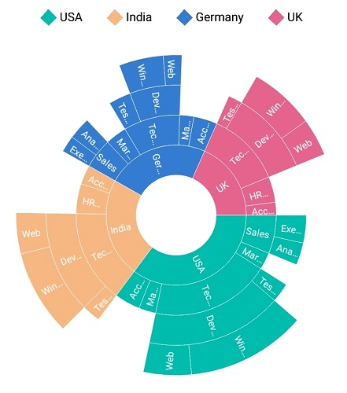
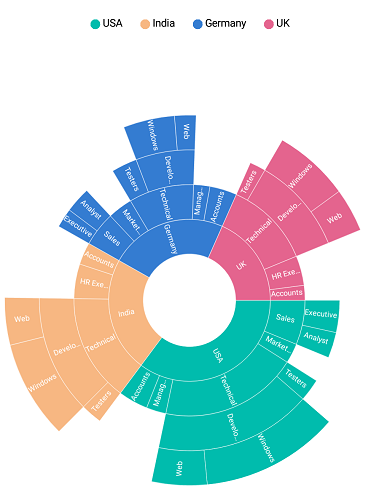

# Legend

Legends are used to represent the first level (i.e root level) of categories in the sunburst chart.

## Visibility

The visibility of legends can be controlled using the [`IsVisible`](https://help.syncfusion.com/cr/cref_files/xamarin-ios/sfsunburstchart/Syncfusion.SfSunburstChart.iOS~Syncfusion.SfSunburstChart.iOS.SunburstChartLegend~IsVisible.html) property.

The following code shows how to control the visibility of legend.

 

 

sunburstChart.Legend.IsVisible = true;



 

## Position

Legends can be docked at the top, right, left, or bottom position using the [`LegendPosition`](https://help.syncfusion.com/cr/cref_files/xamarin-ios/sfsunburstchart/Syncfusion.SfSunburstChart.iOS~Syncfusion.SfSunburstChart.iOS.SunburstChartLegend~LegendPosition.html) property.

The following code shows customizing the legend position.

 

 

            sunburstChart.Legend.IsVisible = true;
            sunburstChart.Legend.LegendPosition = SunburstDockPosition.Left;



 

## Legend icon types

Legend icon shapes can be customized using the [`IconType`](https://help.syncfusion.com/cr/cref_files/xamarin-ios/sfsunburstchart/Syncfusion.SfSunburstChart.iOS~Syncfusion.SfSunburstChart.iOS.SunburstChartLegend~IconType.html) property. The IconType property provides several predefined shapes. The default legend icon type is circle.

The following predefined shapes are available in the IconType property:
* Circle
* Cross
* Diamond
* Pentagon
* Rectangle
* Triangle.

 

 

            sunburstChart.Legend.IsVisible = true;
            sunburstChart.Legend.IconType = SunburstLegendIcon.Diamond;



 

## Icon size customization

The size of the legend icon can be customized using the [`IconHeight`](https://help.syncfusion.com/cr/cref_files/xamarin-ios/sfsunburstchart/Syncfusion.SfSunburstChart.iOS~Syncfusion.SfSunburstChart.iOS.SunburstChartLegend~IconHeight.html) and [`IconWidth`](https://help.syncfusion.com/cr/cref_files/xamarin-ios/sfsunburstchart/Syncfusion.SfSunburstChart.iOS~Syncfusion.SfSunburstChart.iOS.SunburstChartLegend~IconWidth.html) properties.

 

 

            sunburstChart.Legend.IsVisible = true;
            sunburstChart.Legend.IconType = SunburstLegendIcon.Diamond;
            sunburstChart.Legend.IconWidth = 15;
            sunburstChart.Legend.IconHeight = 15;            



 

## Customization

Legend label can be customized using the following properties available in [`LabelStyle`](https://help.syncfusion.com/cr/cref_files/xamarin-ios/sfsunburstchart/Syncfusion.SfSunburstChart.iOS~Syncfusion.SfSunburstChart.iOS.SunburstChartLegend~LabelStyle.html):

* [`Margin`](https://help.syncfusion.com/cr/cref_files/xamarin-ios/sfsunburstchart/Syncfusion.SfSunburstChart.iOS~Syncfusion.SfSunburstChart.iOS.SunburstChartLegendLabelStyle~Margin.html): Sets the specified margin for legend labels.
* [`Color`](https://help.syncfusion.com/cr/cref_files/xamarin-ios/sfsunburstchart/Syncfusion.SfSunburstChart.iOS~Syncfusion.SfSunburstChart.iOS.SunburstChartLegendLabelStyle~Color.html): Customizes the text color of the label.
* [`Font`](https://help.syncfusion.com/cr/cref_files/xamarin-ios/sfsunburstchart/Syncfusion.SfSunburstChart.iOS~Syncfusion.SfSunburstChart.iOS.SunburstChartLegendLabelStyle~Font.html): Customizes the label's font.

Background color for the legend can be changed using the [`Background`](https://help.syncfusion.com/cr/cref_files/xamarin-ios/sfsunburstchart/Syncfusion.SfSunburstChart.iOS~Syncfusion.SfSunburstChart.iOS.SunburstChartLegend~Background.html)Property.

 

 

            sunburstChart.Legend.IsVisible = true;
            sunburstChart.Legend.LabelStyle.Color = UIColor.Red;
            sunburstChart.Legend.LabelStyle.Font = UIFont.FromName("Arial", 12);
            sunburstChart.Legend.LabelStyle.Margin = new UIEdgeInsets(5, 5, 5, 5);
            sunburstChart.Legend.Background = UIColor.White;



 

## Item margin

Margin can be set to individual legend items using the [`ItemMargin`](https://help.syncfusion.com/cr/cref_files/xamarin-ios/sfsunburstchart/Syncfusion.SfSunburstChart.iOS~Syncfusion.SfSunburstChart.iOS.SunburstChartLegend~ItemMargin.html) property.

 

 

            sunburstChart.Legend.IsVisible = true;
            sunburstChart.Legend.ItemMargin = new UIEdgeInsets(3, 3, 3, 3);          



 

