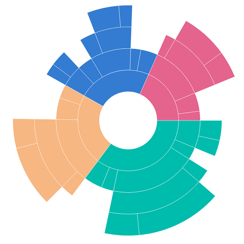

# Levels

The sunburst chart is used to display hierarchical data. More than one hierarchical data can be added to the [`Levels`](https://help.syncfusion.com/cr/xamarin-ios/Syncfusion.SfSunburstChart.iOS.SfSunburstChart.html#Syncfusion_SfSunburstChart_iOS_SfSunburstChart_Levels) collection of the sunburst chart. Each level of the hierarchy is represented by a circle.

The following code shows how to add hierarchical levels in the Levels collection.

 

 

  SunburstHierarchicalLevel level = new SunburstHierarchicalLevel();
  sunburstChart.Levels.Add(level);



 

## Group member path

The [`GroupMemberPath`](https://help.syncfusion.com/cr/xamarin-ios/Syncfusion.SfSunburstChart.iOS.SunburstHierarchicalLevel.html#Syncfusion_SfSunburstChart_iOS_SunburstHierarchicalLevel_GroupMemberPath) is a string property that is used to map the group category value in the sunburst [`ItemsSource`](https://help.syncfusion.com/cr/xamarin-ios/Syncfusion.SfSunburstChart.iOS.SfSunburstChart.html#Syncfusion_SfSunburstChart_iOS_SfSunburstChart_ItemsSource).

The following code shows how to map the group member path.

 

 

  SunburstHierarchicalLevel level1 = new SunburstHierarchicalLevel();
  level1.GroupMemberPath = "Level1";

  SunburstHierarchicalLevel level2 = new SunburstHierarchicalLevel();
  level2.GroupMemberPath = "Level2";

  SunburstHierarchicalLevel level3 = new SunburstHierarchicalLevel();
  level3.GroupMemberPath = "Level3";

  sunburstChart.Levels.Add(level1);
  sunburstChart.Levels.Add(level2);
  sunburstChart.Levels.Add(level3);



 

The following code specifies the levels for data model specified in the getting started section.

 

 

  SfSunburstChart sunburstChart = new SfSunburstChart();

  SunburstViewModel dataModel = new SunburstViewModel();
  sunburstChart.ItemsSource = dataModel.DataSource;
  sunburstChart.ValueMemberPath = "EmployeesCount";

  sunburstChart.Levels.Add(new SunburstHierarchicalLevel() { GroupMemberPath = "Country" });
  sunburstChart.Levels.Add(new SunburstHierarchicalLevel() { GroupMemberPath = "JobDescription" });
  sunburstChart.Levels.Add(new SunburstHierarchicalLevel() { GroupMemberPath = "JobGroup" });
  sunburstChart.Levels.Add(new SunburstHierarchicalLevel() { GroupMemberPath = "JobRole" });            

  sunburstChart.Frame = this.View.Frame;
  View.AddSubview(sunburstChart); 



 

