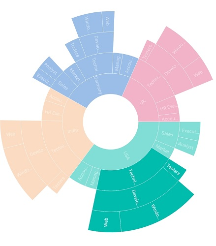
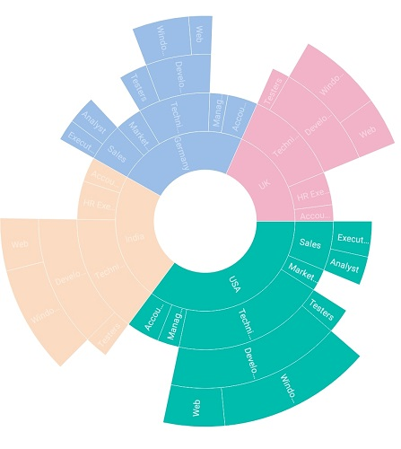
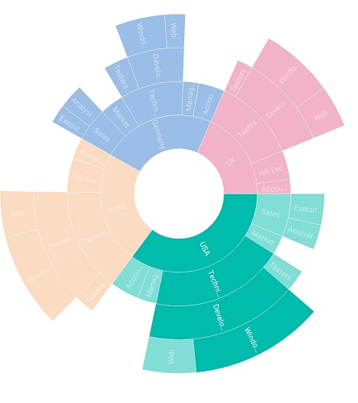
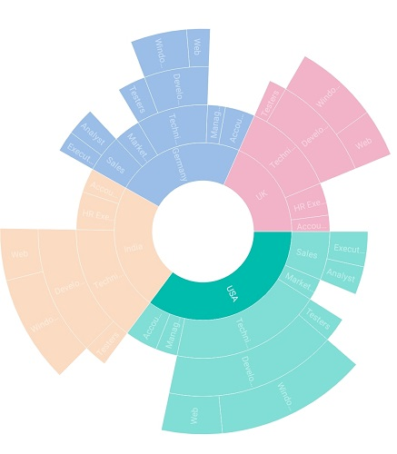
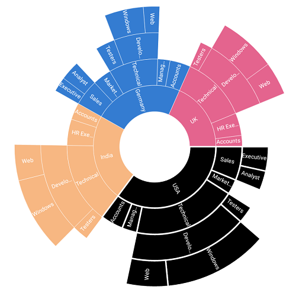
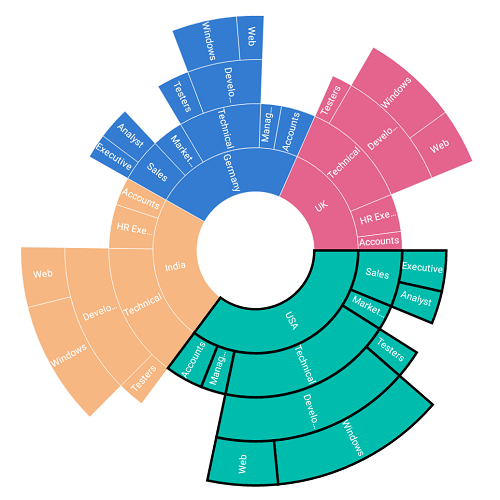

# Selection

The sunburst chart provides support to select or highlight the segments. Selection can be enabled with the help of [`EnableSelection`](https://help.syncfusion.com/cr/xamarin-ios/Syncfusion.SfSunburstChart.iOS.SelectionSettings.html#Syncfusion_SfSunburstChart_iOS_SelectionSettings_EnableSelection) property.

## Selection type

The [`SelectionType`](https://help.syncfusion.com/cr/xamarin-ios/Syncfusion.SfSunburstChart.iOS.SelectionSettings.html#Syncfusion_SfSunburstChart_iOS_SelectionSettings_SelectionType) property allows you to select a segment based on the following categories:

* Child: Highlights the selected segment along with its children in all levels.
* Group: Highlights the entire group of the selected segment in a hierarchy.
* Parent: Highlights the parent of the selected segment in the hierarchy.
* Single: Highlights the selected segment alone.

### Child

The following code shows the `Child` selection type.

 

 

  sunburstChart.SelectionSettings.EnableSelection = true;
  sunburstChart.SelectionSettings.Opacity = 0.5;
  sunburstChart.SelectionSettings.SelectionType = SelectionType.Child;            



 

### Group

The following code shows the `Group` selection type.

 

 

  sunburstChart.SelectionSettings.EnableSelection = true;
  sunburstChart.SelectionSettings.Opacity = 0.5;
  sunburstChart.SelectionSettings.SelectionType = SelectionType.Group;            



 

### Parent

The following code shows the `Parent` selection type.

 

 

  sunburstChart.SelectionSettings.EnableSelection = true;
  sunburstChart.SelectionSettings.Opacity = 0.5;
  sunburstChart.SelectionSettings.SelectionType = SelectionType.Parent;            



 

### Single

The following code shows the `Single` selection type.

 

 

  sunburstChart.SelectionSettings.EnableSelection = true;
  sunburstChart.SelectionSettings.Opacity = 0.5;
  sunburstChart.SelectionSettings.SelectionType = SelectionType.Single;



 

## Selection display mode

The [`SelectionDisplayMode`](https://help.syncfusion.com/cr/xamarin-ios/Syncfusion.SfSunburstChart.iOS.SelectionSettings.html#Syncfusion_SfSunburstChart_iOS_SelectionSettings_SelectionDisplayMode) provides the following selection options to highlight the segments:

* By stroke
* By Color
* By opacity

### Opacity

This mode highlights the selected segment with the opacity specified in the [`Opacity`](https://help.syncfusion.com/cr/xamarin-ios/Syncfusion.SfSunburstChart.iOS.SelectionSettings.html#Syncfusion_SfSunburstChart_iOS_SelectionSettings_Opacity) property.

 

 

  sunburstChart.SelectionSettings.EnableSelection = true;
  sunburstChart.SelectionSettings.Opacity = 0.5;           
  sunburstChart.SelectionSettings.SelectionType = SelectionType.Group;
  sunburstChart.SelectionSettings.SelectionDisplayMode = SelectionDisplayMode.HighlightByOpacity;



 

### Color

This mode highlights the selected segment using the brush specified in the [`SelectionBrush`](https://help.syncfusion.com/cr/xamarin-ios/Syncfusion.SfSunburstChart.iOS.SelectionSettings.html#Syncfusion_SfSunburstChart_iOS_SelectionSettings_SelectionBrush) property.



 

  sunburstChart.SelectionSettings.EnableSelection = true;  
  sunburstChart.SelectionSettings.SelectionDisplayMode = SelectionDisplayMode.HighlightByColor;          
  sunburstChart.SelectionSettings.SelectionBrush = UIColor.Black;
  sunburstChart.SelectionSettings.SelectionType = SelectionType.Group;          



 

### Stroke

This mode highlights the selected segment by applying stroke to it. The color and thickness of the stroke can be customized using the [`SelectionStrokeBrush`](https://help.syncfusion.com/cr/xamarin-ios/Syncfusion.SfSunburstChart.iOS.SelectionSettings.html#Syncfusion_SfSunburstChart_iOS_SelectionSettings_SelectionStrokeBrush) and [`SelectionStrokeWidth`](https://help.syncfusion.com/cr/xamarin-ios/Syncfusion.SfSunburstChart.iOS.SelectionSettings.html#Syncfusion_SfSunburstChart_iOS_SelectionSettings_SelectionStrokeWidth) properties.



 

  sunburstChart.SelectionSettings.EnableSelection = true;
  sunburstChart.SelectionSettings.SelectionDisplayMode = SelectionDisplayMode.HighlightByStroke;           
  sunburstChart.SelectionSettings.SelectionBrush = UIColor.Black;
  sunburstChart.SelectionSettings.SelectionType = SelectionType.Group;          



 

## Events

### Selection Changed

This event occurs whenever you select the segment. You can get the [`SelectedSegment`](https://help.syncfusion.com/cr/xamarin-ios/Syncfusion.SfSunburstChart.iOS.SunburstSelectionChangedEventArgs.html#Syncfusion_SfSunburstChart_iOS_SunburstSelectionChangedEventArgs_SelectedSegment) and [`IsSelected`](https://help.syncfusion.com/cr/xamarin-ios/Syncfusion.SfSunburstChart.iOS.SunburstSelectionChangedEventArgs.html#Syncfusion_SfSunburstChart_iOS_SunburstSelectionChangedEventArgs_IsSelected) properties details as argument from [`SunburstSelectionChangedEventArgs`](https://help.syncfusion.com/cr/xamarin-ios/Syncfusion.SfSunburstChart.iOS.SunburstSelectionChangedEventArgs.html) handler.

 



  sunburstChart.SelectionSettings.EnableSelection = true;
  sunburstChart.SelectionSettings.SelectionDisplayMode = SelectionDisplayMode.HighlightByStroke;
  sunburstChart.SelectionSettings.SelectionType = SelectionType.Single;

  sunburstChart.SelectionChanged += SunburstChart_SelectionChanged; 

  private void SunburstChart_SelectionChanged(object sender, SunburstSelectionChangedEventArgs e)
  {
     if (e.SelectedSegment != null)
        e.SelectedSegment.Color = UIColor.Green;          
  }



 

