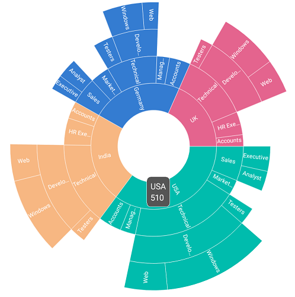

# Tooltip

Tooltip provides additional information about the segments in the sunburst chart. Tooltip is displayed by tapping the segment. By default, tooltip displays the corresponding segment’s category and value. To enable the tooltip, set the [`ShowTooltip`](https://help.syncfusion.com/cr/cref_files/xamarin-ios/Syncfusion.SfSunburstChart.iOS~Syncfusion.SfSunburstChart.iOS.SunburstTooltipSettings~ShowTooltip.html) property to true.

The following code shows enabling the tooltip.

 

 

        sunburstChart.TooltipSettings.ShowTooltip = true;



 

## Customization

The appearance of the tooltip can be customized using the following properties:

* [`BackgroundColor`](https://help.syncfusion.com/cr/cref_files/xamarin-ios/Syncfusion.SfSunburstChart.iOS~Syncfusion.SfSunburstChart.iOS.SunburstTooltipSettings~BackgroundColor.html) : Customizes the background color of the tooltip.
* [`BorderColor`](https://help.syncfusion.com/cr/cref_files/xamarin-ios/Syncfusion.SfSunburstChart.iOS~Syncfusion.SfSunburstChart.iOS.SunburstTooltipSettings~BorderColor.html) : Customizes the border color of the tooltip.
* [`BorderWidth`](https://help.syncfusion.com/cr/cref_files/xamarin-ios/Syncfusion.SfSunburstChart.iOS~Syncfusion.SfSunburstChart.iOS.SunburstTooltipSettings~BorderWidth.html) : Customizes the border width of the tooltip.
* [`Duration`](https://help.syncfusion.com/cr/cref_files/xamarin-ios/Syncfusion.SfSunburstChart.iOS~Syncfusion.SfSunburstChart.iOS.SunburstTooltipSettings~Duration.html) : Specifies the duration of the tooltip to be displayed.

The following properties are available under [`LabelStyle`](https://help.syncfusion.com/cr/cref_files/xamarin-ios/Syncfusion.SfSunburstChart.iOS~Syncfusion.SfSunburstChart.iOS.SunburstTooltipSettings~LabelStyle.html).

* [`Color`](https://help.syncfusion.com/cr/cref_files/xamarin-ios/Syncfusion.SfSunburstChart.iOS~Syncfusion.SfSunburstChart.iOS.SunburstChartLabelStyle~Color.html) : Customizes the text color of the tooltip.
* [`Font`](https://help.syncfusion.com/cr/cref_files/xamarin-ios/Syncfusion.SfSunburstChart.iOS~Syncfusion.SfSunburstChart.iOS.SunburstChartLabelStyle~Font.html) : Customizes the font of the tooltip text.

The following code shows all the above customizations.

 



            sunburstChart.TooltipSettings.ShowTooltip = true;
            sunburstChart.TooltipSettings.LabelStyle.Font = UIFont.FromName("Arial", 14);           
            sunburstChart.TooltipSettings.LabelStyle.Color = UIColor.White;
            sunburstChart.TooltipSettings.BackgroundColor = UIColor.Green;
            sunburstChart.TooltipSettings.BorderColor = UIColor.Black;
            sunburstChart.TooltipSettings.BorderWidth = 1;
            sunburstChart.TooltipSettings.Duration = 5;      



 

## Custom template

The sunburst chart provides options to design your template for tooltip by inheriting [`SunburstTooltipSettings`](https://help.syncfusion.com/cr/cref_files/xamarin-ios/Syncfusion.SfSunburstChart.iOS~Syncfusion.SfSunburstChart.iOS.SunburstTooltipSettings.html) class.

 

 

            CustomTooltip customTooltip = new CustomTooltip(this.View.Frame);
            sunburstChart.TooltipSettings = customTooltip;
            sunburstChart.TooltipSettings.ShowTooltip = true;         
           

    public class CustomTooltip : SunburstTooltipSettings
    {
        private CGRect frame;        

        public CustomTooltip(CGRect frame)
        {
            this.frame = frame;
        }

        public override UIView GetView(SunburstSegment segment)
        {
            UIView custom = new UIView();
            custom.BackgroundColor = UIColor.Black;         

            UILabel label = new UILabel();         
            label.Font = UIFont.FromName("Helvetica", 12f);
            label.Text = "Category : " + segment.Category;

            var labelSize = label.SystemLayoutSizeFittingSize(new CGSize(frame.Width, frame.Height));
            label.Frame = new CGRect(10, 5, labelSize.Width + 10, labelSize.Height + 5);
            label.TextColor = UIColor.White;            

            UILabel label1 = new UILabel();          
            label1.TextColor = UIColor.White;
            label1.Font = UIFont.FromName("Helvetica", 12f);
            label1.Text = "Value : " + segment.Value;
            var label1Size = label1.SystemLayoutSizeFittingSize(new CGSize(frame.Width, frame.Height));
            label1.Frame = new CGRect(10, labelSize.Height + 10, label1Size.Width + 10, label1Size.Height + 5);

            var width = labelSize.Width > label1Size.Width ? labelSize.Width : label1Size.Width;
            var height =  labelSize.Height + label1Size.Height;

            custom.Frame = new CGRect(0, 0, width + 20, height + 20);

            custom.AddSubview(label);
            custom.AddSubview(label1);

            return custom;           
        }
    }



 

