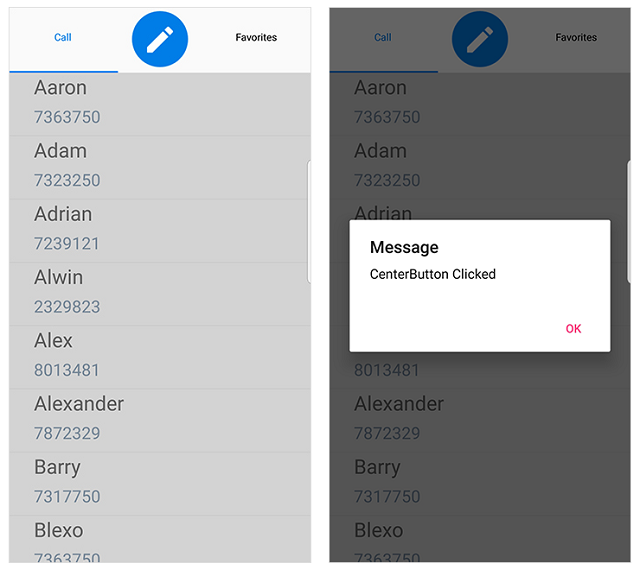

# CenterButtonSettings

This section explains on how to create and customize The Xamarin.Android SfTabView CenterButton. To enable CenterButton we need to set the `OverFlowMode` of Xamarin.Android SfTabView as `CenterButton`.





public partial class ViewController : UIViewController
{
    SfTabView tabView;

    public override void ViewDidLoad()
    {
        base.ViewDidLoad();
        tabView = new SfTabView();
        tabView.Frame = new CGRect(0, 0, View.Frame.Width, View.Frame.Height);
        tabView.OverflowMode = OverflowMode.CenterButton;
        View.AddSubview(tabView);
    }
}





## Customize CenterButtonSettings

We can customize the CenterButton by using the properties of `CenterButtonSetting`. Following are the some properties that are used to customize the view of CenterButton `BackgroundColor`, `BorderColor`, `BorderThickness`, `Height`, `Title`, `TitleFontColor`, `TitleFontSize`, `TitleFontStyle`, `Width`.





public override void ViewDidLoad()
{
    base.ViewDidLoad();
    var centerButton = tabView.CenterButtonSettings;
    centerButton.Title = "Center button";
    centerButton.TitleFontColor = UIColor.Green;
    centerButton.TitleFontSize = 15;
    centerButton.Height = 50;
    centerButton.Width = 100;
}





## CenterButtonTapped Event

When we tap the `CenterButton` an event `CenterButtonTapped` will be raised. Using this event we can able to set alert message.





public override void ViewDidLoad()
{
    base.ViewDidLoad();
    tabView.CenterButtonTapped += TabView_CenterButtonTapped;
}

void TabView_CenterButtonTapped(object sender, EventArgs e)
{
    var okAlertController = UIAlertController.Create("Center Button", "Center Button Clicked", UIAlertControllerStyle.Alert);
    okAlertController.AddAction(UIAlertAction.Create("OK", UIAlertActionStyle.Default, null));
    PresentViewController(okAlertController, true, null);
}





## Custom CenterButton

When built-in view is not needed, It can be overridden by adding custom views to the CenterButtonView. The CenterButton view can be customized by adding Image, Label, Button inside the CenterButtonView. Please refer the following code snippet to customize the CenterButton view.





public partial class ViewController : UIViewController
{
    SfTabView tabView;
    UIImageView imageView;
    UIImage image;

    public override void ViewDidLoad()
    {
        base.ViewDidLoad();
        tabView = new SfTabView();
        tabView.Frame = new CGRect(0, 0, View.Frame.Width, View.Frame.Height);
        imageView = new UIImageView();
        image = new UIImage();
        image = UIImage.FromFile("Compose.png");
        imageView.Frame = new CGRect(0, 0, 100, 60);
        imageView.Image = image;
        tabView.CenterButtonView = imageView;
        imageView.UserInteractionEnabled = true;
        UITapGestureRecognizer gesture = new UITapGestureRecognizer(Tab);
        gesture.NumberOfTouchesRequired = 1;
        imageView.AddGestureRecognizer(gesture);
        View.AddSubview(tabView);
    }

    void Tab()
    {
        var okAlertController = UIAlertController.Create("Center Button", "Center Button Clicked", UIAlertControllerStyle.Alert);
        okAlertController.AddAction(UIAlertAction.Create("OK", UIAlertActionStyle.Default, null));
        PresentViewController(okAlertController, true, null);
    }
}





Please find the sample from this [link](http://www.syncfusion.com/downloads/support/directtrac/general/ze/TabView_CenterBttonCustomization-1051697862.zip)

