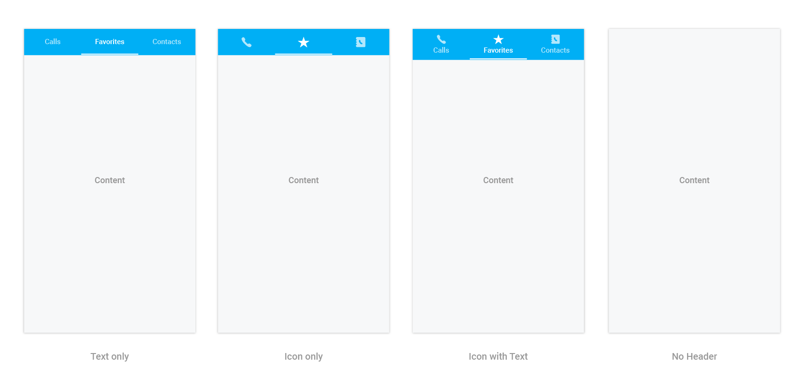

# Display Type

Tab view will display the title of each tab item by default. It can be changed to any of the below type.

* Text only.
* Image only.
* Image with text.
* No header.

It can be changed by settings the `DisplayMode` property of `SfTabView`.





tabView.DisplayMode = TabDisplayMode.ImageWithText;





`No header` can be used when header is not needed for the tab view control, so content space will be occupied in the entire available height.

N> Image appearance in the header can be achieved through font icons.

## How to change the selection color for text and font icons?

Selected index can be differentiated by setting `SelectionColor` property of `SfTabItem`.





var tabViewItem = new SfTabItem()
			{
				Title = "Calls",
				TitleFontColor = Color.Green,
			}
			




Further customizations of header are discussed in the below sections.

* How to customize text appearance of the header title?
* How to set and customize font icons appearance in the header?
* Setting font file for font icons.

## How to customize text appearance of the header title?





var tabViewItem = new SfTabItem()
			{
				Title = "Calls",
				Content = allContactsGrid,
				TitleFontColor = Color.Red,
				
			}
			




## How to set and customize font icons appearance in the header?

Add the font file into your application by following the below steps.

**Adding font file for iOS**

* Add the font file with Build Action: `BundleResource`, and
* Update the `Info.plist` file (Fonts provided by application, or UIAppFonts, key).

**Setting font file for font icons**





var tabViewItem = new SfTabItem
		{
			Title = "Calls",
			Content = allContactsGrid,
			IconFont = "a", // setting value for font icons as mentioned in *.ttf.
			FontIconFontColor = Color.LightBlue,
			FontIconFont = UIFont.FromName("TabIcons", 20);
		};

			



