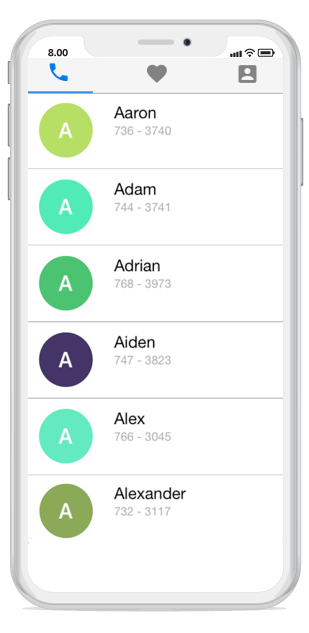

# Getting Started

This section provides a quick overview for working with the tab view control for Xamarin.iOS. Walk through the entire process of creating a real-world application with tab view.

# Assembly deployment

After installing Essential Studio for Xamarin, find all the required assemblies in the installation folders,   
{Syncfusion Essential Studio Installed location}\Essential Studio\16.1.0.24\Xamarin\lib
Eg: C:\Program Files (x86)\Syncfusion\Essential Studio\16.1.0.24\Xamarin\lib

N> Assemblies can be found in unzipped package location in Mac.

## Tab View for Xamarin.iOS

The following list of assemblies should be added as reference from the lib folder to use the tab view.

<table>
<tr>
<th>Project</th>
<th>Required assemblies</th>
</tr>
<tr>
<td>Xamarin.iOS</td>
<td>pcl\Syncfusion.SfTabView.iOS.dll</td>
</tr>
</table>

### Create a simple tab view

This section explains how to create a tab view and configure it. This is how the final output will look like in iOS devices.

# Creating the project

Create a new BlankApp (iOS) application in Xamarin Studio or Visual Studio.

# Adding SfTabView in Xamarin.iOS

Add the required assembly reference to the project as discussed in the Assembly deployment section.

Import the control namespace as





using Syncfusion.iOS.TabView;





Set the tab view control as sub view in the `ViewDidLoad` method on the inherited class of UIViewController.





		private SfTabView tabView;
        public override void ViewDidLoad()
        {
            base.ViewDidLoad();
            tabView = new SfTabView();
            tabView.Frame = new CGRect(0, 0, View.Frame.Width, View.Frame.Height);
            View.AddSubview(tabView);
        }
		




# Adding Tab items

Tab items can be configured in tab view through the Items property of `SfTabView`, where it holds collection of `SfTabItem` through `TabItemsCollection`





            var tabItems = new TabItemCollection
            {
                new SfTabItem()
                {
                    Title = "Calls",
                    Content = allContactsUIView
                },
                new SfTabItem()
                {
                    Title = "Favorites",
                    Content = favoritesUIView
                },
                new SfTabItem()
                {
                    Title = "Contacts",
                    Content = contactsUIView
                }
            };

            tabView.Items = tabItems;
            





## Share the header space equally

In order to share the header space equally for the , we can set the number of tabs which can be distributed in the available space though `VisibleHeaderCount` of SfTabView.





tabView.VisibleHeaderCount = 3;





That’s it, tab view control is ready. Now we can add the required controls for our application.  Here we are adding a `ListView` in the content region.

## Adding List view in the tab view

## Preparing data

Create a view model class with ContactsInfo collection property, initialized with required number of data objects.



public class ContactInfo
{
	public string Name { get; set; }
	public long Number { get; set; }
}

public class ContactsViewModel
{
	private ObservableCollection<ContactInfo> contactList;

	public ObservableCollection<ContactInfo> ContactList
	{
		get { return contactList; }
		set { contactList = value; }
	}
	public ContactsViewModel()
	{
		ContactList = new ObservableCollection<ContactInfo>();
		ContactList.Add(new ContactInfo{Name = "Aaron",Number = 7363750});
		ContactList.Add(new ContactInfo { Name = "Adam", Number = 7323250 });
		ContactList.Add(new ContactInfo { Name = "Adrian", Number = 7239121 });
		ContactList.Add(new ContactInfo { Name = "Alwin", Number = 2329823 });
		ContactList.Add(new ContactInfo { Name = "Alex", Number = 8013481 });
		ContactList.Add(new ContactInfo { Name = "Alexander", Number = 7872329 });
		ContactList.Add(new ContactInfo { Name = "Barry", Number = 7317750 });
	}
}



## Binding data to table view

Create a `UITableView` and set the data source from ContactList. Also, appearance of each cell can be customized by `GetCell` method of `UITableViewSource`. Similarly, content region for other tabs can be configured in the same way.

## Swiping

Both vertical swiping for the list view and horizontal swiping for the tab view will works by default. If it is not required it can be customized by `EnableSwiping` property of `SfTabView`.
