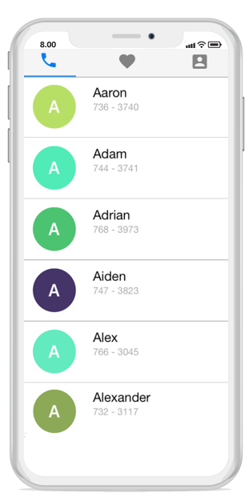

# Overview

The tab view control is available in Xamarin.Forms, Xamarin.Android, and Xamarin.iOS. It helps you to create the customizable features that are used to explore and switch among the different views. The key features of tab view control in Xamarin.Forms, Xamarin.Android, and Xamarin.iOS are follows.

## Key Features

* Tab header type with text, font icons, and no header.  
* Scrollable content and header.
* Top and bottom placements of header.
* Layout option for overflow tabs.

N> Currently, tab view control for Xamarin.Forms(UWP) is not available.

