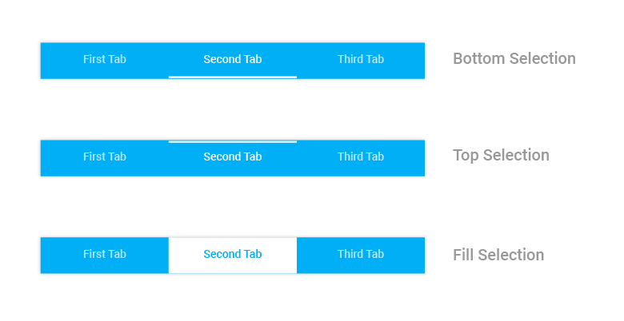

# Selection Indicator strip

Selection indicator strip can be used to indicate the selected index of the tab view control. It can be customized with the built in APIs available in `SelectionIndicatorSettings` of `SfTabView`.

Selection indicator can be positioned below the title or above the title or else it can be filled in the entire selected header space.





		var selectionIndicatorSettings = new SelectionIndicatorSettings();
		selectionIndicatorSettings.Color = Color.Yellow;
		selectionIndicatorSettings.Position = SelectionIndicatorPosition.Top;
		selectionIndicatorSettings.StrokeThickness = 10;

		tabView.SelectionIndicatorSettings = selectionIndicatorSettings;

			




N> Stroke thickness is not applicable when selection indicator’s position is set as Fill.

