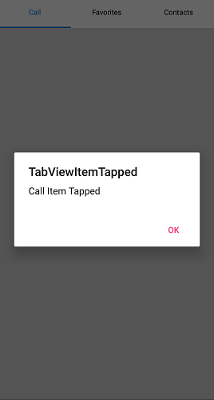

# TabItemTapped

Whenever the TapIem is tapped, the `TapItemTapped` event will occur. Using this event, you can Modify the selected Tab Item properties.





SfTabView tabView;
UIView callsTabItem;
UIView favoritesTabItem;
UIView contactsTabItem;

public override void ViewDidLoad()
{
    base.ViewDidLoad();
    callsTabItem = new UIView();
    callsTabItem.Frame = new CGRect(5, 30, this.View.Frame.Width - 10, this.View.Frame.Height - 40);
    callsTabItem.BackgroundColor = UIColor.LightGray;
    favoritesTabItem = new UIView();
    favoritesTabItem.Frame = new CGRect(5, 30, this.View.Frame.Width - 10, this.View.Frame.Height - 40);
    favoritesTabItem.BackgroundColor = UIColor.Green;
    contactsTabItem = new UIView();
    contactsTabItem.Frame = new CGRect(5, 30, this.View.Frame.Width - 10, this.View.Frame.Height - 40);
    contactsTabItem.BackgroundColor = UIColor.Orange;
    tabView = new SfTabView();
    tabView.VisibleHeaderCount = 2;
    tabView.Frame = new CGRect(5, 30, this.View.Frame.Width - 10, this.View.Frame.Height - 40);
    tabView.Items = new TabItemCollection
    {
        new SfTabItem(){Title="Call",Content=callsTabItem},
        new SfTabItem(){Title="Favorite", Content=favoritesTabItem},
        new SfTabItem(){Title="Contacts", Content=contactsTabItem},
    };
    tabView.TabItemTapped += TabView_TabItemTapped;
    this.View.Add(tabView);
}

void TabView_TabItemTapped(object sender, TabItemTappedEventArgs e)
{
    var okAlertController = UIAlertController.Create("TabViewItem Tapped", e.TabItem.Title + " Item Tapped", UIAlertControllerStyle.Alert);
    okAlertController.AddAction(UIAlertAction.Create("OK", UIAlertActionStyle.Default, null));
    PresentViewController(okAlertController, true, null);
}





