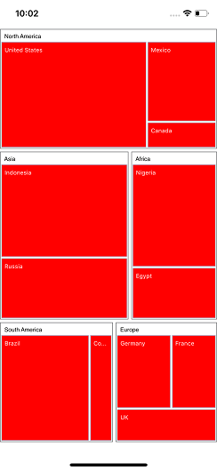
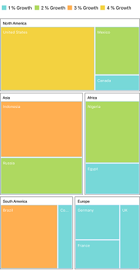
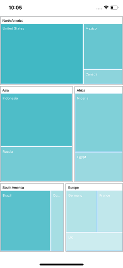
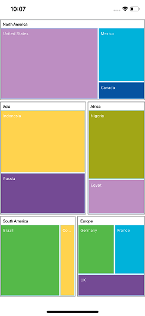
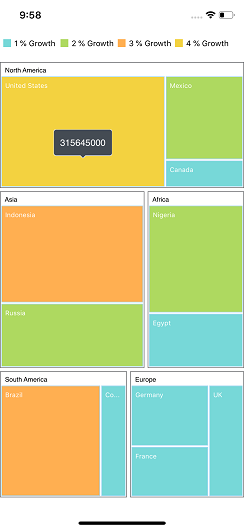
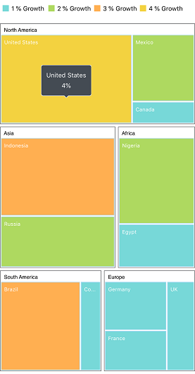
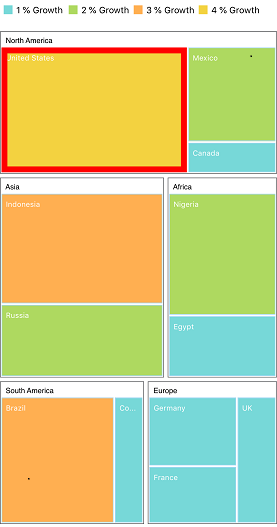

# Customization

The TreeMap control supports color customization to determine the exact combination of colors for the tree nodes displayed and provides tooltip support to display additional information of TreeMap data.

## Color

You can customize the colors of leaf nodes using the [`ColorMapping`](https://help.syncfusion.com/cr/xamarin-ios/Syncfusion.SfTreeMap.iOS.SFColorMapping.html) support.

The [`ColorMapping`](https://help.syncfusion.com/cr/xamarin-ios/Syncfusion.SfTreeMap.iOS.SFColorMapping.html) is categorized into the following three different types:

* UniColorMapping
* RangeColorMapping
* DesaturationColorMapping

### UniColorMapping

You can color all the leaf nodes with the same color by setting a value to the [`Color`](https://help.syncfusion.com/cr/xamarin-ios/Syncfusion.SfTreeMap.iOS.SFUniColorMapping.html#Syncfusion_SfTreeMap_iOS_SFUniColorMapping_Color) property of [`UniColorMapping`](https://help.syncfusion.com/cr/xamarin-ios/Syncfusion.SfTreeMap.iOS.SFUniColorMapping.html).

  

 

  SFUniColorMapping uniColorMapping = new SFUniColorMapping();
            uniColorMapping.Color = UIColor.Red;
            treeMap.LeafItemColorMapping = uniColorMapping;



  

### RangeColorMapping

You can group the leaf nodes based on the range of color values of data. You can set a unique color for every range. To achieve this, specify the [`To`](https://help.syncfusion.com/cr/xamarin-ios/Syncfusion.SfTreeMap.iOS.SFRange.html#Syncfusion_SfTreeMap_iOS_SFRange_To) and [`From`](https://help.syncfusion.com/cr/xamarin-ios/Syncfusion.SfTreeMap.iOS.SFRange.html#Syncfusion_SfTreeMap_iOS_SFRange_From) values as range bound and specify the [`Color`](https://help.syncfusion.com/cr/xamarin-ios/Syncfusion.SfTreeMap.iOS.SFRange.html#Syncfusion_SfTreeMap_iOS_SFRange_Color) value to fill the leaf nodes of a particular range using the [`RangeColorMapping`](https://help.syncfusion.com/cr/xamarin-ios/Syncfusion.SfTreeMap.iOS.SFRangeColorMapping.html) property of TreeMap. You must specify value to ColorValuePath since the ranges `From` and `To` depend on the under bound value of [`ColorValuePath`](https://help.syncfusion.com/cr/xamarin-ios/Syncfusion.SfTreeMap.iOS.SFTreeMap.html#Syncfusion_SfTreeMap_iOS_SFTreeMap_ColorValuePath).

  



            SFRangeColorMapping colorMapping = new SFRangeColorMapping();

            SFRange range1 = new SFRange();
            range1.LegendLabel = (NSString)"1 % Growth";
            range1.From = 0;
            range1.To = 1;
            range1.Color = UIColor.FromRGB(119, 216, 216);

            SFRange range2 = new SFRange();
            range2.LegendLabel = (NSString)"2 % Growth";
            range2.From = 0;
            range2.To = 2;
            range2.Color = UIColor.FromRGB(174, 217, 96);

            SFRange range3 = new SFRange();
            range3.LegendLabel = (NSString)"3 % Growth";
            range3.From = 0;
            range3.To = 3;
            range3.Color = UIColor.FromRGB(255, 175, 81);

            SFRange range4 = new SFRange();
            range4.LegendLabel = (NSString)"4 % Growth";
            range4.From = 0;
            range4.To = 4;
            range4.Color = UIColor.FromRGB(243, 210, 64);

            colorMapping.Ranges.Add(range1);
            colorMapping.Ranges.Add(range2);
            colorMapping.Ranges.Add(range3);
            colorMapping.Ranges.Add(range4);

            treeMap.LeafItemColorMapping = colorMapping;



  

### DesaturationColorMapping

You can differentiate all the leaf nodes using the [`DesaturationColorMapping`](https://help.syncfusion.com/cr/xamarin-ios/Syncfusion.SfTreeMap.iOS.SFDesaturationColorMapping.html) property of TreeMap. Differentiation can be achieved even when the same color is applied for all the leaf nodes by varying the opacity of the leaf nodes based on the [`Color`](https://help.syncfusion.com/cr/xamarin-ios/Syncfusion.SfTreeMap.iOS.SFDesaturationColorMapping.html#Syncfusion_SfTreeMap_iOS_SFDesaturationColorMapping_Color) value specified. You can also change the opacity range by setting the [`From`](https://help.syncfusion.com/cr/xamarin-ios/Syncfusion.SfTreeMap.iOS.SFDesaturationColorMapping.html#Syncfusion_SfTreeMap_iOS_SFDesaturationColorMapping_From)) and [`To`](https://help.syncfusion.com/cr/xamarin-ios/Syncfusion.SfTreeMap.iOS.SFDesaturationColorMapping.html#Syncfusion_SfTreeMap_iOS_SFDesaturationColorMapping_To) properties of `DesaturationColorMapping`.

  



            SFDesaturationColorMapping desaturationColorMapping = new SFDesaturationColorMapping();
            desaturationColorMapping.From = 1;
            desaturationColorMapping.To = 0.2f;
            desaturationColorMapping.Color = UIColor.FromRGB(65, 184, 196);
            treeMap.LeafItemColorMapping = desaturationColorMapping;



  

### Palette color mapping

Leaf nodes were colored based on the colors mentioned in the [`Colors`](https://help.syncfusion.com/cr/xamarin-ios/Syncfusion.SfTreeMap.iOS.SFPaletteColorMapping.html#Syncfusion_SfTreeMap_iOS_SFPaletteColorMapping_Colors) collection of the [`PaletteColorMapping`](https://help.syncfusion.com/cr/xamarin-ios/Syncfusion.SfTreeMap.iOS.SFPaletteColorMapping.html). 

  



            SFPaletteColorMapping paletteColorMapping = new SFPaletteColorMapping();
            paletteColorMapping.Colors.Add(UIColor.FromRGB(189, 142, 194));
            paletteColorMapping.Colors.Add(UIColor.FromRGB(255, 211, 78));
            paletteColorMapping.Colors.Add(UIColor.FromRGB(85, 185, 73));
            paletteColorMapping.Colors.Add(UIColor.FromRGB(0, 178, 218));
            paletteColorMapping.Colors.Add(UIColor.FromRGB(116, 74, 148));
            paletteColorMapping.Colors.Add(UIColor.FromRGB(161, 166, 22));
            paletteColorMapping.Colors.Add(UIColor.FromRGB(7, 83, 161));
            treeMap.LeafItemColorMapping = paletteColorMapping;



 

## Tooltip

You can enable the tooltip support for TreeMap by setting the [`ShowTooltip`](https://help.syncfusion.com/cr/xamarin-ios/Syncfusion.SfTreeMap.iOS.SFTreeMap.html#Syncfusion_SfTreeMap_iOS_SFTreeMap_ShowTooltip) property to true. By default, it takes the property of bound object referenced in [`GroupPath`](https://help.syncfusion.com/cr/xamarin-ios/Syncfusion.SfTreeMap.iOS.SFTreeMapFlatLevel.html#Syncfusion_SfTreeMap_iOS_SFTreeMapFlatLevel_GroupPath) and displays its content when the corresponding node is tapped.

  



           treeMap.ShowTooltip = true;



 

### Tooltip customization

Tooltip can be customized by inheriting `TooltipSetting`. Tooltip defines our own customized view.

 

 

 treeMap.ShowTooltip = true;
            CustomTooltipSetting tooltipSetting = new CustomTooltipSetting();
            treeMap.TooltipSettings = tooltipSetting;



  

Refer to the following code snippet for defining custom tooltip.

 

 

  public class CustomTooltipSetting : TooltipSetting
    {
        public CustomTooltipSetting()
        {

        }
        public override UIView GetView(object shapeData)
        {
            NSArray array = (NSArray)shapeData;
            NSDictionary dic = new NSDictionary();

            for (nuint i = 0; i < array.Count; i++)
            {
                dic = array.GetItem<NSDictionary>(i);
            }
            UIView view = new UIView();
            NSString topText = (NSString)(dic["Region"]);
            NSString bottomText = (NSString)(dic["Growth"].ToString() + "%");

            UILabel topLabel = new UILabel();
            topLabel.Text = topText;
            topLabel.Font = UIFont.SystemFontOfSize(12);
            topLabel.TextColor = UIColor.White;
            topLabel.TextAlignment = UITextAlignment.Center;

            UILabel bottomLabel = new UILabel();
            bottomLabel.Text = bottomText;
            bottomLabel.Font = UIFont.SystemFontOfSize(12);
            bottomLabel.TextColor = UIColor.White;
            bottomLabel.TextAlignment = UITextAlignment.Center;

            view.AddSubview(topLabel);
            view.AddSubview(bottomLabel);

            CGSize expectedLabelSize1 = topText.GetSizeUsingAttributes(new UIStringAttributes() { Font = topLabel.Font });
            CGSize expectedLabelSize2 = bottomText.GetSizeUsingAttributes(new UIStringAttributes() { Font = bottomLabel.Font });

            view.Frame = new CGRect(0.0f, 0.0f, Math.Max(expectedLabelSize1.Width, expectedLabelSize2.Width), 35.0f);
            topLabel.Frame = new CGRect(0.0f, 0.0f, Math.Max(expectedLabelSize1.Width, expectedLabelSize2.Width), 15.0f);
            bottomLabel.Frame = new CGRect(0.0f, 20.0f, Math.Max(expectedLabelSize1.Width, expectedLabelSize2.Width), 15.0f);

            return view;
        }
    }



  

## Selection

The TreeMap control provides selection support, which allows you to select the tree map items. The selection can be enabled by setting the [`HightlightOnSelection`](https://help.syncfusion.com/cr/xamarin-ios/Syncfusion.SfTreeMap.iOS.SFTreeMap.html#Syncfusion_SfTreeMap_iOS_SFTreeMap_HightlightOnSelection) property to true in TreeMap. You can specify the highlight color and border width using the [`HighlightColor`](https://help.syncfusion.com/cr/xamarin-ios/Syncfusion.SfTreeMap.iOS.SFTreeMap.html#Syncfusion_SfTreeMap_iOS_SFTreeMap_HighlightColor) and [`HighlightBorderWidth`](https://help.syncfusion.com/cr/xamarin-ios/Syncfusion.SfTreeMap.iOS.SFTreeMap.html#Syncfusion_SfTreeMap_iOS_SFTreeMap_HighlightBorderWidth) properties, respectively.

  

 

  treeMap.HightlightOnSelection = true;
            treeMap.HighlightColor = UIColor.Red;
            treeMap.HighlightBorderWidth = 8;



  

