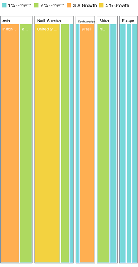
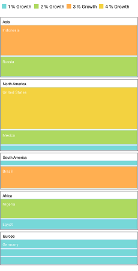

# Layout

You can decide the visual representation of nodes belonging to all the TreeMap levels using the [`LayoutType`](https://help.syncfusion.com/cr/cref_files/xamarin-ios/Syncfusion.SfTreeMap.iOS~Syncfusion.SfTreeMap.iOS.SFTreeMap~LayoutType.html) property of TreeMap.

The following four different types of layout are available in TreeMap:

* Squarified
* SliceAndDiceAuto
* SliceAndDiceHorizontal
* SliceAndDiceVertical

## Squarified

The **Squarified** layout creates rectangles with best aspect ratio.

  

 
      
    treeMap.LayoutType = SFTreeMapLayoutType.SFTreeMapLayoutTypeSquarified;



  

## SliceAndDiceAuto

The **SliceAndDiceAuto** layout creates rectangles with high aspect ratio and displays them sorted both horizontally and vertically.

 

 

   treeMap.LayoutType = SFTreeMapLayoutType.SFTreeMapLayoutTypeSliceAndDiceAuto;



  

## SliceAndDiceHorizontal

The **SliceAndDiceHorizontal** layout creates rectangles with high aspect ratio and displays them sorted horizontally.

  

 

       treeMap.LayoutType = SFTreeMapLayoutType.SFTreeMapLayoutTypeSliceAndDiceHorizontal;



  

## SliceAndDiceVertical

The **SliceAndDiceVertical** layout creates rectangles with high aspect ratio and displays them sorted vertically.

  

 

      treeMap.LayoutType = SFTreeMapLayoutType.SFTreeMapLayoutTypeSliceAndDiceVertical;



  

The following code is the complete code for squarified layout type.

  

 

            SFTreeMap treeMap = new SFTreeMap();
          
            treeMap.WeightValuePath = (NSString)"Population";
            treeMap.ColorValuePath = (NSString)"Growth";
            treeMap.LayoutType = SFTreeMapLayoutType.SFTreeMapLayoutTypeSquarified;

            SFTreeMapFlatLevel flatLevel = new SFTreeMapFlatLevel();
            flatLevel.GroupBorderColor = UIColor.Gray;
            flatLevel.GroupBorderWidth = 1;
            flatLevel.GroupBackground = UIColor.White;
            flatLevel.HeaderHeight = 20;
            flatLevel.GroupPath = (NSString)"Continent";
            flatLevel.GroupGap = 5;
            flatLevel.HeaderStyle = new SFStyle() { Color = UIColor.Black };
            flatLevel.ShowHeader = true;
            treeMap.Levels.Add(flatLevel);

            SFLeafItemSetting leafItemSetting = new SFLeafItemSetting();
            leafItemSetting.Gap = 2;
            leafItemSetting.LabelPath = (NSString)"Region";
            leafItemSetting.BorderColor = UIColor.FromRGB(169, 217, 247);
            leafItemSetting.ShowLabels = true;
            treeMap.LeafItemSettings = leafItemSetting;

            SFRangeColorMapping colorMapping = new SFRangeColorMapping();

            SFRange range1 = new SFRange();
            range1.LegendLabel = (NSString)"1 % Growth";
            range1.From = 0;
            range1.To = 1;
            range1.Color = UIColor.FromRGB(119, 216, 216);

            SFRange range2 = new SFRange();
            range2.LegendLabel = (NSString)"2 % Growth";
            range2.From = 0;
            range2.To = 2;
            range2.Color = UIColor.FromRGB(174, 217, 96);

            SFRange range3 = new SFRange();
            range3.LegendLabel = (NSString)"3 % Growth";
            range3.From = 0;
            range3.To = 3;
            range3.Color = UIColor.FromRGB(255, 175, 81);

            SFRange range4 = new SFRange();
            range4.LegendLabel = (NSString)"4 % Growth";
            range4.From = 0;
            range4.To = 4;
            range4.Color = UIColor.FromRGB(243, 210, 64);

            colorMapping.Ranges.Add(range1);
            colorMapping.Ranges.Add(range2);
            colorMapping.Ranges.Add(range3);
            colorMapping.Ranges.Add(range4);

            treeMap.LeafItemColorMapping = colorMapping;

            SFLegendSetting legendSetting = new SFLegendSetting();
            legendSetting.ShowLegend = true;
            legendSetting.Size = new CoreGraphics.CGSize(500, 45);
            treeMap.LegendSettings = legendSetting;

            GetPopulationData();
            treeMap.DataSource = PopulationDetails;
            treeMap.ShowTooltip = true;
            treeMap.Frame = new CoreGraphics.CGRect(View.Frame.Left, View.Frame.Top + 50, View.Frame.Width, View.Frame.Height - 100);

            this.View.Add(treeMap);

    


  
