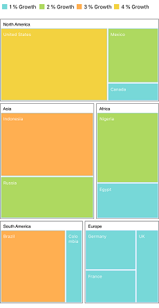
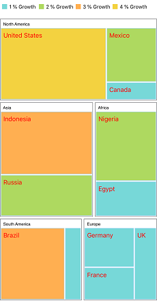

# TreeMap Elements

The TreeMap contains the following elements:

* Legends
* Headers
* Labels

## Legend

You can set the color value of leaf nodes using the [`LegendSettings`](https://help.syncfusion.com/cr/cref_files/xamarin-ios/Syncfusion.SfTreeMap.iOS~Syncfusion.SfTreeMap.iOS.SFTreeMap~LegendSettings.html) property. This legend is appropriate only for the tree map whose leaf nodes are colored using [`RangeColorMapping`](https://help.syncfusion.com/cr/cref_files/xamarin-ios/Syncfusion.SfTreeMap.iOS~Syncfusion.SfTreeMap.iOS.SFRangeColorMapping.html).

The visibility of legend can be enabled by setting the [`ShowLegend`](https://help.syncfusion.com/cr/cref_files/xamarin-ios/Syncfusion.SfTreeMap.iOS~Syncfusion.SfTreeMap.iOS.SFLegendSetting~ShowLegend.html) property to true.

### TreeMap legends

You can set the size of legend icons by setting the [`IconSize`](https://help.syncfusion.com/cr/cref_files/xamarin-ios/Syncfusion.SfTreeMap.iOS~Syncfusion.SfTreeMap.iOS.SFLegendSetting~ShowLegend.html) property of `LegendSettings` in TreeMap.

### Labels for legends

You can customize the labels of the legend items using the [`LegendLabel`](https://help.syncfusion.com/cr/cref_files/xamarin-ios/Syncfusion.SfTreeMap.iOS~Syncfusion.SfTreeMap.iOS.SFRange~LegendLabel.html) property of [`RangeColorMapping`](https://help.syncfusion.com/cr/cref_files/xamarin-ios/Syncfusion.SfTreeMap.iOS~Syncfusion.SfTreeMap.iOS.SFRangeColorMapping.html). 





    SFLegendSetting legendSetting = new SFLegendSetting();
            legendSetting.ShowLegend = true;
            legendSetting.Size = new CoreGraphics.CGSize(500, 45);
            treeMap.LegendSettings = legendSetting;



 

## Header

You can set headers for each level by setting the [`ShowHeader`](https://help.syncfusion.com/cr/cref_files/xamarin-ios/Syncfusion.SfTreeMap.iOS~Syncfusion.SfTreeMap.iOS.SFTreeMapLevel~ShowHeader.html) property of each **TreeMap** level. The [`HeaderHeight`](https://help.syncfusion.com/cr/cref_files/xamarin-ios/Syncfusion.SfTreeMap.iOS~Syncfusion.SfTreeMap.iOS.SFTreeMapLevel~HeaderHeight.html) property helps you set the height of header, and the [`GroupPath`](https://help.syncfusion.com/cr/cref_files/xamarin-ios/Syncfusion.SfTreeMap.iOS~Syncfusion.SfTreeMap.iOS.SFTreeMapFlatLevel~GroupPath.html) value determines the header value. 





 SFTreeMapFlatLevel flatLevel = new SFTreeMapFlatLevel();
            flatLevel.GroupBorderColor = UIColor.Gray;
            flatLevel.GroupBorderWidth = 1;
            flatLevel.GroupBackground = UIColor.White;
            flatLevel.HeaderHeight = 20;
            flatLevel.GroupPath = (NSString)"Continent";
            flatLevel.GroupGap = 5;
            flatLevel.HeaderStyle = new SFStyle() { Color = UIColor.Black };
            flatLevel.ShowHeader = true;
            treeMap.Levels.Add(flatLevel);

 

 

## Data labels

The [`ShowLabels`](https://help.syncfusion.com/cr/cref_files/xamarin-ios/Syncfusion.SfTreeMap.iOS~Syncfusion.SfTreeMap.iOS.SFLeafItemSetting~ShowLabels.html) property is used to enable or disable the labels in leaf nodes. The [`LabelPath`](https://help.syncfusion.com/cr/cref_files/xamarin-ios/Syncfusion.SfTreeMap.iOS~Syncfusion.SfTreeMap.iOS.SFLeafItemSetting~LabelPath.html) property allows you to set values to labels.





            SFLeafItemSetting leafItemSetting = new SFLeafItemSetting();
            leafItemSetting.Gap = 2;
            leafItemSetting.LabelPath = (NSString)"Region";
            leafItemSetting.BorderColor = UIColor.FromRGB(169, 217, 247);
            leafItemSetting.ShowLabels = true;
            treeMap.LeafItemSettings = leafItemSetting;
 


 

### Avoid overlap in data labels

The [`OverflowMode`](https://help.syncfusion.com/cr/cref_files/xamarin-ios/Syncfusion.SfTreeMap.iOS~Syncfusion.SfTreeMap.iOS.SFLeafItemSetting~OverflowMode.html)) property aligns data labels within leaf node boundaries using the `Trim`, `Wrap`, and `Hide` options. The default value of the `OverflowMode` property is Trim.

#### Trim

You can trim the data labels inside the leaf node boundaries using the `Trim` option.





   leafItemSetting.OverflowMode = LabelOverflowMode.Trim;
 




#### Wrap

You can wrap the data labels inside the leaf node boundaries using the `Wrap` option.





    leafItemSetting.OverflowMode = LabelOverflowMode.Wrap;
 




#### Hide

You can hide the data labels inside the leaf node boundaries using the `Hide` option. 





  leafItemSetting.OverflowMode = LabelOverflowMode.Hide;
 




### Customize data labels

You can customize the data labels using the [`LabelStyle`](https://help.syncfusion.com/cr/cref_files/xamarin-ios/Syncfusion.SfTreeMap.iOS~Syncfusion.SfTreeMap.iOS.SFLeafItemSetting~LabelStyle.html) property of LeafItemSettings. The text color and font can be customized using the [`Color`](https://help.syncfusion.com/cr/cref_files/xamarin-ios/Syncfusion.SfTreeMap.iOS~Syncfusion.SfTreeMap.iOS.SFStyle~Color.html) and [`Font`](https://help.syncfusion.com/cr/cref_files/xamarin-ios/Syncfusion.SfTreeMap.iOS~Syncfusion.SfTreeMap.iOS.SFStyle~Font.html) properties respectively.





          leafItemSetting.LabelStyle = new SFStyle() { Color = UIColor.Red, Font = UIFont.SystemFontOfSize(15) };
 




