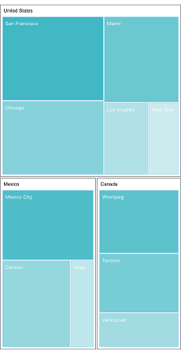

# TreeMap Levels

The levels of TreeMap can be categorized into the following two types:

* Flat level
* Hierarchical level

## Flat level

### GroupPath

You can use the [`GroupPath`](https://help.syncfusion.com/cr/xamarin-ios/Syncfusion.SfTreeMap.iOS.SFTreeMapFlatLevel.html#Syncfusion_SfTreeMap_iOS_SFTreeMapFlatLevel_GroupPath) property for every flat level in the TreeMap control. It is a path to a field on the source object that serves as “Group” for the level specified. You can group the data based on the [`GroupPath`](https://help.syncfusion.com/cr/xamarin-ios/Syncfusion.SfTreeMap.iOS.SFTreeMapFlatLevel.html#Syncfusion_SfTreeMap_iOS_SFTreeMapFlatLevel_GroupPath) property. When [`GroupPath`](https://help.syncfusion.com/cr/xamarin-ios/Syncfusion.SfTreeMap.iOS.SFTreeMapFlatLevel.html#Syncfusion_SfTreeMap_iOS_SFTreeMapFlatLevel_GroupPath) is not specified, the items will not be grouped, and the data will be displayed in the order specified in [`DataSource`](https://help.syncfusion.com/cr/xamarin-ios/Syncfusion.SfTreeMap.iOS.SFTreeMap.html#Syncfusion_SfTreeMap_iOS_SFTreeMap_DataSource).

### GroupGap

You can use the [`GroupGap`](https://help.syncfusion.com/cr/xamarin-ios/Syncfusion.SfTreeMap.iOS.SFTreeMapFlatLevel.html#Syncfusion_SfTreeMap_iOS_SFTreeMapFlatLevel_GroupGap) property to separate items from every flat level and differentiate the levels mentioned in the TreeMap control.

The following code snippet explains the tree map flat level.

  

  

  SFTreeMap treeMap = new SFTreeMap();
         
            treeMap.WeightValuePath = (NSString)"Population";
            treeMap.ColorValuePath = (NSString)"Growth";
            treeMap.LayoutType = SFTreeMapLayoutType.SFTreeMapLayoutTypeSquarified;

            SFTreeMapFlatLevel flatLevel = new SFTreeMapFlatLevel();
            flatLevel.GroupBorderColor = UIColor.Gray;
            flatLevel.GroupBorderWidth = 1;
            flatLevel.GroupBackground = UIColor.White;
            flatLevel.HeaderHeight = 20;
            flatLevel.GroupPath = (NSString)"Continent";
            flatLevel.GroupGap = 5;
            flatLevel.HeaderStyle = new SFStyle() { Color = UIColor.Black };
            flatLevel.ShowHeader = true;
            treeMap.Levels.Add(flatLevel);

            SFLeafItemSetting leafItemSetting = new SFLeafItemSetting();
            leafItemSetting.Gap = 2;
            leafItemSetting.LabelPath = (NSString)"Region";
            leafItemSetting.BorderColor = UIColor.FromRGB(169, 217, 247);
            leafItemSetting.ShowLabels = true;
            leafItemSetting.OverflowMode = LabelOverflowMode.Trim;
            treeMap.LeafItemSettings = leafItemSetting;

            SFRangeColorMapping colorMapping = new SFRangeColorMapping();

            SFRange range1 = new SFRange();
            range1.LegendLabel = (NSString)"1 % Growth";
            range1.From = 0;
            range1.To = 1;
            range1.Color = UIColor.FromRGB(119, 216, 216);

            SFRange range2 = new SFRange();
            range2.LegendLabel = (NSString)"2 % Growth";
            range2.From = 0;
            range2.To = 2;
            range2.Color = UIColor.FromRGB(174, 217, 96);

            SFRange range3 = new SFRange();
            range3.LegendLabel = (NSString)"3 % Growth";
            range3.From = 0;
            range3.To = 3;
            range3.Color = UIColor.FromRGB(255, 175, 81);

            SFRange range4 = new SFRange();
            range4.LegendLabel = (NSString)"4 % Growth";
            range4.From = 0;
            range4.To = 4;
            range4.Color = UIColor.FromRGB(243, 210, 64);

            colorMapping.Ranges.Add(range1);
            colorMapping.Ranges.Add(range2);
            colorMapping.Ranges.Add(range3);
            colorMapping.Ranges.Add(range4);

            treeMap.LeafItemColorMapping = colorMapping;

            SFLegendSetting legendSetting = new SFLegendSetting();
            legendSetting.ShowLegend = true;
            legendSetting.Size = new CoreGraphics.CGSize(500, 45);
            treeMap.LegendSettings = legendSetting;

            GetPopulationData();
            treeMap.DataSource = PopulationDetails;
            treeMap.ShowTooltip = true;
            treeMap.Frame = new CoreGraphics.CGRect(View.Frame.Left, View.Frame.Top + 50, View.Frame.Width, View.Frame.Height - 100);

            this.View.Add(treeMap);



  

## Hierarchical level

Hierarchical level is used to define levels for hierarchical data collection that contains tree-structured data. The following code snippet explains the hierarchical data.

  

  

 SFTreeMap treeMap = new SFTreeMap();
            treeMap.WeightValuePath = (NSString)"Sales";

            SFLeafItemSetting leafItemSetting = new SFLeafItemSetting();
            leafItemSetting.Gap = 2;
            leafItemSetting.LabelPath = (NSString)"Name";
            leafItemSetting.BorderColor = UIColor.FromRGB(169, 217, 247);
            leafItemSetting.ShowLabels = true;
            treeMap.LeafItemSettings = leafItemSetting;

            SFTreeMapHierarchicalLevel level = new SFTreeMapHierarchicalLevel()
            {
                ChildPadding = 4,
                HeaderStyle = new SFStyle() { Color = UIColor.Black },
                ShowHeader = true,
                HeaderHeight = 20,
                HeaderPath = (NSString)"Name",
                ChildPath = (NSString)"RegionalSales"
            };

            treeMap.Levels.Add(level);

            SFDesaturationColorMapping colorMapping = new SFDesaturationColorMapping();
            colorMapping.Color = UIColor.FromRGB(0x41, 0xB8, 0xC4);
            colorMapping.From = 1;
            colorMapping.To = 0.2f;
            treeMap.ColorValuePath = (NSString)"Expense";
            treeMap.LeafItemColorMapping = colorMapping;

            GetPopulationData();
            treeMap.DataSource = PopulationDetails;
            treeMap.ShowTooltip = true;

            treeMap.Frame = new CoreGraphics.CGRect(View.Frame.Left, View.Frame.Top + 50, View.Frame.Width, View.Frame.Height - 100);// this.View.Frame;

            this.View.Add(treeMap);
  


  

The following code snippet demonstrates the underlying hierarchical data model.

  

 

        public NSMutableArray PopulationDetails
        {
            get;
            set;
        }

        void GetPopulationData()
        {
            NSMutableArray array = new NSMutableArray();

            NSMutableArray regional1 = new NSMutableArray();
            regional1.Add(getDictionary("United States", "New York", 2353, 2000));
            regional1.Add(getDictionary("United States", "Los Angeles", 3453, 3000));
            regional1.Add(getDictionary("United States", "San Francisco", 8456, 8000));
            regional1.Add(getDictionary("United States", "Chicago", 6785, 7000));
            regional1.Add(getDictionary("United States", "Miami", 7045, 6000));

            NSMutableArray regional2 = new NSMutableArray();
            regional2.Add(getDictionary("Canada", "Toronto", 7045, 7000));
            regional2.Add(getDictionary("Canada", "Vancouver", 4352, 4000));
            regional2.Add(getDictionary("Canada", "Winnipeg", 7843, 7500));

            NSMutableArray regional3 = new NSMutableArray();
            regional3.Add(getDictionary("Mexico", "Mexico City", 7843, 6500));
            regional3.Add(getDictionary("Mexico", "Cancun", 6683, 6000));
            regional3.Add(getDictionary("Mexico", "Acapulco", 2454, 2000));

            array.Add(getDictionary1("United States", 98456, 87000, regional1));
            array.Add(getDictionary1("Canada", 43523, 40000, regional2));
            array.Add(getDictionary1("Mexico", 45634, 46000, regional3));
            PopulationDetails = array;

        }

        NSDictionary getDictionary1(string name, double expense, double sales, NSMutableArray regionalSales)
        {

            object[] objects = new object[4];
            object[] keys = new object[4];
            keys.SetValue("Name", 0);
            keys.SetValue("Expense", 1);
            keys.SetValue("Sales", 2);
            keys.SetValue("RegionalSales", 3);
            objects.SetValue((NSString)name, 0);
            objects.SetValue(expense, 1);
            objects.SetValue(sales, 2);
            objects.SetValue(regionalSales, 3);
            return NSDictionary.FromObjectsAndKeys(objects, keys);
        }

        NSDictionary getDictionary(string country, string name, double expense, double sales)
        {

            object[] objects = new object[4];
            object[] keys = new object[4];
            keys.SetValue("Country", 0);
            keys.SetValue("Name", 1);
            keys.SetValue("Expense", 2);
            keys.SetValue("Sales", 3);
            objects.SetValue((NSString)country, 0);
            objects.SetValue((NSString)name, 1);
            objects.SetValue(expense, 2);
            objects.SetValue(sales, 3);
            return NSDictionary.FromObjectsAndKeys(objects, keys);
        }



  

