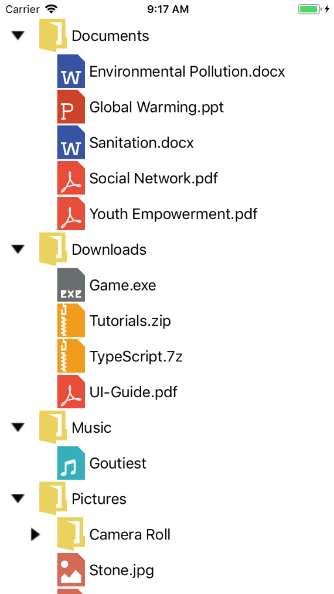
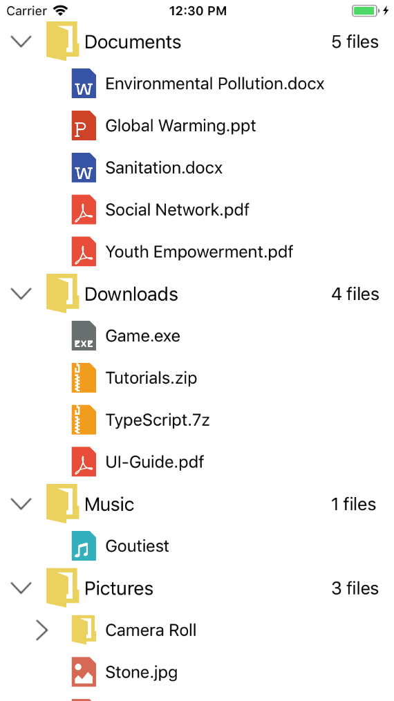
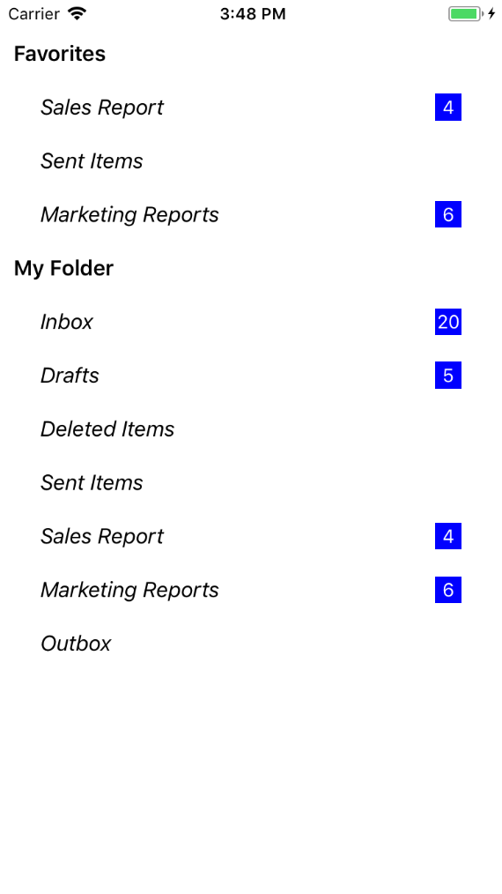

# Appearance

The TreeView allows customizing appearance of the underlying data, and provides different functionalities to the end-user.

## Adapter

An Adapter can be used to present the data in a way that makes sense for the application by using different controls.

The TreeView allows you to customize the appearance of content view and expander view by setting the [Adapter](https://help.syncfusion.com/cr/cref_files/xamarin-ios/Syncfusion.SfTreeView.iOS~Syncfusion.iOS.TreeView.SfTreeView~Adapter.html) property.You can customize the content view and expander view by overriding the `CreateContentView`, `CreateExpanderView` methods and update its content in the `UpdateContentView` and `UpdateExpanderView` methods of `TreeViewAdapter`.
                                      


protected override void OnCreate(Bundle savedInstanceState)
{
    SfTreeView treeView = new SfTreeView();
    treeView.Adapter = new CustomAdapter();
}



### Creating custom Adapter

Creating a custom adapter class derived from `TreeViewAdapter`.



// Adapter extension class
public class NodeImageAdapter : TreeViewAdapter
{
    public NodeImageAdapter()
    {
    }

    protected override UIView CreateContentView(TreeViewItemInfoBase itemInfo)
    {
        var gridView = new NodeImageView();
        return gridView;
    }

    protected override void UpdateContentView(UIView view, TreeViewItemInfoBase itemInfo)
    {
        var grid = view as NodeImageView;
        var treeViewNode = itemInfo.Node;
        if (grid != null)
        {
            var imageView = grid.Subviews[0] as UIImageView;
            if (imageView != null)
                imageView.Image = (treeViewNode.Content as NodeImageModel).ImageIcon;
            var label1 = grid.Subviews[1] as UILabel;
            if (label1 != null)
                label1.Text = (treeViewNode.Content as NodeImageModel).FileName;
        }
    }

    protected override UIView CreateExpanderView(TreeViewItemInfoBase itemInfo)
    {
        var expanderImage = new UIImageView();
        return expanderImage;
    }

    protected override void UpdateExpanderView(UIView view, TreeViewItemInfoBase itemInfo)
    {
        var imageView = view as UIImageView;
        var node = itemInfo.Node;
        if (imageView != null)
            if (node.HasChildNodes)
                imageView.Image = node.IsExpanded ? UIImage.FromBundle("Images/expand.png") : UIImage.FromBundle("Images/collapse.png");
    }
}



To create custom view to use in adapter, refer this [link](https://help.syncfusion.com/xamarin-ios/sftreeview/getting-started#creating-custom-view-for-adapter).
You can also download the entire source code of this demo from [here](http://www.syncfusion.com/downloads/support/directtrac/general/ze/CustomAdapter-863616830)

## Indentation

The TreeView allows customizing the indent spacing of items by setting the [Indentation](https://help.syncfusion.com/cr/xamarin-ios/Syncfusion.SfTreeView.iOS~Syncfusion.iOS.TreeView.SfTreeView~Indentation.html) property. The default value of this property is `40`. This property can be customized at runtime.



SfTreeView treeView = new SfTreeView();
treeView.Indentation = 40; 



## ItemHeight

The TreeView allows customizing the height of items by setting the [ItemHeight](https://help.syncfusion.com/cr/xamarin-ios/Syncfusion.SfTreeView.iOS~Syncfusion.iOS.TreeView.SfTreeView~ItemHeight.html) property. The default value of this property is `40`. This property can be customized at runtime.



SfTreeView treeView = new SfTreeView();
treeView.ItemHeight = 40; 



## ExpanderWidth

The TreeView allows customizing the width of expander view by setting the [ExpanderWidth](https://help.syncfusion.com/cr/xamarin-ios/Syncfusion.SfTreeView.iOS~Syncfusion.iOS.TreeView.SfTreeView~ExpanderWidth.html) property. The default value of this property is `40`. This property can be customized at runtime.



SfTreeView treeView = new SfTreeView();
treeView.ExpanderWidth = 40; 



## Level based Customization

### Level based views

The TreeView allows you to customize the content view and expander view with different views by using `CreateContentView` and `CreateExpanderView` override methods based on specific constraints.

Following example illustrates you to load different content views based on the node level.



// Adapter extension class
public class NodeImageAdapter : TreeViewAdapter
{
    public NodeImageAdapter()
    {
    }

    protected override UIView CreateContentView(TreeViewItemInfoBase itemInfo)
    {
        if (itemInfo.Node.Level == 0)
        {
            var gridView = new NodeImageView();
            return gridView;
        }
        else
        {
            var gridView = new NodeImageView1();
            return gridView;
        }
    }
       
    protected override void UpdateContentView(UIView view, TreeViewItemInfoBase itemInfo)
    {
        var treeViewNode = itemInfo.Node;
        var grid = view as NodeImageView;
        if (grid != null)
        {
            var imageView = grid.Subviews[0] as UIImageView;
            if (imageView != null)
                imageView.Image = (treeViewNode.Content as FileManager).ImageIcon;

            var label1 = grid.Subviews[1] as UILabel;
            if (label1 != null)
                label1.Text = (treeViewNode.Content as FileManager).FileName;
            var label2 = grid.SubViews[2] as UILabel;
            if (label2 != null)
                label2.Text = treeViewNode.HasChildNodes ? treeViewNode.ChildNodes.Count.ToString()+" files" : "No files";
        }
        else
        {
            var grid1 = view as NodeImageView1;
            if (grid1 != null)
            {
                var imageView = grid1.Subviews[0] as UIImageView;
                if (imageView != null)
                    imageView.Image = (treeViewNode.Content as FileManager).ImageIcon;
                
                var label1 = grid1.Subviews[1] as UILabel;
                if (label1 != null)
                    label1.Text = (treeViewNode.Content as FileManager).FileName;
            }
        }
    }
}






// Custom views
public class NodeImageView : UIView
{
    UILabel label1;
    UIImageView imageIcon;
    UILabel label2;

    public NodeImageView()
    {
        label1 = new UILabel();
        label2 = new UILabel();
        label1.Font = UIFont.SystemFontOfSize(18);
        imageIcon = new UIImageView();
        imageIcon.ClipsToBounds = true;
        this.AddSubview(imageIcon);
        this.AddSubview(label1);
        this.AddSubview(label2);
    }

    public override void LayoutSubviews()
    {
        base.LayoutSubviews();
        var imageWidth = 40;
        var labelWidth = 60;
        this.imageIcon.Frame = new CGRect(0, 0, imageWidth, this.Frame.Height);
        this.label1.Frame = new CGRect(imageWidth, 0, this.Frame.Width-imageWidth-labelWidth, this.Frame.Height);
        this.label2.Frame = new CGRect(this.Frame.Width - labelWidth, 0, labelWidth, this.Frame.Height);
    }

    protected override void Dispose(bool disposing)
    {
        base.Dispose(disposing);
    }
}




public class NodeImageView1 : UIView
{
    UILabel label1;
    UIImageView imageIcon;

    public NodeImageView1()
    {
        label1 = new UILabel();
        label1.Font = UIFont.SystemFontOfSize(16);
        imageIcon = new UIImageView();
        imageIcon.LayoutMargins.InsetRect(new CGRect(5, 5, 5, 5));
        this.AddSubview(imageIcon);
        this.AddSubview(label1);
    }

    public override void LayoutSubviews()
    {
        base.LayoutSubviews();
        this.imageIcon.Frame = new CGRect(5, 5, 30, this.Frame.Height-10);
        this.label1.Frame = new CGRect(40, 0, this.Frame.Width, this.Frame.Height);
    }

    protected override void Dispose(bool disposing)
    {
        base.Dispose(disposing);
    }
}



You can also download the entire source code of this demo from [here](http://www.syncfusion.com/downloads/support/directtrac/general/ze/LevelBasedViews1230479197)

### Level based styling.

The TreeView allows you to customize the style of `TreeViewItem` based on different levels by customizing the adapter by using `UpdateContentView` and  `UpdateExpanderView` override methods.

 You can customize the content view and expander view by overriding the `CreateContentView`, `CreateExpanderView` methods and update its content in the `UpdateContentView` and `UpdateExpanderView` methods of `TreeViewAdapter`.



protected override void UpdateContentView(UIView view, TreeViewItemInfoBase itemInfo)
{
    var grid = view as TemplateView;
    var treeViewNode = itemInfo.Node;
    if (grid != null)
    {
        var label = grid.Subviews[0] as UILabel;
        if (label != null)
        {
            label.Text = (treeViewNode.Content as MailFolder).FolderName;
            if (treeViewNode.Level == 0)
            {
                label.Font = UIFont.BoldSystemFontOfSize(16);
            }
            else
                label.Font = UIFont.ItalicSystemFontOfSize(16);
        }

        var label1 = grid.Subviews[1] as UILabel;
        if (label1 != null)
        {
            if ((treeViewNode.Content as MailFolder).MailsCount > 0)
            {
                label1.Text = (treeViewNode.Content as MailFolder).MailsCount.ToString();
                label1.BackgroundColor = UIColor.Blue;
                label1.TextColor = UIColor.White;
                label1.TextAlignment = UITextAlignment.Center;
                label1.AdjustsFontSizeToFitWidth = true;
            }
        }
    }
}              



You can download the example for level based styling demo from [here](http://www.syncfusion.com/downloads/support/directtrac/general/ze/LevelBasedStyling-660740124).

