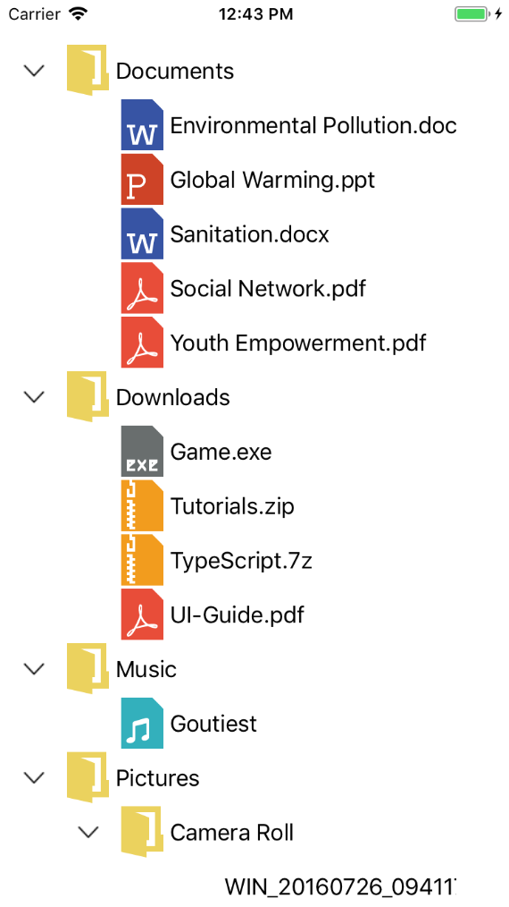

# Data Population with Xamarin.iOS TreeView (SfTreeView)

TreeView can be populated either with the data source by using a [ItemsSource](https://help.syncfusion.com/cr/xamarin-ios/Syncfusion.SfTreeView.iOS~Syncfusion.iOS.TreeView.SfTreeView~ItemsSource.html) property or by creating and adding the [TreeViewNode](https://help.syncfusion.com/cr/xamarin-ios/Syncfusion.SfTreeView.iOS~Syncfusion.TreeView.Engine.TreeViewNode.html) in hierarchical structure to [Nodes](https://help.syncfusion.com/cr/xamarin-ios/Syncfusion.SfTreeView.iOS~Syncfusion.iOS.TreeView.SfTreeView~Nodes.html) property.

## Populating Nodes by data binding - Bound Mode
[Nodes](https://help.syncfusion.com/cr/xamarin-ios/Syncfusion.SfTreeView.iOS~Syncfusion.iOS.TreeView.SfTreeView~Nodes.html) can be populated in bound mode includes following steps.

* [Create hierarchical data model](#create-data-model-for-treeview)
* [Bind data model to treeview](#bind-to-hierarchical-data)

To update the collection changes in UI, it is necessary to define the [NotificationSubscriptionMode](https://help.syncfusion.com/cr/cref_files/xamarin-ios/Syncfusion.SfTreeView.iOS~Syncfusion.iOS.TreeView.SfTreeView~NotificationSubscriptionMode.html) to treeview as the CollectionChanged/PropertyChanged. 
`NotificationSubscriptionMode` enum has the following members:
* CollectionChange: Updates its tree structure when the child items collection gets changed.
* PropertyChange: Updates its ChildItems when the associated collection property gets changed.
* None: It is a default mode and it does not reflect the collection/property changes in UI.

To decide how to populate the nodes, it is necessary to set this [NodePopulationMode](https://help.syncfusion.com/cr/cref_files/xamarin-ios/Syncfusion.SfTreeView.iOS~Syncfusion.iOS.TreeView.SfTreeView~NodePopulationMode.html) API to Treeview. 

The `NodePopulationMode` API has the following enum values:

* OnDemand: Populate the child nodes only when the parent nodes are expanded. It is the default value.
* Instant: Populates all the child nodes when the Treeview control is initially loaded.

### Create Data Model for treeview

Create a simple data source as shown in the following code example in a new class file, and save it as FileManager.cs file:



public class FileManager : INotifyPropertyChanged
{
   private string fileName;
   private UIImage imageIcon;
   private ObservableCollection<FileManager> subFiles;

   public ObservableCollection<FileManager> SubFiles
   {
       get
       {
            return subFiles;
       }

        set
       {
            subFiles = value;
            RaisedOnPropertyChanged("SubFiles");
       }
    }

    public string FileName
    {
        get
        {
            return fileName;
        }

        set
        {
            fileName = value;
            RaisedOnPropertyChanged("FileName");
        }
    }

    public UIImage ImageIcon
    {
        get
        {
            return imageIcon;
        }

        set
        {
            imageIcon = value;
            RaisedOnPropertyChanged("ImageIcon");
        }
    }

    public FileManager()
    {
    }

    public event PropertyChangedEventHandler PropertyChanged;

    public void RaisedOnPropertyChanged(string propertyName)
    {
        if (PropertyChanged != null)
        {
            PropertyChanged(this, new PropertyChangedEventArgs(propertyName));
        }
    }
}




N> If you want your data model to respond to property changes, then implement `INotifyPropertyChanged` interface in your model class.

Create a model repository class with ImageNodeInfo collection property initialized with required number of data objects in a new class file as shown in the following code example, and save it as FileManagerViewModel.cs file:



public class FileManagerViewModel
{
    public ObservableCollection<FileManager> Folders { get; set; }

    public FileManagerViewModel()
    {
        GenerateFiles();
    }

    private void GenerateFiles()
    {
        var doc = new FileManager() { FileName = "Documents", ImageIcon = UIImage.FromBundle("Images/treeview_folder.png") };
        var download = new FileManager() { FileName = "Downloads", ImageIcon = UIImage.FromBundle("Images/treeview_folder.png") };
        var mp3 = new FileManager() { FileName = "Music", ImageIcon = UIImage.FromBundle("Images/treeview_folder.png") };
        var pictures = new FileManager() { FileName = "Pictures", ImageIcon = UIImage.FromBundle("Images/treeview_folder.png") };
        var video = new FileManager() { FileName = "Videos", ImageIcon = UIImage.FromBundle("Images/treeview_folder.png") };

        var pollution = new FileManager() { FileName = "Environmental Pollution.docx", ImageIcon = UIImage.FromBundle("Images/treeview_word.png") };
        var globalWarming = new FileManager() { FileName = "Global Warming.ppt", ImageIcon = UIImage.FromBundle("Images/treeview_ppt.png") };
        var sanitation = new FileManager() { FileName = "Sanitation.docx", ImageIcon = UIImage.FromBundle("Images/treeview_word.png") };
        var socialNetwork = new FileManager() { FileName = "Social Network.pdf", ImageIcon = UIImage.FromBundle("Images/treeview_pdf.png") };
        var youthEmpower = new FileManager() { FileName = "Youth Empowerment.pdf", ImageIcon = UIImage.FromBundle("Images/treeview_pdf.png") };

        var game = new FileManager() { FileName = "Game.exe", ImageIcon = UIImage.FromBundle("Images/treeview_exe.png") };
        var tutorials = new FileManager() { FileName = "Tutorials.zip", ImageIcon = UIImage.FromBundle("Images/treeview_zip.png") };
        var typescript = new FileManager() { FileName = "TypeScript.7z", ImageIcon = UIImage.FromBundle("Images/treeview_zip.png") };
        var uiGuide = new FileManager() { FileName = "UI-Guide.pdf", ImageIcon = UIImage.FromBundle("Images/treeview_pdf.png") };

        var song = new FileManager() { FileName = "Goutiest", ImageIcon = UIImage.FromBundle("Images/treeview_mp3.png") };

        var camera = new FileManager() { FileName = "Camera Roll", ImageIcon = UIImage.FromBundle("Images/treeview_folder.png") };
        var stone = new FileManager() { FileName = "Stone.jpg", ImageIcon = UIImage.FromBundle("Images/treeview_png.png") };
        var wind = new FileManager() { FileName = "Wind.jpg", ImageIcon = UIImage.FromBundle("Images/treeview_png.png") };

        var img0 = new FileManager() { FileName = "WIN_20160726_094117.JPG", ImageIcon = UIImage.FromBundle("Images/treeview_img0.png") };
        var img1 = new FileManager() { FileName = "WIN_20160726_094118.JPG", ImageIcon = UIImage.FromBundle("Images/treeview_img1.png") };

        var video0 = new FileManager() { FileName = "Naturals.mp4", ImageIcon = UIImage.FromBundle("Images/treeview_video.png") };
        var video1 = new FileManager() { FileName = "Wild.mpg", ImageIcon = UIImage.FromBundle("Images/treeview_video.png") };

      doc.SubFiles = new ObservableCollection<FileManager>
      {
         pollution,
         globalWarming,
         sanitation,
         socialNetwork,
         youthEmpower
      };

      download.SubFiles = new ObservableCollection<FileManager>
      {
         game,
         tutorials,
         typescript,
         uiGuide
      };

      mp3.SubFiles = new ObservableCollection<FileManager>
      {
         song
      };

      pictures.SubFiles = new ObservableCollection<FileManager>
      {
         camera,
         stone,
         wind
      };
      
      camera.SubFiles = new ObservableCollection<FileManager>
      {
         img0,
         img1
      };

      video.SubFiles = new ObservableCollection<FileManager>
      {
         video0,
         video1
      };

      Folders = new ObservableCollection<FileManager>(); 

      Folders.Add(doc);
      Folders.Add(download);
      Folders.Add(mp3);
      Folders.Add(pictures);
      Folders.Add(video);
  }
}



### Bind to hierarchical data

To create a tree view using data binding, set a hierarchical data collection to the [ItemsSource](https://help.syncfusion.com/cr/xamarin-ios/Syncfusion.SfTreeView.iOS~Syncfusion.iOS.TreeView.SfTreeView~ItemsSource.html). And set the child object name to the [ChildPropertyName](https://help.syncfusion.com/cr/xamarin-ios/Syncfusion.SfTreeView.iOS~Syncfusion.iOS.TreeView.SfTreeView~ChildPropertyName.html) property.



using Syncfusion.iOS.TreeView;
using Syncfusion.TreeView.Engine;

public override void ViewDidLoad()
{
    base.ViewDidLoad();
    // Perform any additional setup after loading the view
    SfTreeView treeView = new SfTreeView(View.Bounds);
    FileManagerViewModel viewModel = new FileManagerViewModel();
    treeView.ChildPropertyName = "SubFiles";
    treeView.ItemsSource = viewModel.Folders;
    treeView.Adapter = new NodeImageAdapter();
    Add(treeView);
}



N> By defining the [Adapter](https://help.syncfusion.com/cr/xamarin-ios/Syncfusion.SfTreeView.iOS~Syncfusion.iOS.TreeView.SfTreeView~Adapter.html), a custom user interface(UI) can be achieved to display the data items for both expander and content view.

You can also download the entire source code of this demo from [here](http://www.syncfusion.com/downloads/support/directtrac/general/ze/GettingStartedBound1798588758).

## Populating Nodes without data binding - Unbound Mode

You can create and manage the [TreeViewNode](https://help.syncfusion.com/cr/xamarin-ios/Syncfusion.SfTreeView.iOS~Syncfusion.TreeView.Engine.TreeViewNode.html) objects by yourself to display the data in a hierarchical view. Create the node hierarchy by adding one or more root nodes to the [Nodes](https://help.syncfusion.com/cr/xamarin-ios/Syncfusion.SfTreeView.iOS~Syncfusion.iOS.TreeView.SfTreeView~Nodes.html) collection. Each `TreeViewNode` can then have more nodes added to its Children collection. You can nest tree view nodes to whatever depth you require.
 


using Syncfusion.iOS.TreeView;
using Syncfusion.TreeView.Engine;

public override void ViewDidLoad()
{
    base.ViewDidLoad();
    // Perform any additional setup after loading the view
    SfTreeView treeView = new SfTreeView(View.Bounds);

    var australia = new TreeViewNode() { Content = "Australia", IsExpanded = true };
    var _NSW = new TreeViewNode() { Content = "New South Wales" };
    _NSW.ChildNodes.Add(new TreeViewNode() { Content = "Sydney" });
    australia.ChildNodes.Add(_NSW);
          
    var usa = new TreeViewNode() { Content = "United States of America", IsExpanded = true };
    var newYork = new TreeViewNode() { Content = "New York" };
    var _California = new TreeViewNode() { Content = "California" };
    _California.ChildNodes.Add(new TreeViewNode() { Content = "San Francisco" });
    usa.ChildNodes.Add(newYork);
    usa.ChildNodes.Add(_California);
          
    treeView.Nodes.Add(australia);
    treeView.Nodes.Add(usa);

    Add(treeView);
}



Now, run the application to render the below output:

You can also download the entire source code of this demo from [here](http://www.syncfusion.com/downloads/support/directtrac/general/ze/GettingStartedUnbound2036228865).
