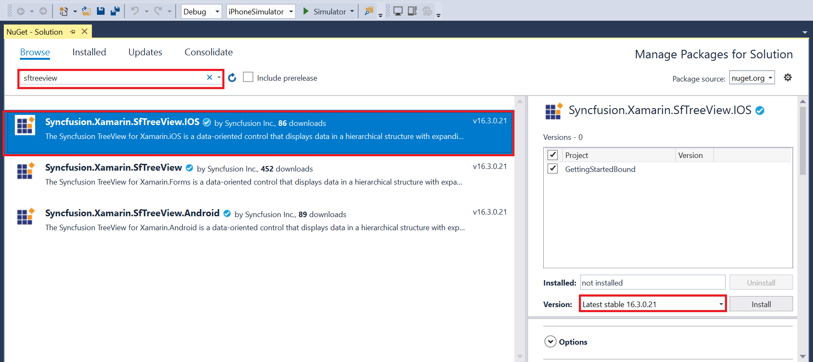
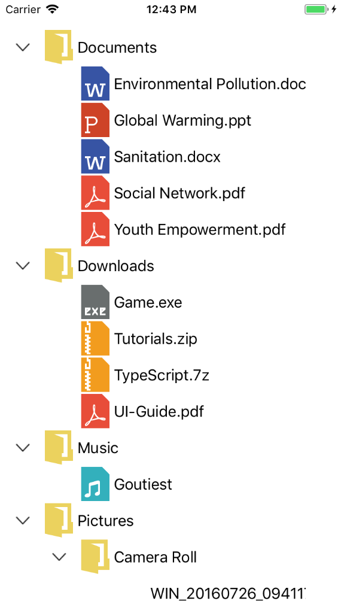
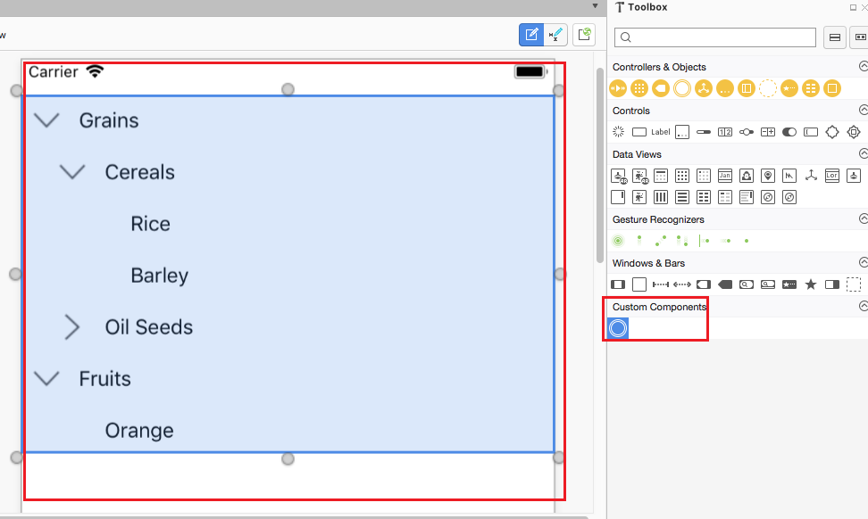
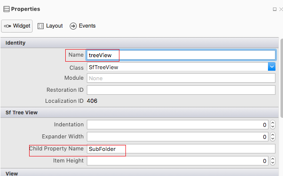

# Getting Started with Xamarin.iOS TreeView (SfTreeView)

This section provides a quick overview for working with the TreeView for Xamarin.iOS. Walk through the entire process of creating an app with TreeView.

## Assembly Deployment

After installing Essential Studio for Xamarin, you can find all the required assemblies in the {Syncfusion Essential Studio Installed location}\Essential Studio\{{ site.releaseversion }}\Xamarin\lib installation folder.

Eg: C:\Program Files (x86)\Syncfusion\Essential Studio\{{ site.releaseversion }}\Xamarin\lib

Refer [control dependencies](https://help.syncfusion.com/xamarin-ios/introduction/controldependencies#sftreeview) section to get the list of assemblies or NuGet package needs to be added as reference to use the TreeView control in any application.

N> Assemblies can be found in an unzipped package location in Mac.

## NuGet configuration

To install the required NuGet for the TreeView control in the application, configure the NuGet packages of the Syncfusion components.

Refer to the following KB to configure the NuGet packages of the Syncfusion components:

[How to configure package source and install Syncfusion NuGet packages in an existing project?](https://www.syncfusion.com/kb/7441/how-to-configure-package-source-and-install-syncfusion-nuget-packages-in-an-existing-project)

The following NuGet package should be installed to use the TreeView control in the application.

<table>
<tr>
<th> Project </th>
<th> Required package </th>
</tr>
<tr>
<td> Xamarin.iOS </td>
<td> Syncfusion.Xamarin.SfTreeView.iOS</td>
</tr>
</table>

### Adding TreeView Reference

Syncfusion Xamarin components are available in [nuget.org](https://www.nuget.org/). To add TreeView to your project, open the NuGet package manager in Visual Studio, and search for [Syncfusion.Xamarin.SfTreeView.iOS](https://www.nuget.org/packages/Syncfusion.Xamarin.SfTreeView.iOS/), and then install it. 

To know more about obtaining our components, refer to these links: [Mac](https://help.syncfusion.com/xamarin-ios/introduction/download-and-installation/mac) and [Windows](https://help.syncfusion.com/xamarin-ios/introduction/download-and-installation/windows). Also, if you prefer to manually refer the assemblies instead of NuGet, refer to this [link](https://help.syncfusion.com/xamarin-ios/introduction/control-dependencies#sftreeview) to know about the dependent assemblies for TreeView. 

 Also, if you prefer to manually refer the assemblies instead of NuGet, refer the list of assemblies mentioned in the table below.

<table>
<tr>
<th>Project</th>
<th>Required assemblies</th>
</tr>
<tr>
<td>Xamarin.iOS</td>
<td>Syncfusion.SfTreeView.iOS.dll Syncfusion.GridCommon.Portable.dll </td>
</tr>
</table>

I> Starting with v16.2.0.x, if you reference Syncfusion assemblies from trial setup or from the NuGet feed, you also must include a license key in your projects. Please refer to this [link](https://help.syncfusion.com/common/essential-studio/licensing/license-key) to know about registering Syncfusion license key in your Xamarin application to use our components.

## Create a tree view

This section explains how to create a TreeView and configure it. The TreeView control can be configured entirely in C# code or using story board. This is how the final output will look like on iOS devices.

You can download the entire source code of this demo for Xamarin.iOS from [here](http://www.syncfusion.com/downloads/support/directtrac/general/ze/GettingStartedBound1798588758). 

In this walk through, you will create a new application with the TreeView that includes the following topics:

* [Creating the project](#creating-the-project)
* [Adding TreeView in Xamarin.iOS using story board](#adding-treeview-in-xamarin.ios-using-story-board)     
* [Adding TreeView in Xamarin.iOS using C# code](#adding-treeview-in-xamarin.ios-using-c#-code)     
* [Populating Nodes without data source - Unbound Mode](#populating-nodes-without-data-source---unbound-mode) 
* [Creating Data Model](#creating-data-model)  
* [Bind to a hierarchical data source - Bound Mode](#bind-to-a-hierarchical-data-source---bound-mode)
* [Creating Hierarchical Data Model](#creating-hierarchical-data-model-for-the-tree-view)
* [Bind to a Hierarchy Property Descriptors data source - Bound Mode](#bind-to-a-hierarchy-Property-descriptors-data-source---bound-mode)
* [Defining a adapter to expander and content view](#defining-a-adapter-to-expander-and-content-view)
* [Interacting with a tree view](#interacting-with-a-treeview)
* [Selection](#selection)
 
## Creating the Project

Create a new iOS application in Xamarin Studio or Visual Studio for Xamarin.iOS.

## Adding TreeView in Xamarin.iOS using story board

1. Add a new story board inside the project.
2. Drag the TreeView control from toolbox and drop it into the story board. Preview for TreeView will be shown.
3. Open the properties window of TreeView and set the required properties.

### Setting the TreeView properties in story board

Set the identity name and required properties for TreeView in story board.




namespace GettingStartedBound
{
	public partial class MyViewController : UIViewController
	{
		ViewModel viewModel;
		public MyViewController() : base("MyViewController",null)
		{
		}
		public override void ViewDidLoad()
		{
 			base.ViewDidLoad();
 			// Perform any additional setup loading the view, typically from a nib.
 			FileManagerViewModel viewModel = new FileManagerViewModel();
            treeView.ChildPropertyName = "SubFiles";
            treeView.ItemsSource = viewModel.Folders;
            treeView.Adapter = new NodeImageAdapter();
		}
		public override void DidReceiveMemoryWarning()
		{
			base.DidReceiveMemoryWarning();
			// Release any cached data, images, etc that aren't in use.
		}
	}
}





You can download the entire source code of this sample [here](http://www.syncfusion.com/downloads/support/directtrac/general/ze/GettingStartedBound1798588758).

Refer to this link to know the properties that can be configured using story board for TreeView.

## Adding TreeView in Xamarin.iOS using C# code

To add the treeview to your application, follow the steps:

1. Add required assemblies as discussed in assembly deployment section.
2. Import the `SfTreeView` namespace Syncfusion.iOS.TreeView
3. Create an instance of tree view control.



using Syncfusion.iOS.TreeView;

public class UnboundUIViewController : UIViewController
{
    public UnboundUIViewController()
    {
    }

    public override void ViewDidLoad()
    {
        base.ViewDidLoad();
        SfTreeView treeView = new SfTreeView(View.Bounds);
        Add(treeView);
    }
}





public override bool FinishedLaunching(UIApplication application, NSDictionary launchOptions)
{
    // create a new window instance based on the screen size
    Window = new UIWindow(UIScreen.MainScreen.Bounds);
    Window.RootViewController = new UnboundUIViewController();

    // make the window visible
    Window.MakeKeyAndVisible();

    return true;
}



## Populating Nodes without data source - Unbound Mode

You can create and manage the [TreeViewNode](https://help.syncfusion.com/cr/xamarin-ios/Syncfusion.SfTreeView.iOS~Syncfusion.TreeView.Engine.TreeViewNode.html) objects by yourself to display the data in a hierarchical view. To create a tree view, you use a `TreeView` control and a hierarchy of `TreeViewNode` objects. You create the node hierarchy by adding one or more root nodes to the TreeView control’s [Nodes](https://help.syncfusion.com/cr/cref_files/xamarin-ios/Syncfusion.SfTreeView.iOS~Syncfusion.iOS.TreeView.SfTreeView~Nodes.html) collection. Each `TreeViewNode` can then have more nodes added to its Children collection. You can nest tree view nodes to whatever depth you require.

>**Important** 
`ItemsSource` is an alternative mechanism to `Nodes` for putting content into the TreeView control. You cannot set both `ItemsSource` and `Nodes` at the same time. When you use `ItemsSource`, nodes created for you internally, but you cannot access them from `Nodes` property.



using Syncfusion.iOS.TreeView;
using Syncfusion.TreeView.Engine;

public override void ViewDidLoad()
{
    base.ViewDidLoad();
    // Perform any additional setup after loading the view
    SfTreeView treeView = new SfTreeView(View.Bounds);

    var australia = new TreeViewNode() { Content = "Australia", IsExpanded = true };
    var _NSW = new TreeViewNode() { Content = "New South Wales" };
    _NSW.ChildNodes.Add(new TreeViewNode() { Content = "Sydney" });
    australia.ChildNodes.Add(_NSW);
          
    var usa = new TreeViewNode() { Content = "United States of America", IsExpanded = true };
    var newYork = new TreeViewNode() { Content = "New York" };
    var _California = new TreeViewNode() { Content = "California" };
    _California.ChildNodes.Add(new TreeViewNode() { Content = "San Francisco" });
    usa.ChildNodes.Add(newYork);
    usa.ChildNodes.Add(_California);
          
    treeView.Nodes.Add(australia);
    treeView.Nodes.Add(usa);

    Add(treeView);
}



Now, run the application to render the below output:

You can also download the entire source code of this demo from [here](http://www.syncfusion.com/downloads/support/directtrac/general/ze/GettingStartedUnbound2036228865).

## Creating Data Model

Create a data model to bind it to the control. 

Create a simple data source as shown in the following code example in a new class file, and save it as FileManager.cs file: 



public class FileManager : INotifyPropertyChanged
{
   private string fileName;
   private UIImage imageIcon;
   private ObservableCollection<FileManager> subFiles;

   public ObservableCollection<FileManager> SubFiles
   {
       get
       {
            return subFiles;
       }

        set
       {
            subFiles = value;
            RaisedOnPropertyChanged("SubFiles");
       }
    }

    public string FileName
    {
        get
        {
            return fileName;
        }

        set
        {
            fileName = value;
            RaisedOnPropertyChanged("FileName");
        }
    }

    public UIImage ImageIcon
    {
        get
        {
            return imageIcon;
        }

        set
        {
            imageIcon = value;
            RaisedOnPropertyChanged("ImageIcon");
        }
    }

    public FileManager()
    {
    }

    public event PropertyChangedEventHandler PropertyChanged;

    public void RaisedOnPropertyChanged(string propertyName)
    {
        if (PropertyChanged != null)
        {
            PropertyChanged(this, new PropertyChangedEventArgs(propertyName));
        }
    }
}



N> If you want your data model to respond to property changes, then implement `INotifyPropertyChanged` interface in your model class.

Create a model repository class with ImageNodeInfo collection property initialized with required number of data objects in a new class file as shown in the following code example, and save it as FileManagerViewModel.cs file:



public class FileManagerViewModel
{
    public ObservableCollection<FileManager> Folders { get; set; }

    public FileManagerViewModel()
    {
        GenerateFiles();
    }

    private void GenerateFiles()
    {
        var doc = new FileManager() { FileName = "Documents", ImageIcon = UIImage.FromBundle("Images/treeview_folder.png") };
        var download = new FileManager() { FileName = "Downloads", ImageIcon = UIImage.FromBundle("Images/treeview_folder.png") };
        var mp3 = new FileManager() { FileName = "Music", ImageIcon = UIImage.FromBundle("Images/treeview_folder.png") };
        var pictures = new FileManager() { FileName = "Pictures", ImageIcon = UIImage.FromBundle("Images/treeview_folder.png") };
        var video = new FileManager() { FileName = "Videos", ImageIcon = UIImage.FromBundle("Images/treeview_folder.png") };

        var pollution = new FileManager() { FileName = "Environmental Pollution.docx", ImageIcon = UIImage.FromBundle("Images/treeview_word.png") };
        var globalWarming = new FileManager() { FileName = "Global Warming.ppt", ImageIcon = UIImage.FromBundle("Images/treeview_ppt.png") };
        var sanitation = new FileManager() { FileName = "Sanitation.docx", ImageIcon = UIImage.FromBundle("Images/treeview_word.png") };
        var socialNetwork = new FileManager() { FileName = "Social Network.pdf", ImageIcon = UIImage.FromBundle("Images/treeview_pdf.png") };
        var youthEmpower = new FileManager() { FileName = "Youth Empowerment.pdf", ImageIcon = UIImage.FromBundle("Images/treeview_pdf.png") };

        var game = new FileManager() { FileName = "Game.exe", ImageIcon = UIImage.FromBundle("Images/treeview_exe.png") };
        var tutorials = new FileManager() { FileName = "Tutorials.zip", ImageIcon = UIImage.FromBundle("Images/treeview_zip.png") };
        var typescript = new FileManager() { FileName = "TypeScript.7z", ImageIcon = UIImage.FromBundle("Images/treeview_zip.png") };
        var uiGuide = new FileManager() { FileName = "UI-Guide.pdf", ImageIcon = UIImage.FromBundle("Images/treeview_pdf.png") };

        var song = new FileManager() { FileName = "Goutiest", ImageIcon = UIImage.FromBundle("Images/treeview_mp3.png") };

        var camera = new FileManager() { FileName = "Camera Roll", ImageIcon = UIImage.FromBundle("Images/treeview_folder.png") };
        var stone = new FileManager() { FileName = "Stone.jpg", ImageIcon = UIImage.FromBundle("Images/treeview_png.png") };
        var wind = new FileManager() { FileName = "Wind.jpg", ImageIcon = UIImage.FromBundle("Images/treeview_png.png") };

        var img0 = new FileManager() { FileName = "WIN_20160726_094117.JPG", ImageIcon = UIImage.FromBundle("Images/treeview_img0.png") };
        var img1 = new FileManager() { FileName = "WIN_20160726_094118.JPG", ImageIcon = UIImage.FromBundle("Images/treeview_img1.png") };

        var video0 = new FileManager() { FileName = "Naturals.mp4", ImageIcon = UIImage.FromBundle("Images/treeview_video.png") };
        var video1 = new FileManager() { FileName = "Wild.mpg", ImageIcon = UIImage.FromBundle("Images/treeview_video.png") };

      doc.SubFiles = new ObservableCollection<FileManager>
      {
         pollution,
         globalWarming,
         sanitation,
         socialNetwork,
         youthEmpower
      };

      download.SubFiles = new ObservableCollection<FileManager>
      {
         game,
         tutorials,
         typescript,
         uiGuide
      };

      mp3.SubFiles = new ObservableCollection<FileManager>
      {
         song
      };

      pictures.SubFiles = new ObservableCollection<FileManager>
      {
         camera,
         stone,
         wind
      };
      
      camera.SubFiles = new ObservableCollection<FileManager>
      {
         img0,
         img1
      };

      video.SubFiles = new ObservableCollection<FileManager>
      {
         video0,
         video1
      };

      Folders = new ObservableCollection<FileManager>(); 

      Folders.Add(doc);
      Folders.Add(download);
      Folders.Add(mp3);
      Folders.Add(pictures);
      Folders.Add(video);
  }
}



## Bind to a hierarchical data source - Bound Mode

You can create a tree view by binding the [ItemsSource](https://help.syncfusion.com/cr/cref_files/xamarin-ios/Syncfusion.SfTreeView.iOS~Syncfusion.iOS.TreeView.SfTreeView~ItemsSource.html) to a hierarchical data source. To create a tree view using data binding, set a hierarchical collection to the `ItemsSource` property.



using Syncfusion.iOS.TreeView;
using Syncfusion.TreeView.Engine;

public override void ViewDidLoad()
{
    base.ViewDidLoad();
    // Perform any additional setup after loading the view
    SfTreeView treeView = new SfTreeView(View.Bounds);
    FileManagerViewModel viewModel = new FileManagerViewModel();
    treeView.ChildPropertyName = "SubFiles";
    treeView.ItemsSource = viewModel.Folders;
    treeView.Adapter = new NodeImageAdapter();
    Add(treeView);
}



## Creating Hierarchical Data Model for the tree view

Create a hierarchical data model to bind it to the control. 

Create a simple hierarchical  data source as shown in the following code example in a new class file, and save it as FileManager.cs file: 



public class Folder : INotifyPropertyChanged
{
    private string fileName;
    private ImageSource imageIcon;
    private ObservableCollection<File> files;

    public Folder()
    {
    }

    public ObservableCollection<File> Files
    {
        get { return files; }
        set
        {
            files = value;
            RaisedOnPropertyChanged("SubFiles");
        }
    }

    public string FileName
    {
        get { return fileName; }
        set
        {
            fileName = value;
            RaisedOnPropertyChanged("FileName");
        }
    }

    public ImageSource ImageIcon
    {
        get { return imageIcon; }
        set
        {
            imageIcon = value;
            RaisedOnPropertyChanged("ImageIcon");
        }
    }

    public event PropertyChangedEventHandler PropertyChanged;

    public void RaisedOnPropertyChanged(string _PropertyName)
    {
        if (PropertyChanged != null)
        {
            PropertyChanged(this, new PropertyChangedEventArgs(_PropertyName));
        }
    }
}

public class File : INotifyPropertyChanged
{
    private string fileName;
    private ImageSource imageIcon;
    private ObservableCollection<SubFile> subFiles;

    public File()
    {
    }

    public ObservableCollection<SubFile> SubFiles
    {
        get { return subFiles; }
        set
        {
            subFiles = value;
            RaisedOnPropertyChanged("SubFiles");
        }
    }

    public string FileName
    {
        get { return fileName; }
        set
        {
            fileName = value;
            RaisedOnPropertyChanged("FileName");
        }
    }

    public ImageSource ImageIcon
    {
        get { return imageIcon; }
        set
        {
            imageIcon = value;
            RaisedOnPropertyChanged("ImageIcon");
        }
    }

    public event PropertyChangedEventHandler PropertyChanged;

    public void RaisedOnPropertyChanged(string _PropertyName)
    {
        if (PropertyChanged != null)
        {
            PropertyChanged(this, new PropertyChangedEventArgs(_PropertyName));
        }
    }
}

public class SubFile : INotifyPropertyChanged
{
    private string fileName;
    private ImageSource imageIcon;

    public SubFile()
    {
    }

    public string FileName
    {
        get { return fileName; }
        set
        {
            fileName = value;
            RaisedOnPropertyChanged("FolderName");
        }
    }

    public ImageSource ImageIcon
    {
        get { return imageIcon; }
        set
        {
            imageIcon = value;
            RaisedOnPropertyChanged("ImageIcon");
        }
    }

    public event PropertyChangedEventHandler PropertyChanged;

    public void RaisedOnPropertyChanged(string _PropertyName)
    {
        if (PropertyChanged != null)
        {
            PropertyChanged(this, new PropertyChangedEventArgs(_PropertyName));
        }
    }
}



N> If you want your hierarchical data model to respond to property changes, then implement `INotifyPropertyChanged` interface in your model class.

Create a model repository class with ImageNodeInfo collection property initialized with required number of data objects in a new class file as shown in the following code example, and save it as FileManagerViewModel.cs file:



public class FileManagerViewModel
{
    public ObservableCollection<Folder> Folders { get; set; }

    public ObservableCollection<File> Files { get; set; }

    public ObservableCollection<SubFile> SubFiles { get; set; }

    public FileManagerViewModel()
    {
        this.Folders = GetFiles();
    }

    private ObservableCollection<Folder> GetFiles()
    {
        var nodeImageInfo = new ObservableCollection<Folder>();
        Assembly assembly = typeof(NodeWithImage).GetTypeInfo().Assembly;

        var doc = new Folder() { FileName = "Documents", ImageIcon = ImageSource.FromResource("SampleBrowser.SfTreeView.Icons.NodeWithImage.treeview_folder.png", assembly) };
        var download = new Folder() { FileName = "Downloads", ImageIcon = ImageSource.FromResource("SampleBrowser.SfTreeView.Icons.NodeWithImage.treeview_folder.png", assembly) };
        var mp3 = new Folder() { FileName = "Music", ImageIcon = ImageSource.FromResource("SampleBrowser.SfTreeView.Icons.NodeWithImage.treeview_folder.png", assembly) };
        var pictures = new Folder() { FileName = "Pictures", ImageIcon = ImageSource.FromResource("SampleBrowser.SfTreeView.Icons.NodeWithImage.treeview_folder.png", assembly) };
        var video = new Folder() { FileName = "Videos", ImageIcon = ImageSource.FromResource("SampleBrowser.SfTreeView.Icons.NodeWithImage.treeview_folder.png", assembly) };

        var pollution = new File() { FileName = "Environmental Pollution.docx", ImageIcon = ImageSource.FromResource("SampleBrowser.SfTreeView.Icons.NodeWithImage.treeview_word.png", assembly) };
        var globalWarming = new File() { FileName = "Global Warming.ppt", ImageIcon = ImageSource.FromResource("SampleBrowser.SfTreeView.Icons.NodeWithImage.treeview_ppt.png", assembly) };
        var sanitation = new File() { FileName = "Sanitation.docx", ImageIcon = ImageSource.FromResource("SampleBrowser.SfTreeView.Icons.NodeWithImage.treeview_word.png", assembly) };
        var socialNetwork = new File() { FileName = "Social Network.pdf", ImageIcon = ImageSource.FromResource("SampleBrowser.SfTreeView.Icons.NodeWithImage.treeview_pdf.png", assembly) };
        var youthEmpower = new File() { FileName = "Youth Empowerment.pdf", ImageIcon = ImageSource.FromResource("SampleBrowser.SfTreeView.Icons.NodeWithImage.treeview_pdf.png", assembly) };

        var games = new File() { FileName = "Game.exe", ImageIcon = ImageSource.FromResource("SampleBrowser.SfTreeView.Icons.NodeWithImage.treeview_exe.png", assembly) };
        var tutorials = new File() { FileName = "Tutorials.zip", ImageIcon = ImageSource.FromResource("SampleBrowser.SfTreeView.Icons.NodeWithImage.treeview_zip.png", assembly) };
        var typeScript = new File() { FileName = "TypeScript.7z", ImageIcon = ImageSource.FromResource("SampleBrowser.SfTreeView.Icons.NodeWithImage.treeview_zip.png", assembly) };
        var uiGuide = new File() { FileName = "UI-Guide.pdf", ImageIcon = ImageSource.FromResource("SampleBrowser.SfTreeView.Icons.NodeWithImage.treeview_pdf.png", assembly) };

        var song = new File() { FileName = "Gouttes", ImageIcon = ImageSource.FromResource("SampleBrowser.SfTreeView.Icons.NodeWithImage.treeview_mp3.png", assembly) };

        var camera = new File() { FileName = "Camera Roll", ImageIcon = ImageSource.FromResource("SampleBrowser.SfTreeView.Icons.NodeWithImage.treeview_folder.png", assembly) };
        var stone = new File() { FileName = "Stone.jpg", ImageIcon = ImageSource.FromResource("SampleBrowser.SfTreeView.Icons.NodeWithImage.treeview_png.png", assembly) };
        var wind = new File() { FileName = "Wind.jpg", ImageIcon = ImageSource.FromResource("SampleBrowser.SfTreeView.Icons.NodeWithImage.treeview_png.png", assembly) };

        var img0 = new SubFile() { FileName = "WIN_20160726_094117.JPG", ImageIcon = ImageSource.FromResource("SampleBrowser.SfTreeView.Icons.NodeWithImage.treeview_img0.png", assembly) };
        var img1 = new SubFile() { FileName = "WIN_20160726_094118.JPG", ImageIcon = ImageSource.FromResource("SampleBrowser.SfTreeView.Icons.NodeWithImage.treeview_img1.png", assembly) };

        var video1 = new File() { FileName = "Naturals.mp4", ImageIcon = ImageSource.FromResource("SampleBrowser.SfTreeView.Icons.NodeWithImage.treeview_video.png", assembly) };
        var video2 = new File() { FileName = "Wild.mpeg", ImageIcon = ImageSource.FromResource("SampleBrowser.SfTreeView.Icons.NodeWithImage.treeview_video.png", assembly) };

        doc.Files = new ObservableCollection<File>
            {
                pollution,
                globalWarming,
                sanitation,
                socialNetwork,
                youthEmpower
            };

        download.Files = new ObservableCollection<File>
            {
                games,
                tutorials,
                typeScript,
                uiGuide
            };

        mp3.Files = new ObservableCollection<File>
            {
                song
            };

        pictures.Files = new ObservableCollection<File>
            {
                camera,
                stone,
                wind
            };

        camera.SubFiles = new ObservableCollection<SubFile>
            {
                img0,
                img1
            };

        video.Files = new ObservableCollection<File>
            {
                video1,
                video2
            };

        nodeImageInfo.Add(doc);
        nodeImageInfo.Add(download);
        nodeImageInfo.Add(mp3);
        nodeImageInfo.Add(pictures);
        nodeImageInfo.Add(video);
        return nodeImageInfo;
    }
}



## Bind to a Hierarchy Property Descriptors data source - Bound Mode

You can create a tree view by binding the [ItemsSource](https://help.syncfusion.com/cr/cref_files/xamarin-ios/Syncfusion.SfTreeView.iOS~Syncfusion.iOS.TreeView.SfTreeView~ItemsSource.html) to a hierarchy property descriptors data source. To create a tree view using hierarchical data binding, set a hierarchical collection to the `ItemsSource` property. Then create a [HierarchyPropertyDescriptors](https://help.syncfusion.com/cr/cref_files/xamarin-ios/Syncfusion.SfTreeView.iOS~Syncfusion.iOS.TreeView.SfTreeView~HierarchyPropertyDescriptors.html) and set the `TargetType` and [ChildPropertyName](https://help.syncfusion.com/cr/xamarin-ios/Syncfusion.SfTreeView.iOS~Syncfusion.iOS.TreeView.SfTreeView~ChildPropertyName.html) property values. Finally add that [HierarchyPropertyDescriptors](https://help.syncfusion.com/cr/cref_files/xamarin-ios/Syncfusion.SfTreeView.iOS~Syncfusion.iOS.TreeView.SfTreeView~HierarchyPropertyDescriptors.html) to treeview.



using Syncfusion.iOS.TreeView;
using Syncfusion.TreeView.Engine;

public override void ViewDidLoad()
{
    base.ViewDidLoad();
    // Perform any additional setup after loading the view
    SfTreeView treeView = new SfTreeView(View.Bounds);
    FileManagerViewModel viewModel = new FileManagerViewModel();
    treeView.ItemsSource = viewModel.ImageNodeInfo;
    var data = new HierarchyPropertyDescriptors();
    data.Add(new HierarchyPropertyDescriptor() { TargetType = typeof(Folder), ChildPropertyName = "Files" });
    data.Add(new HierarchyPropertyDescriptor() { TargetType = typeof(File), ChildPropertyName = "SubFiles" });
    treeView.HierarchyPropertyDescriptors = data;
    treeView.Adapter = new NodeImageAdapter();
    Add(treeView);
}



## Defining a adapter to expander and content view

 By defining the [Adapter](https://help.syncfusion.com/cr/cref_files/xamarin-ios/Syncfusion.SfTreeView.iOS~Syncfusion.iOS.TreeView.SfTreeView~Adapter.html), a custom user interface(UI) can be achieved to display the data items for both expander and content view.

The following code example will illustrate you to customize your custom content view by using `Adapter` property.

### Creating custom view for adapters



// Customized content view

public class NodeImageView : UIView
{

    UILabel label1;
    UIImageView imageIcon;

    public NodeImageView()
    {
        label1 = new UILabel();
        imageIcon = new UIImageView();
        imageIcon.ClipsToBounds = true;
        imageIcon.AdjustsImageSizeForAccessibilityContentSizeCategory = true;
        imageIcon.InsetsLayoutMarginsFromSafeArea = true;
        this.AddSubview(imageIcon);
        this.AddSubview(label1);
    }

    public override void LayoutSubviews()
    {
        this.imageIcon.Frame = new CGRect(0, 0, 40,40);        
        this.label1.Frame = new CGRect(40, 0, this.Frame.Width, this.Frame.Height);        base.LayoutSubviews();
    }

    protected override void Dispose(bool disposing)
    {
        base.Dispose(disposing);
    }
}



### Creating custom adapters to display the data items.


// Adapter extension class
public class NodeImageAdapter : TreeViewAdapter
{
    public NodeImageAdapter()
    {
    }

    protected override UIView CreateContentView(TreeViewItemInfoBase itemInfo)
    {
        var gridView = new NodeImageView();
        return gridView;
    }

    protected override void UpdateContentView(UIView view, TreeViewItemInfoBase itemInfo)
    {
        var grid = view as NodeImageView;
        var treeViewNode = itemInfo.Node;
        if (grid != null)
        {
            var imageView = grid.Subviews[0] as UIImageView;
            if (imageView != null)
                imageView.Image = (treeViewNode.Content as NodeImageModel).ImageIcon;
            var label1 = grid.Subviews[1] as UILabel;
            if (label1 != null)
                label1.Text = (treeViewNode.Content as NodeImageModel).FileName;
        }
    }
}



It is also applicable for both Unbound Mode data items. Now, run the application to render the similar output:

You can also download the entire source code of this demo from [here](http://www.syncfusion.com/downloads/support/directtrac/general/ze/GettingStartedBound1798588758).

## Interacting with a TreeView

The `TreeView` allows you to expand and collapse the nodes either by user interaction on the nodes or by programmatically. The expanding and collapsing interactions can be handled with the help of [NodeCollapsing](https://help.syncfusion.com/cr/cref_files/xamarin-ios/Syncfusion.SfTreeView.iOS~Syncfusion.iOS.TreeView.SfTreeView~NodeCollapsing_EV.html) and [NodeExpanding](https://help.syncfusion.com/cr/cref_files/xamarin-ios/Syncfusion.SfTreeView.iOS~Syncfusion.iOS.TreeView.SfTreeView~NodeExpanding_EV.html) events.

 You can define how the nodes to be expanded while loading the TreeView by using [AutoExpandMode](https://help.syncfusion.com/cr/cref_files/xamarin-ios/Syncfusion.SfTreeView.iOS~Syncfusion.iOS.TreeView.SfTreeView~AutoExpandMode.html) property. Also, the `TreeView` allows you to set the restrictions whether expanding and collapsing of nodes can be performed only by tapping in expander view or in both expander view and content view by using [ExpandActionTarget](https://help.syncfusion.com/cr/cref_files/xamarin-ios/Syncfusion.SfTreeView.iOS~Syncfusion.iOS.TreeView.SfTreeView~ExpandActionTarget.html) property. 

N> `AutoExpandMode` property is only applicable for bound mode. For Unbound mode you need to set `IsExpanded` property to `true` while creating the nodes, to be in expanded state while loading the TreeView.



using Syncfusion.iOS.TreeView;
using Syncfusion.TreeView.Engine;

public override void ViewDidLoad()
{
    base.ViewDidLoad();
    // Perform any additional setup after loading the view
    SfTreeView treeView = new SfTreeView(View.Bounds);
    FileManagerViewModel viewModel = new FileManagerViewModel();
    treeView.AutoExpandMode = AutoExpandMode.AllNodesExpanded;
    treeView.ExpanderActionTarget = ExpanderActionTarget.Node; 
    treeView.ChildPropertyName = "SubFiles";
    treeView.ItemsSource = viewModel.Folders;
    treeView.Adapter = new NodeImageAdapter();
    Add(treeView);
}



## Selection

The `TreeView` allows selecting the item by setting the [SelectionMode](https://help.syncfusion.com/cr/xamarin-ios/Syncfusion.SfTreeView.iOS~Syncfusion.iOS.TreeView.SfTreeView~SelectionMode.html) property. Set the `SelectionMode` property to single, single-deselect, multiple and none based on the requirements. Informations about the selected item can be tracked using the [SelectedItem](https://help.syncfusion.com/cr/cref_files/xamarin-ios/Syncfusion.SfTreeView.iOS~Syncfusion.iOS.TreeView.SfTreeView~SelectedItem.html), [CurrentItem](https://help.syncfusion.com/cr/cref_files/xamarin-ios/Syncfusion.SfTreeView.iOS~Syncfusion.iOS.TreeView.SfTreeView~CurrentItem.html) and [SelectedItems](https://help.syncfusion.com/cr/cref_files/xamarin-ios/Syncfusion.SfTreeView.iOS~Syncfusion.iOS.TreeView.SfTreeView~SelectedItems.html) properties.

It also allows changing the selection highlight color by using the [SelectionBackgroundColor](https://help.syncfusion.com/cr/cref_files/xamarin-ios/Syncfusion.SfTreeView.iOS~Syncfusion.iOS.TreeView.SfTreeView~SelectionBackgroundColor.html) property. Additionally, for unbound mode, you can change the selection fore ground color of the text by using the [SelectionForegroundColor](https://help.syncfusion.com/cr/cref_files/xamarin-ios/Syncfusion.SfTreeView.iOS~Syncfusion.iOS.TreeView.SfTreeView~SelectionForegroundColor.html) property.

The selection operations can be handled with the help of [SelectionChanging](https://help.syncfusion.com/cr/cref_files/xamarin-ios/Syncfusion.SfTreeView.iOS~Syncfusion.iOS.TreeView.SfTreeView~SelectionChanging_EV.html) and [SelectionChanged](https://help.syncfusion.com/cr/cref_files/xamarin-ios/Syncfusion.SfTreeView.iOS~Syncfusion.iOS.TreeView.SfTreeView~SelectionChanged_EV.html) events.



using Syncfusion.iOS.TreeView;
using Syncfusion.TreeView.Engine;

public override void ViewDidLoad()
{
    base.ViewDidLoad();
    // Perform any additional setup after loading the view
    SfTreeView treeView = new SfTreeView(View.Bounds);
    treeView.SelectionMode = SelectionMode.Single;
    Add(treeView);
}



## Reset tree view items

You can reset the visible treeview items by using the [ResetTreeViewItems](https://help.syncfusion.com/cr/cref_files/xamarin-ios/Syncfusion.SfTreeView.iOS~Syncfusion.iOS.TreeView.SfTreeView~ResetTreeViewItems.html) method. If the parameter is null, all the visible treeview items will reset. If you are passing the `data object` as a parameter, a particular treeview item will reset.



treeView.ResetTreeViewItems();



## Refresh view

You can refresh the view by using the [RefreshView](https://help.syncfusion.com/cr/cref_files/xamarin-ios/Syncfusion.SfTreeView.iOS~Syncfusion.iOS.TreeView.SfTreeView~RefreshView.html) method. It will be used to refresh the items in the treeview at runtime while updating the view.



treeView.RefreshView();

