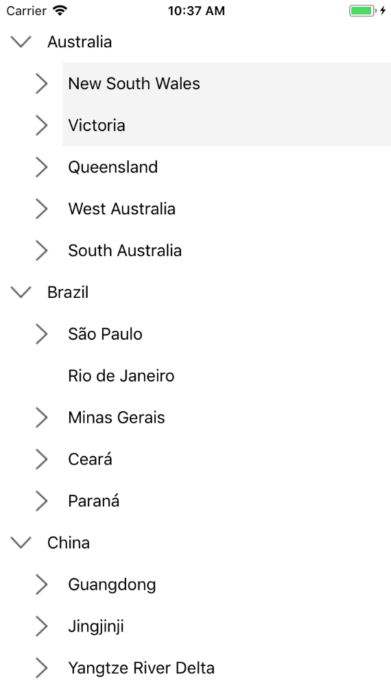

# Selection

This section explains how to perform selection and its related operations in the TreeView.

## UI Selection
The TreeView allows selecting the items either programmatically or touch interactions by setting the [SelectionMode](https://help.syncfusion.com/cr/xamarin-ios/Syncfusion.SfTreeView.iOS~Syncfusion.iOS.TreeView.SfTreeView~SelectionMode.html) property value to other than `None`. The control has different selection modes to perform selection operations as listed as follows.

* `None`: Allows disabling the selection.
* `Single`: Allows selecting the single item only. When clicking on the selected item, selection not will not be cleared. This is the default value for `SelectionMode`.
* `SingleDeselect`: Allows selecting the single item only. When clicking on the selected item, selection gets cleared.
* `Multiple`: Allows selecting more than one item. Selection is not cleared when selecting more than one items. When clicking on the selected item, selection gets cleared.



TreeView.SelectionMode = SelectionMode.Multiple;



## Programmatic Selection

When the [SelectionMode](https://help.syncfusion.com/cr/xamarin-ios/Syncfusion.SfTreeView.iOS~Syncfusion.iOS.TreeView.SfTreeView~SelectionMode.html) is other than `None`, the item or items in the TreeView can be selected from the code by setting the [SelectedItem](https://help.syncfusion.com/cr/xamarin-ios/Syncfusion.SfTreeView.iOS~Syncfusion.iOS.TreeView.SfTreeView~SelectedItem.html), or adding items to the [SelectedItems](https://help.syncfusion.com/cr/xamarin-ios/Syncfusion.SfTreeView.iOS~Syncfusion.iOS.TreeView.SfTreeView~SelectedItems.html) property based on the `SelectionMode`.

When the selection mode is `Single` or `SingleDeselect`, programmatically select an item by setting the underlying object to the [SelectedItem](https://help.syncfusion.com/cr/xamarin-ios/Syncfusion.SfTreeView.iOS~Syncfusion.iOS.TreeView.SfTreeView~SelectedItem.html) property.




treeView.SelectedItem = viewModel.CountriesInfo[2];




When the selection mode is `Multiple`, programmatically select more than one item by adding the underlying object to the [SelectedItems](https://help.syncfusion.com/cr/xamarin-ios/Syncfusion.SfTreeView.iOS~Syncfusion.iOS.TreeView.SfTreeView~SelectedItems.html) property.




treeView.SelectedItems.Add(viewModel.CountriesInfo[2]);
treeView.SelectedItems.Add(viewModel.CountriesInfo[3]);




## Selected items 

### Gets selected Items
The TreeView gets all the selected items through the `SelectedItems` property and gets the single item by using the `SelectedItem` property.

### Clear selected items
The selected items can be cleared by calling the `SelectedItems.Clear()` method.



treeView.SelectedItems.Clear();



### CurrentItem vs SelectedItem

The TreeView gets the selected item by using the [SelectedItem](https://help.syncfusion.com/cr/xamarin-ios/Syncfusion.SfTreeView.iOS~Syncfusion.iOS.TreeView.SfTreeView~SelectedItem.html) and [CurrentItem](https://help.syncfusion.com/cr/xamarin-ios/Syncfusion.SfTreeView.iOS~Syncfusion.iOS.TreeView.SfTreeView~CurrentItem.html) properties. Both `SelectedItem` and `CurrentItem` returns the same data object when selecting single item. When selecting more than one item, the `SelectedItem` property returns the first selected item, and the `CurrentItem` property returns the last selected item.

W> If you select an item when `SelectionMode` is none or if you select multiple items when `SelectionMode` is single or single deselect, exception will be thrown.

## Selected item style

### Selection background

The TreeView allows changing the selection background color for the selected items by using the [SelectionBackgroundColor](https://help.syncfusion.com/cr/xamarin-ios/Syncfusion.SfTreeView.iOS~Syncfusion.iOS.TreeView.SfTreeView~SelectionBackgroundColor.html) property. You can also change the selection background color at runtime.

### Selection foreground

The TreeView allows changing the selection background color for the selected items by using the [SelectionForegroundColor](https://help.syncfusion.com/cr/xamarin-ios/Syncfusion.SfTreeView.iOS~Syncfusion.iOS.TreeView.SfTreeView~SelectionForegroundColor.html) property. You can also change the selection background color at runtime.

N> `SelectionForegroundColor` is applicable only for unbound mode.

## Events

### SelectionChanging Event

The [SelectionChanging](https://help.syncfusion.com/cr/xamarin-ios/Syncfusion.SfTreeView.iOS~Syncfusion.iOS.TreeView.SfTreeView~SelectionChanging_EV.html) event is raised while selecting an item at the execution time. The [ItemSelectionChangingEventArgs](https://help.syncfusion.com/cr/xamarin-ios/Syncfusion.SfTreeView.iOS~Syncfusion.iOS.TreeView.ItemSelectionChangingEventArgs.html) has the following members which provides the information for `SelectionChanging` event:

* [AddedItems](https://help.syncfusion.com/cr/xamarin-ios/Syncfusion.SfTreeView.iOS~Syncfusion.iOS.TreeView.ItemSelectionChangingEventArgs~AddedItems.html): Gets collection of the underlying data objects where the selection is going to process.
* [RemovedItems](https://help.syncfusion.com/cr/xamarin-ios/Syncfusion.SfTreeView.iOS~Syncfusion.iOS.TreeView.ItemSelectionChangingEventArgs~RemovedItems.html): Gets collection of the underlying data objects where the selection is going to remove.

You can cancel the selection process within this event by setting the `ItemSelectionChangingEventArgs.Cancel` property to true.



treeView.SelectionChanging += TreeView_SelectionChanging;  

private void TreeView_SelectionChanging(object sender, ItemSelectionChangingEventArgs e)
{
   if (e.AddedItems.Count > 0 && e.AddedItems[0] == ViewModel.Items[0])
       e.Cancel = true;
}



### SelectionChanged event

The [SelectionChanged](https://help.syncfusion.com/cr/xamarin-ios/Syncfusion.SfTreeView.iOS~Syncfusion.iOS.TreeView.SfTreeView~SelectionChanged_EV.html) event will occur once selection process has been completed for the selected item in the TreeView. The [ItemSelectionChangedEventArgs](https://help.syncfusion.com/cr/xamarin-ios/Syncfusion.SfTreeView.iOS~Syncfusion.iOS.TreeView.ItemSelectionChangedEventArgs.html) has the following members which provides information for `SelectionChanged` event:

* [AddedItems](https://help.syncfusion.com/cr/xamarin-ios/Syncfusion.SfTreeView.iOS~Syncfusion.iOS.TreeView.ItemSelectionChangedEventArgs~AddedItems.html): Gets collection of the underlying data objects where the selection has been processed.
* [RemovedItems](https://help.syncfusion.com/cr/xamarin-ios/Syncfusion.SfTreeView.iOS~Syncfusion.iOS.TreeView.ItemSelectionChangedEventArgs~RemovedItems.html): Gets collection of the underlying data objects where the selection has been removed.



treeView.SelectionChanged += TreeView_SelectionChanged;  

private void TreeView_SelectionChanged(object sender, ItemSelectionChangedEventArgs e)
{
   treeView.SelectedItems.Clear();
}



N> [SelectionChanging](https://help.syncfusion.com/cr/xamarin-ios/Syncfusion.SfTreeView.iOS~Syncfusion.iOS.TreeView.SfTreeView~SelectionChanging_EV.html) and [SelectionChanged](https://help.syncfusion.com/cr/xamarin-ios/Syncfusion.SfTreeView.iOS~Syncfusion.iOS.TreeView.SfTreeView~SelectionChanged_EV.html) events will be triggered only on UI interactions.

## Limitation

* When a grid is loaded inside the [Adapter](https://help.syncfusion.com/cr/xamarin-ios/Syncfusion.SfTreeView.iOS~Syncfusion.iOS.TreeView.SfTreeView~Adapter.html) with background color, the [SelectionBackgroundColor](https://help.syncfusion.com/cr/xamarin-ios/Syncfusion.SfTreeView.iOS~Syncfusion.iOS.TreeView.SfTreeView~SelectionBackgroundColor.html) will not display. Because, it overlaps the `SelectionBackgroundColor`. In this case, set the background color for the TreeView instead of `Adapter`.
 * When the `TreeView` contains duplicated items in the collection, only the first item whose instance was created initially will be selected or deselected.