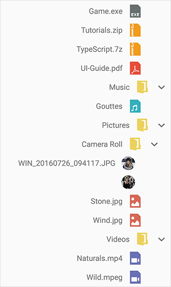

# Right to left(RTL)

TreeView supports the right-to-left localization by setting [SemanticContentAttribute](https://developer.xamarin.com/api/property/UIKit.UIView.SemanticContentAttribute/) to `UISemanticContentAttribute.ForceRightToLeft`.TreeView also supports RTL based on device language layout direction.

N> Specific setup is required to enable right-to-left localization. For this you can refer [Localization Basics in iOS](https://docs.microsoft.com/xamarin/ios/app-fundamentals/localization/#localization-basics-in-ios).




SfTreeView treeView = new SfTreeView();
treeView.SemanticContentAttribute = UISemanticContentAttribute.ForceRightToLeft;




N> If you need to customize [Adapter](https://help.syncfusion.com/cr/cref_files/xamarin-ios/Syncfusion.SfTreeView.iOS~Syncfusion.iOS.TreeView.SfTreeView~Adapter.html) with your custom views, layout views in based on device layout direction to respond for right-to-left changes.



// Customized content view

public class NodeImageView : UIView
{

    UILabel label1;
    UIImageView imageIcon;
    SfTreeView view;
    
    public NodeImageView(SfTreeView treeView)
    {
        view = treeView;
        label1 = new UILabel();
        if (GetUserInterfaceLayoutDirection(view.SemanticContentAttribute) == UIUserInterfaceLayoutDirection.RightToLeft)
            label1.TextAlignment = UITextAlignment.Right;
        imageIcon = new UIImageView();
        imageIcon.ClipsToBounds = true;
        imageIcon.AdjustsImageSizeForAccessibilityContentSizeCategory = true;
        imageIcon.InsetsLayoutMarginsFromSafeArea = true;
        this.AddSubview(imageIcon);
        this.AddSubview(label1);
    }

    public override void LayoutSubviews()
    {
        var imageWidth = 40;
        if (GetUserInterfaceLayoutDirection(view.SemanticContentAttribute) == UIUserInterfaceLayoutDirection.RightToLeft)
        {
            this.imageIcon.Frame = new CGRect(this.Frame.Width- imageWidth, 0, imageWidth, this.Frame.Height);
            this.label1.Frame = new CGRect(0, 0, this.Frame.Width- imageWidth, this.Frame.Height);
        }
        else
        {
            this.imageIcon.Frame = new CGRect(0, 0, imageWidth, this.Frame.Height);
            this.label1.Frame = new CGRect(imageWidth, 0, this.Frame.Width, this.Frame.Height);
        }
        base.LayoutSubviews();
    }

    protected override void Dispose(bool disposing)
    {
        base.Dispose(disposing);
    }
}



You can download the entire [source code](https://github.com/SyncfusionExamples/treeview-xamarin-right-to-left) here.

