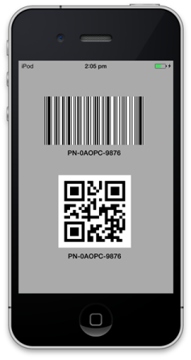

# SfBarcode

Essential Barcode for iOS provides a perfect approach to encode texts by using supported symbol types that comprises one dimensional Barcodes and two dimensional Barcodes. The basic structure of a Barcode consists of one or more data characters, optionally one or two check characters, a start pattern as well as a stop pattern.

                                  

iOS device with 1D & 2D Barcodes
{:.caption}

